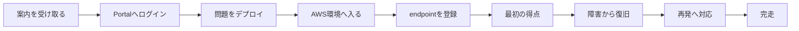
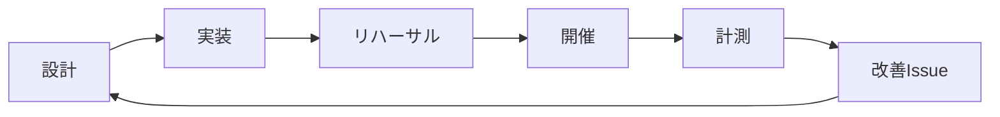

イベントの最終順位だけを見ても、問題が良かったかは判断できません。

全チームが低得点でも、問題が難しいとは限りません。ログイン失敗、AWSアカウントの誤り、endpoint登録の迷い、採点停止も原因になります。

反対に、全チームが高得点でも、学習目標を達成したとは限りません。問題文に正解コマンドがあり、固定flagも共有されていた場合があります。強い権限で環境を作り直した場合も、高得点になります。

本章では、イベントの結果を次の問題改善へ戻す方法を整理します。

## スコア以外の流れを測る

参加者が競技を進む流れを、段階に分けます。

各段階で止まった人数と時間を記録すると、問題の難しさと運営上の摩擦を分離できます。

## 最低限記録する時刻

Cloud Rescueでは、次の時刻を記録します。

| 指標 | 分かること |
| --- | --- |
| ログイン成功時刻 | 招待と認証の導線が機能したか |
| 問題deploy開始・完了時刻 | AWS環境の作成時間と失敗率 |
| AWS環境への初回接続時刻 | Console連携やSSMで詰まっていないか |
| endpoint登録時刻 | 採点開始までの導線が理解されたか |
| 最初の得点時刻 | 正常系の確認までに要した時間 |
| 障害発生時刻 | 復旧時間の起点 |
| 復旧時刻 | 調査と操作に要した時間 |
| 再発からの復旧時刻 | 学習した手順を再利用できたか |
| 最終得点時刻 | 競技終了時の状態 |

全てを個人単位で追跡する必要はありません。チーム単位で十分な場合もあります。

## 競技外の摩擦と学習上の難しさを分ける

改善では、詰まりを二種類に分けます。

### 競技外の摩擦

学習目標と関係のない障害です。

- Participant Portalへログインできない
- チーム鍵のコピーに失敗する
- 間違ったAWSアカウントへ入る
- SSMセッションマネージャーを開始できない
- endpoint登録欄を見つけられない
- 問題stackがデプロイに失敗する

これらは、オンボーディング、事前確認、画面導線、運営runbookで減らします。

### 学習上の難しさ

問題の中心となる判断で止まる状態です。

- networkとserviceのどちらを疑うか決められない
- `systemctl`の状態を読めない
- logから設定エラーを判断できない
- 復旧後に外形監視を確認しない
- 再発時に同じ調査手順を使えない

こちらは、学習目標、難易度、ヒント、前提問題を見直します。

二種類を混ぜると、問題を簡単にしすぎたり、環境不具合を参加者の能力不足として扱ったりします。

## ヒント利用を教材改善へ使う

ヒントを開いた人数だけでなく、どの段階で使われたかを確認します。

### Hint 1の利用が多い

接続先や開始地点が分かっていない可能性があります。問題文、Output、Portal導線を改善します。

### Hint 2の利用が多い

観察対象が広すぎる可能性があります。前提知識を追加するか、症状から原因を絞れる情報を増やします。

### Hint 3の利用が多い

復旧操作自体が難しい可能性があります。前提Challengeを追加し、Battleの前に基本操作を練習させます。

ヒント利用が多いこと自体を失敗とみなしません。どの説明が不足していたかを示すデータとして使います。

## 復旧時間の分布を見る

平均時間だけでは、一部の長い停止に引っ張られます。次を合わせて確認します。

- 最短時間
- 中央値
- 最長時間
- 完走できなかったチーム数
- ヒント別の復旧時間
- 初回障害と再発時の差

再発時の復旧が短くなっていれば、最初の経験を手順として再利用できた可能性があります。

反対に、再発時も同じ時間がかかる場合は、正解コマンドだけを1度実行し、調査の流れを理解していない可能性があります。

## スコア推移から競技設計を読む

最終得点だけでなく、時間ごとの推移を見ます。

### 序盤で差が固定された

初動の得点が強すぎる可能性があります。後半のフェーズ、復旧bonus、点数配分を見直します。

### 全チームが同時に止まった

個別問題より、採点基盤、event時刻、capacityを疑います。

### 一つのチームだけ0点のまま

endpoint未登録、deploy失敗、ログイン先の誤りを確認します。

### 障害後に全チームが戻らない

障害が観測不能、権限不足、revert失敗、問題文不足の可能性があります。

### 上位チームだけが得点を伸ばし続ける

前提知識の差が大きすぎる可能性があります。Challengeで基本操作を分離し、Battle開始時の条件をそろえます。

## 定性的な振り返りを残す

数値だけでは、参加者が何を考えたか分かりません。

終了後に、次を聞きます。

1. 最初にどの症状を見たか
2. 最初の仮説は何だったか
3. どの証拠で仮説を変えたか
4. どの操作に不安を感じたか
5. 復旧後に何を確認したか
6. 再発時に何を再利用したか
7. 実運用なら何を自動化するか
8. 問題文や画面で誤解した場所はどこか

問題作者が正解を説明する前に、参加者へ質問します。この順序が重要です。解説を聞いた後では、参加者の記憶は正解手順へ寄ってしまいます。

## 改善を四つに分類する

イベントで見つかった改善点を分類します。

| 分類 | 例 | 主な変更先 |
| --- | --- | --- |
| 導線 | ログインやendpoint登録で迷う | TenkaCloud、Portal、問題文 |
| 問題 | 証拠が不足し、原因を絞れない | metadata、template、README |
| 採点 | 部分復旧が反映されない | scoring設定 |
| 運営 | 障害発火や支援判断が遅い | OPERATOR.md、runbook |

全てを問題ファイルへ押し込みません。プラットフォームで解くべき課題と、問題固有の課題を分けます。

## 改善の優先順位を決める

次の順に直すと、安全に再開催しやすくなります。

1. 費用、権限、他チーム影響などの安全上の問題
2. deploy、採点、削除を妨げる再現性の問題
3. 学習目標と無関係な競技外の摩擦
4. 学習目標へ到達できない問題設計
5. 点数配分とイベント演出
6. 表現、画面、ストーリーの改善

見栄えより、削除漏れや権限過多を先に直します。

## 問題のversionへ反映する

変更によって、問題の意味が変わる場合があります。

- 誤字やリンク修正: 小さな修正
- ヒントや権限の改善: 互換性を保った改善
- 新しいdisruptionの追加: 競技体験の拡張
- 勝利条件やarchitectureの変更: 大きなversion変更

イベント記録には、TenkaCloud本体と問題カタログのcommit SHAを残します。次回開催時に、前回と同じ状態を再現できるようにします。

## 個人情報と秘密値を残さない

分析に必要な情報だけを保存します。

保存しないものの例です。

- participant credential
- teamログイン鍵
- ExternalId
- 一時AWS credential
- flagの実値
- 不要な個人情報
- 参加者の画面に表示された社内情報

スクリーンショットやログを共有する場合は、公開前にマスキングします。

## 改善ループを閉じる

振り返りは、感想を集めて終わりではありません。

改善点をIssueへ変換し、問題versionとrunbookへ反映します。次のイベントで、同じ指標をもう一度測ります。

次章では、改善した問題をOSSまたは社内限定教材として配布し、継続して利用できる資産にします。
