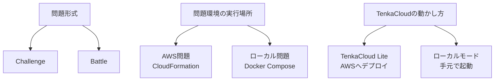

ここまで作った`hello-world`と`hello-world-battle`は、チームのAWSアカウントへCloudFormation stackを作る問題です。

TenkaCloudには、AWS問題を開催するTenkaCloud Liteと、AWSを使わずDocker問題を動かすローカルモードがあります。ChallengeとBattleの違いとは別の話なので、ここで整理します。

## 問題形式と実行場所は別に考える

ChallengeとBattleは、どのように採点するかを表す問題形式です。

- Challenge: 発見や修正の完了を採点する
- Battle: システムの状態を競技中に繰り返し採点する

AWSとローカルは、問題環境をどこで動かすかを表します。

- AWS問題: `template.yaml`からチーム用AWSアカウントへリソースを作る
- ローカル問題: `local/docker-compose.yml`から参加者のPCへコンテナを起動する

TenkaCloud Liteは、運営基盤を自分のAWSアカウントへデプロイする構成です。Application Admin Console、Participant Portal、採点、問題デプロイのbackendがAWS上で動きます。



「BattleだからAWS」「Challengeだからローカル」という決まりはありません。本書の2問はAWSを使いますが、これは題材に合わせた選択です。

## TenkaCloud LiteでAWS問題を動かす

TenkaCloud Liteでは、問題カタログの`template.yaml`を読み、チーム用AWSアカウントへCloudFormation stackを作ります。

本書の`hello-world`と`hello-world-battle`は、この経路で動きます。

```text
Application Admin Console
  → 問題を選ぶ
  → チーム用AWSへデプロイ
  → Participant Portalで参加
  → flagまたはendpointを採点
```

TenkaCloud Lite自体をAWSへデプロイする手順は、ランディングページから始められる`deploy-tenkacloud-lite`という問題にまとめています。

[TenkaCloud Liteのデプロイ問題を開く](https://www.tenkacloud.com/portal-demo/?demo=1&goto=%2Fproblems%2F01HZX0KZZ3DR0PW9M4Q7XV2C5D)

これは、TenkaCloud LiteをAWSへ作るための問題です。次に説明するローカルモードの問題ではありません。

## ローカルモードでDocker問題を動かす

ローカルモードでは、TenkaCloudの採点APIとParticipant Portalを手元で起動します。問題環境はDocker Composeで動き、AWSアカウントとAWS認証情報は不要です。

```text
make local PROBLEM=<問題ID>
  → ローカル採点APIを起動
  → Participant Portalを起動
  → Docker問題を起動
  → 提出内容を問題コンテナの/verifyへ渡す
```

ローカル問題は、`template.yaml`の代わりに次のファイルを持ちます。

```text
challenges/<問題ID>/
├── metadata.json
├── README.md
├── README.ja.md
└── local/
    ├── Dockerfile
    ├── docker-compose.yml
    └── app/
```

`metadata.json`には、Docker Composeの入口、参加者が開くURL、採点を委譲する`/verify`のURLを定義します。

## どちらを選ぶか

AWS固有の操作を学ばせたい場合は、AWS問題にします。IAM、VPC、EC2、SSM、CloudFormationなどを実際に操作できます。一方で、AWSアカウントの準備、課金、削除が必要です。

Webセキュリティやコード修正など、AWSリソースが学習目標ではない場合は、ローカル問題が向いています。参加者はDockerを使ってすぐ始められ、クラウド料金も発生しません。

| 観点 | AWS問題 | ローカル問題 |
| --- | --- | --- |
| 実行環境 | チーム用AWSアカウント | 参加者のDocker |
| 環境定義 | `template.yaml` | `local/docker-compose.yml` |
| 採点 | CloudFormation Outputやendpoint | コンテナの`/verify` |
| 適した題材 | クラウド運用、IAM、障害対応 | Webセキュリティ、コード修正、ローカル演習 |
| 後片付け | CloudFormation stackを削除 | `make local-down` |

次章では、本書で設計したローカル問題を一から作ります。完成した問題は`challenges/sqli-demo`として公開されています。
