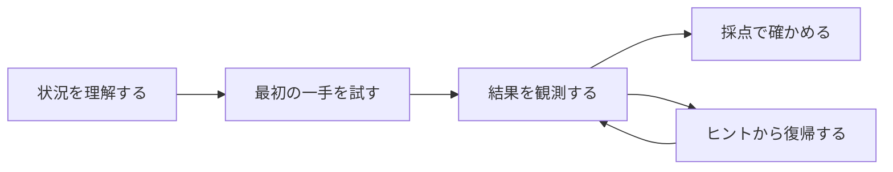

クラウド競技を作る側は、Docker、AWSサービス、採点機能などの実装へ目が向きがちです。しかし、参加者が触れるのは実装ではなく体験です。

技術的に正しく動く問題でも、最初に何をすればよいか分からなければ始められません。正解しても何が評価されたのか分からなければ、学びを持ち帰れません。

問題作者は、参加者が次の流れを迷わず進めるように設計します。

## 最初の一手が分かる

参加者は、問題を開いた直後に何か1つ試せる必要があります。答えを教えるのではなく、調査を始める入口を渡します。

最初に作る`sqli-demo`では、Participant Portalに攻略対象のWeb画面を開く入口を示します。参加者が調べるのは、ログイン処理が入力をどう扱っているかです。入口を示しても、管理者としてログインする方法や答えは明かしていません。

## 行動の結果が返ってくる

参加者の操作と結果が離れていると、自分の判断が正しかったのか分かりません。

`sqli-demo`では、管理者としてログインするとflagが表示されます。そのflagをParticipant Portalへ提出すると、その場で正解かどうかが返ります。参加者は、Web画面での操作と採点結果を結び付けられます。

## 何が成功と判定されたか分かる

「サービスが動いている」「調査できた」のような曖昧な条件では、参加者と問題作者の双方が成功を説明できません。

`sqli-demo`では、参加者が提出したflagと、実行中の問題環境が持つflagの一致を判定します。「管理者としてログインできたように見える」といった曖昧な状態ではなく、成功を外から確認できます。

## 行き詰まっても戻れる

ヒントは、答えを隠すための飾りではありません。参加者が途中から自力で進める状態へ戻すために使います。

最初のヒントでは、調べる場所や考え方を示します。次のヒントで、具体的な操作へ近づけます。参加者は、自分に必要な段階だけを選べます。

`sqli-demo`では、最初のヒントで入力の扱いへ注意を向け、次のヒントで脆弱性の種類と具体的な操作へ近づけます。

## 終了後に安全に片付けられる

競技の終了時に、参加者の手作業で作った課金リソースが残る設計は避けます。

`sqli-demo`は、意図的に脆弱なWebアプリケーションを動かします。外部ネットワークへ公開せず、手元のPCだけから接続できるようにします。終了時は、Docker環境をTenkaCloudの終了コマンドで片付けます。

## 良い体験を設計判断へ変える

ここまでの考え方を、作問時の問いへ変えます。

- 問題を開いた参加者は、最初の1分で何をするか
- その行動の結果は、どこへ表示されるか
- 成功と失敗は、外からどう判定できるか
- 行き詰まった参加者は、どのヒントから戻れるか
- 終了後に、環境をどう片付けるか

次章では、最初に作るローカルChallengeについて、参加者に何を持ち帰ってほしいかを決めます。
