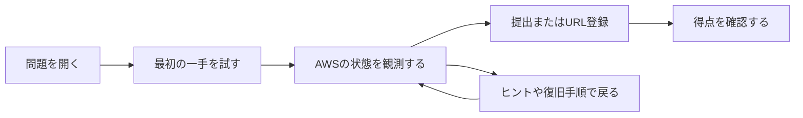

競技を作る側は、AWSリソースや採点機能へ目が向きがちです。しかし、参加者が触れるのは実装ではなく体験です。何をすればよいか分からない、正解しても理由が分からない、終了後に課金リソースだけが残る問題は、技術的に動いていても良い問題とは言えません。

良い問題には、次の4点があります。

## 最初の一手が分かる

参加者は、問題を開いた直後に何か1つ試せる必要があります。答えを教えるのではなく、調査を始める入口を渡します。

`hello-world`では、CloudFormation Outputの`ParameterConsoleUrl`を開く方法と、次のCLIコマンドを示します。

```bash
aws ssm get-parameter \
  --name /<NamePrefix>/hello \
  --query Parameter.Value \
  --output text
```

これで参加者は、AWS ConsoleかCLIの好きな方から始められます。

`hello-world-battle`では、`SsmStartSessionCommand`でEC2へ入り、`Ec2HostHint`を使って2つのURLをParticipant Portalへ登録します。登録後に採点が始まるため、自分の操作と得点の変化がつながります。

## 成功した理由が分かる

問題を解いた後、何が判定されたのか説明できることが大切です。

`hello-world`の正解は、SSM Parameterへ保存されたデプロイごとのランダム値です。公開された名前から推測できないため、実際にAWSリソースを読んだことを確認できます。

`hello-world-battle`では、frontendの`/`とAPIの`/healthz`がHTTP 200を返したかを採点します。「サービスが動いている」という曖昧な表現ではなく、観測できる条件へ落としています。

## 行き詰まっても復帰できる

ヒントは答えを隠すための飾りではありません。参加者が途中から自力で進める状態へ戻すために使います。

`hello-world`の1つ目のヒントは、SSM Parameterの詳細画面へ行く方法を示します。2つ目は、提出する値の形式を説明します。入口から正解へ少しずつ近づけます。

Battleでは、接続後に表示される案内とREADMEが、URL登録とサービス再起動の方法を示します。障害が起きた後も、参加者が復旧手順へ戻れます。

## 終了後に安全に片付けられる

参加者の手作業で新しいAWSリソースを作る問題では、CloudFormation stackを削除しても課金リソースの残ることがあります。

本書の2問では、必要なAWSリソースをすべて`template.yaml`で作ります。参加者は既存リソースを読み取るか、既存サービスを再起動します。競技終了後はstackを削除でき、問題作者が想定していないリソースを残しません。

## 2問を教材としてつなげる

`hello-world`は、問題のデプロイ、AWSへの移動、flagの提出、得点までを短時間で体験する入口です。

`hello-world-battle`は、その次の段階です。参加者がURLを登録し、TenkaCloudが状態を繰り返し確認し、運営が障害を入れ、参加者が復旧します。



次章では、参加者に何を持ち帰ってもらいたいかを文章にします。
