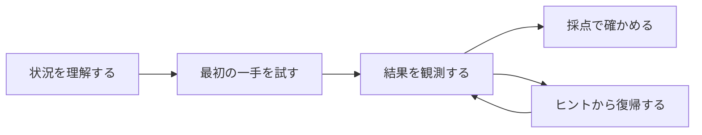

クラウド競技を作る側は、使うAWSサービスや採点機能へ目が向きがちです。しかし、参加者が触れるのは実装ではなく体験です。

技術的に正しく動く問題でも、最初に何をすればよいか分からなければ始められません。正解しても何が評価されたのか分からなければ、学びを持ち帰れません。

問題作者は、参加者が次の流れを迷わず進めるように設計します。

## 最初の一手が分かる

参加者は、問題を開いた直後に何か1つ試せる必要があります。答えを教えるのではなく、調査を始める入口を渡します。

`hello-world`では、自分のチーム用AWS環境を開く入口と、SSM Parameterを表示する方法を示します。参加者が探すのはParameterの実際の値です。入口を示しても、答えは明かしていません。

`hello-world-battle`では、最初にサーバーへの接続方法を示します。接続後の画面が、次に2つのサービスURLを登録するよう案内します。参加者は一度にすべての手順を読むのではなく、行動するたびに次の一手を知ります。

## 行動の結果が返ってくる

参加者の操作と結果が離れていると、自分の判断が正しかったのか分かりません。

`hello-world`では、発見した値を提出すると、その場で正解かどうかが返ります。

`hello-world-battle`では、2つのサービスURLを登録した後に採点が始まります。URLを登録する前は0点のままです。参加者は、自分の操作によって競技が始まったことを得点の変化から理解できます。

## 何が成功と判定されたか分かる

「サービスが動いている」「調査できた」のような曖昧な条件では、参加者と問題作者の双方が成功を説明できません。

`hello-world`では、参加者が発見した値と、問題環境が持つ正解値の一致を判定します。

`hello-world-battle`では、frontendとAPIが決められたURLでHTTP 200を返したかを判定します。何を直せば得点へ戻るのかが明確です。

## 行き詰まっても戻れる

ヒントは、答えを隠すための飾りではありません。参加者が途中から自力で進める状態へ戻すために使います。

最初のヒントでは、調べる場所や考え方を示します。次のヒントで、具体的な操作へ近づけます。参加者は、自分に必要な段階だけを選べます。

Battleでは、障害後の復旧方法を問題文と接続後の案内へ書きます。入門問題で、復旧コマンドそのものを隠す必要はありません。目的は、障害から得点を取り戻す一連の流れを体験することです。

## 終了後に安全に片付けられる

競技の終了時に、参加者の手作業で作った課金リソースが残る設計は避けます。

本書のAWS問題では、必要なリソースを問題環境の一部としてまとめて作ります。参加者は、用意されたリソースを調査または復旧します。終了時には問題環境をまとめて削除できます。

ローカル問題では、Docker環境をTenkaCloudの終了コマンドで片付けます。

## 良い体験を設計判断へ変える

ここまでの考え方を、作問時の問いへ変えます。

- 問題を開いた参加者は、最初の1分で何をするか
- その行動の結果は、どこへ表示されるか
- 成功と失敗は、外からどう判定できるか
- 行き詰まった参加者は、どのヒントから戻れるか
- 終了後に、環境をどう片付けるか

次章では、この問いに答えるため、参加者に何を持ち帰ってほしいかを先に決めます。
