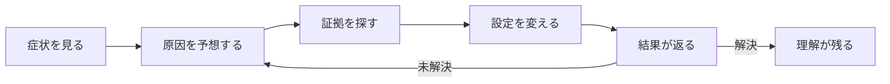

クラウド競技の価値は、使うAWSサービスの数や、問題の難しさでは決まりません。

良い問題は、参加者に体験してほしい判断を必要とします。さらに、その判断に必要な証拠を環境の中へ置きます。参加者は仮説を立て、証拠を確認し、操作結果をすぐ観測します。この流れが重要です。

反対に、難しくても学びを残せない問題があります。作者だけが知る隠し場所を当てる問題や、長い手順を正確に写すだけの問題です。これらは、クラウド運用の判断力より、偶然や記憶力を測ってしまいます。

## 難しい問題と良い問題は違う

次の表は、似ているようで異なる問題設計を比較したものです。

| 悪い設計 | 良い設計 |
| --- | --- |
| 固定された文字列を知っていれば解ける | 実際の環境を調査しないと答えが得られない |
| 作者の想定したコマンドだけを正解とする | 外から観測できる正常状態を正解とする |
| 原因と無関係な場所まで同時に壊す | 学習目標に関係する原因へ絞る |
| 参加者に新しい課金リソースを作らせる | 既存リソースの設定を直させる |
| エラーの理由を隠しすぎる | ログや状態から原因を絞れるようにする |
| 一度だけ成功すれば終わる | 復旧後も正常状態を維持させる |
| 削除手順を後から考える | 最初からCloudFormationで回収できるようにする |

良い問題は、参加者を迷わせない問題ではありません。**意味のある場所で迷わせる問題**です。

ログイン方法や対象AWSアカウントが分からない状態は、学習目標と関係のない迷いです。一方、frontendだけが落ちている状況で、networkとserviceのどちらを疑うかは意味のある迷いです。

## 楽しさは「仮説が当たる瞬間」から生まれる

競技を楽しくするために、派手な演出を大量に入れる必要はありません。

参加者が次の小さなループを回せると、問題には手応えが生まれます。



このループで重要なのは、操作に対する反応が見えることです。

- `curl`がtimeoutからHTTP 200へ変わる
- `systemctl`の状態がinactiveからactiveへ変わる
- Participant Portalのprobeがfailureからsuccessへ変わる
- scoreが次の採点周期で増え始める

正解を知った瞬間ではなく、**自分の仮説を環境で確かめた瞬間**が競技の面白さになります。

## 問題作成で守る四つの基準

TenkaCloudChallengeでは、問題を「宿題」ではなく「遊べる競技」にするため、次の基準を重視します。

### 実際に発見する答え

flagを使う場合は、デプロイごとに値を変えます。公開された問題文やリポジトリだけでは答えられないようにします。

固定された`TC{security-group}`を入力させても、Security Groupを理解した証拠にはなりません。実際のAWS環境を調査した結果として、答えが得られる構成にします。

### 新しく作るより、既存設定を直す

参加者が新しいEC2やLoad Balancerを手作業で作ると、競技終了後もリソースは残る可能性があります。また、学習目標が「復旧」なのか「構築」なのかも曖昧になります。

必要なリソースは問題stackが先に作ります。参加者は、その中にある設定や状態を直します。

### 一つの明確な発見を置く

問題には、参加者が「そういうことか」と理解できる中心を置きます。

Cloud Rescueなら、EC2自体やnetworkは正常です。frontendだけが失敗し、APIは動いています。ここから、対象serviceを切り分けることが中心の発見です。

IAM、VPC、DNS、nginx、APIを同時に壊すと、中心が消えます。総合問題にする場合も、段階を分けて1つずつ発見させます。

### ストーリーに利害を持たせる

「nginxを起動してください」だけでは、操作の意味がありません。

公開直前のサービスを復旧する、監査前に過剰権限を直す、移行期限までにデータを戻すなど、行動の理由を置きます。長い物語は不要です。役割、事故、影響、ゴールが分かれば十分です。

## Cloud Rescueを悪い問題にするとどうなるか

同じ題材でも、設計によって学習体験は大きく変わります。

### 悪いCloud Rescue

```text
問題文: nginxを再起動してください。
手順: systemctl restart nginxを実行してください。
答え: TC{nginx}
```

この形式では、参加者は症状を観察しません。原因も考えません。正解コマンドを写し、固定flagを入力するだけです。

### 良いCloud Rescue

```text
症状: frontendは失敗しているが、APIは応答している。
ゴール: 既存環境を調査し、両endpointを正常にする。
証拠: systemdの状態、journal、外形監視。
採点: endpointがHTTP 200を返し続ける時間。
制約: 新しいEC2を作らず、既存環境を直す。
```

この形式なら、参加者はnetwork全体の障害ではないと考えられます。SSMで接続し、service状態を確認し、復旧後に外部から再確認します。

一行のコマンドではなく、調査から確認までの流れが学習対象になります。

## 作者が知っていることを問題文へ漏らさない

作者は原因を知っています。そのため、説明文へ無意識に答えを書きやすくなります。

次の文章は、原因をほぼ明かしています。

> EC2上で停止しているnginxを見つけ、再起動してください。

次の文章なら、症状とゴールだけを示せます。

> 顧客向けfrontendが応答していません。APIは応答しています。既存環境を調査し、両方を正常にしてください。

接続方法が分からない場合は、段階的なヒントで補います。原因そのものは、環境から発見してもらいます。

## 良い問題か確認する質問

実装へ進む前に、次の質問へ答えます。

1. 参加者に体験してほしい判断は1つに絞れているか
2. その判断に必要な証拠を環境から取得できるか
3. 公開情報だけで答えを推測できないか
4. 作者の想定と異なる正当な解法を許容できるか
5. 学習目標と無関係な環境構築で詰まらないか
6. 参加者が新しい課金リソースを作らずに解けるか
7. 操作した結果を短時間で観測できるか
8. 障害注入には復旧方法と自動revertがあるか
9. CloudFormationを削除すれば環境を回収できるか
10. 初見者がヒントを使いながら完走できるか

全てに答えられなくても、最初から巨大な問題を作る必要はありません。中心となる発見を1つ選び、小さなChallengeとして完成させます。その後、Battleで時間圧や再発を追加します。

次章では、Cloud Rescueで参加者に何をさせるかを決めます。
