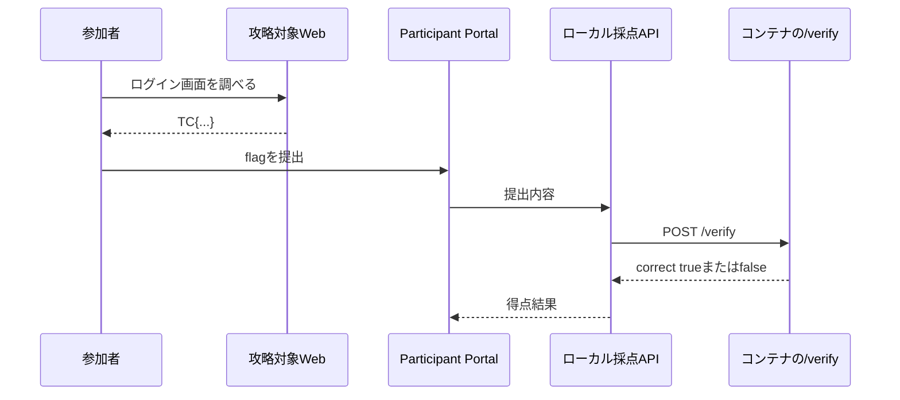

ローカル問題も、Dockerfileから作り始めません。参加者へ届けたい体験を決め、その体験に必要なストーリーと採点を先に作ります。

本書では、TenkaCloudのローカルモードで最初に表示される`sqli-demo`を一から作ります。実装結果は次の場所で確認できます。

[sqli-demoの実装](https://github.com/susumutomita/TenkaCloudChallenge/tree/main/challenges/sqli-demo)

## 参加者へ届ける体験

この問題で参加者に体験してほしいことは、次の3点です。

1. 手元のDockerで問題を起動する
2. ブラウザから対象アプリを調べ、管理者としてログインする
3. 発見したflagをParticipant Portalへ提出し、ローカルの採点結果を受け取る

AWSは使いません。学習対象はWebアプリケーションの入力処理であり、AWSリソースを準備すると本来の体験から離れるためです。

## ストーリーを作る

参加者の役割は、社内ログイン画面のセキュリティ診断を依頼された担当者です。

- 対象: スタッフ専用のログイン画面
- ゴール: パスワードを知らずに`admin`としてログインする
- 成功の証拠: 管理者だけに表示される`TC{...}`形式のflag
- 最初の行動: ログイン画面を開き、入力による挙動の違いを調べる

この設計から、参加者へ次の状況を渡します。

> 社内スタッフ専用のログイン画面があります。管理者としてサインインできれば、管理者だけが見られる合言葉を取得できます。しかし、管理者のパスワードは誰も知りません。入力の扱いを調べ、正規のパスワードなしで管理者としてサインインしてください。

問題文では、脆弱性の名前や具体的な入力値を最初から教えません。それを発見することが競技だからです。

ヒントは段階を分けます。

- 1つ目: 入力した文字が裏側でどう扱われるかを考える
- 2つ目: 脆弱性の名前と具体的な入力例を示す

答えを知りたい参加者は減点と引き換えに先へ進めます。自力で発見したい参加者には、問題文の時点でネタを明かしません。

## ローカル問題のファイル構成

AWS問題では`template.yaml`が問題環境を作りました。ローカル問題では、`local/`以下のDockerfileとCompose fileが環境を作ります。

```text
challenges/sqli-demo/
├── metadata.json
├── README.md
├── README.ja.md
└── local/
    ├── Dockerfile
    ├── docker-compose.yml
    └── app/
        └── server.mjs
```

各ファイルの役割は次のとおりです。

| ファイル | 役割 |
| --- | --- |
| `metadata.json` | 問題文、Docker runtime、採点、ヒント |
| `local/docker-compose.yml` | コンテナ、環境変数、port、health check |
| `local/Dockerfile` | 問題アプリのimage |
| `local/app/server.mjs` | 攻略対象のWeb画面と`/verify`採点API |
| `README.md` | 英語の作問・運用説明 |
| `README.ja.md` | 日本語の作問・運用説明 |

## metadata.jsonで実行方法を定義する

共通の基本情報は、AWS問題と同じです。

```json
{
  "$schema": "../../SCHEMA.json",
  "id": "sqli-demo",
  "name": "スタッフ専用ログイン",
  "category": "Challenge",
  "difficulty": 2,
  "estimatedDuration": "30 分",
  "tags": [
    "web-security",
    "sql-injection",
    "local-play",
    "container"
  ]
}
```

ローカル問題では、`cfnTemplate`の代わりに`runtime`を定義します。

```json
{
  "runtime": {
    "provider": "docker",
    "engine": "compose",
    "entry": "local/docker-compose.yml",
    "challengeEndpoints": {
      "Web": "http://127.0.0.1:18080"
    },
    "verifyUrl": "http://127.0.0.1:18081/verify",
    "secretEnv": ["FLAG_SEED"]
  }
}
```

それぞれの意味は次のとおりです。

| 項目 | 意味 |
| --- | --- |
| `provider` | 問題環境をDockerで動かす |
| `engine` | Docker Composeを使う |
| `entry` | 起動に使うCompose file |
| `challengeEndpoints.Web` | Participant Portalに表示する攻略対象URL |
| `verifyUrl` | 提出内容を判定するローカルAPI |
| `secretEnv` | TenkaCloudが実行ごとに生成してコンテナへ渡す秘密値 |

`challengeEndpoints`は参加者が開く入口です。`verifyUrl`はTenkaCloudの採点処理だけが使う入口です。同じportへまとめず、役割を分けます。

## verify採点を定義する

AWSのflag問題では、CloudFormation Outputを正解値として使いました。ローカル問題では、TenkaCloudが正解を保持せず、提出内容を問題コンテナの`/verify`へ渡します。

```json
{
  "scoring": {
    "kind": "verify",
    "points": 100,
    "wrongAnswerPenalty": 5,
    "hints": [
      {
        "id": "hint-1",
        "content": "入力した文字が画面の裏側でどう扱われるかを調べます。",
        "penalty": 20
      },
      {
        "id": "hint-2",
        "content": "SQL文へ入力が連結されています。コメント記号を使った入力を試します。",
        "penalty": 30
      }
    ]
  }
}
```

採点の流れは次のとおりです。



`/verify`は正解の文字列を返しません。`correct`と、参加者へ見せてもよい短い結果だけを返します。

## 解答後の学びを用意する

問題文で脆弱性を伏せるだけでは、解き終わった後の学びが不足します。`writeup`には、入力がSQL文へ連結されていたこと、なぜ認証を回避できたのか、パラメータ化クエリでどう直すかを書きます。

参加者向けの順序は次のようになります。

1. ストーリーから調査を始める
2. 必要なら段階的なヒントを使う
3. 自分で挙動を確かめてflagを得る
4. 解答後に原因と対策を理解する

次章では、この`metadata.json`が指すDocker環境と`/verify`を実装し、TenkaCloudのローカルモードで動かします。
