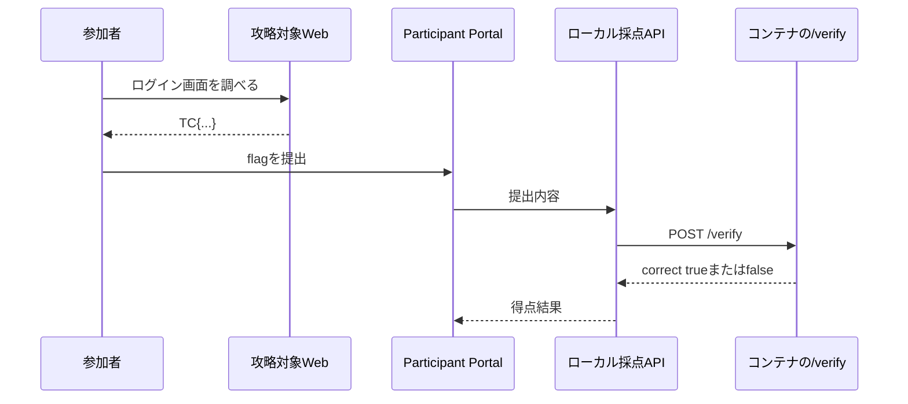

前章までに、`sqli-demo`のストーリー、勝利条件、安全境界を決めました。本章では、その設計をTenkaCloudが読み込める`metadata.json`へ変換します。

`metadata.json`は、参加者へ見せる問題文、Docker環境の起動方法、採点、ヒントをTenkaCloudへ伝えるファイルです。

## metadata.jsonで実行方法を定義する

最初に、問題の基本情報を書きます。

```json
{
  "$schema": "../../SCHEMA.json",
  "id": "sqli-demo",
  "name": "スタッフ専用ログイン",
  "category": "Challenge",
  "difficulty": 2,
  "estimatedDuration": "30 分",
  "tags": [
    "web-security",
    "sql-injection",
    "local-play",
    "container"
  ]
}
```

ローカル問題では、`cfnTemplate`の代わりに`runtime`を定義します。

```json
{
  "runtime": {
    "provider": "docker",
    "engine": "compose",
    "entry": "local/docker-compose.yml",
    "challengeEndpoints": {
      "Web": "http://127.0.0.1:18080"
    },
    "verifyUrl": "http://127.0.0.1:18081/verify",
    "secretEnv": ["FLAG_SEED"]
  }
}
```

それぞれの意味は次のとおりです。

| 項目 | 意味 |
| --- | --- |
| `provider` | 問題環境をDockerで動かす |
| `engine` | Docker Composeを使う |
| `entry` | 起動に使うCompose file |
| `challengeEndpoints.Web` | Participant Portalに表示する攻略対象URL |
| `verifyUrl` | 提出内容を判定するローカルAPI |
| `secretEnv` | TenkaCloudが実行ごとに生成してコンテナへ渡す秘密値 |

`challengeEndpoints`は参加者が開く入口です。`verifyUrl`はTenkaCloudの採点処理だけが使う入口です。同じportへまとめず、役割を分けます。

## verify採点を定義する

ローカル問題では、TenkaCloudが正解を保持せず、提出内容を問題コンテナの`/verify`へ渡します。

```json
{
  "scoring": {
    "kind": "verify",
    "points": 100,
    "wrongAnswerPenalty": 5,
    "hints": [
      {
        "id": "hint-1",
        "content": "入力した文字が画面の裏側でどう扱われるかを調べます。",
        "penalty": 20
      },
      {
        "id": "hint-2",
        "content": "SQL文へ入力が連結されています。コメント記号を使った入力を試します。",
        "penalty": 30
      }
    ]
  }
}
```

採点の流れは次のとおりです。



`/verify`は正解の文字列を返しません。`correct`と、参加者へ見せてもよい短い結果だけを返します。

## 解答後の学びを用意する

問題文で脆弱性を伏せるだけでは、解き終わった後の学びが不足します。`writeup`には、入力がSQL文へ連結されていたこと、なぜ認証を回避できたのか、パラメータ化クエリでどう直すかを書きます。

参加者向けの順序は次のようになります。

1. ストーリーから調査を始める
2. 必要なら段階的なヒントを使う
3. 自分で挙動を確かめてflagを得る
4. 解答後に原因と対策を理解する

次章では、この`metadata.json`が指すDocker環境と`/verify`を実装し、TenkaCloudのローカルモードで動かします。
