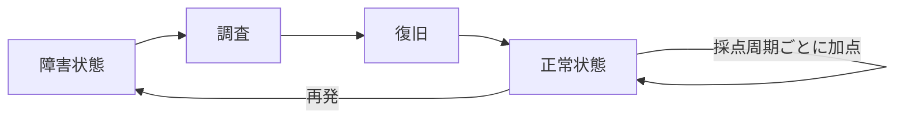

競技に点数を入れると、参加者は点数が増える行動を選びます。

そのため、採点は結果を記録するだけの機能ではありません。**何を正しい行動として報いるかを決める教材設計**です。

復旧速度だけに点数を付けると、参加者は原因を確認せず、再起動を先に試します。正常状態の維持だけを報いると、初動で遅れたチームは逆転しにくくなります。ヒントの減点が大きすぎる場合、参加者は学習するより黙って止まる方を選びます。

本章では、TenkaCloudの設定を書く前に、採点が参加者の行動へ与える影響を整理します。

## 点数は代理指標である

本当に測りたいのは、参加者が原因を考え、証拠を確認し、安全に復旧できたかです。

しかし、思考の全てを自動採点することは困難です。そこで、外から観測できる状態を代理指標にします。

Cloud Rescueでは、次を機械採点できます。

- frontendがHTTP 200を返す
- APIがHTTP 200を返す
- 両方の正常状態が一定時間続く
- 障害発生から復旧までに要した時間

一方、次は振り返りで確認します。

- 最初に何を疑ったか
- どの証拠で仮説を変えたか
- 復旧前に設定を検証したか
- 再発防止をどう考えたか

機械採点へ向かない内容まで無理に点数へ変えると、評価が不自然になります。

## Challengeは完了を報いる

Challengeは、参加者が自分のペースで理解する形式です。

この形式では、速度より完了を重視します。典型的な採点は、flagや回答を一度提出して得点する方式です。

Challengeで速度を強く競わせると、次の問題が起きます。

- 初心者がログを読まず、検索で答えを探す
- 経験者だけが得をする
- ヒントを使うことが失敗のように見える
- 試行錯誤より、一発で正解することが優先される

個人学習やオンボーディングでは、完走を主目的にします。ヒントの減点を小さくするか、減点なしにする判断も有効です。

## Battleは状態の維持を報いる

Battleは、一度の正解ではなく運用状態を継続的に採点します。



この方式では、正解コマンドを知っているだけでは勝てません。復旧後に状態を確認し、再発へ対応します。

Battleで報いたい行動は次です。

- 監視対象を正しく登録する
- 障害を早く検知する
- 原因を切り分ける
- 正常状態へ戻す
- 復旧後も監視を続ける
- 再発時に同じ手順を素早く使う

## 途中経過に点数を付けるか

複数の正常条件がある場合、部分点を与えるかを決めます。

Cloud RescueにはfrontendとAPIがあります。

### 部分点を与える

frontendだけを復旧した場合にも得点します。

この設計は、初学者へ進捗を返せます。どこまで直ったかも分かりやすくなります。

### 全て揃った場合だけ得点する

frontendとAPIの両方が正常な場合だけ得点します。

この設計は、システム全体の価値を重視します。一部だけ直して作業を終える行動を防げます。

どちらが正しいかは、学習目標で決めます。最初の演習では部分点を使い、総合Battleでは全条件を要求する構成も可能です。

## 点数の経済を先に計算する

点数は、実装後に雰囲気で調整しません。競技時間と採点周期から、理論上の最大点を計算します。

例として、2つのendpointを1分ごとに確認し、成功ごとに100点を与えるとします。競技時間が60分なら、最大点は次のようになります。

```text
2 endpoints × 100 points × 60 rounds = 12,000 points
```

ここへ障害注入を加えます。

- 障害は何回起こるか
- 平均復旧時間を何分と想定するか
- 失敗中は無得点か、減点か
- 後半から参加したチームに逆転の余地があるか

この条件を試算すると、1回の初動だけで勝敗が決まる設計を避けられます。

## 減点は行動を変える

障害中の減点は、復旧を急がせる効果があります。一方で、強すぎる減点は参加者を萎縮させます。

次の違いを考えます。

### 無得点

障害中は点数が増えません。

参加者は正常状態へ戻す必要がありますが、負の点数にはなりません。初心者向けのBattleに向きます。

### 継続減点

障害中は採点周期ごとに点数を失います。

復旧速度が強く反映されます。障害対応の時間を競うイベントに向きます。ただし、序盤で大きく失点したチームが諦めないように調整します。

### 一度だけ減点

障害を検知した時点で固定点を失い、その後は減点しません。

障害を起こした事実を評価しつつ、長時間の負債を避けられます。

## ヒントを使うことは失敗ではない

ヒントの目的は、答えを安売りすることではありません。学習目標と関係のない場所で止まった参加者を、本来の判断へ戻すことです。

ヒントを3段階に分けます。

| 段階 | 内容 | 役割 |
| --- | --- | --- |
| 1 | 接続先や観察場所 | 競技外の迷いを減らす |
| 2 | 対象serviceやlog | 調査範囲を狭める |
| 3 | 復旧に近い操作 | 完走を優先する |

減点は、情報量に応じて段階的にします。

社内研修では、減点をなくしても構いません。ヒント利用数を、教材改善のデータとして使う方が価値を持つ場合があります。

## 公開スコアと非公開スコア

スコアボードは盛り上がりを作ります。しかし、常に全順位を公開する必要はありません。

### 全順位を公開する

対戦イベントとして分かりやすくなります。上位チームを追う観客も楽しめます。

### 自分のチームだけ表示する

学習に集中しやすくなります。社内研修や初心者向けに向きます。

### 順位を遅延表示する

競技中は差を見せず、終了後に結果を公開します。序盤の差による諦めを減らせます。

開催目的に応じて選びます。

## スコアを人事評価へ直結させない

同じ点数でも、参加者の経験、担当役割、利用したヒント、環境トラブルが異なります。

そのため、1回の競技スコアだけで個人の能力を断定することは危険です。特に社内研修では、スコアを人事評価へ直接使うと、次の行動を誘発します。

- チーム内で情報を共有しない
- 安全な試行錯誤を避ける
- 分からないことを隠す
- ヒントを使わずに止まり続ける

スコアは、学習を楽しくし、状態を観測する道具として使います。能力評価が必要なら、振り返り、再試行、別問題での再現性も合わせます。

## 採点を迂回できないか確認する

採点方式が決まったら、意図しない得点経路を考えます。

- 固定flagを知っていれば提出できないか
- CloudFormation Outputから答えを直接読めないか
- frontendだけを偽装してAPIを直さず得点できないか
- 採点用endpointだけに特別な応答を返せないか
- 他チームのURLやflagを利用できないか
- Participant PortalのJavaScriptに答えが含まれないか

不正対策だけが目的ではありません。採点の迂回が可能なら、学習目標を通らずに得点できるからです。

## Cloud Rescueの採点方針

本書では、次の順で採点を育てます。

1. 最小Challengeで、デプロイごとのflag提出を体験する
2. Battleで、frontendとAPIを個別に継続採点する
3. 総合版で、両方が正常な場合だけ得点する
4. 障害注入後の復旧時間をスコアへ反映する
5. ヒント利用と復旧時間を振り返りへ使う

採点機能を増やすことが目的ではありません。学習目標が変わったときだけ、採点も変えます。

次章から、設計したChallengeをTenkaCloudChallenge上へ実装します。
