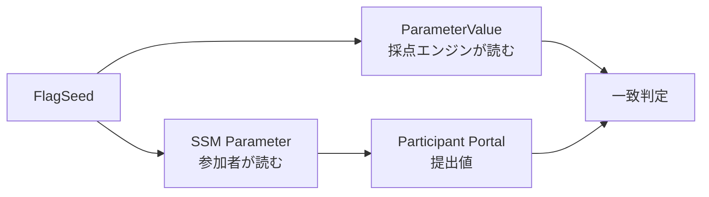

採点は、参加者に取ってほしい行動が完了したことを確認する仕組みです。点数を増やすことより、学びと判定条件が一致していることを優先します。

## Challengeは発見した値を採点する

`hello-world`では、デプロイごとに異なるランダム値をSSM Parameterへ保存します。

```text
TC{デプロイごとのランダム値}
```

同じ値をCloudFormation Outputの`ParameterValue`にも出します。TenkaCloudの採点エンジンはこのOutputを正解として使います。

参加者にはCloudFormation stackのOutputを読む権限を与えません。SSM Parameterだけを読めるようにします。この権限設計により、正解を得るには想定したAWS操作が必要です。



採点方式は`flag`です。難易度1のChallengeなので、正答は100点、誤答は5点減点とします。ヒントは20点と30点の減点にし、両方を開いても50点が残ります。

## Battleは状態を繰り返し採点する

`hello-world-battle`では、次の2か所を確認します。

- frontend: `/`がHTTP 200
- api: `/healthz`がHTTP 200

採点方式は`uptime-flat`です。1分ごとの確認で両方が正常なら100点を加え、どちらかが失敗したら100点を引きます。

URLはCloudFormation Outputから自動登録しません。参加者がParticipant Portalへ登録してから採点を開始します。デプロイしただけで得点が増える状態を防ぎ、URL登録も学習体験へ含めるためです。

## ChallengeとBattleを使い分ける

| 確認したいこと | 向いている形式 |
| --- | --- |
| ある値を発見したか | Challengeの`flag` |
| ある修正を一度完了したか | Challengeの`flag`または`verify` |
| サービスを正常に保てるか | Battleの`uptime-flat` |
| 複数サービスが同時に正常か | Battleの`uptime-multi` |
| 時間帯で採点条件を変えたいか | Battleの`phased-polling` |

本書では最小構成を理解するため、`flag`と`uptime-flat`だけを使います。

次章から、TenkaCloudChallengeリポジトリへ実際のファイルを作ります。
