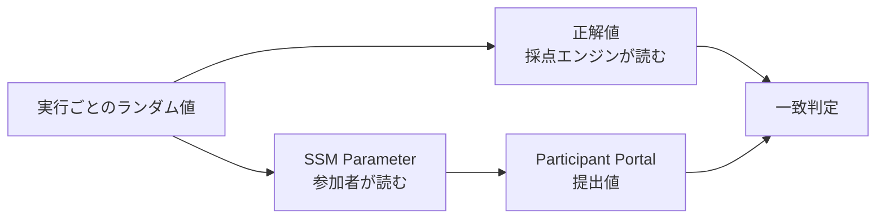

採点は、参加者に取ってほしい行動が完了したことを確認する仕組みです。本章では`hello-world`だけを対象に、SSM Parameterから発見した値をどう採点するか決めます。

Battleの継続採点は、AWS Challengeを完成させてから別の章で設計します。

## 発見した値を採点する

`hello-world`では、問題環境を作るたびに異なるランダム値をSSM Parameterへ保存します。

```text
TC{デプロイごとのランダム値}
```

問題環境は、参加者へ見せない採点用の正解値もTenkaCloudへ返します。

参加者にはSSM Parameterだけを読める権限を与えます。採点用の値を直接読むことはできません。この権限設計により、正解を得るには想定したAWS操作が必要です。



このように、発見した値を提出して一度だけ判定する方式を`flag`と呼びます。難易度1のChallengeなので、正答は100点、誤答は5点減点とします。ヒントは20点と30点の減点にし、両方を開いても50点が残ります。

正答は100点、誤答は5点減点とします。ヒントは2段階に分け、20点と30点を減点します。両方のヒントを開いても50点が残るため、行き詰まった参加者が競技を続けられます。

採点条件は、次の一文で確定します。

> 参加者の提出値が、問題stackの`ParameterValue` Outputと一致したら100点を記録する。

次章では、この採点に必要なSSM Parameter、ランダム値、参加者用IAM Role、CloudFormation Outputを`template.yaml`へ実装します。
