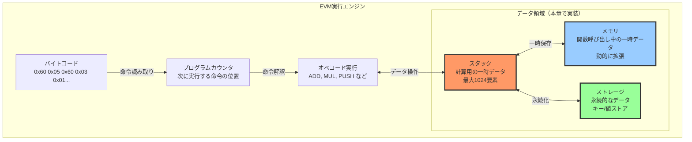

## 本章で実装するEVMコンポーネント

前章では、EVMの基本構造とデータ型(256ビット整数)について学びました。本章では、EVMの実行に不可欠な3つの主要コンポーネントを実装していきます。

### EVMの実行モデルの全体像

EVMは「スタックマシン」として動作します。バイトコードの命令を1つずつ読み取り、スタック上でデータを操作しながら計算を進めていきます。



### 3つのデータ領域の役割

EVMには、目的の異なる3つのデータ領域があります。

| データ領域 | 用途 | 永続性 | アクセス特性 |
|----------|------|--------|------------|
| スタック | 命令のオペランドと計算結果 | トランザクション内のみ | LIFO（後入れ先出し）最大1024要素 |
| メモリ | 関数呼び出し時の一時データ | トランザクション内のみ | バイトアドレス指定動的に拡張 |
| ストレージ | コントラクトの状態変数 | ブロックチェイン上に永続化 | キー/値ペアガスコストが高い |

### 本章の実装フロー

以下の順序で、各コンポーネントを実装していきます。

1. スタックの実装 - EVMの計算の中核となるLIFO構造
2. メモリの実装 - 動的に拡張可能なバイト配列
3. ストレージの実装 - 永続的なキー/値ストア
4. オペコード実行エンジン - バイトコードを解釈して実行

それでは、まずスタックから実装していきましょう。

## スタックの実装

EVMのスタックは最大1024要素を格納できるLIFO（Last In First Out）構造です。

### エラーハンドリングについて

EVMのスタック操作では、次の2つのエラーが発生します。

1. StackOverflow: スタックに1024個を超える要素をプッシュしようとした場合
2. StackUnderflow: 空のスタックからポップしようとした場合

これらのエラーは、スマートコントラクトの実行を即座に停止させ、トランザクション全体を失敗させます。
Zigのエラーハンドリング機構（`!`と`error`）を使って、これらを適切に処理します。

```zig
/// EVMスタック
pub const EvmStack = struct {
    data: [1024]EVMu256,  // 固定サイズ配列
    sp: usize,           // スタックトップの位置

    /// 新しいスタックを作成
    pub fn init() EvmStack {
        return EvmStack{
            .data = undefined,  // 初期化は不要
            .top = 0,
        };
    }

    /// 値をプッシュ
    pub fn push(self: *EvmStack, value: EVMu256) !void {
        if (self.sp >= 1024) {
            return error.StackOverflow;
        }
        self.data[self.sp] = value;
        self.sp += 1;
    }

    /// 値をポップ
    pub fn pop(self: *EvmStack) !EVMu256 {
        if (self.sp == 0) {
            return error.StackUnderflow;
        }
        self.sp -= 1;
        return self.data[self.sp];
    }

    /// スタックの深さを取得
    pub fn depth(self: *const EvmStack) usize {
        return self.sp;
    }

    /// n番目の要素を複製（DUP命令用）
    pub fn dup(self: *EvmStack, n: usize) !void {
        if (self.sp < n) {
            return error.StackUnderflow;
        }
        if (self.sp >= 1024) {
            return error.StackOverflow;
        }

        const value = self.data[self.sp - n];
        self.data[self.sp] = value;
        self.sp += 1;
    }

    /// n番目の要素と交換（SWAP命令用）
    pub fn swap(self: *EvmStack, n: usize) !void {
        if (self.sp < n + 1) {
            return error.StackUnderflow;
        }

        const temp = self.data[self.sp - 1];
        self.data[self.sp - 1] = self.data[self.sp - n - 1];
        self.data[self.sp - n - 1] = temp;
    }
};
```

コード全体は次のようになります。

```evm_types.zig
//! EVMデータ構造定義
//!
//! このモジュールはEthereum Virtual Machine (EVM)の実行に必要な
//! データ構造を定義します。スマートコントラクト実行環境に
//! 必要なスタック、メモリ、ストレージなどの構造体を含みます。

const std = @import("std");

/// 256ビット整数型（EVMの基本データ型）
/// u128の2つの要素で256ビットを表現
pub const EVMu256 = struct {
    // 256ビットを2つのu128値で表現（上位ビットと下位ビット）
    hi: u128, // 上位128ビット
    lo: u128, // 下位128ビット

    /// ゼロ値の作成
    pub fn zero() EVMu256 {
        return EVMu256{ .hi = 0, .lo = 0 };
    }

    /// u64値からEVMu256を作成
    pub fn fromU64(value: u64) EVMu256 {
        return EVMu256{ .hi = 0, .lo = value };
    }

    /// 加算演算
    pub fn add(self: EVMu256, other: EVMu256) EVMu256 {
        var result = EVMu256{ .hi = self.hi, .lo = self.lo };
        // 修正: Zigの最新バージョンに合わせて@addWithOverflow呼び出しを変更
        var overflow: u1 = 0;
        result.lo, overflow = @addWithOverflow(result.lo, other.lo);
        // オーバーフローした場合は上位ビットに1を加算
        result.hi = result.hi + other.hi + overflow;
        return result;
    }

    /// 減算演算
    pub fn sub(self: EVMu256, other: EVMu256) EVMu256 {
        var result = EVMu256{ .hi = self.hi, .lo = self.lo };
        // 修正: Zigの最新バージョンに合わせて@subWithOverflow呼び出しを変更
        var underflow: u1 = 0;
        result.lo, underflow = @subWithOverflow(result.lo, other.lo);
        // アンダーフローした場合は上位ビットから1を引く
        result.hi = result.hi - other.hi - underflow;
        return result;
    }

    /// 乗算演算（シンプル実装 - 実際には最適化が必要）
    pub fn mul(self: EVMu256, other: EVMu256) EVMu256 {
        // 簡易実装: 下位ビットのみの乗算
        // 注：完全な256ビット乗算は複雑なため、ここでは省略
        if (self.hi == 0 and other.hi == 0) {
            const result_lo = self.lo * other.lo;
            // シフト演算で上位ビットを取得
            // 128ビットシフトを避けるために、別の方法で計算
            // 注: u128に入らない上位ビットは無視される
            const result_hi = @as(u128, 0); // 簡略化した実装では上位ビットは0として扱う
            return EVMu256{ .hi = result_hi, .lo = result_lo };
        } else {
            // 簡易実装のため、上位ビットがある場合は詳細計算を省略
            return EVMu256{ .hi = 0, .lo = 0 };
        }
    }

    /// 等価比較
    pub fn eql(self: EVMu256, other: EVMu256) bool {
        return self.hi == other.hi and self.lo == other.lo;
    }

    /// フォーマット出力用メソッド
    /// std.fmt.Formatインターフェースに準拠
    pub fn format(
        self: EVMu256,
        comptime fmt: []const u8,
        options: std.fmt.FormatOptions,
        writer: anytype,
    ) !void {
        // options is used in some format cases below

        if (fmt.len == 0 or fmt[0] == 'd') {
            // 10進数表示
            if (self.hi == 0) {
                // 上位ビットが0の場合は単純に下位ビットを表示
                try std.fmt.formatInt(self.lo, 10, .lower, options, writer);
            } else {
                // 本来は256ビット数値を正確に10進変換する必要があるが、簡易表示
                try writer.writeAll("0x");
                try std.fmt.formatInt(self.hi, 16, .lower, .{}, writer);
                try writer.writeByte('_');
                try std.fmt.formatInt(self.lo, 16, .lower, .{}, writer);
            }
        } else if (fmt[0] == 'x' or fmt[0] == 'X') {
            // 16進数表示
            const case: std.fmt.Case = if (fmt[0] == 'X') .upper else .lower;
            try writer.writeAll("0x");

            // 上位ビットが0でなければ表示
            if (self.hi != 0) {
                try std.fmt.formatInt(self.hi, 16, case, .{ .fill = '0', .width = 32 }, writer);
            }

            try std.fmt.formatInt(self.lo, 16, case, .{ .fill = '0', .width = 32 }, writer);
        } else {
            // 不明なフォーマット指定子の場合はデフォルトで16進表示
            try writer.writeAll("0x");
            if (self.hi != 0) {
                try std.fmt.formatInt(self.hi, 16, .lower, .{}, writer);
                try writer.writeByte('_');
            }
            try std.fmt.formatInt(self.lo, 16, .lower, .{}, writer);
        }
    }
};

/// EVMアドレスクラス（20バイト/160ビットのEthereumアドレス）
pub const EVMAddress = struct {
    /// アドレスデータ（20バイト固定長）
    data: [20]u8,

    /// ゼロアドレスを作成
    pub fn zero() EVMAddress {
        return EVMAddress{ .data = [_]u8{0}  20 };
    }

    /// バイト配列からアドレスを作成
    pub fn fromBytes(bytes: []const u8) !EVMAddress {
        if (bytes.len != 20) {
            return error.InvalidAddressLength;
        }
        var addr = EVMAddress{ .data = undefined };
        @memcpy(&addr.data, bytes);
        return addr;
    }

    /// 16進数文字列からアドレスを作成（"0x"プレフィックスは省略可能）
    pub fn fromHexString(hex_str: []const u8) !EVMAddress {
        // 先頭の"0x"を取り除く
        var offset: usize = 0;
        if (hex_str.len >= 2 and hex_str[0] == '0' and (hex_str[1] == 'x' or hex_str[1] == 'X')) {
            offset = 2;
        }

        // 期待される長さをチェック (20バイト = 40文字 + オプションの"0x")
        if (hex_str.len - offset != 40) {
            return error.InvalidAddressLength;
        }

        var addr = EVMAddress{ .data = undefined };

        // 16進数文字列をバイト配列に変換
        var i: usize = 0;
        while (i < 20) : (i += 1) {
            const high = try std.fmt.charToDigit(hex_str[offset + i * 2], 16);
            const low = try std.fmt.charToDigit(hex_str[offset + i * 2 + 1], 16);
            addr.data[i] = @as(u8, high << 4) | @as(u8, low);
        }

        return addr;
    }

    /// アドレスを16進数文字列に変換（0xプレフィックス付き）
    pub fn toHexString(self: EVMAddress, allocator: std.mem.Allocator) ![]u8 {
        // "0x" + 20バイト*2文字 + null終端の領域を確保
        var result = try allocator.alloc(u8, 2 + 40);
        result[0] = '0';
        result[1] = 'x';

        // 各バイトを16進数に変換
        for (self.data, 0..) |byte, i| {
            const high = std.fmt.digitToChar(byte >> 4, .lower);
            const low = std.fmt.digitToChar(byte & 0xF, .lower);
            result[2 + i * 2] = high;
            result[2 + i * 2 + 1] = low;
        }

        return result;
    }

    /// EVMu256からアドレスへ変換（下位20バイトを使用）
    pub fn fromEVMu256(value: EVMu256) EVMAddress {
        var addr = EVMAddress{ .data = undefined };

        // 下位16バイトを取り出す（u128の下位部分から）
        const lo_bytes = std.mem.asBytes(&value.lo);

        // ほとんどのアーキテクチャはリトルエンディアンなので、バイト順を調整
        var i: usize = 0;
        while (i < 16) : (i += 1) {
            // u128(16バイト)の最後の4バイトは使わない
            if (i < 12) {
                addr.data[i + 8] = lo_bytes[15 - i]; // 下位バイトから順に20バイトのアドレスに入れる
            }
        }

        // 上位4バイトを取り出す（u128の上位部分の最下位バイトから）
        const hi_bytes = std.mem.asBytes(&value.hi);
        i = 0;
        while (i < 4) : (i += 1) {
            addr.data[i] = hi_bytes[15 - i]; // 最下位4バイトを使用
        }

        return addr;
    }

    /// 等価比較
    pub fn eql(self: EVMAddress, other: EVMAddress) bool {
        for (self.data, other.data) |a, b| {
            if (a != b) return false;
        }
        return true;
    }

    /// チェックサム付きアドレスを取得（EIP-55準拠）
    pub fn toChecksumAddress(self: EVMAddress, allocator: std.mem.Allocator) ![]u8 {
        // アドレスの16進表現（0xなし）を取得
        var hex_addr = try allocator.alloc(u8, 40);
        defer allocator.free(hex_addr);

        for (self.data, 0..) |byte, i| {
            const high = std.fmt.digitToChar(byte >> 4, .lower);
            const low = std.fmt.digitToChar(byte & 0xF, .lower);
            hex_addr[i * 2] = high;
            hex_addr[i * 2 + 1] = low;
        }

        // アドレスのKeccak-256ハッシュを計算
        // 注：完全な実装にするためには、適切なKeccakライブラリが必要です
        // この実装はシンプル化のため、実際のハッシュ計算は省略しています

        // 結果文字列（0xプレフィックス付き）
        var result = try allocator.alloc(u8, 42);
        result[0] = '0';
        result[1] = 'x';

        // この実装では単純にすべて小文字に
        // 実際のEIP-55実装ではハッシュ値に基づき大文字/小文字を決定する
        @memcpy(result[2..], hex_addr);

        return result;
    }
};

/// EVMスタック（1024要素まで格納可能）
pub const EvmStack = struct {
    /// スタックデータ（最大1024要素）
    data: [1024]EVMu256,
    /// スタックポインタ（次に積むインデックス）
    sp: usize,

    /// 新しい空のスタックを作成
    pub fn init() EvmStack {
        return EvmStack{
            .data = undefined,
            .sp = 0,
        };
    }

    /// スタックに値をプッシュ
    pub fn push(self: *EvmStack, value: EVMu256) !void {
        if (self.sp >= 1024) {
            return error.StackOverflow;
        }
        self.data[self.sp] = value;
        self.sp += 1;
    }

    /// スタックから値をポップ
    pub fn pop(self: *EvmStack) !EVMu256 {
        if (self.sp == 0) {
            return error.StackUnderflow;
        }
        self.sp -= 1;
        return self.data[self.sp];
    }

    /// スタックの深さを取得
    pub fn depth(self: *const EvmStack) usize {
        return self.sp;
    }
};

/// EVMメモリ（動的に拡張可能なバイト配列）
pub const EvmMemory = struct {
    /// メモリデータ（初期サイズは1024バイト）
    data: std.ArrayList(u8),

    /// 新しいEVMメモリを初期化
    pub fn init(allocator: std.mem.Allocator) EvmMemory {
        // メモリリークを避けるためにconst修飾子を使用
        const memory = std.ArrayList(u8).init(allocator);
        return EvmMemory{
            .data = memory,
        };
    }

    /// メモリを必要に応じて拡張
    pub fn ensureSize(self: *EvmMemory, size: usize) !void {
        if (size > self.data.items.len) {
            // サイズを32バイト単位に切り上げて拡張
            const new_size = ((size + 31) / 32) * 32;
            try self.data.resize(new_size);
            // 拡張部分を0で初期化
            var i = self.data.items.len;
            while (i < new_size) : (i += 1) {
                self.data.items[i] = 0;
            }
        }
    }

    /// メモリから32バイト（256ビット）読み込み
    pub fn load32(self: *EvmMemory, offset: usize) !EVMu256 {
        try self.ensureSize(offset + 32);
        var result = EVMu256.zero();

        // 上位128ビット（先頭16バイト）
        var hi: u128 = 0;
        for (0..16) |i| {
            const byte_val = self.data.items[offset + i];
            const shift_amount = (15 - i) * 8;
            hi |= @as(u128, byte_val) << @intCast(shift_amount);
        }

        // 下位128ビット（後半16バイト）
        var lo: u128 = 0;
        for (0..16) |i| {
            const byte_val = self.data.items[offset + 16 + i];
            const shift_amount = (15 - i) * 8;
            lo |= @as(u128, byte_val) << @intCast(shift_amount);
        }

        result.hi = hi;
        result.lo = lo;
        return result;
    }

    /// メモリに32バイト（256ビット）書き込み
    pub fn store32(self: *EvmMemory, offset: usize, value: EVMu256) !void {
        try self.ensureSize(offset + 32);

        // 上位128ビットをバイト単位で書き込み
        const hi = value.hi;
        var i: usize = 0;
        while (i < 16) : (i += 1) {
            const shift_amount = (15 - i) * 8;
            const byte_val = @as(u8, @truncate(hi >> @intCast(shift_amount)));
            self.data.items[offset + i] = byte_val;
        }

        // 下位128ビットをバイト単位で書き込み
        const lo = value.lo;
        i = 0;
        while (i < 16) : (i += 1) {
            const shift_amount = (15 - i) * 8;
            const byte_val = @as(u8, @truncate(lo >> @intCast(shift_amount)));
            self.data.items[offset + 16 + i] = byte_val;
        }
    }

    /// 解放処理
    pub fn deinit(self: *EvmMemory) void {
        self.data.deinit();
    }
};

/// EVMストレージ（永続的なキー/バリューストア）
pub const EvmStorage = struct {
    /// ストレージデータ（キー: EVMu256, 値: EVMu256のマップ）
    data: std.AutoHashMap(EVMu256, EVMu256),

    /// 新しいストレージを初期化
    pub fn init(allocator: std.mem.Allocator) EvmStorage {
        return EvmStorage{
            .data = std.AutoHashMap(EVMu256, EVMu256).init(allocator),
        };
    }

    /// ストレージから値を読み込み
    pub fn load(self: *EvmStorage, key: EVMu256) EVMu256 {
        return self.data.get(key) orelse EVMu256.zero();
    }

    /// ストレージに値を書き込み
    pub fn store(self: *EvmStorage, key: EVMu256, value: EVMu256) !void {
        try self.data.put(key, value);
    }

    /// 解放処理
    pub fn deinit(self: *EvmStorage) void {
        self.data.deinit();
    }
};

/// EVM実行コンテキスト（実行状態を保持）
pub const EvmContext = struct {
    /// プログラムカウンタ（現在実行中のコード位置）
    pc: usize,
    /// 残りガス量
    gas: usize,
    /// 実行中のバイトコード
    code: []const u8,
    /// 呼び出しデータ（コントラクト呼び出し時の引数）
    calldata: []const u8,
    /// 戻り値データ
    returndata: std.ArrayList(u8),
    /// スタック
    stack: EvmStack,
    /// メモリ
    memory: EvmMemory,
    /// ストレージ
    storage: EvmStorage,
    /// 呼び出し深度（再帰呼び出し用）
    depth: u8,
    /// 実行終了フラグ
    stopped: bool,
    /// エラー発生時のメッセージ
    error_msg: ?[]const u8,

    /// 新しいEVM実行コンテキストを初期化
    pub fn init(allocator: std.mem.Allocator, code: []const u8, calldata: []const u8) EvmContext {
        return EvmContext{
            .pc = 0,
            .gas = 10_000_000, // 初期ガス量（適宜調整）
            .code = code,
            .calldata = calldata,
            .returndata = std.ArrayList(u8).init(allocator),
            .stack = EvmStack.init(),
            .memory = EvmMemory.init(allocator),
            .storage = EvmStorage.init(allocator),
            .depth = 0,
            .stopped = false,
            .error_msg = null,
        };
    }

    /// リソース解放
    pub fn deinit(self: *EvmContext) void {
        self.returndata.deinit();
        self.memory.deinit();
        self.storage.deinit();
    }
};
```

### EVM実行エンジンの実装

EVMの実行エンジン部分は、オペコードの読み取り、解釈、実行を担当します。主な機能は以下の通りです。

- オペコード定数の定義: EVMで使用される命令コードを定数として定義します（STOP, ADD, MULなど）
- 実行ループ: バイトコードを1命令ずつ処理し、コンテキストを更新していきます
- 命令処理: 各オペコードに対応する処理をswitch文で実装します

下記は実行エンジンの核となる部分です。

`src/evm.zig`を新規に作成し、以下のように記述します。

```zig
//! Ethereum Virtual Machine (EVM) 実装
//!
//! このモジュールはEthereumのスマートコントラクト実行環境であるEVMを
//! 簡易的に実装します。EVMバイトコードを解析・実行し、スタックベースの
//! 仮想マシンとして動作します。

const std = @import("std");
const logger = @import("logger.zig");
const evm_types = @import("evm_types.zig");
// u256型を別名で使用して衝突を回避
const EVMu256 = evm_types.EVMu256;
const EvmContext = evm_types.EvmContext;

/// EVMオペコード定義
pub const Opcode = struct {
    // 終了・リバート系
    pub const STOP = 0x00;
    pub const RETURN = 0xF3;
    pub const REVERT = 0xFD;

    // スタック操作・算術命令
    pub const ADD = 0x01;
    pub const MUL = 0x02;
    pub const SUB = 0x03;
    pub const DIV = 0x04;
    pub const SDIV = 0x05;
    pub const MOD = 0x06;
    pub const SMOD = 0x07;
    pub const ADDMOD = 0x08;
    pub const MULMOD = 0x09;
    pub const EXP = 0x0A;
    pub const LT = 0x10;
    pub const GT = 0x11;
    pub const SLT = 0x12;
    pub const SGT = 0x13;
    pub const EQ = 0x14;
    pub const ISZERO = 0x15;
    pub const AND = 0x16;
    pub const OR = 0x17;
    pub const XOR = 0x18;
    pub const NOT = 0x19;
    pub const POP = 0x50;

    // メモリ操作
    pub const MLOAD = 0x51;
    pub const MSTORE = 0x52;
    pub const MSTORE8 = 0x53;

    // ストレージ操作
    pub const SLOAD = 0x54;
    pub const SSTORE = 0x55;

    // 制御フロー
    pub const JUMP = 0x56;
    pub const JUMPI = 0x57;
    pub const PC = 0x58;
    pub const JUMPDEST = 0x5B;

    // PUSHシリーズ (PUSH1-PUSH32)
    pub const PUSH1 = 0x60;
    // 他のPUSH命令も順次増えていく (0x61-0x7F)

    // DUPシリーズ (DUP1-DUP16)
    pub const DUP1 = 0x80;
    // 他のDUP命令も順次増えていく (0x81-0x8F)

    // SWAPシリーズ (SWAP1-SWAP16)
    pub const SWAP1 = 0x90;
    // 他のSWAP命令も順次増えていく (0x91-0x9F)

    // 呼び出しデータ関連
    pub const CALLDATALOAD = 0x35;
    pub const CALLDATASIZE = 0x36;
    pub const CALLDATACOPY = 0x37;
};

/// エラー型定義
pub const EVMError = error{
    OutOfGas,
    StackOverflow,
    StackUnderflow,
    InvalidJump,
    InvalidOpcode,
    MemoryOutOfBounds,
};

/// EVMバイトコードを実行する
///
/// 引数:
///     allocator: メモリアロケータ
///     code: EVMバイトコード
///     calldata: コントラクト呼び出し時の引数データ
///     gas_limit: 実行時のガス上限
///
/// 戻り値:
///     []const u8: 実行結果のバイト列
///
/// エラー:
///     様々なEVM実行エラー
pub fn execute(allocator: std.mem.Allocator, code: []const u8, calldata: []const u8, gas_limit: usize) ![]const u8 {
    // EVMコンテキストの初期化
    var context = EvmContext.init(allocator, code, calldata);
    // ガスリミット設定
    context.gas = gas_limit;
    defer context.deinit();

    // メインの実行ループ
    while (context.pc < context.code.len and !context.stopped) {
        try executeStep(&context);
    }

    // 戻り値をコピーして返す
    const result = try allocator.alloc(u8, context.returndata.items.len);
    @memcpy(result, context.returndata.items);
    return result;
}

/// 単一のEVM命令を実行
fn executeStep(context: *EvmContext) !void {
    // 現在のオペコードを取得
    const opcode = context.code[context.pc];

    // ガス消費（シンプル版 - 本来は命令ごとに異なる）
    if (context.gas < 1) {
        context.error_msg = "Out of gas";
        return EVMError.OutOfGas;
    }
    context.gas -= 1;

    // オペコードを解釈して実行
    switch (opcode) {
        Opcode.STOP => {
            context.stopped = true;
        },

        Opcode.ADD => {
            if (context.stack.depth() < 2) return EVMError.StackUnderflow;
            const a = try context.stack.pop();
            const b = try context.stack.pop();
            try context.stack.push(a.add(b));
            context.pc += 1;
        },

        Opcode.MUL => {
            if (context.stack.depth() < 2) return EVMError.StackUnderflow;
            const a = try context.stack.pop();
            const b = try context.stack.pop();
            try context.stack.push(a.mul(b));
            context.pc += 1;
        },

        Opcode.SUB => {
            if (context.stack.depth() < 2) return EVMError.StackUnderflow;
            const a = try context.stack.pop();
            const b = try context.stack.pop();
            try context.stack.push(a.sub(b));
            context.pc += 1;
        },

        Opcode.DIV => {
            if (context.stack.depth() < 2) return EVMError.StackUnderflow;
            const a = try context.stack.pop();
            const b = try context.stack.pop();
            // 0除算の場合は0を返す
            if (b.hi == 0 and b.lo == 0) {
                try context.stack.push(EVMu256.zero());
            } else {
                // 簡易版ではu64の範囲のみサポート
                if (a.hi == 0 and b.hi == 0) {
                    const result = EVMu256.fromU64(@intCast(a.lo / b.lo));
                    try context.stack.push(result);
                } else {
                    // 本来はより複雑な処理が必要
                    try context.stack.push(EVMu256.zero());
                }
            }
            context.pc += 1;
        },

        // PUSH1: 1バイトをスタックにプッシュ
        Opcode.PUSH1 => {
            if (context.pc + 1 >= context.code.len) return EVMError.InvalidOpcode;
            const value = EVMu256.fromU64(context.code[context.pc + 1]);
            try context.stack.push(value);
            context.pc += 2; // オペコード＋データで2バイト進む
        },

        // DUP1: スタックトップの値を複製
        Opcode.DUP1 => {
            if (context.stack.depth() < 1) return EVMError.StackUnderflow;
            const value = context.stack.data[context.stack.sp - 1];
            try context.stack.push(value);
            context.pc += 1;
        },

        // SWAP1: スタックトップと2番目の要素を交換
        Opcode.SWAP1 => {
            if (context.stack.depth() < 2) return EVMError.StackUnderflow;
            const a = context.stack.data[context.stack.sp - 1];
            const b = context.stack.data[context.stack.sp - 2];
            context.stack.data[context.stack.sp - 1] = b;
            context.stack.data[context.stack.sp - 2] = a;
            context.pc += 1;
        },

        Opcode.MLOAD => {
            if (context.stack.depth() < 1) return EVMError.StackUnderflow;
            const offset = try context.stack.pop();
            // 現在はu64範囲のみサポート
            if (offset.hi != 0) return EVMError.MemoryOutOfBounds;
            const value = try context.memory.load32(@intCast(offset.lo));
            try context.stack.push(value);
            context.pc += 1;
        },

        Opcode.MSTORE => {
            if (context.stack.depth() < 2) return EVMError.StackUnderflow;
            const offset = try context.stack.pop();
            const value = try context.stack.pop();
            // 現在はu64範囲のみサポート
            if (offset.hi != 0) return EVMError.MemoryOutOfBounds;
            try context.memory.store32(@intCast(offset.lo), value);
            context.pc += 1;
        },

        Opcode.SLOAD => {
            if (context.stack.depth() < 1) return EVMError.StackUnderflow;
            const key = try context.stack.pop();
            const value = context.storage.load(key);
            try context.stack.push(value);
            context.pc += 1;
        },

        Opcode.SSTORE => {
            if (context.stack.depth() < 2) return EVMError.StackUnderflow;
            const key = try context.stack.pop();
            const value = try context.stack.pop();
            try context.storage.store(key, value);
            context.pc += 1;
        },

        Opcode.CALLDATALOAD => {
            if (context.stack.depth() < 1) return EVMError.StackUnderflow;
            const offset = try context.stack.pop();
            if (offset.hi != 0) return EVMError.MemoryOutOfBounds;

            var result = EVMu256.zero();
            const off = @as(usize, @intCast(offset.lo));

            // calldataから32バイトをロード（範囲外は0埋め）
            for (0..32) |i| {
                const byte_pos = off + i;
                if (byte_pos < context.calldata.len) {
                    const byte_val = context.calldata[byte_pos];
                    if (i < 16) {
                        // 上位16バイト
                        result.hi |= @as(u128, byte_val) << @intCast((15 - i) * 8);
                    } else {
                        // 下位16バイト
                        result.lo |= @as(u128, byte_val) << @intCast((31 - i) * 8);
                    }
                }
            }

            try context.stack.push(result);
            context.pc += 1;
        },

        Opcode.RETURN => {
            if (context.stack.depth() < 2) return EVMError.StackUnderflow;
            const offset = try context.stack.pop();
            const length = try context.stack.pop();

            // 現在はu64範囲のみサポート
            if (offset.hi != 0 or length.hi != 0) return EVMError.MemoryOutOfBounds;

            const off = @as(usize, @intCast(offset.lo));
            const len = @as(usize, @intCast(length.lo));

            try context.memory.ensureSize(off + len);
            if (len > 0) {
                try context.returndata.resize(len);
                for (0..len) |i| {
                    if (off + i < context.memory.data.items.len) {
                        context.returndata.items[i] = context.memory.data.items[off + i];
                    } else {
                        context.returndata.items[i] = 0;
                    }
                }
            }

            context.stopped = true;
        },

        else => {
            logger.debugLog("未実装のオペコード: 0x{x:0>2}", .{opcode});
            context.error_msg = "未実装または無効なオペコード";
            return EVMError.InvalidOpcode;
        },
    }
}

/// EVMバイトコードの逆アセンブル（デバッグ用）
pub fn disassemble(code: []const u8, writer: anytype) !void {
    var pc: usize = 0;
    while (pc < code.len) {
        const opcode = code[pc];
        try writer.print("0x{x:0>4}: ", .{pc});

        switch (opcode) {
            Opcode.STOP => try writer.print("STOP", .{}),
            Opcode.ADD => try writer.print("ADD", .{}),
            Opcode.MUL => try writer.print("MUL", .{}),
            Opcode.SUB => try writer.print("SUB", .{}),
            Opcode.DIV => try writer.print("DIV", .{}),
            Opcode.MLOAD => try writer.print("MLOAD", .{}),
            Opcode.MSTORE => try writer.print("MSTORE", .{}),
            Opcode.SLOAD => try writer.print("SLOAD", .{}),
            Opcode.SSTORE => try writer.print("SSTORE", .{}),
            Opcode.JUMP => try writer.print("JUMP", .{}),
            Opcode.JUMPI => try writer.print("JUMPI", .{}),
            Opcode.JUMPDEST => try writer.print("JUMPDEST", .{}),
            Opcode.RETURN => try writer.print("RETURN", .{}),

            Opcode.PUSH1 => {
                if (pc + 1 < code.len) {
                    const value = code[pc + 1];
                    try writer.print("PUSH1 0x{x:0>2}", .{value});
                    pc += 1;
                } else {
                    try writer.print("PUSH1 <データ不足>", .{});
                }
            },

            Opcode.DUP1 => try writer.print("DUP1", .{}),
            Opcode.SWAP1 => try writer.print("SWAP1", .{}),
            Opcode.CALLDATALOAD => try writer.print("CALLDATALOAD", .{}),

            else => {
                if (opcode >= 0x60 and opcode <= 0x7F) {
                    // PUSH1-PUSH32
                    const push_bytes = opcode - 0x5F;
                    if (pc + push_bytes < code.len) {
                        try writer.print("PUSH{d} ", .{push_bytes});
                        for (0..push_bytes) |i| {
                            try writer.print("0x{x:0>2}", .{code[pc + 1 + i]});
                        }
                        pc += push_bytes;
                    } else {
                        try writer.print("PUSH{d} <データ不足>", .{push_bytes});
                        pc = code.len;
                    }
                } else if (opcode >= 0x80 and opcode <= 0x8F) {
                    // DUP1-DUP16
                    try writer.print("DUP{d}", .{opcode - 0x7F});
                } else if (opcode >= 0x90 and opcode <= 0x9F) {
                    // SWAP1-SWAP16
                    try writer.print("SWAP{d}", .{opcode - 0x8F});
                } else {
                    // その他の未実装オペコード
                    try writer.print("UNKNOWN 0x{x:0>2}", .{opcode});
                }
            },
        }

        try writer.print("\n", .{});
        pc += 1;
    }
}

// シンプルなEVM実行テスト
test "Simple EVM execution" {
    var arena = std.heap.ArenaAllocator.init(std.testing.allocator);
    defer arena.deinit();
    const allocator = arena.allocator();

    // シンプルなバイトコード: PUSH1 0x05, PUSH1 0x03, ADD, PUSH1 0x00, MSTORE, PUSH1 0x20, PUSH1 0x00, RETURN
    // 意味: 5 + 3 = 8 を計算し、メモリに格納して返す
    const bytecode = [_]u8{
        0x60, 0x05, // PUSH1 5
        0x60, 0x03, // PUSH1 3
        0x01, // ADD
        0x60, 0x00, // PUSH1 0
        0x52, // MSTORE
        0x60, 0x20, // PUSH1 32
        0x60, 0x00, // PUSH1 0
        0xf3, // RETURN
    };

    const calldata = [_]u8{};

    // EVMを実行し、戻り値を取得
    const result = try execute(allocator, &bytecode, &calldata, 100000);
    defer allocator.free(result);

    // 結果をEVMu256形式で解釈
    var value = EVMu256{ .hi = 0, .lo = 0 };
    if (result.len >= 32) {
        // 上位16バイトを解析
        for (0..16) |i| {
            const byte_val = result[i];
            value.hi |= @as(u128, byte_val) << @as(u7, @intCast((15 - i) * 8));
        }

        // 下位16バイトを解析
        for (0..16) |i| {
            const byte_val = result[i + 16];
            value.lo |= @as(u128, byte_val) << @as(u7, @intCast((15 - i) * 8));
        }
    }

    // 結果が8（5+3）になっていることを確認
    try std.testing.expect(value.hi == 0);
    try std.testing.expect(value.lo == 8);
}

// 乗算のテスト
test "EVM multiplication" {
    var arena = std.heap.ArenaAllocator.init(std.testing.allocator);
    defer arena.deinit();
    const allocator = arena.allocator();

    // バイトコード: PUSH1 0x07, PUSH1 0x06, MUL, PUSH1 0x00, MSTORE, PUSH1 0x20, PUSH1 0x00, RETURN
    // 意味: 7 * 6 = 42 を計算し、メモリに格納して返す
    const bytecode = [_]u8{
        0x60, 0x07, // PUSH1 7
        0x60, 0x06, // PUSH1 6
        0x02, // MUL
        0x60, 0x00, // PUSH1 0
        0x52, // MSTORE
        0x60, 0x20, // PUSH1 32
        0x60, 0x00, // PUSH1 0
        0xf3, // RETURN
    };

    const calldata = [_]u8{};
    const result = try execute(allocator, &bytecode, &calldata, 100000);
    defer allocator.free(result);

    // 結果をEVMu256形式で解釈
    var value = EVMu256{ .hi = 0, .lo = 0 };
    if (result.len >= 32) {
        // 上位16バイトを解析
        for (0..16) |i| {
            const byte_val = result[i];
            value.hi |= @as(u128, byte_val) << @as(u7, @intCast((15 - i) * 8));
        }

        // 下位16バイトを解析
        for (0..16) |i| {
            const byte_val = result[i + 16];
            value.lo |= @as(u128, byte_val) << @as(u7, @intCast((15 - i) * 8));
        }
    }

    // 結果が42（7*6）になっていることを確認
    try std.testing.expect(value.hi == 0);
    try std.testing.expect(value.lo == 42);
}

// ストレージ操作のテスト
test "EVM storage operations" {
    var arena = std.heap.ArenaAllocator.init(std.testing.allocator);
    defer arena.deinit();
    const allocator = arena.allocator();

    // バイトコード:
    // PUSH1 0x2A, PUSH1 0x01, SSTORE, // キー1に42を保存
    // PUSH1 0x01, SLOAD,               // キー1の値をロード
    // PUSH1 0x00, MSTORE,              // メモリに保存
    // PUSH1 0x20, PUSH1 0x00, RETURN   // 戻り値を返す
    const bytecode = [_]u8{
        0x60, 0x2A, // PUSH1 42
        0x60, 0x01, // PUSH1 1
        0x55, // SSTORE
        0x60, 0x01, // PUSH1 1
        0x54, // SLOAD
        0x60, 0x00, // PUSH1 0
        0x52, // MSTORE
        0x60, 0x20, // PUSH1 32
        0x60, 0x00, // PUSH1 0
        0xf3, // RETURN
    };

    const calldata = [_]u8{};
    const result = try execute(allocator, &bytecode, &calldata, 100000);
    defer allocator.free(result);

    // 結果をEVMu256形式で解釈
    var value = EVMu256{ .hi = 0, .lo = 0 };
    if (result.len >= 32) {
        // 上位16バイトを解析
        for (0..16) |i| {
            const byte_val = result[i];
            value.hi |= @as(u128, byte_val) << @as(u7, @intCast((15 - i) * 8));
        }

        // 下位16バイトを解析
        for (0..16) |i| {
            const byte_val = result[i + 16];
            value.lo |= @as(u128, byte_val) << @as(u7, @intCast((15 - i) * 8));
        }
    }

    // 結果が42になっていることを確認
    try std.testing.expect(value.hi == 0);
    try std.testing.expect(value.lo == 42);
}

// 複数のオペコード実行テスト
test "EVM multiple operations" {
    var arena = std.heap.ArenaAllocator.init(std.testing.allocator);
    defer arena.deinit();
    const allocator = arena.allocator();

    // バイトコード:
    // PUSH1 0x0A, PUSH1 0x0B, ADD,    // 10 + 11 = 21
    // PUSH1 0x03, MUL,                // 21 * 3 = 63
    // PUSH1 0x02, SWAP1, DIV,         // 63 / 2 = 31 (スワップしてスタックを調整)
    // PUSH1 0x00, MSTORE,             // 結果をメモリに保存
    // PUSH1 0x20, PUSH1 0x00, RETURN  // 戻り値を返す
    const bytecode = [_]u8{
        0x60, 0x0A, // PUSH1 10
        0x60, 0x0B, // PUSH1 11
        0x01, // ADD
        0x60, 0x03, // PUSH1 3
        0x02, // MUL
        0x60, 0x02, // PUSH1 2
        0x90, // SWAP1
        0x04, // DIV
        0x60, 0x00, // PUSH1 0
        0x52, // MSTORE
        0x60, 0x20, // PUSH1 32
        0x60, 0x00, // PUSH1 0
        0xf3, // RETURN
    };

    const calldata = [_]u8{};
    const result = try execute(allocator, &bytecode, &calldata, 100000);
    defer allocator.free(result);

    // 結果をEVMu256形式で解釈
    var value = EVMu256{ .hi = 0, .lo = 0 };
    if (result.len >= 32) {
        // 上位16バイトを解析
        for (0..16) |i| {
            const byte_val = result[i];
            value.hi |= @as(u128, byte_val) << @as(u7, @intCast((15 - i) * 8));
        }

        // 下位16バイトを解析
        for (0..16) |i| {
            const byte_val = result[i + 16];
            value.lo |= @as(u128, byte_val) << @as(u7, @intCast((15 - i) * 8));
        }
    }

    // 結果が31（(10+11)*3/2）になっていることを確認
    try std.testing.expect(value.hi == 0);
    try std.testing.expect(value.lo == 31);
}
```

## Solidityコントラクトの実行
