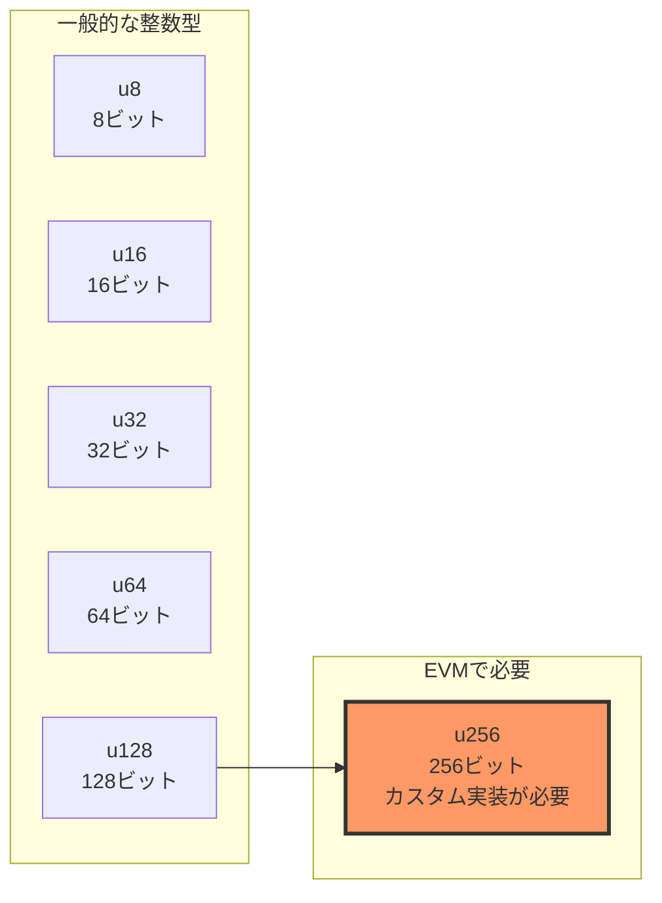

## 256ビット整数の実装

## なぜ256ビット整数が必要なのか

EVMは256ビット（32バイト）を基本単位とするスタックマシンです。これは、暗号学的ハッシュ（SHA-256やKeccak-256）の出力サイズや、楕円曲線暗号で使用される数値の範囲に合わせた設計です。

しかし、多くのプログラミング言語（Zigを含む）では、標準で提供される整数型は最大でも128ビット（`u128`）や64ビット（`u64`）です。そのため、EVMを実装する際は独自の256ビット整数型を作成します。



## 256ビット整数の内部表現

256ビットの整数を表現する最もシンプルな方法は、2つの128ビット整数を組み合わせることです。構成要素は次のとおりです。

- 上位128ビット（`hi`）: 値の大きい側の半分
- 下位128ビット（`lo`）: 値の小さい側の半分

```text
256ビット整数 = [上位128ビット (hi)] [下位128ビット (lo)]
                ←――――――――― 256ビット ――――――――→
```

### 具体例

例えば、数値`1`を256ビット整数で表現すると次のようになります。

```text
hi = 0x0000000000000000000000000000000 (128ビット)
lo = 0x0000000000000000000000000000001 (128ビット)
```

大きな数値、例えば`2^128`（128ビット目が1）の場合は次のとおりです。

```text
hi = 0x0000000000000000000000000000001 (128ビット)
lo = 0x0000000000000000000000000000000 (128ビット)
```

## Zigでの実装

それでは、ZigでEVM用の256ビット整数型`EVMu256`を実装してみましょう。
evm_types.zigを新規に作成します。

### 基本構造体の定義

```zig
//! EVM用の256ビット整数型
pub const EVMu256 = struct {
    hi: u128, // 上位128ビット
    lo: u128, // 下位128ビット

    /// ゼロ値を返す
    pub fn zero() EVMu256 {
        return EVMu256{ .hi = 0, .lo = 0 };
    }

    /// 64ビット整数から変換
    pub fn fromU64(value: u64) EVMu256 {
        return EVMu256{ .hi = 0, .lo = value };
    }
};
```

この構造体は、シンプルに2つの`u128`フィールドを持ちます。

### 加算の実装

256ビット整数の加算では、桁上がり（キャリー）の処理が重要です。

```zig
/// 加算（オーバーフロー対応）
pub fn add(self: EVMu256, other: EVMu256) EVMu256 {
    var result = EVMu256{ .hi = self.hi, .lo = self.lo };

    // Zigの組み込み関数でオーバーフローを検出
    var overflow: u1 = 0;
    result.lo, overflow = @addWithOverflow(result.lo, other.lo);

    // オーバーフローした場合は上位ビットに1を加算
    result.hi = result.hi + other.hi + overflow;

    return result;
}
```

重要なポイント。

- `@addWithOverflow`：Zigの組み込み関数で安全にオーバーフローを検出
- 戻り値は`{結果, オーバーフローフラグ}`のタプル
- オーバーフローフラグ（`u1`型、0または1）を上位ビットに加算

### 加算の動作例

```text
例1: 小さな数の加算（キャリーなし）
  self:  hi=0, lo=10
  other: hi=0, lo=20
  ────────────────────
  result: hi=0, lo=30

例2: キャリーが発生する加算
  self:  hi=0, lo=0xFFFFFFFFFFFFFFFFFFFFFFFFFFFFFFFF (128ビット最大値)
  other: hi=0, lo=1
  ────────────────────
  result_lo = 0 (オーバーフロー)
  carry = 1
  result: hi=1, lo=0
```

### 減算の実装

減算では、借り入れ（ボロー）の処理が必要です。

```zig
/// 減算（アンダーフロー対応）
pub fn sub(self: EVMu256, other: EVMu256) EVMu256 {
    var result = EVMu256{ .hi = self.hi, .lo = self.lo };

    // Zigの組み込み関数でアンダーフローを検出
    var underflow: u1 = 0;
    result.lo, underflow = @subWithOverflow(result.lo, other.lo);

    // アンダーフローした場合は上位ビットから1を引く
    result.hi = result.hi - other.hi - underflow;

    return result;
}
```

重要なポイント。

- `@subWithOverflow`：Zigの組み込み関数で安全にアンダーフローを検出
- 戻り値は`{結果, アンダーフローフラグ}`のタプル
- アンダーフローフラグを上位ビットから減算

### 乗算の実装（簡易版）

完全な256ビット乗算は非常に複雑なため、まずは簡易版を実装します。

```zig
/// 乗算（簡易版）
/// 注意: 両方の値が小さい場合のみ正確
pub fn mul(self: EVMu256, other: EVMu256) EVMu256 {
    // 簡易実装: 下位ビットのみの乗算
    // 注：完全な256ビット乗算は複雑なため、ここでは省略
    if (self.hi == 0 and other.hi == 0) {
        const result_lo = self.lo * other.lo;
        // 上位ビットは省略（簡略化のため0として扱う）
        const result_hi = @as(u128, 0);
        return EVMu256{ .hi = result_hi, .lo = result_lo };
    } else {
        // 上位ビットがある場合は詳細計算を省略
        return EVMu256{ .hi = 0, .lo = 0 };
    }
}
```

注意。

- この実装は教育目的の簡易版です
- 実際のEVM実装では、完全な多倍長乗算アルゴリズム（Karatsubaアルゴリズムなど）が必要
- 上位ビットが0の場合のみ正確に計算可能

## バイト配列との変換（発展）

EVMでは、メモリやストレージとの間でデータをやり取りする際、256ビット整数を32バイトのバイト配列として扱います。

注： 現在の簡易実装では、バイト配列変換機能は`EvmMemory`構造体の`load32()`と`store32()`メソッドで実装されています。これらのメソッドは、メモリ上のバイト配列と`EVMu256`型の間で直接変換します。

将来的な拡張として、以下のようなメソッドを`EVMu256`構造体に追加できます。

- `toBytes()`：256ビット整数を32バイトのバイト配列に変換（ビッグエンディアン形式）
- `fromBytes()`：32バイトのバイト配列から256ビット整数に変換

現時点では、メモリ操作を通じてバイト配列との変換が実現されています。

## 比較演算

EVMでは、値の等価性比較も重要な機能です。

```zig
/// 等価性チェック
pub fn eql(self: EVMu256, other: EVMu256) bool {
    return self.hi == other.hi and self.lo == other.lo;
}
```

注： 現在の簡易実装では等価性比較（`eql`）のみを実装しています。比較演算が必要になる`LT`や`GT`オペコードを実装するタイミングで、それぞれのメソッドを追加しましょう。

## 最終的に出来上がったもの

```evm_types.zig
//! EVMデータ構造定義
//!
//! このモジュールはEthereum Virtual Machine (EVM)の実行に必要な
//! データ構造を定義します。スマートコントラクト実行環境に
//! 必要なスタック、メモリ、ストレージなどの構造体を含みます。

const std = @import("std");

/// 256ビット整数型（EVMの基本データ型）
/// 現在はu128の2つの要素で256ビットを表現
pub const EVMu256 = struct {
    // 256ビットを2つのu128値で表現（上位ビットと下位ビット）
    hi: u128, // 上位128ビット
    lo: u128, // 下位128ビット

    /// ゼロ値の作成
    pub fn zero() EVMu256 {
        return EVMu256{ .hi = 0, .lo = 0 };
    }

    /// u64値からEVMu256を作成
    pub fn fromU64(value: u64) EVMu256 {
        return EVMu256{ .hi = 0, .lo = value };
    }

    /// 加算演算
    pub fn add(self: EVMu256, other: EVMu256) EVMu256 {
        var result = EVMu256{ .hi = self.hi, .lo = self.lo };
        // 修正: Zigの最新バージョンに合わせて@addWithOverflow呼び出しを変更
        var overflow: u1 = 0;
        result.lo, overflow = @addWithOverflow(result.lo, other.lo);
        // オーバーフローした場合は上位ビットに1を加算
        result.hi = result.hi + other.hi + overflow;
        return result;
    }

    /// 減算演算
    pub fn sub(self: EVMu256, other: EVMu256) EVMu256 {
        var result = EVMu256{ .hi = self.hi, .lo = self.lo };
        // 修正: Zigの最新バージョンに合わせて@subWithOverflow呼び出しを変更
        var underflow: u1 = 0;
        result.lo, underflow = @subWithOverflow(result.lo, other.lo);
        // アンダーフローした場合は上位ビットから1を引く
        result.hi = result.hi - other.hi - underflow;
        return result;
    }

    /// 乗算演算（シンプル実装 - 実際には最適化が必要）
    pub fn mul(self: EVMu256, other: EVMu256) EVMu256 {
        // 簡易実装: 下位ビットのみの乗算
        // 注：完全な256ビット乗算は複雑なため、ここでは省略
        if (self.hi == 0 and other.hi == 0) {
            const result_lo = self.lo * other.lo;
            // シフト演算で上位ビットを取得
            // 128ビットシフトを避けるために、別の方法で計算
            // 注: u128に入らない上位ビットは無視される
            const result_hi = @as(u128, 0); // 簡略化した実装では上位ビットは0として扱う
            return EVMu256{ .hi = result_hi, .lo = result_lo };
        } else {
            // 簡易実装のため、上位ビットがある場合は詳細計算を省略
            return EVMu256{ .hi = 0, .lo = 0 };
        }
    }

    /// 等価比較
    pub fn eql(self: EVMu256, other: EVMu256) bool {
        return self.hi == other.hi and self.lo == other.lo;
    }

    /// フォーマット出力用メソッド
    /// std.fmt.Formatインターフェースに準拠
    pub fn format(
        self: EVMu256,
        comptime fmt: []const u8,
        options: std.fmt.FormatOptions,
        writer: anytype,
    ) !void {
        // options is used in some format cases below

        if (fmt.len == 0 or fmt[0] == 'd') {
            // 10進数表示
            if (self.hi == 0) {
                // 上位ビットが0の場合は単純に下位ビットを表示
                try std.fmt.formatInt(self.lo, 10, .lower, options, writer);
            } else {
                // 本来は256ビット数値を正確に10進変換する必要があるが、簡易表示
                try writer.writeAll("0x");
                try std.fmt.formatInt(self.hi, 16, .lower, .{}, writer);
                try writer.writeByte('_');
                try std.fmt.formatInt(self.lo, 16, .lower, .{}, writer);
            }
        } else if (fmt[0] == 'x' or fmt[0] == 'X') {
            // 16進数表示
            const case: std.fmt.Case = if (fmt[0] == 'X') .upper else .lower;
            try writer.writeAll("0x");

            // 上位ビットが0でなければ表示
            if (self.hi != 0) {
                try std.fmt.formatInt(self.hi, 16, case, .{ .fill = '0', .width = 32 }, writer);
            }

            try std.fmt.formatInt(self.lo, 16, case, .{ .fill = '0', .width = 32 }, writer);
        } else {
            // 不明なフォーマット指定子の場合はデフォルトで16進表示
            try writer.writeAll("0x");
            if (self.hi != 0) {
                try std.fmt.formatInt(self.hi, 16, .lower, .{}, writer);
                try writer.writeByte('_');
            }
            try std.fmt.formatInt(self.lo, 16, .lower, .{}, writer);
        }
    }
};
```

## テストコードの例

実装した256ビット整数が正しく動作するか確認しましょう。

```zig
test "EVMu256 operations" {
    // ゼロ値の作成テスト
    const zero = EVMu256.zero();
    try std.testing.expect(zero.hi == 0);
    try std.testing.expect(zero.lo == 0);

    // fromU64テスト
    const value_42 = EVMu256.fromU64(42);
    try std.testing.expect(value_42.hi == 0);
    try std.testing.expect(value_42.lo == 42);

    // 加算テスト
    const value_a = EVMu256.fromU64(100);
    const value_b = EVMu256.fromU64(50);
    const sum = value_a.add(value_b);
    try std.testing.expect(sum.hi == 0);
    try std.testing.expect(sum.lo == 150);

    // オーバーフロー加算テスト
    const max_u128 = EVMu256{ .hi = 0, .lo = std.math.maxInt(u128) };
    const one = EVMu256.fromU64(1);
    const overflow_sum = max_u128.add(one);
    try std.testing.expect(overflow_sum.hi == 1);
    try std.testing.expect(overflow_sum.lo == 0);

    // 減算テスト
    const diff = value_a.sub(value_b);
    try std.testing.expect(diff.hi == 0);
    try std.testing.expect(diff.lo == 50);

    // 乗算テスト
    const product = value_a.mul(value_b);
    try std.testing.expect(product.hi == 0);
    try std.testing.expect(product.lo == 5000);

    // 等価比較テスト
    try std.testing.expect(value_a.eql(value_a));
    try std.testing.expect(!value_a.eql(value_b));
    try std.testing.expect(zero.eql(EVMu256.zero()));
}
```

## まとめ

本章では、EVMの基盤となる256ビット整数型`EVMu256`を実装しました。

実装したポイント。

- 2つの128ビット整数（`hi`と`lo`）による内部表現
- `@addWithOverflow`を使用した安全な加算実装
- `@subWithOverflow`を使用した安全な減算実装
- 簡易版の乗算（教育目的）
- 等価性比較（`eql`メソッド）
- フォーマット出力機能（デバッグ用）

次章では、この`EVMu256`型を使用して、EVMの主要データ構造（スタック、メモリ、ストレージ）を実装します。
