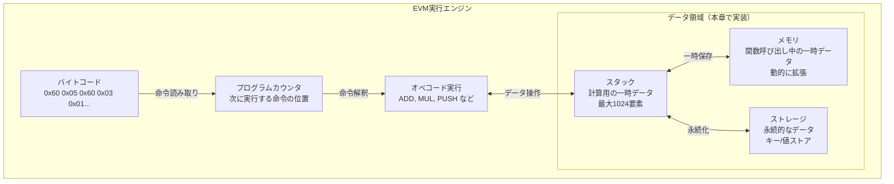

## 本章で実装するEVMコンポーネント

前章では、EVMの基本構造とデータ型(256ビット整数)について学びました。本章では、EVMの実行に不可欠な3つの主要コンポーネントを実装していきます。

### EVMの実行モデルの全体像

EVMは「スタックマシン」として動作します。バイトコードの命令を1つずつ読み取り、スタック上でデータを操作しながら計算を進めていきます。


```mermaid
graph TD
    subgraph "EVM実行エンジン"
        PC[プログラムカウンタ<br/>次に実行する命令の位置]
        Bytecode[バイトコード<br/>0x60 0x05 0x60 0x03 0x01...]

        subgraph "データ領域（本章で実装）"
            Stack[スタック<br/>計算用の一時データ<br/>最大1024要素]
            Memory[メモリ<br/>関数呼び出し中の一時データ<br/>動的に拡張]
            Storage[ストレージ<br/>永続的なデータ<br/>キー/値ストア]
        end

        Opcode[オペコード実行<br/>ADD, MUL, PUSH など]
    end

    Bytecode -->|命令読み取り| PC
    PC -->|命令解釈| Opcode
    Opcode <-->|データ操作| Stack
    Stack <-->|一時保存| Memory
    Stack <-->|永続化| Storage

```

### 3つのデータ領域の役割

EVMには、目的の異なる3つのデータ領域があります。

| データ領域 | 用途 | 永続性 | アクセス特性 |
|----------|------|--------|------------|
| スタック | 命令のオペランドと計算結果 | トランザクション内のみ | LIFO（後入れ先出し）最大1024要素 |
| メモリ | 関数呼び出し時の一時データ | トランザクション内のみ | バイトアドレス指定動的に拡張 |
| ストレージ | コントラクトの状態変数 | 本物のEVMでは永続。本書では1回の実行内のみ | キー/値ペア |

本物のEthereumではストレージをワールドステートへ反映します。本書の `EvmContext.init` は実行ごとに新しい `AutoHashMap` を作り、`deinit` で破棄します。そのため、本章の `SSTORE` / `SLOAD` は同じ `execute` 呼び出しの中だけで有効です。呼び出しをまたぐ状態永続化は実装範囲外です。

### 本章の実装フロー

以下の順序で、各コンポーネントを実装していきます。

1. スタックの実装 - EVMの計算の中核となるLIFO構造
2. メモリの実装 - 動的に拡張可能なバイト配列
3. ストレージの実装 - 1回の実行内で使うキー/値ストア
4. オペコード実行エンジン - バイトコードを解釈して実行

### 第9章から作業用チェックポイントを作る

第10章だけの途中スナップショットはありません。完成版の`references/EVMchapter/`を最初からコピーすると、まだ説明していないコードまで混ざります。そこで、前章で本文から作った`book-work/chapter9/`を複製し、この章専用の作業ディレクトリを作ります。以降のパスとコマンドは、`BlockChain`リポジトリのルートで次を実行した後、`book-work/chapter10/`をカレントディレクトリにしたものです。

```bash
cd "$(git rev-parse --show-toplevel)"
docker build --build-arg ZIG_VERSION=0.14.0 -t zig-blockchain-book .

test -f book-work/chapter9/src/evm_types.zig
rm -rf book-work/chapter10
cp -R book-work/chapter9 book-work/chapter10
cd book-work/chapter10

docker run --rm \
  -v "$PWD:/work:ro" \
  -w /work \
  zig-blockchain-book \
  sh -c '
    zig build test --cache-dir /tmp/zig-cache --global-cache-dir /tmp/zig-global-cache &&
    zig build run --cache-dir /tmp/zig-cache --global-cache-dir /tmp/zig-global-cache --prefix /tmp/zig-out
  '
```

開始地点ではテストが成功し、実行結果に`100 + 50 = 150`が含まれます。本章では`src/evm_types.zig`を段階的に拡張し、最後に`src/evm.zig`とEVM用の`src/main.zig`を追加します。

以降は、現在の`book-work/chapter10`を`/work`へ読み取り専用でマウントします。編集内容は次の`docker run`へ即座に反映されるため、イメージを節ごとに再ビルドする必要はありません。Zigのキャッシュと成果物はコンテナの`/tmp`へ出し、ホスト側へroot所有ファイルを残さないようにします。

### テストフィルターを0件成功にしない

Zigの`--test-filter`は、名前に一致するテストを0件しか選べなくても終了コード0になる場合があります。本章では、テスト出力に分数形式の実行件数と対象名が存在することまで`grep`で検査します。各カードの「テスト」は、単にコンパイルできたことではなく、対象テストが1件以上動いたことを表します。

それでは、まずスタックから実装していきましょう。

## スタックの実装

EVMのスタックは最大1024要素を格納できるLIFO（Last In First Out）構造です。

> **対象パス:** `src/evm_types.zig`
>
> **開始地点:** `ch09-sec04-evmu256`（直前に複製した`book-work/chapter9/`）
>
> **今回の変更:** 後述の「`evm_types.zig`の完成コード」で、第9章の`EVMu256`を互換メソッドを残した版へ置き換え、その直後へ`EvmStack`を追加します。`EvmStack`の閉じ括弧`};`の直後へ、`test "EvmStack operations"`も追加します。
>
> **テスト:** イメージを再ビルドし、`--test-filter "EvmStack"`の出力が0件でないことを検査します。
>
> **実行:** フィルターしたテスト実行そのものが、push、pop、underflow、overflowの実行例です。
>
> **期待する結果:** `1/1 ... EvmStack operations...OK`と`All 1 tests passed.`が表示され、空popは`StackUnderflow`、1025個目のpushは`StackOverflow`になります。

### エラーハンドリングについて

EVMのスタック操作では、次の2つのエラーが発生します。

1. StackOverflow: スタックに1024個を超える要素をプッシュしようとした場合
2. StackUnderflow: 空のスタックからポップしようとした場合

これらのエラーは、スマートコントラクトの実行を即座に停止させ、トランザクション全体を失敗させます。
Zigのエラーハンドリング機構（`!`と`error`）を使って、これらを適切に処理します。

```zig
/// EVMスタック
pub const EvmStack = struct {
    data: [1024]EVMu256,  // 固定サイズ配列
    sp: usize,           // スタックトップの位置

    /// 新しいスタックを作成
    pub fn init() EvmStack {
        return EvmStack{
            .data = undefined,  // 初期化は不要
            .sp = 0,
        };
    }

    /// 値をプッシュ
    pub fn push(self: *EvmStack, value: EVMu256) !void {
        if (self.sp >= 1024) {
            return error.StackOverflow;
        }
        self.data[self.sp] = value;
        self.sp += 1;
    }

    /// 値をポップ
    pub fn pop(self: *EvmStack) !EVMu256 {
        if (self.sp == 0) {
            return error.StackUnderflow;
        }
        self.sp -= 1;
        return self.data[self.sp];
    }

    /// スタックの深さを取得
    pub fn depth(self: *const EvmStack) usize {
        return self.sp;
    }

    /// n番目の要素を複製（DUP命令用）
    pub fn dup(self: *EvmStack, n: usize) !void {
        if (n == 0 or self.sp < n) {
            return error.StackUnderflow;
        }
        if (self.sp >= 1024) {
            return error.StackOverflow;
        }

        const value = self.data[self.sp - n];
        self.data[self.sp] = value;
        self.sp += 1;
    }

    /// n番目の要素と交換（SWAP命令用）
    pub fn swap(self: *EvmStack, n: usize) !void {
        if (n == 0 or self.sp < n + 1) {
            return error.StackUnderflow;
        }

        const temp = self.data[self.sp - 1];
        self.data[self.sp - 1] = self.data[self.sp - n - 1];
        self.data[self.sp - n - 1] = temp;
    }
};
```

### `evm_types.zig`の完成コード

ここから示すコードは、4つのデータ領域をすべて実装し終えた時点の`src/evm_types.zig`です。最初にファイル全体をこのコードへ置き換えても構いません。節ごとに進める場合は、各カードで指定した構造体までを順番に追加し、次に示すテストをファイル末尾へ追加してください。

第9章の`src/main.zig`と`src/root.zig`も途中のゲートでコンパイルできるように、`one`、`eq`、`isZero`、`toBytes`、`fromBytes`を残しています。`eql`は第10章で`AutoHashMap`の値を比較するための同義メソッドです。

```zig
//! EVMデータ構造定義
//!
//! このモジュールはEthereum Virtual Machine (EVM)の実行に必要な
//! データ構造を定義します。スマートコントラクト実行環境に
//! 必要なスタック、メモリ、ストレージなどの構造体を含みます。

const std = @import("std");

/// 256ビット整数型（EVMの基本データ型）
/// u128の2つの要素で256ビットを表現
pub const EVMu256 = struct {
    // 256ビットを2つのu128値で表現（上位ビットと下位ビット）
    hi: u128, // 上位128ビット
    lo: u128, // 下位128ビット

    /// ゼロ値の作成
    pub fn zero() EVMu256 {
        return EVMu256{ .hi = 0, .lo = 0 };
    }

    /// 1の作成（第9章のAPIとの互換性を保つ）
    pub fn one() EVMu256 {
        return EVMu256{ .hi = 0, .lo = 1 };
    }

    /// u64値からEVMu256を作成
    pub fn fromU64(value: u64) EVMu256 {
        return EVMu256{ .hi = 0, .lo = value };
    }

    /// 加算演算
    pub fn add(self: EVMu256, other: EVMu256) EVMu256 {
        var result = EVMu256{ .hi = self.hi, .lo = self.lo };
        var overflow: u1 = 0;
        result.lo, overflow = @addWithOverflow(result.lo, other.lo);
        result.hi = result.hi +% other.hi +% @as(u128, overflow);
        return result;
    }

    /// 減算演算
    pub fn sub(self: EVMu256, other: EVMu256) EVMu256 {
        var result = EVMu256{ .hi = self.hi, .lo = self.lo };
        var underflow: u1 = 0;
        result.lo, underflow = @subWithOverflow(result.lo, other.lo);
        result.hi = result.hi -% other.hi -% @as(u128, underflow);
        return result;
    }

    /// 乗算演算（mod 2^256）
    pub fn mul(self: EVMu256, other: EVMu256) EVMu256 {
        const lhs = (@as(u256, self.hi) << 128) | @as(u256, self.lo);
        const rhs = (@as(u256, other.hi) << 128) | @as(u256, other.lo);
        const product = lhs *% rhs;
        return .{
            .hi = @truncate(product >> 128),
            .lo = @truncate(product),
        };
    }

    /// 等価比較
    pub fn eql(self: EVMu256, other: EVMu256) bool {
        return self.hi == other.hi and self.lo == other.lo;
    }

    /// 第9章で使った名前を残す
    pub fn eq(self: EVMu256, other: EVMu256) bool {
        return self.eql(other);
    }

    /// ゼロ値かを判定
    pub fn isZero(self: EVMu256) bool {
        return self.hi == 0 and self.lo == 0;
    }

    /// 32バイトのビッグエンディアン表現へ変換
    pub fn toBytes(self: EVMu256) [32]u8 {
        var bytes: [32]u8 = undefined;
        for (0..16) |i| {
            const shift = @as(u7, @intCast((15 - i) * 8));
            bytes[i] = @truncate(self.hi >> shift);
            bytes[i + 16] = @truncate(self.lo >> shift);
        }
        return bytes;
    }

    /// 32バイト以下のビッグエンディアン表現から変換
    pub fn fromBytes(input: []const u8) EVMu256 {
        const bytes = input[input.len - @min(input.len, 32) ..];
        const offset = 32 - bytes.len;
        var result = EVMu256.zero();

        for (bytes, 0..) |byte, i| {
            const pos = offset + i;
            if (pos < 16) {
                const shift = @as(u7, @intCast((15 - pos) * 8));
                result.hi |= @as(u128, byte) << shift;
            } else {
                const shift = @as(u7, @intCast((31 - pos) * 8));
                result.lo |= @as(u128, byte) << shift;
            }
        }
        return result;
    }

    /// フォーマット出力用メソッド
    /// std.fmt.Formatインターフェースに準拠
    pub fn format(
        self: EVMu256,
        comptime fmt: []const u8,
        options: std.fmt.FormatOptions,
        writer: anytype,
    ) !void {
        // options is used in some format cases below

        if (fmt.len == 0 or fmt[0] == 'd') {
            // 10進数表示
            if (self.hi == 0) {
                // 上位ビットが0の場合は単純に下位ビットを表示
                try std.fmt.formatInt(self.lo, 10, .lower, options, writer);
            } else {
                // 本来は256ビット数値を正確に10進変換する必要があるが、簡易表示
                try writer.writeAll("0x");
                try std.fmt.formatInt(self.hi, 16, .lower, .{}, writer);
                try writer.writeByte('_');
                try std.fmt.formatInt(self.lo, 16, .lower, .{}, writer);
            }
        } else if (fmt[0] == 'x' or fmt[0] == 'X') {
            // 16進数表示
            const case: std.fmt.Case = if (fmt[0] == 'X') .upper else .lower;
            try writer.writeAll("0x");

            // 上位ビットが0でなければ表示
            if (self.hi != 0) {
                try std.fmt.formatInt(self.hi, 16, case, .{ .fill = '0', .width = 32 }, writer);
            }

            try std.fmt.formatInt(self.lo, 16, case, .{ .fill = '0', .width = 32 }, writer);
        } else {
            // 不明なフォーマット指定子の場合はデフォルトで16進表示
            try writer.writeAll("0x");
            if (self.hi != 0) {
                try std.fmt.formatInt(self.hi, 16, .lower, .{}, writer);
                try writer.writeByte('_');
            }
            try std.fmt.formatInt(self.lo, 16, .lower, .{}, writer);
        }
    }
};

/// EVMアドレスクラス（20バイト/160ビットのEthereumアドレス）
pub const EVMAddress = struct {
    /// アドレスデータ（20バイト固定長）
    data: [20]u8,

    /// ゼロアドレスを作成
    pub fn zero() EVMAddress {
        return EVMAddress{ .data = [_]u8{0} ** 20 };
    }

    /// バイト配列からアドレスを作成
    pub fn fromBytes(bytes: []const u8) !EVMAddress {
        if (bytes.len != 20) {
            return error.InvalidAddressLength;
        }
        var addr = EVMAddress{ .data = undefined };
        @memcpy(&addr.data, bytes);
        return addr;
    }

    /// 16進数文字列からアドレスを作成（"0x"プレフィックスは省略可能）
    pub fn fromHexString(hex_str: []const u8) !EVMAddress {
        // 先頭の"0x"を取り除く
        var offset: usize = 0;
        if (hex_str.len >= 2 and hex_str[0] == '0' and (hex_str[1] == 'x' or hex_str[1] == 'X')) {
            offset = 2;
        }

        // 期待される長さをチェック (20バイト = 40文字 + オプションの"0x")
        if (hex_str.len - offset != 40) {
            return error.InvalidAddressLength;
        }

        var addr = EVMAddress{ .data = undefined };

        // 16進数文字列をバイト配列に変換
        var i: usize = 0;
        while (i < 20) : (i += 1) {
            const high = try std.fmt.charToDigit(hex_str[offset + i * 2], 16);
            const low = try std.fmt.charToDigit(hex_str[offset + i * 2 + 1], 16);
            addr.data[i] = @as(u8, high << 4) | @as(u8, low);
        }

        return addr;
    }

    /// アドレスを16進数文字列に変換（0xプレフィックス付き）
    pub fn toHexString(self: EVMAddress, allocator: std.mem.Allocator) ![]u8 {
        // "0x" + 20バイト*2文字 + null終端の領域を確保
        var result = try allocator.alloc(u8, 2 + 40);
        result[0] = '0';
        result[1] = 'x';

        // 各バイトを16進数に変換
        for (self.data, 0..) |byte, i| {
            const high = std.fmt.digitToChar(byte >> 4, .lower);
            const low = std.fmt.digitToChar(byte & 0xF, .lower);
            result[2 + i * 2] = high;
            result[2 + i * 2 + 1] = low;
        }

        return result;
    }

    /// EVMu256からアドレスへ変換（下位20バイトを使用）
    pub fn fromEVMu256(value: EVMu256) EVMAddress {
        var addr = EVMAddress{ .data = undefined };

        // 下位16バイトを取り出す（u128の下位部分から）
        const lo_bytes = std.mem.asBytes(&value.lo);

        // ほとんどのアーキテクチャはリトルエンディアンなので、バイト順を調整
        var i: usize = 0;
        while (i < 16) : (i += 1) {
            // u128(16バイト)の最後の4バイトは使わない
            if (i < 12) {
                addr.data[i + 8] = lo_bytes[15 - i]; // 下位バイトから順に20バイトのアドレスに入れる
            }
        }

        // 上位4バイトを取り出す（u128の上位部分の最下位バイトから）
        const hi_bytes = std.mem.asBytes(&value.hi);
        i = 0;
        while (i < 4) : (i += 1) {
            addr.data[i] = hi_bytes[15 - i]; // 最下位4バイトを使用
        }

        return addr;
    }

    /// 等価比較
    pub fn eql(self: EVMAddress, other: EVMAddress) bool {
        for (self.data, other.data) |a, b| {
            if (a != b) return false;
        }
        return true;
    }

    /// チェックサム付きアドレスを取得（EIP-55準拠）
    pub fn toChecksumAddress(self: EVMAddress, allocator: std.mem.Allocator) ![]u8 {
        // アドレスの16進表現（0xなし）を取得
        var hex_addr = try allocator.alloc(u8, 40);
        defer allocator.free(hex_addr);

        for (self.data, 0..) |byte, i| {
            const high = std.fmt.digitToChar(byte >> 4, .lower);
            const low = std.fmt.digitToChar(byte & 0xF, .lower);
            hex_addr[i * 2] = high;
            hex_addr[i * 2 + 1] = low;
        }

        // アドレスのKeccak-256ハッシュを計算
        // 注：EIP-55に厳密対応するには、適切なKeccakライブラリが必要です
        // この実装はシンプル化のため、実際のハッシュ計算は省略しています

        // 結果文字列（0xプレフィックス付き）
        var result = try allocator.alloc(u8, 42);
        result[0] = '0';
        result[1] = 'x';

        // この実装では単純にすべて小文字に
        // 実際のEIP-55実装ではハッシュ値に基づき大文字/小文字を決定する
        @memcpy(result[2..], hex_addr);

        return result;
    }
};

/// EVMスタック（1024要素まで格納可能）
pub const EvmStack = struct {
    /// スタックデータ（最大1024要素）
    data: [1024]EVMu256,
    /// スタックポインタ（次に積むインデックス）
    sp: usize,

    /// 新しい空のスタックを作成
    pub fn init() EvmStack {
        return EvmStack{
            .data = undefined,
            .sp = 0,
        };
    }

    /// スタックに値をプッシュ
    pub fn push(self: *EvmStack, value: EVMu256) !void {
        if (self.sp >= 1024) {
            return error.StackOverflow;
        }
        self.data[self.sp] = value;
        self.sp += 1;
    }

    /// スタックから値をポップ
    pub fn pop(self: *EvmStack) !EVMu256 {
        if (self.sp == 0) {
            return error.StackUnderflow;
        }
        self.sp -= 1;
        return self.data[self.sp];
    }

    /// スタックの深さを取得
    pub fn depth(self: *const EvmStack) usize {
        return self.sp;
    }

    /// 上からn番目の値を複製する（DUP1-DUP16用）
    pub fn dup(self: *EvmStack, n: usize) !void {
        if (n == 0 or self.sp < n) {
            return error.StackUnderflow;
        }
        try self.push(self.data[self.sp - n]);
    }

    /// スタックトップと上からn+1番目の値を交換する（SWAP1-SWAP16用）
    pub fn swap(self: *EvmStack, n: usize) !void {
        if (n == 0 or self.sp < n + 1) {
            return error.StackUnderflow;
        }
        const top = self.sp - 1;
        const other = self.sp - n - 1;
        const value = self.data[top];
        self.data[top] = self.data[other];
        self.data[other] = value;
    }
};

/// EVMメモリ（動的に拡張可能なバイト配列）
pub const EvmMemory = struct {
    /// メモリデータ（初期サイズは0、アクセス時に32バイト単位で拡張）
    data: std.ArrayList(u8),

    /// 新しいEVMメモリを初期化
    pub fn init(allocator: std.mem.Allocator) EvmMemory {
        // メモリリークを避けるためにconst修飾子を使用
        const memory = std.ArrayList(u8).init(allocator);
        return EvmMemory{
            .data = memory,
        };
    }

    /// メモリを必要に応じて拡張
    pub fn ensureSize(self: *EvmMemory, size: usize) !void {
        if (size > self.data.items.len) {
            // サイズを32バイト単位に切り上げて拡張
            const old_len = self.data.items.len;
            const new_size = ((size + 31) / 32) * 32;
            try self.data.resize(new_size);
            // 拡張部分を0で初期化
            var i = old_len;
            while (i < new_size) : (i += 1) {
                self.data.items[i] = 0;
            }
        }
    }

    /// メモリから32バイト（256ビット）読み込み
    pub fn load32(self: *EvmMemory, offset: usize) !EVMu256 {
        try self.ensureSize(offset + 32);
        var result = EVMu256.zero();

        // 上位128ビット（先頭16バイト）
        var hi: u128 = 0;
        for (0..16) |i| {
            const byte_val = self.data.items[offset + i];
            const shift_amount = (15 - i) * 8;
            hi |= @as(u128, byte_val) << @intCast(shift_amount);
        }

        // 下位128ビット（後半16バイト）
        var lo: u128 = 0;
        for (0..16) |i| {
            const byte_val = self.data.items[offset + 16 + i];
            const shift_amount = (15 - i) * 8;
            lo |= @as(u128, byte_val) << @intCast(shift_amount);
        }

        result.hi = hi;
        result.lo = lo;
        return result;
    }

    /// メモリに32バイト（256ビット）書き込み
    pub fn store32(self: *EvmMemory, offset: usize, value: EVMu256) !void {
        try self.ensureSize(offset + 32);

        // 上位128ビットをバイト単位で書き込み
        const hi = value.hi;
        var i: usize = 0;
        while (i < 16) : (i += 1) {
            const shift_amount = (15 - i) * 8;
            const byte_val = @as(u8, @truncate(hi >> @intCast(shift_amount)));
            self.data.items[offset + i] = byte_val;
        }

        // 下位128ビットをバイト単位で書き込み
        const lo = value.lo;
        i = 0;
        while (i < 16) : (i += 1) {
            const shift_amount = (15 - i) * 8;
            const byte_val = @as(u8, @truncate(lo >> @intCast(shift_amount)));
            self.data.items[offset + 16 + i] = byte_val;
        }
    }

    /// 解放処理
    pub fn deinit(self: *EvmMemory) void {
        self.data.deinit();
    }
};

/// EVMストレージ（本章では1回の実行中だけ保持するキー/バリューストア）
pub const EvmStorage = struct {
    /// ストレージデータ（キー: EVMu256, 値: EVMu256のマップ）
    data: std.AutoHashMap(EVMu256, EVMu256),

    /// 新しいストレージを初期化
    pub fn init(allocator: std.mem.Allocator) EvmStorage {
        return EvmStorage{
            .data = std.AutoHashMap(EVMu256, EVMu256).init(allocator),
        };
    }

    /// ストレージから値を読み込み
    pub fn load(self: *EvmStorage, key: EVMu256) EVMu256 {
        return self.data.get(key) orelse EVMu256.zero();
    }

    /// ストレージに値を書き込み
    pub fn store(self: *EvmStorage, key: EVMu256, value: EVMu256) !void {
        try self.data.put(key, value);
    }

    /// 解放処理
    pub fn deinit(self: *EvmStorage) void {
        self.data.deinit();
    }
};

/// EVM実行コンテキスト（実行状態を保持）
pub const EvmContext = struct {
    /// プログラムカウンタ（現在実行中のコード位置）
    pc: usize,
    /// 残りガス量
    gas: usize,
    /// 実行中のバイトコード
    code: []const u8,
    /// 呼び出しデータ（コントラクト呼び出し時の引数）
    calldata: []const u8,
    /// 戻り値データ
    returndata: std.ArrayList(u8),
    /// スタック
    stack: EvmStack,
    /// メモリ
    memory: EvmMemory,
    /// ストレージ
    storage: EvmStorage,
    /// 呼び出し深度（再帰呼び出し用）
    depth: u8,
    /// 実行終了フラグ
    stopped: bool,
    /// エラー発生時のメッセージ
    error_msg: ?[]const u8,

    /// 新しいEVM実行コンテキストを初期化
    pub fn init(allocator: std.mem.Allocator, code: []const u8, calldata: []const u8) EvmContext {
        return EvmContext{
            .pc = 0,
            .gas = 10_000_000, // 初期ガス量（適宜調整）
            .code = code,
            .calldata = calldata,
            .returndata = std.ArrayList(u8).init(allocator),
            .stack = EvmStack.init(),
            .memory = EvmMemory.init(allocator),
            .storage = EvmStorage.init(allocator),
            .depth = 0,
            .stopped = false,
            .error_msg = null,
        };
    }

    /// リソース解放
    pub fn deinit(self: *EvmContext) void {
        self.returndata.deinit();
        self.memory.deinit();
        self.storage.deinit();
    }
};
```

### スタックのテストを追加する

`src/evm_types.zig`の末尾、`EvmContext`の閉じ括弧`};`より後へ次を追加します。節ごとに進めていて`EvmContext`がまだない場合は、現在のファイル末尾へ追加し、次節の構造体はこのテストより前へ挿入してください。

```zig
test "EvmStack operations" {
    var stack = EvmStack.init();
    try std.testing.expectEqual(@as(usize, 0), stack.depth());

    try stack.push(EVMu256.fromU64(10));
    try stack.push(EVMu256.fromU64(20));
    try std.testing.expectEqual(@as(usize, 2), stack.depth());

    try stack.dup(2);
    try std.testing.expect((try stack.pop()).eql(EVMu256.fromU64(10)));
    try stack.swap(1);
    try std.testing.expect((try stack.pop()).eql(EVMu256.fromU64(10)));
    try std.testing.expect((try stack.pop()).eql(EVMu256.fromU64(20)));
    try std.testing.expectError(error.StackUnderflow, stack.pop());

    for (0..1024) |i| {
        try stack.push(EVMu256.fromU64(@intCast(i)));
    }
    try std.testing.expectError(
        error.StackOverflow,
        stack.push(EVMu256.fromU64(1025)),
    );
}
```

```bash
docker run --rm \
  -v "$PWD:/work:ro" \
  -w /work \
  zig-blockchain-book \
  sh -eu -c '
  output="$(zig test src/evm_types.zig --test-filter "EvmStack" \
    --cache-dir /tmp/zig-cache \
    --global-cache-dir /tmp/zig-global-cache 2>&1)"
  printf "%s\n" "$output"
  printf "%s\n" "$output" |
    grep -Eq "^[1-9][0-9]*/[1-9][0-9]* .*EvmStack"
'
```

### メモリを実装してテストする

> **対象パス:** `src/evm_types.zig`
>
> **開始地点:** `ch10-sec01-evm-stack`
>
> **今回の変更:** 完成コード中の`pub const EvmMemory`全体を、`EvmStack`の閉じ括弧`};`の直後かつ最初の`test`宣言より前へ追加します。次の`test "EvmMemory operations"`はファイル末尾へ追加します。
>
> **テスト:** `--test-filter "EvmMemory"`を実行し、出力にも`EvmMemory`があることを`grep`で検査します。
>
> **実行:** テストが`store32`と`load32`を実行し、オフセット100の読み込みによる動的拡張も起こします。
>
> **期待する結果:** 32バイト値がビッグエンディアンで往復し、メモリ長は32バイト境界へ切り上げられ、未書き込み領域は0になります。

```zig
test "EvmMemory operations" {
    var memory = EvmMemory.init(std.testing.allocator);
    defer memory.deinit();

    const value = EVMu256{
        .hi = 0x0123456789abcdef_fedcba9876543210,
        .lo = 0x0011223344556677_8899aabbccddeeff,
    };
    try memory.store32(0, value);
    try std.testing.expect((try memory.load32(0)).eql(value));
    try std.testing.expectEqual(@as(usize, 32), memory.data.items.len);

    const unwritten = try memory.load32(100);
    try std.testing.expect(unwritten.eql(EVMu256.zero()));
    try std.testing.expectEqual(@as(usize, 160), memory.data.items.len);
}
```

```bash
docker run --rm \
  -v "$PWD:/work:ro" \
  -w /work \
  zig-blockchain-book \
  sh -eu -c '
  output="$(zig test src/evm_types.zig --test-filter "EvmMemory" \
    --cache-dir /tmp/zig-cache \
    --global-cache-dir /tmp/zig-global-cache 2>&1)"
  printf "%s\n" "$output"
  printf "%s\n" "$output" |
    grep -Eq "^[1-9][0-9]*/[1-9][0-9]* .*EvmMemory"
'
```

### ストレージを実装してテストする

> **対象パス:** `src/evm_types.zig`
>
> **開始地点:** `ch10-sec02-evm-memory`
>
> **今回の変更:** 完成コード中の`pub const EvmStorage`全体を、`EvmMemory`の閉じ括弧`};`の直後かつ最初の`test`宣言より前へ追加します。次の`test "EvmStorage operations"`はファイル末尾へ追加します。
>
> **テスト:** `--test-filter "EvmStorage"`を実行し、対象テストが1件以上動いたことも検査します。
>
> **実行:** テストが未登録キーの読み込み、2キーの保存、既存キーの上書きを実行します。
>
> **期待する結果:** 未登録キーは0、保存後は対応する値、上書き後は新しい値を返します。この時点の値はプロセスや`execute`呼び出しをまたいで永続化しません。

```zig
test "EvmStorage operations" {
    var storage = EvmStorage.init(std.testing.allocator);
    defer storage.deinit();

    const key1 = EVMu256.fromU64(1);
    const key2 = EVMu256.fromU64(2);
    try std.testing.expect(storage.load(key1).eql(EVMu256.zero()));

    try storage.store(key1, EVMu256.fromU64(100));
    try storage.store(key2, EVMu256.fromU64(200));
    try std.testing.expect(storage.load(key1).eql(EVMu256.fromU64(100)));
    try std.testing.expect(storage.load(key2).eql(EVMu256.fromU64(200)));

    try storage.store(key1, EVMu256.fromU64(300));
    try std.testing.expect(storage.load(key1).eql(EVMu256.fromU64(300)));
}
```

```bash
docker run --rm \
  -v "$PWD:/work:ro" \
  -w /work \
  zig-blockchain-book \
  sh -eu -c '
  output="$(zig test src/evm_types.zig --test-filter "EvmStorage" \
    --cache-dir /tmp/zig-cache \
    --global-cache-dir /tmp/zig-global-cache 2>&1)"
  printf "%s\n" "$output"
  printf "%s\n" "$output" |
    grep -Eq "^[1-9][0-9]*/[1-9][0-9]* .*EvmStorage"
'
```

### 実行コンテキストを実装してテストする

> **対象パス:** `src/evm_types.zig`
>
> **開始地点:** `ch10-sec03-evm-storage`
>
> **今回の変更:** 完成コード中の`pub const EvmContext`全体を、`EvmStorage`の閉じ括弧`};`の直後かつ最初の`test`宣言より前へ追加します。次の`test "EvmContext initialization"`はファイル末尾へ追加します。
>
> **テスト:** `--test-filter "EvmContext"`を実行し、対象テストが1件以上動いたことも検査します。
>
> **実行:** テストがコードとcalldataを渡してコンテキストを作り、初期状態を読み取った後、`deinit`で所有リソースを解放します。
>
> **期待する結果:** `pc`と`depth`は0、スタック、メモリ、戻り値は空、`stopped`はfalse、`error_msg`はnullです。

```zig
test "EvmContext initialization" {
    const code = [_]u8{ 0x60, 0x01, 0x60, 0x02, 0x01 };
    const calldata = [_]u8{ 0xaa, 0xbb };
    var context = EvmContext.init(std.testing.allocator, &code, &calldata);
    defer context.deinit();

    try std.testing.expectEqual(@as(usize, 0), context.pc);
    try std.testing.expectEqual(@as(u8, 0), context.depth);
    try std.testing.expect(!context.stopped);
    try std.testing.expect(context.error_msg == null);
    try std.testing.expectEqualSlices(u8, &code, context.code);
    try std.testing.expectEqualSlices(u8, &calldata, context.calldata);
    try std.testing.expectEqual(@as(usize, 0), context.stack.depth());
    try std.testing.expectEqual(@as(usize, 0), context.memory.data.items.len);
    try std.testing.expectEqual(@as(usize, 0), context.returndata.items.len);
}
```

```bash
docker run --rm \
  -v "$PWD:/work:ro" \
  -w /work \
  zig-blockchain-book \
  sh -eu -c '
  output="$(zig test src/evm_types.zig --test-filter "EvmContext" \
    --cache-dir /tmp/zig-cache \
    --global-cache-dir /tmp/zig-global-cache 2>&1)"
  printf "%s\n" "$output"
  printf "%s\n" "$output" |
    grep -Eq "^[1-9][0-9]*/[1-9][0-9]* .*EvmContext"
'
```

### EVM実行エンジンの実装

EVMの実行エンジン部分は、オペコードの読み取り、解釈、実行を担当します。主な機能は以下の通りです。

- オペコード定数の定義: EVMで使用される命令コードを定数として定義します（STOP, ADD, MULなど）
- 実行ループ: バイトコードを1命令ずつ処理し、コンテキストを更新していきます
- 命令処理: 各オペコードに対応する処理をswitch文で実装します

下記は実行エンジンの核となる部分です。

> **対象パス:** `src/evm.zig`（新規作成）
>
> **開始地点:** `ch10-sec04-evm-context`
>
> **今回の変更:** 次のコードブロック全体を新しい`src/evm.zig`へ保存します。続く「Solidity実行に必要なオペコードを追加する」で、同じファイルの定数、ヘルパー、`executeStep`を拡張します。
>
> **テスト:** 基本実装の時点では`zig test src/evm.zig --test-filter "Simple EVM"`を実行します。
>
> **実行:** `PUSH1 5`、`PUSH1 3`、`ADD`、`MSTORE`、`RETURN`からなるバイトコードをテストで実行します。
>
> **期待する結果:** 32バイトの戻り値の末尾が8になり、`1/1 ... Simple EVM execution...OK`と表示されます。

`src/evm.zig`を新規に作成し、以下のように記述します。ログ出力には標準ライブラリの`std.log`を使うため、第9章の作業用チェックポイントに存在しない`logger.zig`は必要ありません。

```zig
//! Ethereum Virtual Machine (EVM) 実装
//!
//! このモジュールはEthereumのスマートコントラクト実行環境であるEVMを
//! 簡易的に実装します。EVMバイトコードを解析・実行し、スタックベースの
//! 仮想マシンとして動作します。

const std = @import("std");
const evm_types = @import("evm_types.zig");
// u256型を別名で使用して衝突を回避
const EVMu256 = evm_types.EVMu256;
const EvmContext = evm_types.EvmContext;

/// EVMオペコード定義
pub const Opcode = struct {
    // 終了・リバート系
    pub const STOP = 0x00;
    pub const RETURN = 0xF3;
    pub const REVERT = 0xFD;

    // スタック操作・算術命令
    pub const ADD = 0x01;
    pub const MUL = 0x02;
    pub const SUB = 0x03;
    pub const DIV = 0x04;
    pub const SDIV = 0x05;
    pub const MOD = 0x06;
    pub const SMOD = 0x07;
    pub const ADDMOD = 0x08;
    pub const MULMOD = 0x09;
    pub const EXP = 0x0A;
    pub const LT = 0x10;
    pub const GT = 0x11;
    pub const SLT = 0x12;
    pub const SGT = 0x13;
    pub const EQ = 0x14;
    pub const ISZERO = 0x15;
    pub const AND = 0x16;
    pub const OR = 0x17;
    pub const XOR = 0x18;
    pub const NOT = 0x19;
    pub const POP = 0x50;

    // メモリ操作
    pub const MLOAD = 0x51;
    pub const MSTORE = 0x52;
    pub const MSTORE8 = 0x53;

    // ストレージ操作
    pub const SLOAD = 0x54;
    pub const SSTORE = 0x55;

    // 制御フロー
    pub const JUMP = 0x56;
    pub const JUMPI = 0x57;
    pub const PC = 0x58;
    pub const JUMPDEST = 0x5B;

    // PUSHシリーズ (PUSH1-PUSH32)
    pub const PUSH1 = 0x60;
    // 他のPUSH命令も順次増えていく (0x61-0x7F)

    // DUPシリーズ (DUP1-DUP16)
    pub const DUP1 = 0x80;
    // 他のDUP命令も順次増えていく (0x81-0x8F)

    // SWAPシリーズ (SWAP1-SWAP16)
    pub const SWAP1 = 0x90;
    // 他のSWAP命令も順次増えていく (0x91-0x9F)

    // 呼び出しデータ関連
    pub const CALLDATALOAD = 0x35;
    pub const CALLDATASIZE = 0x36;
    pub const CALLDATACOPY = 0x37;
};

/// エラー型定義
pub const EVMError = error{
    OutOfGas,
    StackOverflow,
    StackUnderflow,
    InvalidJump,
    InvalidOpcode,
    MemoryOutOfBounds,
};

/// EVMバイトコードを実行する
///
/// 引数:
///     allocator: メモリアロケータ
///     code: EVMバイトコード
///     calldata: コントラクト呼び出し時の引数データ
///     gas_limit: 実行時のガス上限
///
/// 戻り値:
///     []const u8: 実行結果のバイト列
///
/// エラー:
///     様々なEVM実行エラー
pub fn execute(allocator: std.mem.Allocator, code: []const u8, calldata: []const u8, gas_limit: usize) ![]const u8 {
    // EVMコンテキストの初期化
    var context = EvmContext.init(allocator, code, calldata);
    // ガスリミット設定
    context.gas = gas_limit;
    defer context.deinit();

    // メインの実行ループ
    while (context.pc < context.code.len and !context.stopped) {
        try executeStep(&context);
    }

    // 戻り値をコピーして返す
    const result = try allocator.alloc(u8, context.returndata.items.len);
    @memcpy(result, context.returndata.items);
    return result;
}

/// 単一のEVM命令を実行
fn executeStep(context: *EvmContext) !void {
    // 現在のオペコードを取得
    const opcode = context.code[context.pc];

    // ガス消費（シンプル版 - 本来は命令ごとに異なる）
    if (context.gas < 1) {
        context.error_msg = "Out of gas";
        return EVMError.OutOfGas;
    }
    context.gas -= 1;

    // オペコードを解釈して実行
    switch (opcode) {
        Opcode.STOP => {
            context.stopped = true;
        },

        Opcode.ADD => {
            if (context.stack.depth() < 2) return EVMError.StackUnderflow;
            const a = try context.stack.pop();
            const b = try context.stack.pop();
            try context.stack.push(a.add(b));
            context.pc += 1;
        },

        Opcode.MUL => {
            if (context.stack.depth() < 2) return EVMError.StackUnderflow;
            const a = try context.stack.pop();
            const b = try context.stack.pop();
            try context.stack.push(a.mul(b));
            context.pc += 1;
        },

        Opcode.SUB => {
            if (context.stack.depth() < 2) return EVMError.StackUnderflow;
            const a = try context.stack.pop();
            const b = try context.stack.pop();
            try context.stack.push(a.sub(b));
            context.pc += 1;
        },

        Opcode.DIV => {
            if (context.stack.depth() < 2) return EVMError.StackUnderflow;
            const a = try context.stack.pop();
            const b = try context.stack.pop();
            // 0除算の場合は0を返す
            if (b.hi == 0 and b.lo == 0) {
                try context.stack.push(EVMu256.zero());
            } else {
                // 簡易版ではu64の範囲のみサポート
                if (a.hi == 0 and b.hi == 0) {
                    const result = EVMu256.fromU64(@intCast(a.lo / b.lo));
                    try context.stack.push(result);
                } else {
                    // 本来はより複雑な処理が必要
                    try context.stack.push(EVMu256.zero());
                }
            }
            context.pc += 1;
        },

        // PUSH1: 1バイトをスタックにプッシュ
        Opcode.PUSH1 => {
            if (context.pc + 1 >= context.code.len) return EVMError.InvalidOpcode;
            const value = EVMu256.fromU64(context.code[context.pc + 1]);
            try context.stack.push(value);
            context.pc += 2; // オペコード＋データで2バイト進む
        },

        // DUP1: スタックトップの値を複製
        Opcode.DUP1 => {
            if (context.stack.depth() < 1) return EVMError.StackUnderflow;
            const value = context.stack.data[context.stack.sp - 1];
            try context.stack.push(value);
            context.pc += 1;
        },

        // SWAP1: スタックトップと2番目の要素を交換
        Opcode.SWAP1 => {
            if (context.stack.depth() < 2) return EVMError.StackUnderflow;
            const a = context.stack.data[context.stack.sp - 1];
            const b = context.stack.data[context.stack.sp - 2];
            context.stack.data[context.stack.sp - 1] = b;
            context.stack.data[context.stack.sp - 2] = a;
            context.pc += 1;
        },

        Opcode.MLOAD => {
            if (context.stack.depth() < 1) return EVMError.StackUnderflow;
            const offset = try context.stack.pop();
            // 現在はu64範囲のみサポート
            if (offset.hi != 0) return EVMError.MemoryOutOfBounds;
            const value = try context.memory.load32(@intCast(offset.lo));
            try context.stack.push(value);
            context.pc += 1;
        },

        Opcode.MSTORE => {
            if (context.stack.depth() < 2) return EVMError.StackUnderflow;
            const offset = try context.stack.pop();
            const value = try context.stack.pop();
            // 現在はu64範囲のみサポート
            if (offset.hi != 0) return EVMError.MemoryOutOfBounds;
            try context.memory.store32(@intCast(offset.lo), value);
            context.pc += 1;
        },

        Opcode.SLOAD => {
            if (context.stack.depth() < 1) return EVMError.StackUnderflow;
            const key = try context.stack.pop();
            const value = context.storage.load(key);
            try context.stack.push(value);
            context.pc += 1;
        },

        Opcode.SSTORE => {
            if (context.stack.depth() < 2) return EVMError.StackUnderflow;
            const key = try context.stack.pop();
            const value = try context.stack.pop();
            try context.storage.store(key, value);
            context.pc += 1;
        },

        Opcode.CALLDATALOAD => {
            if (context.stack.depth() < 1) return EVMError.StackUnderflow;
            const offset = try context.stack.pop();
            if (offset.hi != 0) return EVMError.MemoryOutOfBounds;

            var result = EVMu256.zero();
            const off = @as(usize, @intCast(offset.lo));

            // calldataから32バイトをロード（範囲外は0埋め）
            for (0..32) |i| {
                const byte_pos = off + i;
                if (byte_pos < context.calldata.len) {
                    const byte_val = context.calldata[byte_pos];
                    if (i < 16) {
                        // 上位16バイト
                        result.hi |= @as(u128, byte_val) << @intCast((15 - i) * 8);
                    } else {
                        // 下位16バイト
                        result.lo |= @as(u128, byte_val) << @intCast((31 - i) * 8);
                    }
                }
            }

            try context.stack.push(result);
            context.pc += 1;
        },

        Opcode.RETURN => {
            if (context.stack.depth() < 2) return EVMError.StackUnderflow;
            const offset = try context.stack.pop();
            const length = try context.stack.pop();

            // 現在はu64範囲のみサポート
            if (offset.hi != 0 or length.hi != 0) return EVMError.MemoryOutOfBounds;

            const off = @as(usize, @intCast(offset.lo));
            const len = @as(usize, @intCast(length.lo));

            try context.memory.ensureSize(off + len);
            if (len > 0) {
                try context.returndata.resize(len);
                for (0..len) |i| {
                    if (off + i < context.memory.data.items.len) {
                        context.returndata.items[i] = context.memory.data.items[off + i];
                    } else {
                        context.returndata.items[i] = 0;
                    }
                }
            }

            context.stopped = true;
        },

        else => {
            std.log.debug("未実装のオペコード: 0x{x:0>2}", .{opcode});
            context.error_msg = "未実装または無効なオペコード";
            return EVMError.InvalidOpcode;
        },
    }
}

/// EVMバイトコードの逆アセンブル（デバッグ用）
pub fn disassemble(code: []const u8, writer: anytype) !void {
    var pc: usize = 0;
    while (pc < code.len) {
        const opcode = code[pc];
        try writer.print("0x{x:0>4}: ", .{pc});

        switch (opcode) {
            Opcode.STOP => try writer.print("STOP", .{}),
            Opcode.ADD => try writer.print("ADD", .{}),
            Opcode.MUL => try writer.print("MUL", .{}),
            Opcode.SUB => try writer.print("SUB", .{}),
            Opcode.DIV => try writer.print("DIV", .{}),
            Opcode.MLOAD => try writer.print("MLOAD", .{}),
            Opcode.MSTORE => try writer.print("MSTORE", .{}),
            Opcode.SLOAD => try writer.print("SLOAD", .{}),
            Opcode.SSTORE => try writer.print("SSTORE", .{}),
            Opcode.JUMP => try writer.print("JUMP", .{}),
            Opcode.JUMPI => try writer.print("JUMPI", .{}),
            Opcode.JUMPDEST => try writer.print("JUMPDEST", .{}),
            Opcode.RETURN => try writer.print("RETURN", .{}),

            Opcode.PUSH1 => {
                if (pc + 1 < code.len) {
                    const value = code[pc + 1];
                    try writer.print("PUSH1 0x{x:0>2}", .{value});
                    pc += 1;
                } else {
                    try writer.print("PUSH1 <データ不足>", .{});
                }
            },

            Opcode.DUP1 => try writer.print("DUP1", .{}),
            Opcode.SWAP1 => try writer.print("SWAP1", .{}),
            Opcode.CALLDATALOAD => try writer.print("CALLDATALOAD", .{}),

            else => {
                if (opcode >= 0x60 and opcode <= 0x7F) {
                    // PUSH1-PUSH32
                    const push_bytes = opcode - 0x5F;
                    if (pc + push_bytes < code.len) {
                        try writer.print("PUSH{d} ", .{push_bytes});
                        for (0..push_bytes) |i| {
                            try writer.print("0x{x:0>2}", .{code[pc + 1 + i]});
                        }
                        pc += push_bytes;
                    } else {
                        try writer.print("PUSH{d} <データ不足>", .{push_bytes});
                        pc = code.len;
                    }
                } else if (opcode >= 0x80 and opcode <= 0x8F) {
                    // DUP1-DUP16
                    try writer.print("DUP{d}", .{opcode - 0x7F});
                } else if (opcode >= 0x90 and opcode <= 0x9F) {
                    // SWAP1-SWAP16
                    try writer.print("SWAP{d}", .{opcode - 0x8F});
                } else {
                    // その他の未実装オペコード
                    try writer.print("UNKNOWN 0x{x:0>2}", .{opcode});
                }
            },
        }

        try writer.print("\n", .{});
        pc += 1;
    }
}

// シンプルなEVM実行テスト
test "Simple EVM execution" {
    var arena = std.heap.ArenaAllocator.init(std.testing.allocator);
    defer arena.deinit();
    const allocator = arena.allocator();

    // シンプルなバイトコード: PUSH1 0x05, PUSH1 0x03, ADD, PUSH1 0x00, MSTORE, PUSH1 0x20, PUSH1 0x00, RETURN
    // 意味: 5 + 3 = 8 を計算し、メモリに格納して返す
    const bytecode = [_]u8{
        0x60, 0x05, // PUSH1 5
        0x60, 0x03, // PUSH1 3
        0x01, // ADD
        0x60, 0x00, // PUSH1 0
        0x52, // MSTORE
        0x60, 0x20, // PUSH1 32
        0x60, 0x00, // PUSH1 0
        0xf3, // RETURN
    };

    const calldata = [_]u8{};

    // EVMを実行し、戻り値を取得
    const result = try execute(allocator, &bytecode, &calldata, 100000);
    defer allocator.free(result);

    // 結果をEVMu256形式で解釈
    var value = EVMu256{ .hi = 0, .lo = 0 };
    if (result.len >= 32) {
        // 上位16バイトを解析
        for (0..16) |i| {
            const byte_val = result[i];
            value.hi |= @as(u128, byte_val) << @as(u7, @intCast((15 - i) * 8));
        }

        // 下位16バイトを解析
        for (0..16) |i| {
            const byte_val = result[i + 16];
            value.lo |= @as(u128, byte_val) << @as(u7, @intCast((15 - i) * 8));
        }
    }

    // 結果が8（5+3）になっていることを確認
    try std.testing.expect(value.hi == 0);
    try std.testing.expect(value.lo == 8);
}

// 乗算のテスト
test "EVM multiplication" {
    var arena = std.heap.ArenaAllocator.init(std.testing.allocator);
    defer arena.deinit();
    const allocator = arena.allocator();

    // バイトコード: PUSH1 0x07, PUSH1 0x06, MUL, PUSH1 0x00, MSTORE, PUSH1 0x20, PUSH1 0x00, RETURN
    // 意味: 7 * 6 = 42 を計算し、メモリに格納して返す
    const bytecode = [_]u8{
        0x60, 0x07, // PUSH1 7
        0x60, 0x06, // PUSH1 6
        0x02, // MUL
        0x60, 0x00, // PUSH1 0
        0x52, // MSTORE
        0x60, 0x20, // PUSH1 32
        0x60, 0x00, // PUSH1 0
        0xf3, // RETURN
    };

    const calldata = [_]u8{};
    const result = try execute(allocator, &bytecode, &calldata, 100000);
    defer allocator.free(result);

    // 結果をEVMu256形式で解釈
    var value = EVMu256{ .hi = 0, .lo = 0 };
    if (result.len >= 32) {
        // 上位16バイトを解析
        for (0..16) |i| {
            const byte_val = result[i];
            value.hi |= @as(u128, byte_val) << @as(u7, @intCast((15 - i) * 8));
        }

        // 下位16バイトを解析
        for (0..16) |i| {
            const byte_val = result[i + 16];
            value.lo |= @as(u128, byte_val) << @as(u7, @intCast((15 - i) * 8));
        }
    }

    // 結果が42（7*6）になっていることを確認
    try std.testing.expect(value.hi == 0);
    try std.testing.expect(value.lo == 42);
}

// ストレージ操作のテスト
test "EVM storage operations" {
    var arena = std.heap.ArenaAllocator.init(std.testing.allocator);
    defer arena.deinit();
    const allocator = arena.allocator();

    // バイトコード:
    // PUSH1 0x2A, PUSH1 0x01, SSTORE, // キー1に42を保存
    // PUSH1 0x01, SLOAD,               // キー1の値をロード
    // PUSH1 0x00, MSTORE,              // メモリに保存
    // PUSH1 0x20, PUSH1 0x00, RETURN   // 戻り値を返す
    const bytecode = [_]u8{
        0x60, 0x2A, // PUSH1 42
        0x60, 0x01, // PUSH1 1
        0x55, // SSTORE
        0x60, 0x01, // PUSH1 1
        0x54, // SLOAD
        0x60, 0x00, // PUSH1 0
        0x52, // MSTORE
        0x60, 0x20, // PUSH1 32
        0x60, 0x00, // PUSH1 0
        0xf3, // RETURN
    };

    const calldata = [_]u8{};
    const result = try execute(allocator, &bytecode, &calldata, 100000);
    defer allocator.free(result);

    // 結果をEVMu256形式で解釈
    var value = EVMu256{ .hi = 0, .lo = 0 };
    if (result.len >= 32) {
        // 上位16バイトを解析
        for (0..16) |i| {
            const byte_val = result[i];
            value.hi |= @as(u128, byte_val) << @as(u7, @intCast((15 - i) * 8));
        }

        // 下位16バイトを解析
        for (0..16) |i| {
            const byte_val = result[i + 16];
            value.lo |= @as(u128, byte_val) << @as(u7, @intCast((15 - i) * 8));
        }
    }

    // 結果が42になっていることを確認
    try std.testing.expect(value.hi == 0);
    try std.testing.expect(value.lo == 42);
}

// 複数のオペコード実行テスト
test "EVM multiple operations" {
    var arena = std.heap.ArenaAllocator.init(std.testing.allocator);
    defer arena.deinit();
    const allocator = arena.allocator();

    // バイトコード:
    // PUSH1 0x0A, PUSH1 0x0B, ADD,    // 10 + 11 = 21
    // PUSH1 0x03, MUL,                // 21 * 3 = 63
    // PUSH1 0x02, SWAP1, DIV,         // 63 / 2 = 31 (スワップしてスタックを調整)
    // PUSH1 0x00, MSTORE,             // 結果をメモリに保存
    // PUSH1 0x20, PUSH1 0x00, RETURN  // 戻り値を返す
    const bytecode = [_]u8{
        0x60, 0x0A, // PUSH1 10
        0x60, 0x0B, // PUSH1 11
        0x01, // ADD
        0x60, 0x03, // PUSH1 3
        0x02, // MUL
        0x60, 0x02, // PUSH1 2
        0x90, // SWAP1
        0x04, // DIV
        0x60, 0x00, // PUSH1 0
        0x52, // MSTORE
        0x60, 0x20, // PUSH1 32
        0x60, 0x00, // PUSH1 0
        0xf3, // RETURN
    };

    const calldata = [_]u8{};
    const result = try execute(allocator, &bytecode, &calldata, 100000);
    defer allocator.free(result);

    // 結果をEVMu256形式で解釈
    var value = EVMu256{ .hi = 0, .lo = 0 };
    if (result.len >= 32) {
        // 上位16バイトを解析
        for (0..16) |i| {
            const byte_val = result[i];
            value.hi |= @as(u128, byte_val) << @as(u7, @intCast((15 - i) * 8));
        }

        // 下位16バイトを解析
        for (0..16) |i| {
            const byte_val = result[i + 16];
            value.lo |= @as(u128, byte_val) << @as(u7, @intCast((15 - i) * 8));
        }
    }

    // 結果が31（(10+11)*3/2）になっていることを確認
    try std.testing.expect(value.hi == 0);
    try std.testing.expect(value.lo == 31);
}
```

基本実装のゲートを通します。ここでもテスト名が出力されたことまで確認します。

```bash
docker run --rm \
  -v "$PWD:/work:ro" \
  -w /work \
  zig-blockchain-book \
  sh -eu -c '
  output="$(zig test src/evm.zig --test-filter "Simple EVM" \
    --cache-dir /tmp/zig-cache \
    --global-cache-dir /tmp/zig-global-cache 2>&1)"
  printf "%s\n" "$output"
  printf "%s\n" "$output" |
    grep -Eq "^[1-9][0-9]*/[1-9][0-9]* .*Simple EVM"
'
```

## Solidity実行に必要なオペコードを追加する

次章では、Solidityが生成した関数ディスパッチャーを実行します。
そのため、ここまでの基本命令だけでは足りません。
次章へ進む前に、完成形の`src/evm.zig`と同じ方針で命令を追加します。

> **対象パス:** `src/evm.zig`
>
> **開始地点:** `ch10-sec05-basic-opcodes`
>
> **今回の変更:** `Opcode`と`EVMError`を拡張し、3つのシフトヘルパーを`executeStep`の直前へ追加します。各命令分岐は`executeStep`の`switch (opcode)`内で、最後の`else`より前へ追加し、最後にその`else`を汎用PUSH、DUP、SWAP処理へ置き換えます。
>
> **テスト:** 後述の`EVM chapter 10 dispatcher readiness`を追加し、同名フィルターが1件以上実行されたことを検査します。その後、`zig test src/evm.zig`ですべての既存テストも通します。
>
> **実行:** Solidity ABIと同じ68バイトのcalldataを簡易runtime codeへ渡し、`SHR`、`PUSH4`、`EQ`、`JUMPI`、`JUMPDEST`、`CALLDATALOAD`、`ADD`、`RETURN`を連続実行します。
>
> **期待する結果:** 戻り値は32バイトで末尾が8になり、不正なセレクタなら関数本体へジャンプせず空の戻り値になります。

特に次章のテストでは、`SHR(0x1c)`、`PUSH4(0x63)`、`EQ(0x14)`、`JUMPI(0x57)`、`JUMPDEST(0x5b)`を使います。
これらが未実装のままだと、Solidityの関数セレクタ判定で停止します。

まず、`Opcode`構造体内の`pub const NOT = 0x19;`の直後へ、不足している定数を追加します。`PUSH0`は既存の`PUSH1`宣言の直前、code、returndata、callvalue関連は既存のcalldata定数の直後に置いても構いません。Zigでは宣言順は動作へ影響しませんが、すべて`Opcode`の閉じ括弧`};`より前に入れてください。

```zig
// ビットシフト操作
pub const SHL = 0x1B;
pub const SHR = 0x1C;
pub const SAR = 0x1D;

// PUSHシリーズ
pub const PUSH0 = 0x5F;

// コード関連
pub const CODESIZE = 0x38;
pub const CODECOPY = 0x39;

// 戻りデータ関連
pub const RETURNDATASIZE = 0x3D;
pub const RETURNDATACOPY = 0x3E;

// コントラクト関連
pub const CALLVALUE = 0x34;
```

`EVMError`には、`REVERT`用のエラーも加えます。既存の`pub const EVMError = error{`から対応する`};`までを、次の定義で丸ごと置き換えてください。

```zig
pub const EVMError = error{
    OutOfGas,
    StackOverflow,
    StackUnderflow,
    InvalidJump,
    InvalidOpcode,
    MemoryOutOfBounds,
    Revert,
};
```

次に、`executeStep`の`switch`へ次の分岐を追加します。挿入位置は既存の`Opcode.RETURN`分岐が閉じた直後、既存の最後の`else`分岐より前です。既存の`else`分岐はまだ残しておき、最後の汎用処理を入れる時点で置き換えます。

```zig
Opcode.MOD => {
    if (context.stack.depth() < 2) return EVMError.StackUnderflow;
    const a = try context.stack.pop();
    const b = try context.stack.pop();
    if (b.hi == 0 and b.lo == 0) {
        try context.stack.push(EVMu256.zero());
    } else if (a.hi == 0 and b.hi == 0) {
        try context.stack.push(EVMu256.fromU64(@intCast(a.lo % b.lo)));
    } else {
        try context.stack.push(EVMu256.zero());
    }
    context.pc += 1;
},

Opcode.POP => {
    if (context.stack.depth() < 1) return EVMError.StackUnderflow;
    _ = try context.stack.pop();
    context.pc += 1;
},

Opcode.EQ => {
    if (context.stack.depth() < 2) return EVMError.StackUnderflow;
    const a = try context.stack.pop();
    const b = try context.stack.pop();
    const value: u64 = if (a.hi == b.hi and a.lo == b.lo) 1 else 0;
    try context.stack.push(EVMu256.fromU64(value));
    context.pc += 1;
},

Opcode.LT => {
    if (context.stack.depth() < 2) return EVMError.StackUnderflow;
    const a = try context.stack.pop();
    const b = try context.stack.pop();
    const value: u64 = if (a.hi < b.hi or (a.hi == b.hi and a.lo < b.lo)) 1 else 0;
    try context.stack.push(EVMu256.fromU64(value));
    context.pc += 1;
},

Opcode.GT => {
    if (context.stack.depth() < 2) return EVMError.StackUnderflow;
    const a = try context.stack.pop();
    const b = try context.stack.pop();
    const value: u64 = if (a.hi > b.hi or (a.hi == b.hi and a.lo > b.lo)) 1 else 0;
    try context.stack.push(EVMu256.fromU64(value));
    context.pc += 1;
},

Opcode.ISZERO => {
    if (context.stack.depth() < 1) return EVMError.StackUnderflow;
    const x = try context.stack.pop();
    const value: u64 = if (x.hi == 0 and x.lo == 0) 1 else 0;
    try context.stack.push(EVMu256.fromU64(value));
    context.pc += 1;
},

Opcode.AND => {
    if (context.stack.depth() < 2) return EVMError.StackUnderflow;
    const a = try context.stack.pop();
    const b = try context.stack.pop();
    try context.stack.push(EVMu256{ .hi = a.hi & b.hi, .lo = a.lo & b.lo });
    context.pc += 1;
},

Opcode.OR => {
    if (context.stack.depth() < 2) return EVMError.StackUnderflow;
    const a = try context.stack.pop();
    const b = try context.stack.pop();
    try context.stack.push(EVMu256{ .hi = a.hi | b.hi, .lo = a.lo | b.lo });
    context.pc += 1;
},

Opcode.XOR => {
    if (context.stack.depth() < 2) return EVMError.StackUnderflow;
    const a = try context.stack.pop();
    const b = try context.stack.pop();
    try context.stack.push(EVMu256{ .hi = a.hi ^ b.hi, .lo = a.lo ^ b.lo });
    context.pc += 1;
},

Opcode.NOT => {
    if (context.stack.depth() < 1) return EVMError.StackUnderflow;
    const a = try context.stack.pop();
    try context.stack.push(EVMu256{ .hi = ~a.hi, .lo = ~a.lo });
    context.pc += 1;
},
```

シフト命令は、関数セレクタを取り出す`SHR 224`でも必要になります。`EVMu256`は128ビットずつの`hi`と`lo`で構成するため、桁の境界も128です。0、127、128、255、256をまたぐケースをヘルパー関数とテストで固定します。

3つのヘルパー関数は、`execute`の閉じ括弧`}`の直後、コメント`/// 単一のEVM命令を実行`の直前へ追加します。同じコードブロック後半にある`Opcode.SHL`、`Opcode.SHR`、`Opcode.SAR`の3分岐は、`executeStep`の`switch`内の最後の`else`より前へ追加します。ヘルパー関数を`switch`の中へ貼り付けないでください。

```zig
fn logicalShiftLeft(value: EVMu256, shift: EVMu256) EVMu256 {
    if (shift.hi != 0 or shift.lo >= 256) return EVMu256.zero();
    const amount: u8 = @intCast(shift.lo);
    if (amount == 0) return value;
    if (amount < 128) {
        const right: u7 = @intCast(128 - amount);
        const left: u7 = @intCast(amount);
        return .{
            .hi = (value.hi << left) | (value.lo >> right),
            .lo = value.lo << left,
        };
    }
    if (amount == 128) return .{ .hi = value.lo, .lo = 0 };
    const left: u7 = @intCast(amount - 128);
    return .{ .hi = value.lo << left, .lo = 0 };
}

fn logicalShiftRight(value: EVMu256, shift: EVMu256) EVMu256 {
    if (shift.hi != 0 or shift.lo >= 256) return EVMu256.zero();
    const amount: u8 = @intCast(shift.lo);
    if (amount == 0) return value;
    if (amount < 128) {
        const right: u7 = @intCast(amount);
        const left: u7 = @intCast(128 - amount);
        return .{
            .hi = value.hi >> right,
            .lo = (value.lo >> right) | (value.hi << left),
        };
    }
    if (amount == 128) return .{ .hi = 0, .lo = value.hi };
    const right: u7 = @intCast(amount - 128);
    return .{ .hi = 0, .lo = value.hi >> right };
}

fn arithmeticShiftRight(value: EVMu256, shift: EVMu256) EVMu256 {
    const negative = (value.hi & (@as(u128, 1) << 127)) != 0;
    const fill: u128 = if (negative) std.math.maxInt(u128) else 0;
    if (shift.hi != 0 or shift.lo >= 256) return .{ .hi = fill, .lo = fill };

    const amount: u8 = @intCast(shift.lo);
    if (amount == 0) return value;
    if (amount < 128) {
        const right: u7 = @intCast(amount);
        const left: u7 = @intCast(128 - amount);
        const sign_mask: u128 = if (negative)
            @as(u128, std.math.maxInt(u128)) << left
        else
            0;
        return .{
            .hi = (value.hi >> right) | sign_mask,
            .lo = (value.lo >> right) | (value.hi << left),
        };
    }
    if (amount == 128) return .{ .hi = fill, .lo = value.hi };

    const right: u7 = @intCast(amount - 128);
    const left: u7 = @intCast(256 - @as(u16, amount));
    const sign_mask: u128 = if (negative)
        @as(u128, std.math.maxInt(u128)) << left
    else
        0;
    return .{
        .hi = fill,
        .lo = (value.hi >> right) | sign_mask,
    };
}

Opcode.SHL => {
    if (context.stack.depth() < 2) return EVMError.StackUnderflow;
    const shift = try context.stack.pop();
    const value = try context.stack.pop();
    try context.stack.push(logicalShiftLeft(value, shift));
    context.pc += 1;
},

Opcode.SHR => {
    if (context.stack.depth() < 2) return EVMError.StackUnderflow;
    const shift = try context.stack.pop();
    const value = try context.stack.pop();
    try context.stack.push(logicalShiftRight(value, shift));
    context.pc += 1;
},

Opcode.SAR => {
    if (context.stack.depth() < 2) return EVMError.StackUnderflow;
    const shift = try context.stack.pop();
    const value = try context.stack.pop();
    try context.stack.push(arithmeticShiftRight(value, shift));
    context.pc += 1;
},
```

制御フローの3分岐も、`executeStep`の`switch`内の最後の`else`より前へ追加します。ジャンプ先が`JUMPDEST`であることを確認します。
これにより、Solidityのディスパッチャーが安全に関数本体へ移れます。

```zig
Opcode.JUMPDEST => {
    context.pc += 1;
},

Opcode.JUMP => {
    if (context.stack.depth() < 1) return EVMError.StackUnderflow;
    const dest = try context.stack.pop();
    if (dest.hi != 0) return EVMError.InvalidJump;
    const jump_dest = @as(usize, @intCast(dest.lo));
    if (jump_dest >= context.code.len) return EVMError.InvalidJump;
    if (context.code[jump_dest] != Opcode.JUMPDEST) return EVMError.InvalidJump;
    context.pc = jump_dest;
},

Opcode.JUMPI => {
    if (context.stack.depth() < 2) return EVMError.StackUnderflow;
    const dest = try context.stack.pop();
    const condition = try context.stack.pop();
    if (condition.hi != 0 or condition.lo != 0) {
        if (dest.hi != 0) return EVMError.InvalidJump;
        const jump_dest = @as(usize, @intCast(dest.lo));
        if (jump_dest >= context.code.len) return EVMError.InvalidJump;
        if (context.code[jump_dest] != Opcode.JUMPDEST) return EVMError.InvalidJump;
        context.pc = jump_dest;
    } else {
        context.pc += 1;
    }
},
```

Solidityの初期化コードとABI処理では、calldataやcodeをメモリへコピーする命令も使われます。次の分岐も`executeStep`の`switch`内の最後の`else`より前へ追加します。

```zig
Opcode.CALLDATASIZE => {
    try context.stack.push(EVMu256.fromU64(context.calldata.len));
    context.pc += 1;
},

Opcode.CALLDATACOPY => {
    if (context.stack.depth() < 3) return EVMError.StackUnderflow;
    const mem_offset = try context.stack.pop();
    const data_offset = try context.stack.pop();
    const length = try context.stack.pop();
    if (mem_offset.hi != 0 or data_offset.hi != 0 or length.hi != 0) {
        return EVMError.MemoryOutOfBounds;
    }
    const mem_off = @as(usize, @intCast(mem_offset.lo));
    const data_off = @as(usize, @intCast(data_offset.lo));
    const len = @as(usize, @intCast(length.lo));
    try context.memory.ensureSize(mem_off + len);
    for (0..len) |i| {
        context.memory.data.items[mem_off + i] =
            if (data_off + i < context.calldata.len) context.calldata[data_off + i] else 0;
    }
    context.pc += 1;
},

Opcode.CODESIZE => {
    try context.stack.push(EVMu256.fromU64(context.code.len));
    context.pc += 1;
},

Opcode.CODECOPY => {
    if (context.stack.depth() < 3) return EVMError.StackUnderflow;
    const mem_offset = try context.stack.pop();
    const code_offset = try context.stack.pop();
    const length = try context.stack.pop();
    if (mem_offset.hi != 0 or code_offset.hi != 0 or length.hi != 0) {
        return EVMError.MemoryOutOfBounds;
    }
    const mem_off = @as(usize, @intCast(mem_offset.lo));
    const code_off = @as(usize, @intCast(code_offset.lo));
    const len = @as(usize, @intCast(length.lo));
    try context.memory.ensureSize(mem_off + len);
    for (0..len) |i| {
        context.memory.data.items[mem_off + i] =
            if (code_off + i < context.code.len) context.code[code_off + i] else 0;
    }
    context.pc += 1;
},

Opcode.RETURNDATASIZE, Opcode.CALLVALUE => {
    try context.stack.push(EVMu256.zero());
    context.pc += 1;
},

Opcode.REVERT => {
    if (context.stack.depth() < 2) return EVMError.StackUnderflow;
    context.stopped = true;
    return EVMError.Revert;
},
```

最後に、`PUSH`、`DUP`、`SWAP`を汎用処理にします。`executeStep`の末尾にある既存の`else => { std.log.debug(...); ... },`全体だけを、次の`else`へ置き換えてください。`switch`より後にある`disassemble`の`else`は別物なので変更しません。
これにより、`PUSH4`などの可変長の即値命令も扱えます。

```zig
else => {
    if (opcode >= 0x5F and opcode <= 0x7F) {
        const push_bytes = opcode - 0x5F;
        var value = EVMu256.zero();
        if (context.pc + push_bytes + 1 > context.code.len) {
            context.error_msg = "コード範囲外のPUSH操作";
            return EVMError.InvalidOpcode;
        }
        for (0..push_bytes) |i| {
            const byte = context.code[context.pc + 1 + i];
            if (push_bytes <= 16) {
                const shift = @as(u7, @intCast(8 * (push_bytes - 1 - i)));
                value.lo |= @as(u128, byte) << shift;
            } else if (i < push_bytes - 16) {
                const shift = @as(u7, @intCast(8 * (push_bytes - 17 - i)));
                value.hi |= @as(u128, byte) << shift;
            } else {
                const shift = @as(u7, @intCast(8 * (push_bytes - 1 - i)));
                value.lo |= @as(u128, byte) << shift;
            }
        }
        try context.stack.push(value);
        context.pc += push_bytes + 1;
    } else if (opcode >= 0x80 and opcode <= 0x8F) {
        const dup_index = opcode - 0x7F;
        if (context.stack.depth() < dup_index) return EVMError.StackUnderflow;
        try context.stack.push(context.stack.data[context.stack.sp - dup_index]);
        context.pc += 1;
    } else if (opcode >= 0x90 and opcode <= 0x9F) {
        const swap_index = opcode - 0x8F;
        if (context.stack.depth() < swap_index + 1) return EVMError.StackUnderflow;
        const top = context.stack.sp - 1;
        const other = context.stack.sp - 1 - swap_index;
        const temp = context.stack.data[top];
        context.stack.data[top] = context.stack.data[other];
        context.stack.data[other] = temp;
        context.pc += 1;
    } else {
        context.error_msg = "未実装または無効なオペコード";
        return EVMError.InvalidOpcode;
    }
},
```

`src/evm.zig`の末尾、既存の`test "EVM multiple operations"`より後へ、次の受け入れテストを追加します。先にシフト境界を直接検査し、その後に次章と同じ関数ディスパッチを実行します。

```zig
test "EVM chapter 10 dispatcher readiness" {
    const marker = EVMu256{ .hi = 1, .lo = 2 };
    const high_bit = EVMu256{
        .hi = @as(u128, 1) << 127,
        .lo = 0,
    };
    try std.testing.expect(logicalShiftRight(
        marker,
        EVMu256.zero(),
    ).eql(marker));
    try std.testing.expect(logicalShiftLeft(
        EVMu256.one(),
        EVMu256.fromU64(127),
    ).eql(.{ .hi = 0, .lo = @as(u128, 1) << 127 }));
    try std.testing.expect(logicalShiftRight(
        high_bit,
        EVMu256.fromU64(127),
    ).eql(.{ .hi = 1, .lo = 0 }));
    try std.testing.expect(logicalShiftRight(
        marker,
        EVMu256.fromU64(128),
    ).eql(.{ .hi = 0, .lo = 1 }));
    try std.testing.expect(logicalShiftLeft(
        marker,
        EVMu256.fromU64(128),
    ).eql(.{ .hi = 2, .lo = 0 }));
    try std.testing.expect(logicalShiftRight(
        high_bit,
        EVMu256.fromU64(255),
    ).eql(EVMu256.one()));
    try std.testing.expect(logicalShiftRight(
        marker,
        EVMu256.fromU64(256),
    ).eql(EVMu256.zero()));

    const runtime_bytecode = [_]u8{
        0x60, 0x00, // PUSH1 0
        0x35, // CALLDATALOAD
        0x60, 0xe0, // PUSH1 224
        0x1c, // SHR
        0x63, 0x77, 0x16, 0x02, 0xf7, // PUSH4 add(uint256,uint256)
        0x14, // EQ
        0x60, 0x10, // PUSH1 0x10 (JUMPDESTの位置)
        0x57, // JUMPI
        0x00, // STOP
        0x5b, // JUMPDEST
        0x60, 0x04, // PUSH1 4
        0x35, // CALLDATALOAD
        0x60, 0x24, // PUSH1 36
        0x35, // CALLDATALOAD
        0x01, // ADD
        0x60, 0x00, // PUSH1 0
        0x52, // MSTORE
        0x60, 0x20, // PUSH1 32
        0x60, 0x00, // PUSH1 0
        0xf3, // RETURN
    };

    var calldata = [_]u8{0} ** 68;
    @memcpy(calldata[0..4], &[_]u8{ 0x77, 0x16, 0x02, 0xf7 });
    calldata[35] = 5;
    calldata[67] = 3;

    const result = try execute(
        std.testing.allocator,
        &runtime_bytecode,
        &calldata,
        100_000,
    );
    defer std.testing.allocator.free(result);
    try std.testing.expectEqual(@as(usize, 32), result.len);
    for (result[0..31]) |byte| {
        try std.testing.expectEqual(@as(u8, 0), byte);
    }
    try std.testing.expectEqual(@as(u8, 8), result[31]);

    calldata[0] = 0;
    const rejected = try execute(
        std.testing.allocator,
        &runtime_bytecode,
        &calldata,
        100_000,
    );
    defer std.testing.allocator.free(rejected);
    try std.testing.expectEqual(@as(usize, 0), rejected.len);
}
```

非0件のフィルターゲートと、ファイル内の全テストを順番に通します。

```bash
docker run --rm \
  -v "$PWD:/work:ro" \
  -w /work \
  zig-blockchain-book \
  sh -eu -c '
  output="$(zig test src/evm.zig \
    --test-filter "EVM chapter 10 dispatcher readiness" \
    --cache-dir /tmp/zig-cache \
    --global-cache-dir /tmp/zig-global-cache 2>&1)"
  printf "%s\n" "$output"
  printf "%s\n" "$output" |
    grep -Eq "^[1-9][0-9]*/[1-9][0-9]* .*dispatcher readiness"
'
docker run --rm \
  -v "$PWD:/work:ro" \
  -w /work \
  zig-blockchain-book \
  zig test src/evm.zig \
    --cache-dir /tmp/zig-cache \
    --global-cache-dir /tmp/zig-global-cache
```

このゲートを通った状態が、次章の開始地点`ch10-sec06-evm-engine`です。

## 章末: 実行可能なEVMデモへ切り替える

最後に、第9章の数値デモだった`src/main.zig`をEVM実行デモへ置き換えます。ファイルの一部分へ追記するのではなく、全内容を次へ置き換えてください。

> **対象パス:** `src/main.zig`
>
> **開始地点:** `ch10-sec06-evm-engine`
>
> **今回の変更:** `src/main.zig`全体を、5と3を足すEVMバイトコードの実行プログラムへ置き換えます。
>
> **テスト:** `zig build test`で、第9章から残したルートテストと第10章のEVMテストをまとめて実行します。
>
> **実行:** `zig build run`
>
> **期待する結果:** `EVM result: 5 + 3 = 8`が表示されます。

```zig
const std = @import("std");
const evm = @import("evm.zig");

pub fn main() !void {
    const allocator = std.heap.page_allocator;
    const bytecode = [_]u8{
        0x60, 0x05, // PUSH1 5
        0x60, 0x03, // PUSH1 3
        0x01, // ADD
        0x60, 0x00, // PUSH1 0
        0x52, // MSTORE
        0x60, 0x20, // PUSH1 32
        0x60, 0x00, // PUSH1 0
        0xf3, // RETURN
    };

    const result = try evm.execute(allocator, &bytecode, &.{}, 100_000);
    defer allocator.free(result);
    if (result.len != 32) return error.UnexpectedReturnLength;

    const stdout = std.io.getStdOut().writer();
    try stdout.print("EVM result: 5 + 3 = {d}\n", .{result[31]});
}
```

### 第10章のテストを`zig build test`へ登録する

第9章の`build.zig`は`root.zig`と`main.zig`だけをテストします。`src/evm.zig`を追加しただけでは、その9件のテストを`zig build test`が実行しません。0件の見落としを章末へ持ち込まないよう、`build.zig`全体を次へ置き換えます。

```zig
const std = @import("std");

pub fn build(b: *std.Build) void {
    const target = b.standardTargetOptions(.{});
    const optimize = b.standardOptimizeOption(.{});

    const lib_mod = b.createModule(.{
        .root_source_file = b.path("src/root.zig"),
        .target = target,
        .optimize = optimize,
    });
    const exe_mod = b.createModule(.{
        .root_source_file = b.path("src/main.zig"),
        .target = target,
        .optimize = optimize,
    });
    exe_mod.addImport("chapter10_lib", lib_mod);

    const lib = b.addLibrary(.{
        .linkage = .static,
        .name = "chapter10",
        .root_module = lib_mod,
    });
    b.installArtifact(lib);

    const exe = b.addExecutable(.{
        .name = "chapter10",
        .root_module = exe_mod,
    });
    b.installArtifact(exe);

    const run_cmd = b.addRunArtifact(exe);
    run_cmd.step.dependOn(b.getInstallStep());
    if (b.args) |args| run_cmd.addArgs(args);
    const run_step = b.step("run", "Run the chapter 10 EVM demo");
    run_step.dependOn(&run_cmd.step);

    const lib_unit_tests = b.addTest(.{ .root_module = lib_mod });
    const run_lib_unit_tests = b.addRunArtifact(lib_unit_tests);
    const exe_unit_tests = b.addTest(.{ .root_module = exe_mod });
    const run_exe_unit_tests = b.addRunArtifact(exe_unit_tests);
    const evm_test_mod = b.createModule(.{
        .root_source_file = b.path("src/evm.zig"),
        .target = target,
        .optimize = optimize,
    });
    const evm_unit_tests = b.addTest(.{ .root_module = evm_test_mod });
    const run_evm_unit_tests = b.addRunArtifact(evm_unit_tests);

    const test_step = b.step("test", "Run unit tests");
    test_step.dependOn(&run_lib_unit_tests.step);
    test_step.dependOn(&run_exe_unit_tests.step);
    test_step.dependOn(&run_evm_unit_tests.step);
}
```

`build.zig.zon`も章スナップショット名へ更新します。

```zig
.{
    .name = .chapter10,
    .version = "0.0.0",
    .fingerprint = 0x1151924f522dbfb3,
    .minimum_zig_version = "0.14.0",
    .dependencies = .{},
    .paths = .{
        "build.zig",
        "build.zig.zon",
        "src",
    },
}
```

ここで`zig build test --summary all`を実行し、`src/evm.zig`の9件を含む合計15件が成功することを確認します。これが`references/chapter10/`と対になる章末状態です。

章末では、フォーマット、4つの非0件フィルター、EVM全体、ビルド、実行を一度に確認します。

```bash
docker run --rm \
  -v "$PWD:/work:ro" \
  -w /work \
  zig-blockchain-book \
  zig fmt --check src/evm_types.zig src/evm.zig src/main.zig

docker run --rm \
  -v "$PWD:/work:ro" \
  -w /work \
  zig-blockchain-book \
  sh -eu -c '
  for filter in EvmStack EvmMemory EvmStorage EvmContext; do
    output="$(zig test src/evm_types.zig --test-filter "$filter" \
      --cache-dir /tmp/zig-cache \
      --global-cache-dir /tmp/zig-global-cache 2>&1)"
    printf "%s\n" "$output"
    printf "%s\n" "$output" |
      grep -Eq "^[1-9][0-9]*/[1-9][0-9]* .*${filter}"
  done
'

docker run --rm \
  -v "$PWD:/work:ro" \
  -w /work \
  zig-blockchain-book \
  sh -eu -c '
    zig test src/evm.zig \
      --cache-dir /tmp/zig-cache \
      --global-cache-dir /tmp/zig-global-cache
    zig build test \
      --cache-dir /tmp/zig-cache \
      --global-cache-dir /tmp/zig-global-cache
    zig build \
      --cache-dir /tmp/zig-cache \
      --global-cache-dir /tmp/zig-global-cache \
      --prefix /tmp/zig-out
    zig build run \
      --cache-dir /tmp/zig-cache \
      --global-cache-dir /tmp/zig-global-cache \
      --prefix /tmp/zig-out
  '
```

期待する最後の行は次です。

```text
EVM result: 5 + 3 = 8
```

ここまで反映すれば、次章のSolidity関数呼び出しテストで使う命令は実装済みです。

ただし、これはEthereumメインネット互換のEVMではありません。ガスは全命令一律1で、`DIV`と`MOD`は結果を`u64`で表せる場合だけを扱います。ストレージは1回の`execute`内だけであり、`REVERT`データ、ログ、外部コール、コントラクト作成、world state、正確なガス返還は未実装です。また、定数を宣言していても本章の`switch`に分岐がない命令は`InvalidOpcode`になります。本章で保証する範囲は、掲載テストで使う命令列と次章の学習用関数ディスパッチャーです。
