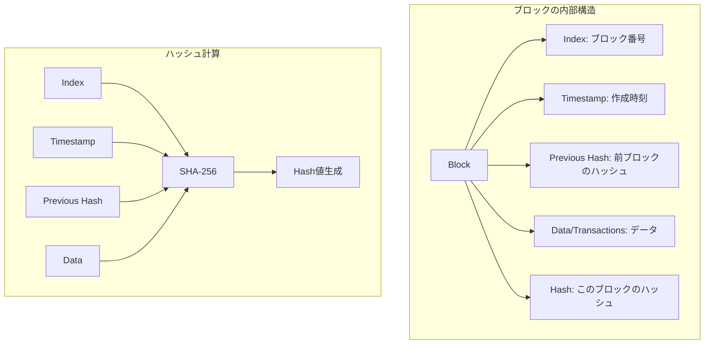

ブロックチェインの基本概念を学びながら、Zig言語を使って最小限のブロックチェイン・プロトタイプを実装してみましょう。**環境セットアップ**から始めて、**ブロックとトランザクションの構造**、**Proof of Work (PoW)** の簡単な実装、そして**動作確認とデバッグ**まで、手を動かしながら順を追って解説します。最終的に、Zigでブロックチェインの基礎が動作するプログラムを完成させ、ブロックチェインの仕組みを体験することが目標です。

このチュートリアルの進め方は次の通りです。

> 1. **ブロックの構造**や**ハッシュ計算**、**PoW** など、ブロックチェインの「核」となる部分をシンプルに実装し、まずは**改ざん検出**や**チェイン構造**を理解します。
> 2. 次章以降で**複数ブロックの追加**や**デジタル署名**、**P2Pネットワーク**などを順次取り上げ、実際のビットコインなどの実装に近づけていきます。
> 3. 参考文献として、ビットコインのホワイトペーパーや「Mastering Bitcoin」などを参照しながら、実際の大規模ブロックチェインの仕組みや、より高度な設計を学んでいきましょう。

## ブロックチェインの基本構造

それでは、ブロックチェインのコアである「ブロック」の構造を実装していきます。まずはブロックチェインの基本を簡単におさらいしましょう。



### なぜブロックという単位か

ブロックチェインでは、膨大な取引情報をそのまま連続的に記録すると、改ざん検出や管理が非常に困難になる。そこで「ブロック」という単位に複数の取引や関連情報(タイムスタンプ、前ブロックのハッシュ値など)をまとめることで、各ブロックごとに一意の「指紋」を生成する仕組みになっています。

**ブロックとは**: ブロックチェインにおけるブロックは、**いくつかのトランザクションの集合**と**タイムスタンプ(日時)**、そして**ひとつ前のブロックのハッシュ値**などを含むデータ構造です。
 ([Hash Functions and the Blockchain Ledger](https://osl.com/academy/article/hash-functions-and-the-blockchain-ledger/#:~:text=Each%20block%20in%20a%20blockchain,network%20can%20trust%20the%20data))。
 各ブロックは前のブロックのハッシュを自分の中に取り込むことで過去との連続性(チェイン)を持ち、これによってブロック同士が鎖状にリンクしています。

**改ざん耐性**: ブロックに含まれるハッシュ値のおかげで、もし過去のブロックのデータが少しでも書き換えられるとそのブロックのハッシュ値が変わります。すると後続のブロックに保存された「前のブロックのハッシュ」と一致しなくなるため、チェイン全体の整合性が崩れてしまいます。この仕組みにより、1つのブロックを改ざんするにはそのブロック以降のすべてのブロックを書き換えなければならず、改ざんは非常に困難になります。

### ステップ1: ブロック構造体だけを定義し、単一ブロックを作成する

上記の概念を踏まえて、Zigでブロックを表現する構造体を作ってみましょう。ブロックに含める主な情報は以下の通りです。

- `index`: ブロック番号(第何番目のブロックかを示す整数)
- `timestamp`: ブロックが作られた時刻(UNIXエポック秒などで保存)
- `prev_hash`: 直前のブロックのハッシュ値
- `data`: ブロックに格納する任意のデータ(まずはシンプルに文字列など)
- `hash`: ブロック自身のハッシュ値(このブロックの`index`や`data`等から計算された値)

Zigでは以下のように`struct`を使ってブロックの型を定義できます。

```zig
const std = @import("std");

// ブロックを表す構造体
const Block = struct {
    index: u32,             // ブロック番号
    timestamp: u64,         // 作成時刻(Unix時間など)
    prev_hash: [32]u8,      // 前のブロックのハッシュ値(32バイト＝256ビット)
    data: []const u8,       // ブロックに含めるデータ(今回はバイト列)
    hash: [32]u8,           // このブロックのハッシュ値(32バイト)
};
```

上記ではハッシュ値を256ビット(32バイト)長の配列 `[32]u8` で表しています。これはSHA-256などの暗号学的ハッシュ関数で得られるハッシュのサイズに合わせたものです。`data`フィールドは`[]const u8`(バイト列)としており、簡単のためブロックに格納するデータを文字列やバイナリ列で扱えるようにしています。

```zig
const std = @import("std");

/// ブロックチェインの1ブロックを表す構造体
/// - index: ブロック番号(u32)
/// - timestamp: ブロック生成時のタイムスタンプ(u64)
/// - prev_hash: 前ブロックのハッシュ(32バイトの固定長配列)
/// - data: ブロックに含まれるデータ(可変長スライス)
/// - hash: このブロックのハッシュ(SHA-256の結果、32バイト固定長配列)
const Block = struct {
    index: u32,
    timestamp: u64,
    prev_hash: [32]u8,
    data: []const u8,
    hash: [32]u8,
};

pub fn main() !void {
    // 出力用ライター
    const stdout = std.io.getStdOut().writer();

    // ブロックのサンプルインスタンスを作成
    const sample_block = Block{
        .index = 1,
        .timestamp = 1672531200, // 例: 適当なUNIXタイム
        .prev_hash = [_]u8{0} ** 32, // とりあえず0で埋める
        .data = "Hello, Zig Blockchain!", // 文字列をバイト列として扱う
        .hash = [_]u8{0} ** 32, // まだハッシュ値計算はしない
    };

    // 作成したブロックの情報を表示
    try stdout.print("Block index: {d}\n", .{sample_block.index});
    try stdout.print("Timestamp  : {d}\n", .{sample_block.timestamp});
    try stdout.print("Data       : {s}\n", .{sample_block.data});
}
```

実行してみると、ブロックの情報が表示されるはずです。

```bash
❯ zig build run
Block index: 1
Timestamp  : 1672531200
Data       : Hello, Zig Blockchain!
```

💡 **教育ポイント**：この段階では、まだハッシュ計算やマイニングは実装していません。まずはデータ構造を理解することが重要です。

もしくはdocker composeで実行できます。

```bash
❯ docker compose up
[+] Running 3/3
 ✔ Container node1  Recreate...                   0.1s
 ✔ Container node2  Recreate...                   0.1s
 ✔ Container node3  Recreate...                   0.1s
Attaching to node1, node2, node3
node3  | Block index: 1
node3  | Timestamp  : 1672531200
node3  | Data       : Hello, Zig Blockchain!
node1  | Block index: 1
node1  | Timestamp  : 1672531200
node1  | Data       : Hello, Zig Blockchain!
node2  | Block index: 1
node2  | Timestamp  : 1672531200
node2  | Data       : Hello, Zig Blockchain!
node3 exited with code 0
node1 exited with code 0
node2 exited with code 0
```

### ステップ2: ハッシュ計算を追加し、`hash`フィールドを埋める

ブロックチェインの肝は**ハッシュの計算**です。ブロックの`hash`フィールドは、ブロック内容全体(index, タイムスタンプ, prev_hash, dataなど)から計算されるハッシュ値です。Zigの標準ライブラリにはSHA-256などのハッシュ関数実装が含まれているので、それを利用してハッシュ計算をします。

ZigでSHA-256を使うには、`std.crypto.hash.sha2`名前空間の`Sha256`型を利用します。以下にブロックのハッシュ値を計算する関数の例を示します。

```zig
const std = @import("std");
const crypto = std.crypto.hash;  // ハッシュ用の名前空間
const Sha256 = crypto.sha2.Sha256;

/// toBytes関数は、任意の型Tの値をそのメモリ表現に基づく固定長のバイト配列に再解釈し、
/// その全要素を含むスライス([]const u8)として返します。
fn toBytes(comptime T: type, value: T) []const u8 {
    // 左辺で返り値の型を [@sizeOf(T)]u8 として指定する
    const bytes: [@sizeOf(T)]u8 = @bitCast(value);
    // 固定長配列を全体スライスとして返す
    return bytes[0..@sizeOf(T)];
}

/// calculateHash関数は、ブロックの各フィールドからバイト列を生成し、
/// それらを順次ハッシュ計算コンテキストに入力して最終的なSHA-256ハッシュを得る関数です。
fn calculateHash(block: *const Block) [32]u8 {
    // SHA-256のハッシュ計算コンテキストを初期化する
    var hasher = Sha256.init(.{});

    // ブロックのindex (u32) をバイト列に変換してハッシュに追加
    hasher.update(toBytes(u32, block.index));

    // ブロックのtimestamp (u64) をバイト列に変換してハッシュに追加
    hasher.update(toBytes(u64, block.timestamp));

    // 前ブロックのハッシュ(固定長配列)は既にスライスになっているのでそのまま追加
    hasher.update(block.prev_hash[0..]);

    // ブロック内のデータ(可変長スライス)もそのまま追加
    hasher.update(block.data);

    // これまでの入力からSHA-256ハッシュを計算して返す(32バイト配列)
    return hasher.finalResult();
}
```

上記の`calculateHash`関数では、`Sha256.init(.{})`でハッシュ計算用のコンテキストを作成します。その後`hasher.update(...)`でブロックの各フィールドをバイト列として順次ハッシュ計算に入力しています。
`toBytes`は与えた値をバイト列として扱うためのヘルパーで、整数型の値などをハッシュに含められて便利です。
最後に`hasher.finalResult()`を呼ぶと、これまでに与えたデータのSHA-256ハッシュが計算され、32バイトの配列として得られます。

## なぜ`toBytes`関数を定義しているのか

Zigでは、**整数型をそのまま「バイト列 (slice of bytes)」としてハッシュ関数へ渡す**場合、以下のような方法が考えられます。

1. **`std.mem.bytesOf(T)`** を使う(Zigのバージョンによっては存在しない場合がある／非推奨となる可能性がある)。
2. **`@bitCast()`** を使って独自に「生のバイト列」へ変換する処理を書く。

今回のコードでは **`@bitCast()`** を活用し、**`toBytes`** という小さな関数を定義しています。これは「**任意の型 `T` の値を、メモリ上の生のビット列として `[@sizeOf(T)]u8` の固定長配列に再解釈し、それをスライス(`[]const u8`)として返す**」処理です。具体的には以下のフローになります。

1. **`comptime T: type`**

   これはZigの引数に「型を受け取る」機能で、コンパイル時に確定する型 `T` を受け取ります。

2. **`@sizeOf(T)`**

   `T` のメモリサイズをコンパイル時に取得します。例えば `u32` なら `4` バイト、`u64` なら `8` バイトです。

3. **ローカルな固定長配列 `const bytes: [@sizeOf(T)]u8 = @bitCast(value);`**

   Zigの組み込み関数 `@bitCast(FromType, ToType)` は、**「メモリ内容を一切変換せずに型だけを再解釈する」**処理です。
   ここでは `value`(整数など)を「同じサイズのバイト配列」に再解釈しています。

4. **`return bytes[0..@sizeOf(T)];`**

   固定長配列を `[]u8` スライスにして返しています。これは、呼び出し元で `hasher.update(...)` に渡すためです。

つまり、**`toBytes`** は「任意の型 `T` を**生のバイト表現**に落として、ハッシュ関数へそのまま投入できる形」に変換するための補助関数です。
バージョンの異なるZigや将来的な変更を考えると、こうした**独自のbitCastラッパ**を作っておくのは柔軟な対応策となります。

**ハッシュ計算のポイント**: ブロックの`hash`値は **ブロック内のすべての重要データから計算** されます。この例では `index, timestamp, prev_hash, data` を含めていますが、後で追加するトランザクションやnonceといった要素も含める必要があります。一度ハッシュを計算して`block.hash`に保存した後で、ブロックの中身(例えば`data`)が変われば当然ハッシュ値も変わります。つまり、`hash`はブロック内容の一種の指紋となっており、内容が変われば指紋も一致しなくなるため改ざんを検出できます。

コード全体は次のようになります。

```bash
const std = @import("std");
const crypto = std.crypto.hash;
const Sha256 = crypto.sha2.Sha256;

/// ブロックチェインの1ブロックを表す構造体
/// - index: ブロック番号(u32)
/// - timestamp: ブロック生成時のタイムスタンプ(u64)
/// - prev_hash: 前ブロックのハッシュ(32バイトの固定長配列)
/// - data: ブロックに含まれるデータ(可変長スライス)
/// - hash: このブロックのハッシュ(SHA-256の結果、32バイト固定長配列)
const Block = struct {
    index: u32,
    timestamp: u64,
    prev_hash: [32]u8,
    data: []const u8,
    hash: [32]u8,
};

/// toBytes関数は、任意の型Tの値をそのメモリ表現に基づく固定長のバイト配列に再解釈し、
/// その全要素を含むスライス([]const u8)として返します。
fn toBytes(comptime T: type, value: T) []const u8 {
    // 左辺で返り値の型を [@sizeOf(T)]u8 として指定する
    const bytes: [@sizeOf(T)]u8 = @bitCast(value);
    // 固定長配列を全体スライスとして返す
    return bytes[0..@sizeOf(T)];
}

/// calculateHash関数は、ブロックの各フィールドからバイト列を生成し、
/// それらを順次ハッシュ計算コンテキストに入力して最終的なSHA-256ハッシュを得る関数です。
fn calculateHash(block: *const Block) [32]u8 {
    // SHA-256のハッシュ計算コンテキストを初期化する
    var hasher = Sha256.init(.{});

    // ブロックのindex (u32) をバイト列に変換してハッシュに追加
    hasher.update(toBytes(u32, block.index));

    // ブロックのtimestamp (u64) をバイト列に変換してハッシュに追加
    hasher.update(toBytes(u64, block.timestamp));

    // 前ブロックのハッシュ(固定長配列)は既にスライスになっているのでそのまま追加
    hasher.update(block.prev_hash[0..]);

    // ブロック内のデータ(可変長スライス)もそのまま追加
    hasher.update(block.data);

    // これまでの入力からSHA-256ハッシュを計算して返す(32バイト配列)
    return hasher.finalResult();
}

/// main関数:ブロックの初期化、ハッシュ計算、及び結果の出力を行います。
pub fn main() !void {
    const stdout = std.io.getStdOut().writer();

    // genesis_block(最初のブロック)を作成
    var genesis_block = Block{
        .index = 0,
        .timestamp = 1672531200, // 例としてUnixタイムスタンプを指定
        .prev_hash = [_]u8{0} ** 32, // 初回は前ブロックのハッシュは全0
        .data = "Hello, Zig Blockchain!",
        .hash = [_]u8{0} ** 32, // 初期値は全0。後で計算結果で上書きする
    };

    // calculateHash()でブロックの全フィールドからハッシュを計算し、hashフィールドに保存する
    genesis_block.hash = calculateHash(&genesis_block);

    // 結果を出力
    try stdout.print("Block index: {d}\n", .{genesis_block.index});
    try stdout.print("Timestamp  : {d}\n", .{genesis_block.timestamp});
    try stdout.print("Data       : {s}\n", .{genesis_block.data});
    try stdout.print("Hash       : ", .{});
    // 32バイトのハッシュを1バイトずつ16進数(小文字)で出力する
    for (genesis_block.hash) |byte| {
        try stdout.print("{x}", .{byte});
    }
    try stdout.print("\n", .{});
}
```

実行してみるとハッシュが追加されているのがわかります。

```bash
❯ zig build run
Block index: 0
Timestamp  : 1672531200
Data       : Hello, Zig Blockchain!
Hash       : 502713c91775223a2e2b3876c8d273766e90df0c0d8114c5ea786e353c532
```

もしくはdocker composeで実行できます。

```bash
❯ docker compose up
[+] Running 3/3
 ✔ Container node2  Recreate...                   0.1s
 ✔ Container node3  Recreate...                   0.1s
 ✔ Container node1  Recreate...                   0.1s
Attaching to node1, node2, node3
node2  | Block index: 0
node2  | Timestamp  : 1672531200
node2  | Data       : Hello, Zig Blockchain!
node2  | Hash       : fd6af27859ff9e2e0e6ecc366dabe55589d56e48356f813c5323a2d654ed9
node3  | Block index: 0
node3  | Timestamp  : 1672531200
node3  | Data       : Hello, Zig Blockchain!
node3  | Hash       : fd6af27859ff9e2e0e6ecc366dabe55589d56e48356f813c5323a2d654ed9
node1  | Block index: 0
node1  | Timestamp  : 1672531200
node1  | Data       : Hello, Zig Blockchain!
node1  | Hash       : fd6af27859ff9e2e0e6ecc366dabe55589d56e48356f813c5323a2d654ed9
node2 exited with code 0
node3 exited with code 0
node1 exited with code 0
```

ここまでで、ブロックの基本構造とハッシュ計算方法が定義できました。次に、このブロックに取引(トランザクション)の情報を組み込んでいきましょう。

## ステップ3: トランザクションを導入し、ブロックに複数の取引情報を持たせる

ブロックチェインは本来、多くの取引(トランザクション)をひとつのブロックに束ねて扱います。これによって改ざんを検出しやすくしたり、ネットワーク全体の負荷を抑えたりしています。ここでは、前章までに作った「**単一ブロックとそのハッシュ計算**」を拡張し、**複数のトランザクションを持てるブロック**を作る流れを **段階的** に進めていきましょう。

### トランザクション用の構造体を定義する

まずは、取引を表すデータ構造 `Transaction` を作ります。実際の暗号通貨では「送信者の署名」「入力と出力のリスト」など複雑な形を取ります。ここでは最低限として「送信者(sender)」「受信者(receiver)」「金額(amount)」だけを持つシンプルな構造にします。

```bash
/// トランザクション構造体
const Transaction = struct {
    sender: []const u8,    // 送信者(文字列)
    receiver: []const u8,  // 受信者(文字列)
    amount: u64,           // 金額(整数)
    // (実際は署名など必要)
};
```

これをファイルに追加し、**ブロック**との関連付けはまだ行いません。とりあえず「トランザクションとはこういうもの」という定義を作る段階です。

### ブロックに可変長トランザクションのリストを追加

次に、`Block` 構造体へ**複数のトランザクションを持つフィールド**を追加します。Zigには `std.ArrayList(T)` があり、C++の `std::vector` に相当する可変長配列です。以下のように `transactions: std.ArrayList(Transaction)` を導入しましょう。

```bash
/// ブロック構造体
const Block = struct {
    index: u32,
    timestamp: u64,
    prev_hash: [32]u8,
    transactions: std.ArrayList(Transaction), // 複数のトランザクションを保持
    // ここは前章で定義したもの
    data: []const u8,
    hash: [32]u8,
};
```

これで、**ブロックが1つのリストを持ち、そこに任意数のトランザクションを追加**できるようになります。

### 初期化時に動的配列を使う

Zigの `std.ArrayList(T)` は使用前に必ず `init(allocator)` で初期化する必要があります。また、使い終わったら `deinit()` を呼び出してメモリを解放しなければなりません。

```bash
const allocator = std.heap.page_allocator;

// ブロック作成時
var block = Block{
    .index = 0,
    .timestamp = 1672531200,
    .prev_hash = [_]u8{0} ** 32,
    .transactions = undefined, // 後で初期化
    .data = "Sample Data",
    .hash = [_]u8{0} ** 32,
};

// 動的配列を初期化
block.transactions = std.ArrayList(Transaction).init(allocator);
// 終了時または使い終わりに解放
defer block.transactions.deinit();
```

**`defer block.transactions.deinit();`** という書き方にすると、スコープを抜けたとき自動で解放されるため便利です。

### トランザクションを追加する

初期化が済んだら、**`append` メソッド**を使ってトランザクションを追加できます。
以下の例では2件追加し、```Alice→Bob 100, Charlie→Dave 50``` の取引を作っています。

```bash
try block.transactions.append(Transaction{
    .sender = "Alice",
    .receiver = "Bob",
    .amount = 100,
});
try block.transactions.append(Transaction{
    .sender = "Charlie",
    .receiver = "Dave",
    .amount = 50,
});
```

appendに失敗するとエラーが返るため、`try` を付けてエラー処理を行っています。

### ハッシュ計算にトランザクションを組み込む

すでに作った `calculateHash(block: *const Block) [32]u8` 関数を**少し修正**し、ブロックのハッシュ計算時に**各トランザクション**も含めるようにします。
**ブロックの ```index, timestamp, prev_hash, そして全トランザクション(sender, receiver, amount)``` を順にハッシュ**に投入します。
トランザクションをブロックに含めたことで、ハッシュ計算時に考慮すべきデータも増えます。`calculateHash`関数では、ブロック内の全トランザクションの内容もハッシュ入力に追加する必要があります。

```bash
/// calculateHash関数
/// ブロックの各フィールドを順番にハッシュ計算へ渡し、最終的なSHA-256ハッシュを得る。
fn calculateHash(block: *const Block) [32]u8 {
    var hasher = Sha256.init(.{});

    // indexとtimestampをバイト列へ変換
    hasher.update(toBytes(u32, block.index));
    hasher.update(toBytes(u64, block.timestamp));

    // 前のブロックのハッシュは配列→スライスで渡す
    hasher.update(block.prev_hash[0..]);

    // ブロックに保持されているトランザクション一覧をまとめてハッシュ
    for (block.transactions.items) |tx| {
        hasher.update(tx.sender);
        hasher.update(tx.receiver);
        hasher.update(toBytes(u64, tx.amount));
    }

    // 既存コードとの互換を保つため、dataもハッシュに含める
    hasher.update(block.data);

    return hasher.finalResult();
}
```

`block.transactions.items`はArrayList内の生のスライス(配列)データです。ループで各`tx`にアクセスし、その中の`sender`文字列、`receiver`文字列、`amount`数値を順次ハッシュに投入しています。こうすることで**ブロック内の全トランザクションデータがハッシュ値計算に反映**されます。トランザクションの追加や変更があればハッシュ値も変化するため、ブロックの改ざん検知において重要な役割を果たします。

> **メモ:** 実際のブロックチェインでは、各トランザクションは送信者の秘密鍵による**デジタル署名**が含まれます。署名によって取引の正当性(送信者本人が承認した取引であること)が保証されますが、署名の作成と検証には公開鍵暗号が必要で実装が複雑になるため、本チュートリアルでは扱いません。概念として、ブロックに署名付きのトランザクションを入れることで不正な取引が混入しないようにしている点だけ押さえておきましょう。

これで、**ブロックの全トランザクションがハッシュ値に反映**されます。
ブロックを改ざんしようとしても、このハッシュが再計算されると合わなくなるため、改ざんが検出できるというわけです。

> **発展:マークルツリー**
> トランザクション数が大幅に増えると、各トランザクションをすべて直接ハッシュ計算するのではなく、**マークルツリー**を使って1つのルートハッシュにまとめる手法が一般的です。ビットコインなどでは、このマークルルートだけをブロックヘッダーに入れ、ブロック全体を効率的に検証できる仕組みにしています。
> 本チュートリアルではまず“すべてのトランザクションを順にハッシュ”して仕組みを理解し、後の章でマークルツリーを導入する流れをとると良いでしょう。

最後に、すべてを**`main`関数内**にまとめた例を示します。これで「ブロックに複数の取引をまとめ、ブロックのハッシュを求める」ひととおりの流れが完結します。

コード全体は次のようになります。(src/main.zig)

```bash
const std = @import("std");
const crypto = std.crypto.hash;
const Sha256 = crypto.sha2.Sha256;

/// トランザクションの構造体
/// 送信者(sender), 受信者(receiver), 金額(amount) の3つだけを持つ。
const Transaction = struct {
    sender: []const u8,
    receiver: []const u8,
    amount: u64,
    // 本来は署名やトランザクションIDなどの要素が必要
};

/// ブロックの構造体
/// - index: ブロック番号
/// - timestamp: 作成時刻
/// - prev_hash: 前ブロックのハッシュ(32バイト)
/// - transactions: 動的配列を使って複数のトランザクションを保持
/// - data: 既存コードとの互換を保つために残す(省略可)
/// - hash: このブロックのSHA-256ハッシュ(32バイト)
const Block = struct {
    index: u32,
    timestamp: u64,
    prev_hash: [32]u8,
    transactions: std.ArrayList(Transaction),
    data: []const u8, // (必要に応じて省略可能)
    hash: [32]u8,
};

/// toBytes関数は、任意の型Tの値をそのメモリ表現に基づく固定長のバイト配列に再解釈し、
/// その全要素を含むスライス([]const u8)として返します。
fn toBytes(comptime T: type, value: T) []const u8 {
    // 左辺で返り値の型を [@sizeOf(T)]u8 として指定する
    const bytes: [@sizeOf(T)]u8 = @bitCast(value);
    // 固定長配列を全体スライスとして返す
    return bytes[0..@sizeOf(T)];
}

/// calculateHash関数
/// ブロックの各フィールドを順番にハッシュ計算へ渡し、最終的なSHA-256ハッシュを得る。
fn calculateHash(block: *const Block) [32]u8 {
    var hasher = Sha256.init(.{});

    // indexとtimestampをバイト列へ変換
    hasher.update(toBytes(u32, block.index));
    hasher.update(toBytes(u64, block.timestamp));

    // 前のブロックのハッシュは配列→スライスで渡す
    hasher.update(block.prev_hash[0..]);

    // ブロックに保持されているトランザクション一覧をまとめてハッシュ
    for (block.transactions.items) |tx| {
        hasher.update(tx.sender);
        hasher.update(tx.receiver);
        hasher.update(toBytes(u64, tx.amount));
    }

    // 既存コードとの互換を保つため、dataもハッシュに含める
    hasher.update(block.data);

    return hasher.finalResult();
}

/// main関数:ブロックの初期化、ハッシュ計算、及び結果の出力を行います。
pub fn main() !void {
    // メモリ割り当て用アロケータを用意(ページアロケータを簡易使用)
    const allocator = std.heap.page_allocator;
    const stdout = std.io.getStdOut().writer();

    // ジェネシスブロック(最初のブロック)を作成
    var genesis_block = Block{
        .index = 0,
        .timestamp = 1672531200,
        .prev_hash = [_]u8{0} ** 32, // 前ブロックが無いので全0にする
        // アロケータの初期化は後で行うため、いったんundefinedに
        .transactions = undefined,
        .data = "Hello, Zig Blockchain!",
        .hash = [_]u8{0} ** 32,
    };

    // transactionsフィールドを動的配列として初期化
    genesis_block.transactions = std.ArrayList(Transaction).init(allocator);
    defer genesis_block.transactions.deinit();

    // トランザクションを2件追加
    try genesis_block.transactions.append(Transaction{
        .sender = "Alice",
        .receiver = "Bob",
        .amount = 100,
    });
    try genesis_block.transactions.append(Transaction{
        .sender = "Charlie",
        .receiver = "Dave",
        .amount = 50,
    });

    // calculateHash()でブロックの全フィールドからハッシュを計算し、hashフィールドに保存する
    genesis_block.hash = calculateHash(&genesis_block);

    // 結果を出力
    try stdout.print("Block index: {d}\n", .{genesis_block.index});
    try stdout.print("Timestamp  : {d}\n", .{genesis_block.timestamp});
    try stdout.print("Data       : {s}\n", .{genesis_block.data});
    try stdout.print("Transactions:\n", .{});
    for (genesis_block.transactions.items) |tx| {
        try stdout.print("  {s} -> {s} : {d}\n", .{ tx.sender, tx.receiver, tx.amount });
    }
    try stdout.print("Hash       : ", .{}); // ← ここはプレースホルダなし、引数なし
    // 32バイトのハッシュを1バイトずつ16進数で出力
    for (genesis_block.hash) |byte| {
        try stdout.print("{x}", .{byte});
    }
    try stdout.print("\n", .{});
}
```

こうして**「複数のトランザクションをブロックにまとめる」**実装ができました。実際にコードを動かすと、**ブロックのハッシュがトランザクションに依存**しており、新たに取引を追加してからハッシュを再計算すると、ハッシュ値も変わっています。

```bash
❯ zig build run
Block index: 0
Timestamp  : 1672531200
Data       : Hello, Zig Blockchain!
Transactions:
  Alice -> Bob : 100
  Charlie -> Dave : 50
Hash       : d7928f7e56537c9e97ce858e7c8fbc211c2336f32b32d8edc707cdda271142b
```

もしくはdocker composeで実行できます。

```bash
❯ docker compose up
[+] Running 4/4
 ✔ Network step3_default  Created                 0.1s
 ✔ Container node1        Cr...                   0.2s
 ✔ Container node3        Cr...                   0.2s
 ✔ Container node2        Cr...                   0.2s
Attaching to node1, node2, node3
node2  | Block index: 0
node2  | Timestamp  : 1672531200
node2  | Data       : Hello, Zig Blockchain!
node2  | Transactions:
node2  |   Alice -> Bob : 100
node2  |   Charlie -> Dave : 50
node2  | Hash       : e8393c1fc14302185d8357b9c906b72595c4c1a72b834f89491faf214cfe7
node3  | Block index: 0
node3  | Timestamp  : 1672531200
node3  | Data       : Hello, Zig Blockchain!
node3  | Transactions:
node3  |   Alice -> Bob : 100
node3  |   Charlie -> Dave : 50
node3  | Hash       : e8393c1fc14302185d8357b9c906b72595c4c1a72b834f89491faf214cfe7
node1  | Block index: 0
node1  | Timestamp  : 1672531200
node1  | Data       : Hello, Zig Blockchain!
node1  | Transactions:
node1  |   Alice -> Bob : 100
node1  |   Charlie -> Dave : 50
node1  | Hash       : e8393c1fc14302185d8357b9c906b72595c4c1a72b834f89491faf214cfe7
node2 exited with code 0
node3 exited with code 0
node1 exited with code 0
```

次のステップでは、**PoW(Proof of Work)** を導入し、`nonce`を使ってブロックハッシュが特定条件を満たすまで試行錯誤する「マイニング」処理を追加してみましょう。そこまで実装すると、「トランザクションをいじればブロックのハッシュが合わなくなり、PoWもやり直しになる」という改ざん耐性が、より強固に体験できます。
