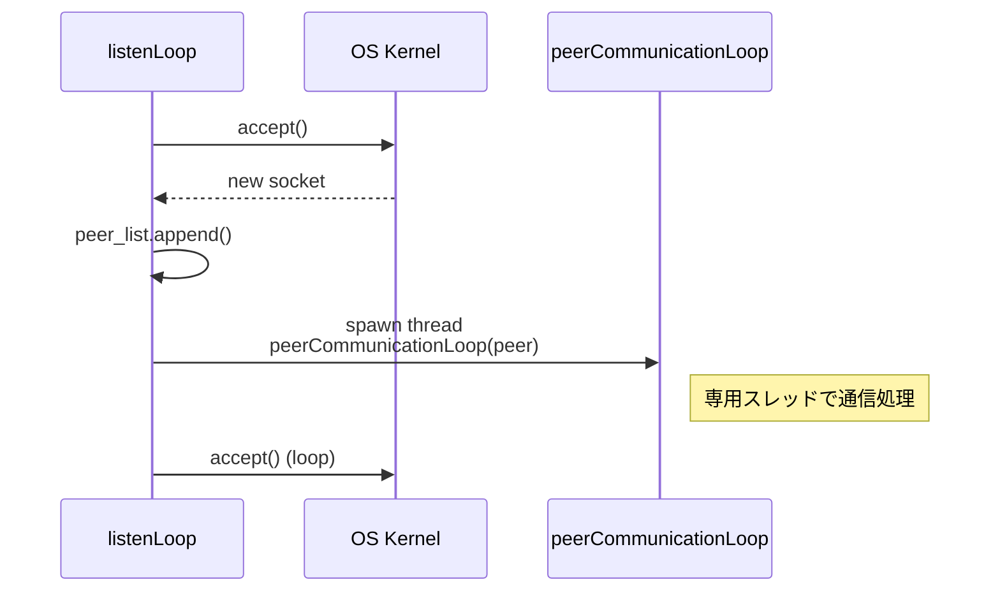
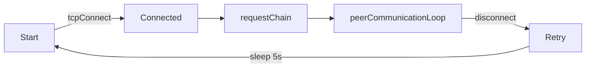

これまでは、サーバー（受信専用）とクライアント（送信専用）に役割を分け、一方向にブロックを送信する仕組みを構築しました。しかし、この方式では各ノードが対等ではなく、真の分散型ネットワークとは言えません。第8章では、この制限を取り払いピアツーピア（P2P）通信を実装します。
各ノードが送信、受信も行う対等なピアとなり、相互にブロックを交換・同期できるネットワークを構築しましょう。

## この章の目標

- 既知ピアへの自動接続: ノード起動時に、あらかじめ知っている複数のピアに対して自動的に接続を試み、ネットワークに参加します。
- ブロックのゴシップ配信: あるピアから新しいブロックを受信した際に、自分が接続している他の全てのピアへそのブロックを再送信し、ネットワーク全体にブロックを広めます（ゴシッププロトコル風の拡散）。
- チェイン全体の同期（RPCの実装）: 新規ノードがネットワークに参加した際、既存ピアに対して自分の持つブロックチェイン全体を要求・取得し、一気に同期できるようにします。
- 接続の維持と再接続: ノードはピアとの接続状態を監視し、切断された場合の再接続やタイムアウト処理を（簡易的に）行います。

## チェインの現在の状態を表示できるようにする

blockchain.zigに現在のチェインの状態を表示する機能を加えます。

```blockchain.zig
pub var chain_store = std.ArrayList(types.Block).init(std.heap.page_allocator);

/// 検証済みブロックをブロックチェーンに追加する
///
/// チェーンに追加する前にブロックのプルーフオブワークを検証します。
/// 検証に失敗したブロックは拒否されます。
///
/// 引数:
///     new_block: チェーンに追加するBlock構造体
///
/// 注意:
///     この関数は成功または失敗のメッセージをログに記録します
pub fn addBlock(new_block: types.Block) void {
    if (!verifyBlockPow(&new_block)) {
        std.log.err("Received block fails PoW check. Rejecting it.", .{});
        return;
    }
    chain_store.append(new_block) catch {};
    std.log.info("Added new block index={d}, nonce={d}, hash={x}", .{ new_block.index, new_block.nonce, new_block.hash });

    // 新しいブロックを追加した後にチェーン全体を表示
    printChainState();
}

/// デバッグ用に現在のブロックチェーン状態を出力する
///
/// チェーンの高さと各ブロックの詳細情報を見やすい形式で表示します
pub fn printChainState() void {
    std.log.info("Current chain state:", .{});
    std.log.info("- Height: {d} blocks", .{chain_store.items.len});

    if (chain_store.items.len == 0) {
        std.log.info("- No blocks in chain", .{});
        return;
    }

    // 各ブロックを詳細に表示
    for (chain_store.items) |block| {
        const hash_str = std.fmt.bytesToHex(block.hash, .lower);
        // 区切り線を表示
        std.debug.print("\n{s}\n", .{"---------------------------"});
        // ブロック情報を見やすく表示
        std.debug.print("Block index: {d}\n", .{block.index});
        std.debug.print("Timestamp  : {d}\n", .{block.timestamp});
        std.debug.print("Nonce      : {d}\n", .{block.nonce});
        std.debug.print("Data       : {s}\n", .{block.data});

        // トランザクション情報を表示
        std.debug.print("Transactions:\n", .{});
        if (block.transactions.items.len == 0) {
            std.debug.print("  (no transactions)\n", .{});
        } else {
            for (block.transactions.items) |tx| {
                std.debug.print("  {s} -> {s} : {d}\n", .{ tx.sender, tx.receiver, tx.amount });
            }
        }

        // ハッシュを表示
        std.debug.print("Hash       : {s}\n", .{hash_str[0..64]});
    }
    std.debug.print("\n{s}\n", .{"---------------------------"});
}
```

## P2P用の処理を作成する

ここからP2P通信に必要な機能を追加していきます。

### P2P通信設計の全体像

本章で組み立てるネットワーク層は **“シンプルさ > 完全性”** を最優先にしています。

- **伝送単位**は `TEXT(JSON) + 改行` —— *Wireshark で即読可能*
- **RPC** は2種のみ
  - `BLOCK:<json>` : 新規ブロックのゴシップ
  - `GET_CHAIN`    : レイジー同期要求
- ピア検出は **静的リスト + 再接続ループ**。「数十〜百ノード規模」であれば十分という割り切りです。
- ハードエラーより **“失敗してもリトライ”** を優先。学習用ツールとして *落ちにくい* 体験を重視しました。

これらを踏まえて、以下で各関数の内部ロジックを詳しく追っていきましょう。

## ピアとの通信処理とブロックの再伝播

それでは、実際にピア間でブロックやメッセージをやり取りする通信処理を実装しましょう。まずp2p.zigを作り、P2Pに関するコードをまとめていきます。

まず、使用するモジュールをインポートしておきます。

```p2p.zig
//! ピアツーピアネットワーキングモジュール
//!
//! このモジュールはブロックチェインアプリケーションのピアツーピアネットワーク層を実装します。
//! 他のノードとの接続確立、着信接続の待ち受け、ノード間の通信プロトコルの
//! 処理機能を提供します。このモジュールはネットワーク全体にブロックチェインデータを
//! ブロードキャストし、同期することを可能にします。

const std = @import("std");
const blockchain = @import("blockchain.zig");
const types = @import("types.zig");
const parser = @import("parser.zig");
```

次に、ネットワーク内の他のノードへのアクティブな接続を維持できるように、グローバルのリストを定義します。

```p2p.zig
/// 接続済みピアのグローバルリスト
/// ネットワーク内の他のノードへのアクティブな接続を維持します
pub var peer_list = std.ArrayList(types.Peer).init(std.heap.page_allocator);
```

## リスナースレッドの作成

inbound接続を捌くリスナースレッドを作成します。

```p2p.zig
/// リッスンソケットを開始し、着信接続を受け入れる
///
/// 指定されたポートで着信接続を待機するTCPサーバーを作成します。
/// 新しい接続ごとに、専用の通信スレッドを生成します。
///
/// 引数:
///     port: リッスンするポート番号
///
/// 注意:
///     この関数は独自のスレッドで無期限に実行されます
pub fn listenLoop(port: u16) !void {
    var addr = try std.net.Address.resolveIp("0.0.0.0", port);
    var listener = try addr.listen(.{});
    defer listener.deinit();

    std.log.info("listen 0.0.0.0:{d}", .{port});

    while (true) {
        const conn = try listener.accept();
        const peer = types.Peer{ .address = conn.address, .stream = conn.stream };
        try peer_list.append(peer);
        std.log.info("Accepted connection from: {any}", .{conn.address});

        // ピアとの通信を処理するスレッドを生成
        _ = try std.Thread.spawn(.{}, peerCommunicationLoop, .{peer});
    }
}
```

着信接続を受け入れるまでの流れは以下の通りです。

1. `std.net.Address.resolveIp` で **0.0.0.0:port** をバインドし全インタフェースで待ち受け。
2. `addr.listen().accept()` は *ブロッキング*。OSカーネルに制御が移ります。
3. 新規接続を `types.Peer` にラップし `peer_list.append`。
   - **目的**: 全スレッド共有の *接続テーブル* を維持
4. 受け入れと同時に `std.Thread.spawn` で **専用スレッド**を生成。
5. 親スレッドは次の `accept()` へ戻り、*無限ループ* でリッスン継続。



ピアを管理するのに必要な関数を追加します。

```p2p.zig
/// 指定されたピアアドレスに接続する
///
/// 指定されたアドレスで別のノードとの接続を確立しようとします。
/// 接続に失敗した場合、遅延後に再試行します。接続が確立されると、
/// チェイン同期をリクエストします。
///
/// 引数:
///     addr: 接続するピアのネットワークアドレス
///
/// 注意:
///     この関数は独自のスレッドで無期限に実行され、再接続を処理します
pub fn connectToPeer(addr: std.net.Address) !void {
    while (true) {
        const sock = std.net.tcpConnectToAddress(addr) catch |err| {
            std.log.warn("Connection failed to {any}: {any}", .{ addr, err });
            std.time.sleep(5 * std.time.ns_per_s); // 5秒待機してから再試行
            continue;
        };

        std.log.info("Connected to peer: {any}", .{addr});
        const peer = types.Peer{ .address = addr, .stream = sock };
        try peer_list.append(peer);

        // 新しく接続されたピアからチェイン同期をリクエスト
        try requestChain(peer);

        // ピアとの通信ループを開始
        peerCommunicationLoop(peer) catch |e| {
            std.log.err("Peer communication error: {any}", .{e});
        };
    }
}

/// ピアからブロックチェインデータをリクエストする
///
/// ピアのブロックチェインデータをリクエストするためにGET_CHAINメッセージを送信します。
///
/// 引数:
///     peer: チェインをリクエストするピア
///
/// エラー:
///     ストリーム書き込みエラー
fn requestChain(peer: types.Peer) !void {
    try peer.stream.writer().writeAll("GET_CHAIN\n");
    std.log.info("Requested chain from {any}", .{peer.address});
}


/// ソース以外のすべてのピアにブロックをブロードキャストする
///
/// ブロックをシリアル化し、接続されているすべてのピアに送信します。
/// オプションで、送信元のピアを除外することができます。
///
/// 引数:
///     blk: ブロードキャストするブロック
///     from_peer: ブロードキャストから除外するオプションのソースピア
pub fn broadcastBlock(blk: types.Block, from_peer: ?types.Peer) void {
    const payload = parser.serializeBlock(blk) catch return;

    for (peer_list.items) |peer| {
        // 指定された場合、送信元のピアをスキップ
        if (from_peer) |sender| {
            if (peer.address.getPort() == sender.address.getPort()) continue;
        }

        var writer = peer.stream.writer();
        _ = writer.writeAll("BLOCK:") catch |err| {
            std.log.err("Error broadcasting to peer {any}: {any}", .{ peer.address, err });
            continue;
        };
        _ = writer.writeAll(payload) catch |err| {
            std.log.err("Error broadcasting to peer {any}: {any}", .{ peer.address, err });
            continue;
        };
        _ = writer.writeAll("\n") catch |err| {
            std.log.err("Error broadcasting to peer {any}: {any}", .{ peer.address, err });
            continue;
        };
    }
}

/// 完全なブロックチェインをピアに送信する
///
/// ローカルチェイン内のすべてのブロックをシリアル化し、
/// 適切なメッセージフレーミングで1つずつ指定されたピアに送信します。
///
/// 引数:
///     peer: チェインを送信するピア
///
/// エラー:
///     シリアル化またはネットワークエラー
pub fn sendFullChain(peer: types.Peer) !void {
    std.log.info("Sending full chain (height={d}) to {any}", .{ blockchain.chain_store.items.len, peer.address });

    var writer = peer.stream.writer();

    for (blockchain.chain_store.items) |block| {
        const block_json = try parser.serializeBlock(block);
        try writer.writeAll("BLOCK:");
        try writer.writeAll(block_json);
        try writer.writeAll("\n"); // メッセージフレーミングのための改行
    }
}

/// ピアリストからピアを削除する
///
/// 切断された場合に、グローバルピアリストからピアを検索して削除します。
///
/// 引数:
///     target: 削除するピア
fn removePeerFromList(target: types.Peer) void {
    var i: usize = 0;
    while (i < peer_list.items.len) : (i += 1) {
        if (peer_list.items[i].address.getPort() == target.address.getPort()) {
            _ = peer_list.orderedRemove(i);
            break;
        }
    }
}
```

### connectToPeer — アウトバウンド接続と再接続

1. `while (true)` で永続的に接続を試行。失敗時は `std.time.sleep(5秒)`（指数バックオフへ置換可能）。
2. 成功したら `types.Peer` を生成し `peer_list` へ登録。
3. 直後に `requestChain(peer)` を送信し **最新チェインの取得** をリクエスト。
4. 続けて **同じスレッド**で `peerCommunicationLoop` を呼び出し、通信ループへ。



### broadcastBlock — ゴシップのコア

- シリアル化は `parser.serializeBlock` に集約し **I/O と計算を分離**。
- `from_peer` で送信元を除外し **エコーループ** を防止。
- 書き込み失敗時はログのみ残してループ継続 —— *ネットワーク全断* を回避します。

### sendFullChain — 遅延同期のためのワンショット RPC

新規ノードが合流した際に **“全ブロック”** を送る簡易実装です。

受信したメッセージを処理する関数を追加します。

```p2p.zig

/// 種類に基づいて受信メッセージを処理する
///
/// BLOCKやGET_CHAINメッセージなど、ピアからの異なるメッセージタイプを
/// 解析して処理します。
///
/// 引数:
///     msg: 改行区切りのない、メッセージの内容
///     from_peer: メッセージを送信したピア
///
/// エラー:
///     解析エラーまたは処理エラー
fn handleMessage(msg: []const u8, from_peer: types.Peer) !void {
    if (std.mem.startsWith(u8, msg, "BLOCK:")) {
        // BLOCKメッセージを処理
        const blk = parser.parseBlockJson(msg[6..]) catch |err| {
            std.log.err("Error parsing block from {any}: {any}", .{ from_peer.address, err });
            return;
        };

        // チェインにブロックを追加
        blockchain.addBlock(blk);

        // 他のピアにブロックをブロードキャスト
        broadcastBlock(blk, from_peer);
    } else if (std.mem.startsWith(u8, msg, "GET_CHAIN")) {
        // GET_CHAINメッセージを処理
        std.log.info("Received GET_CHAIN from {any}", .{from_peer.address});
        try sendFullChain(from_peer);
    } else {
        // 不明なメッセージを処理
        std.log.info("Unknown message from {any}: {s}", .{ from_peer.address, msg });
    }
}

/// ユーザー入力からブロックを作成してブロードキャストするインタラクティブループ
///
/// コンソールからテキスト入力を読み取り、それからブロックを作成し、
/// マイニングして、ネットワークにブロードキャストします。
///
/// 注意:
///     この関数は独自のスレッドで無期限に実行されます
pub fn textInputLoop() !void {
    var reader = std.io.getStdIn().reader();
    var buf: [256]u8 = undefined;

    while (true) {
        std.debug.print("msg> ", .{});
        const maybe_line = reader.readUntilDelimiterOrEof(buf[0..], '\n') catch null;

        if (maybe_line) |line| {
            // チェインが空の場合は最新のブロックを取得するか、ジェネシスを作成
            const last_block = if (blockchain.chain_store.items.len == 0)
                try blockchain.createTestGenesisBlock(std.heap.page_allocator)
            else
                blockchain.chain_store.items[blockchain.chain_store.items.len - 1];

            // 新しいブロックを作成してマイニング
            var new_block = blockchain.createBlock(line, last_block);
            blockchain.mineBlock(&new_block, 2); // 難易度2でマイニング
            blockchain.addBlock(new_block);

            // 作成したブロックをブロードキャスト
            broadcastBlock(new_block, null);
        } else break;
    }
}

/// ホスト:ポート文字列をネットワークアドレスに解決
///
/// "hostname:port"形式の文字列を受け取り、接続に使用できる
/// ネットワークアドレスに解決します。
///
/// 引数:
///     spec: "hostname:port"形式の文字列
///
/// 戻り値:
///     std.net.Address - 解決されたネットワークアドレス
///
/// エラー:
///     error.Invalid: 文字列フォーマットが無効な場合
///     std.net.Address.resolveIpからのその他のエラー
pub fn resolveHostPort(spec: []const u8) !std.net.Address {
    var it = std.mem.tokenizeScalar(u8, spec, ':');
    const host = it.next() orelse return error.Invalid;
    const port_s = it.next() orelse return error.Invalid;
    const port = try std.fmt.parseInt(u16, port_s, 10);

    // 特別なケース: localhostが指定された場合は直接127.0.0.1を使用
    if (std.mem.eql(u8, host, "localhost")) {
        return std.net.Address.parseIp("127.0.0.1", port) catch unreachable;
    }

    // まずIPアドレスとしてパースを試みる
    return std.net.Address.parseIp(host, port) catch |err| {
        if (err == error.InvalidIPAddressFormat) {
            // IPアドレスとして無効な場合は、ホスト名解決を試みる
            const list = try std.net.getAddressList(std.heap.page_allocator, host, port);
            defer list.deinit();

            // アドレスが見つからない場合はエラー
            if (list.addrs.len == 0) {
                return error.UnknownHostName;
            }

            // 最初のアドレスを返す
            return list.addrs[0];
        }
        return err;
    };
}
```

次にピアとの通信を処理する関数を実装します。

```p2p.zig
/// ピアとの通信を処理する
///
/// ピア接続から継続的に読み取り、メッセージを処理し、
/// 切断を処理します。
///
/// 引数:
///     peer: 通信するピア
///
/// 注意:
///     この関数は終了時に接続をクリーンアップします
fn peerCommunicationLoop(peer: types.Peer) !void {
    defer {
        removePeerFromList(peer);
        peer.stream.close();
    }

    var reader = peer.stream.reader();
    var buf: [4096]u8 = undefined; // 受信メッセージ用のバッファ
    var total_bytes: usize = 0;

    while (true) {
        const n = try reader.read(buf[total_bytes..]);
        if (n == 0) break; // 接続が閉じられた

        total_bytes += n;
        var search_start: usize = 0;

        // バッファ内の完全なメッセージを処理
        while (search_start < total_bytes) {
            // メッセージ区切り文字（改行）を探す
            var newline_pos: ?usize = null;
            var i: usize = search_start;
            while (i < total_bytes) : (i += 1) {
                if (buf[i] == '\n') {
                    newline_pos = i;
                    break;
                }
            }

            if (newline_pos) |pos| {
                // 完全なメッセージを処理
                const msg = buf[search_start..pos];
                try handleMessage(msg, peer);
                search_start = pos + 1;
            } else {
                // メッセージがまだ完全ではない
                break;
            }
        }

        // 処理済みメッセージをバッファから削除
        if (search_start > 0) {
            if (search_start < total_bytes) {
                std.mem.copyForwards(u8, &buf, buf[search_start..total_bytes]);
            }
            total_bytes -= search_start;
        }

        // バッファがいっぱいで完全なメッセージがない場合はエラー
        if (total_bytes == buf.len) {
            std.log.err("Message too long, buffer full from peer {any}", .{peer.address});
            break;
        }
    }

    std.log.info("Peer {any} disconnected.", .{peer.address});
}
```

peerCommunicationLoop関数は受信・整形・デコードの三段階で構成してあります。

| ステップ | 処理内容 | 役割 |
|---------|----------|------|
| (1) **read**  | `reader.read(buf[n..])` | ソケットから *生バイト列* を取得 |
| (2) **frame** | バッファ内を `\n` でスキャン | **メッセージ境界** を検出 |
| (3) **handle**| `handleMessage(msg, peer)` | コマンド種別で振り分け |

改行デリミタのみを規約にした **最小限の状態機械** なので、高速かつバグが少ない構造になっています。

出来上がったp2p.zigモジュール全体のコードは以下になります。

```p2p.zig
//! ピアツーピアネットワーキングモジュール
//!
//! このモジュールはブロックチェーンアプリケーションのピアツーピアネットワーク層を実装します。
//! 他のノードとの接続確立、着信接続の待ち受け、ノード間の通信プロトコルの
//! 処理機能を提供します。このモジュールはネットワーク全体にブロックチェーンデータを
//! ブロードキャストし、同期することを可能にします。

const std = @import("std");
const blockchain = @import("blockchain.zig");
const types = @import("types.zig");
const parser = @import("parser.zig");

/// 接続済みピアのグローバルリスト
/// ネットワーク内の他のノードへのアクティブな接続を維持します
pub var peer_list = std.ArrayList(types.Peer).init(std.heap.page_allocator);

/// リッスンソケットを開始し、着信接続を受け入れる
///
/// 指定されたポートで着信接続を待機するTCPサーバーを作成します。
/// 新しい接続ごとに、専用の通信スレッドを生成します。
///
/// 引数:
///     port: リッスンするポート番号
///
/// 注意:
///     この関数は独自のスレッドで無期限に実行されます
pub fn listenLoop(port: u16) !void {
    var addr = try std.net.Address.resolveIp("0.0.0.0", port);
    var listener = try addr.listen(.{});
    defer listener.deinit();

    std.log.info("listen 0.0.0.0:{d}", .{port});

    while (true) {
        const conn = try listener.accept();
        const peer = types.Peer{ .address = conn.address, .stream = conn.stream };
        try peer_list.append(peer);
        std.log.info("Accepted connection from: {any}", .{conn.address});

        // ピアとの通信を処理するスレッドを生成
        _ = try std.Thread.spawn(.{}, peerCommunicationLoop, .{peer});
    }
}

/// 指定されたピアアドレスに接続する
///
/// 指定されたアドレスで別のノードとの接続を確立しようとします。
/// 接続に失敗した場合、遅延後に再試行します。接続が確立されると、
/// チェーン同期をリクエストします。
///
/// 引数:
///     addr: 接続するピアのネットワークアドレス
///
/// 注意:
///     この関数は独自のスレッドで無期限に実行され、再接続を処理します
pub fn connectToPeer(addr: std.net.Address) !void {
    while (true) {
        const sock = std.net.tcpConnectToAddress(addr) catch |err| {
            std.log.warn("Connection failed to {any}: {any}", .{ addr, err });
            std.time.sleep(5 * std.time.ns_per_s); // 5秒待機してから再試行
            continue;
        };

        std.log.info("Connected to peer: {any}", .{addr});
        const peer = types.Peer{ .address = addr, .stream = sock };
        try peer_list.append(peer);

        // 新しく接続されたピアからチェーン同期をリクエスト
        try requestChain(peer);

        // ピアとの通信ループを開始
        peerCommunicationLoop(peer) catch |e| {
            std.log.err("Peer communication error: {any}", .{e});
        };
    }
}

/// ピアからブロックチェーンデータをリクエストする
///
/// ピアのブロックチェーンデータをリクエストするためにGET_CHAINメッセージを送信します。
///
/// 引数:
///     peer: チェーンをリクエストするピア
///
/// エラー:
///     ストリーム書き込みエラー
fn requestChain(peer: types.Peer) !void {
    try peer.stream.writer().writeAll("GET_CHAIN\n");
    std.log.info("Requested chain from {any}", .{peer.address});
}

/// ソース以外のすべてのピアにブロックをブロードキャストする
///
/// ブロックをシリアル化し、接続されているすべてのピアに送信します。
/// オプションで、送信元のピアを除外することができます。
///
/// 引数:
///     blk: ブロードキャストするブロック
///     from_peer: ブロードキャストから除外するオプションのソースピア
pub fn broadcastBlock(blk: types.Block, from_peer: ?types.Peer) void {
    const payload = parser.serializeBlock(blk) catch return;

    for (peer_list.items) |peer| {
        // 指定された場合、送信元のピアをスキップ
        if (from_peer) |sender| {
            if (peer.address.getPort() == sender.address.getPort()) continue;
        }

        var writer = peer.stream.writer();
        _ = writer.writeAll("BLOCK:") catch |err| {
            std.log.err("Error broadcasting to peer {any}: {any}", .{ peer.address, err });
            continue;
        };
        _ = writer.writeAll(payload) catch |err| {
            std.log.err("Error broadcasting to peer {any}: {any}", .{ peer.address, err });
            continue;
        };
        _ = writer.writeAll("\n") catch |err| {
            std.log.err("Error broadcasting to peer {any}: {any}", .{ peer.address, err });
            continue;
        };
    }
}

/// 完全なブロックチェーンをピアに送信する
///
/// ローカルチェーン内のすべてのブロックをシリアル化し、
/// 適切なメッセージフレーミングで1つずつ指定されたピアに送信します。
///
/// 引数:
///     peer: チェーンを送信するピア
///
/// エラー:
///     シリアル化またはネットワークエラー
pub fn sendFullChain(peer: types.Peer) !void {
    std.log.info("Sending full chain (height={d}) to {any}", .{ blockchain.chain_store.items.len, peer.address });

    var writer = peer.stream.writer();

    for (blockchain.chain_store.items) |block| {
        const block_json = try parser.serializeBlock(block);
        try writer.writeAll("BLOCK:");
        try writer.writeAll(block_json);
        try writer.writeAll("\n"); // メッセージフレーミングのための改行
    }
}

/// ピアリストからピアを削除する
///
/// 切断された場合に、グローバルピアリストからピアを検索して削除します。
///
/// 引数:
///     target: 削除するピア
fn removePeerFromList(target: types.Peer) void {
    var i: usize = 0;
    while (i < peer_list.items.len) : (i += 1) {
        if (peer_list.items[i].address.getPort() == target.address.getPort()) {
            _ = peer_list.orderedRemove(i);
            break;
        }
    }
}

/// 種類に基づいて受信メッセージを処理する
///
/// BLOCKやGET_CHAINメッセージなど、ピアからの異なるメッセージタイプを
/// 解析して処理します。
///
/// 引数:
///     msg: 改行区切りのない、メッセージの内容
///     from_peer: メッセージを送信したピア
///
/// エラー:
///     解析エラーまたは処理エラー
fn handleMessage(msg: []const u8, from_peer: types.Peer) !void {
    if (std.mem.startsWith(u8, msg, "BLOCK:")) {
        // BLOCKメッセージを処理
        const blk = parser.parseBlockJson(msg[6..]) catch |err| {
            std.log.err("Error parsing block from {any}: {any}", .{ from_peer.address, err });
            return;
        };

        // チェーンにブロックを追加
        blockchain.addBlock(blk);

        // 他のピアにブロックをブロードキャスト
        broadcastBlock(blk, from_peer);
    } else if (std.mem.startsWith(u8, msg, "GET_CHAIN")) {
        // GET_CHAINメッセージを処理
        std.log.info("Received GET_CHAIN from {any}", .{from_peer.address});
        try sendFullChain(from_peer);
    } else {
        // 不明なメッセージを処理
        std.log.info("Unknown message from {any}: {s}", .{ from_peer.address, msg });
    }
}

/// ユーザー入力からブロックを作成してブロードキャストするインタラクティブループ
///
/// コンソールからテキスト入力を読み取り、それからブロックを作成し、
/// マイニングして、ネットワークにブロードキャストします。
///
/// 注意:
///     この関数は独自のスレッドで無期限に実行されます
pub fn textInputLoop() !void {
    var reader = std.io.getStdIn().reader();
    var buf: [256]u8 = undefined;

    while (true) {
        std.debug.print("msg> ", .{});
        const maybe_line = reader.readUntilDelimiterOrEof(buf[0..], '\n') catch null;

        if (maybe_line) |line| {
            // チェーンが空の場合は最新のブロックを取得するか、ジェネシスを作成
            const last_block = if (blockchain.chain_store.items.len == 0)
                try blockchain.createTestGenesisBlock(std.heap.page_allocator)
            else
                blockchain.chain_store.items[blockchain.chain_store.items.len - 1];

            // 新しいブロックを作成してマイニング
            var new_block = blockchain.createBlock(line, last_block);
            blockchain.mineBlock(&new_block, 2); // 難易度2でマイニング
            blockchain.addBlock(new_block);

            // 作成したブロックをブロードキャスト
            broadcastBlock(new_block, null);
        } else break;
    }
}

/// ホスト:ポート文字列をネットワークアドレスに解決
///
/// "hostname:port"形式の文字列を受け取り、接続に使用できる
/// ネットワークアドレスに解決します。
///
/// 引数:
///     spec: "hostname:port"形式の文字列
///
/// 戻り値:
///     std.net.Address - 解決されたネットワークアドレス
///
/// エラー:
///     error.Invalid: 文字列フォーマットが無効な場合
///     std.net.Address.resolveIpからのその他のエラー
pub fn resolveHostPort(spec: []const u8) !std.net.Address {
    var it = std.mem.tokenizeScalar(u8, spec, ':');
    const host = it.next() orelse return error.Invalid;
    const port_s = it.next() orelse return error.Invalid;
    const port = try std.fmt.parseInt(u16, port_s, 10);

    // 特別なケース: localhostが指定された場合は直接127.0.0.1を使用
    if (std.mem.eql(u8, host, "localhost")) {
        return std.net.Address.parseIp("127.0.0.1", port) catch unreachable;
    }

    // まずIPアドレスとしてパースを試みる
    return std.net.Address.parseIp(host, port) catch |err| {
        if (err == error.InvalidIPAddressFormat) {
            // IPアドレスとして無効な場合は、ホスト名解決を試みる
            const list = try std.net.getAddressList(std.heap.page_allocator, host, port);
            defer list.deinit();

            // アドレスが見つからない場合はエラー
            if (list.addrs.len == 0) {
                return error.UnknownHostName;
            }

            // 最初のアドレスを返す
            return list.addrs[0];
        }
        return err;
    };
}

/// ピアとの通信を処理する
///
/// ピア接続から継続的に読み取り、メッセージを処理し、
/// 切断を処理します。
///
/// 引数:
///     peer: 通信するピア
///
/// 注意:
///     この関数は終了時に接続をクリーンアップします
fn peerCommunicationLoop(peer: types.Peer) !void {
    defer {
        removePeerFromList(peer);
        peer.stream.close();
    }

    var reader = peer.stream.reader();
    var buf: [4096]u8 = undefined; // 受信メッセージ用のバッファ
    var total_bytes: usize = 0;

    while (true) {
        const n = try reader.read(buf[total_bytes..]);
        if (n == 0) break; // 接続が閉じられた

        total_bytes += n;
        var search_start: usize = 0;

        // バッファ内の完全なメッセージを処理
        while (search_start < total_bytes) {
            // メッセージ区切り文字（改行）を探す
            var newline_pos: ?usize = null;
            var i: usize = search_start;
            while (i < total_bytes) : (i += 1) {
                if (buf[i] == '\n') {
                    newline_pos = i;
                    break;
                }
            }

            if (newline_pos) |pos| {
                // 完全なメッセージを処理
                const msg = buf[search_start..pos];
                try handleMessage(msg, peer);
                search_start = pos + 1;
            } else {
                // メッセージがまだ完全ではない
                break;
            }
        }

        // 処理済みメッセージをバッファから削除
        if (search_start > 0) {
            if (search_start < total_bytes) {
                std.mem.copyForwards(u8, &buf, buf[search_start..total_bytes]);
            }
            total_bytes -= search_start;
        }

        // バッファがいっぱいで完全なメッセージがない場合はエラー
        if (total_bytes == buf.len) {
            std.log.err("Message too long, buffer full from peer {any}", .{peer.address});
            break;
        }
    }

    std.log.info("Peer {any} disconnected.", .{peer.address});
}
```

## ノード起動時に複数のピアへ自動接続する

ピア一覧を管理できるようになったところで、既知のピアに自動接続する処理を実装します。ネットワークに新しいノードを参加させる際、あらかじめネットワーク内のいくつかのノードのアドレスを知っていれば、それらに接続することでブロックチェインの同期を開始できます。これはブロックチェインネットワークのブートストラップによくある手法です。

本実装では、プログラムの引数や設定に既知ピアのアドレス一覧を渡し、起動時に順次接続を試みるようにします。main.zigを修正します。

```main.zig
//! ブロックチェーンアプリケーション エントリーポイント
//!
//! このファイルはブロックチェーンアプリケーションのメインエントリーポイントです。
//! コマンドライン引数の処理、ブロックチェーンの初期化、
//! ネットワーキングとユーザー操作用のスレッドの起動を行います。
//! また、適合性テストを実行するためのサポートも提供します。

const std = @import("std");
const blockchain = @import("blockchain.zig");
const types = @import("types.zig");
const parser = @import("parser.zig");
const p2p = @import("p2p.zig");

/// アプリケーションエントリーポイント
///
/// コマンドライン引数を解析し、P2Pネットワークをセットアップし、
/// リスナーとユーザー操作用のバックグラウンドスレッドを起動して
/// ブロックチェーンアプリケーションを初期化します。
/// また、適合性テストの実行もサポートします。
///
/// コマンドライン形式:
///   実行ファイル <ポート> [ピアアドレス...]
///   実行ファイル --listen <ポート> [--connect <ホスト:ポート>...]
///   実行ファイル --conformance <テスト名> [--update]
///
/// 引数:
///     <ポート>: このノードが待ち受けるポート番号
///     [ピア...]: オプションの既知ピアアドレスのリスト（"ホスト:ポート"形式）
///     --listen <ポート>: このノードが待ち受けるポート番号
///     --connect <ホスト:ポート>: オプションの既知ピアアドレス
///     --conformance <テスト名>: 指定された適合性テストを実行
///     --update: 適合性テスト実行時にゴールデンファイルを更新
///
/// 戻り値:
///     void - 関数は無期限に実行されるか、エラーが発生するまで実行
pub fn main() !void {
    // アロケータの初期化
    const gpa = std.heap.page_allocator;
    const args = try std.process.argsAlloc(gpa);
    defer std.process.argsFree(gpa, args);

    if (args.len < 2) {
        std.log.err("使用法: {s} <ポート> [ピアアドレス...]", .{args[0]});
        std.log.err("または: {s} --listen <ポート> [--connect <ホスト:ポート>...]", .{args[0]});
        std.log.err("       {s} --conformance <テスト名> [--update]", .{args[0]});
        return;
    }

    var self_port: u16 = 0;
    var known_peers = std.ArrayList([]const u8).init(gpa);
    defer known_peers.deinit();

    var i: usize = 1;
    while (i < args.len) : (i += 1) {
        const arg = args[i];
        if (std.mem.eql(u8, arg, "--listen")) {
            i += 1;
            if (i >= args.len) {
                std.log.err("--listen フラグの後にポート番号が必要です", .{});
                return;
            }
            self_port = try std.fmt.parseInt(u16, args[i], 10);
        } else if (std.mem.eql(u8, arg, "--connect")) {
            i += 1;
            if (i >= args.len) {
                std.log.err("--connect フラグの後にホスト:ポートが必要です", .{});
                return;
            }
            try known_peers.append(args[i]);
        } else if (self_port == 0) {
            // 従来の方式（最初の引数はポート番号）
            self_port = try std.fmt.parseInt(u16, arg, 10);
        } else {
            // 従来の方式（追加の引数はピアアドレス）
            try known_peers.append(arg);
        }
    }

    if (self_port == 0) {
        std.log.err("ポート番号が指定されていません。--listen フラグまたは最初の引数として指定してください。", .{});
        return;
    }

    // 初期ブロックチェーン状態の表示
    blockchain.printChainState();

    // 着信接続用のリスナースレッドを開始
    _ = try std.Thread.spawn(.{}, p2p.listenLoop, .{self_port});

    // すべての既知のピアに接続
    for (known_peers.items) |spec| {
        const peer_addr = try p2p.resolveHostPort(spec);
        _ = try std.Thread.spawn(.{}, p2p.connectToPeer, .{peer_addr});
    }

    // インタラクティブなテキスト入力スレッドを開始
    _ = try std.Thread.spawn(.{}, p2p.textInputLoop, .{});

    // メインスレッドを生かし続ける
    while (true) std.time.sleep(60 * std.time.ns_per_s);
}

//------------------------------------------------------------------------------
// テスト
//------------------------------------------------------------------------------
test "トランザクションの初期化テスト" {
    const tx = types.Transaction{
        .sender = "Alice",
        .receiver = "Bob",
        .amount = 42,
    };
    try std.testing.expectEqualStrings("Alice", tx.sender);
    try std.testing.expectEqualStrings("Bob", tx.receiver);
    try std.testing.expectEqual(@as(u64, 42), tx.amount);
}

test "ブロックにトランザクションを追加" {
    var block = types.Block{
        .index = 0,
        .timestamp = 1234567890,
        .prev_hash = [_]u8{0} ** 32,
        .transactions = std.ArrayList(types.Transaction).init(std.testing.allocator),
        .nonce = 0,
        .data = "Test block",
        .hash = [_]u8{0} ** 32,
    };
    defer block.transactions.deinit();

    try block.transactions.append(types.Transaction{
        .sender = "Taro",
        .receiver = "Hanako",
        .amount = 100,
    });
    try std.testing.expectEqual(@as(usize, 1), block.transactions.items.len);
}

test "マイニングが先頭1バイト0のハッシュを生成できる" {
    var block = types.Block{
        .index = 0,
        .timestamp = 1672531200,
        .prev_hash = [_]u8{0} ** 32,
        .transactions = std.ArrayList(types.Transaction).init(std.testing.allocator),
        .nonce = 0,
        .data = "For Mining test",
        .hash = [_]u8{0} ** 32,
    };
    defer block.transactions.deinit();

    // 適当にトランザクションを追加
    try block.transactions.append(types.Transaction{ .sender = "A", .receiver = "B", .amount = 100 });

    // 初期ハッシュ
    block.hash = blockchain.calculateHash(&block);

    // 難易度1(先頭1バイトが0)を満たすまでマイニング
    blockchain.mineBlock(&block, 1);
    try std.testing.expectEqual(@as(u8, 0), block.hash[0]);
}
```

## Dcoekr composeの修正

docker-compose.ymlを修正して、サーバーノードとクライアントノードの両方を起動できるようにします。以下のように修正します。

```yaml
# Docker Compose構成ファイル - ブロックチェーンノードネットワーク
#
# 使い方:
# 1. 起動: docker compose up -d
# 2. コンテナでコマンド実行: docker exec -it <container_name> <command>
#    例: docker compose exec -it node2 sh -c "./zig-out/bin/chapter8 --listen 3000 --connect node1:3000"
#
# 注意: 新しいコンテナを起動するには docker compose run ではなく docker exec を使用してください

# 共通設定
x-common-config: &common-config
  platform: linux/amd64
  volumes:
    - ./:/app
  build: .

services:
  node1:
    <<: *common-config
    container_name: node1
    ports:
      - "3001:3000"
    environment:
      - NODE_ID=1
    command: ./zig-out/bin/chapter8 --listen 3000

  node2:
    <<: *common-config
    container_name: node2
    ports:
      - "3002:3000"
    environment:
      - NODE_ID=2
    tty: true
    stdin_open: true
    # 長時間実行するコマンドを追加してコンテナを停止させない
    command: sh -c "tail -f /dev/null"

  node3:
    <<: *common-config
    container_name: node3
    ports:
      - "3003:3000"
    environment:
      - NODE_ID=3
    tty: true
    stdin_open: true
    # 長時間実行するコマンドを追加してコンテナを停止させない
    command: sh -c "tail -f /dev/null"
```

## 動作確認

NodeAを起動させる。

```bash
zig build run -- --listen 8080
```

NodeBを起動させる。

```bash
zig build run -- --listen 8081 --connect 127.0.0.1:8080
```

それぞれのノードで起動メッセージが表示されたら、どれか1つのノードでブロックメッセージを入力してみてください。例えばNode CのコンソールでHello P2Pと入力すると、マイニングが行われた後、他のNode AやNode Bのログにも新しいブロックを受信・追加した旨が表示されるはずです。これがピアツーピア同期の効果です。

例えばNodeAを開いたコンソールにNodeBを開いたコンソールからメッセージを送ってみます。

NodeB側のコンソールでhiと入力しています。

```bash
zig build run -- --listen 8081 --connect 127.0.0.1:8080
info: Current chain state:
info: - Height: 0 blocks
info: - No blocks in chain
msg> info: listen 0.0.0.0:8081
info: Connected to peer: 127.0.0.1:8080
info: Requested chain from 127.0.0.1:8080
hi
info: Added new block index=1, nonce=1924, hash={ 0, 0, a0, c6, 19, 2e, 84, 6f, b8, b7, 49, 9c, 67, c6, 7e, cf, 70, 30, 45, 25, 57, 95, 45, 71, 30, a7, b5, 7b, 44, 90, 56, 7e }
info: Current chain state:
info: - Height: 1 blocks

---------------------------
Block index: 1
Timestamp  : 1746151143
Nonce      : 1924
Data       : hi
Transactions:
  (no transactions)
Hash       : 0000a0c6192e846fb8b7499c67c67ecf703045255795457130a7b57b4490567e

---------------------------
msg>
```

するとブロックが追加された旨のメッセージが表示されます。

この状態でNodeAのコンソールに戻ると、以下のように表示されます。

```bash
zig build run -- --listen 8080
info: Current chain state:
info: - Height: 0 blocks
info: - No blocks in chain
msg> info: listen 0.0.0.0:8080
info: Accepted connection from: 127.0.0.1:52325
info: Received GET_CHAIN from 127.0.0.1:52325
info: Sending full chain (height=0) to 127.0.0.1:52325
debug: parseBlockJson start
debug: parseBlockJson start parsed
debug: parseBlockJson end parsed
debug: parseBlockJson start parser
debug: Transactions field is directly an array.
debug: Transactions field is directly an array. end transactions=array_list.ArrayListAligned(types.Transaction,null){ .items = {  }, .capacity = 0, .allocator = mem.Allocator{ .ptr = anyopaque@0, .vtable = mem.Allocator.VTable{ .alloc = fn (*anyopaque, usize, mem.Alignment, usize) ?[*]u8@1009e7cf8, .resize = fn (*anyopaque, []u8, mem.Alignment, usize, usize) bool@1009e8250, .remap = fn (*anyopaque, []u8, mem.Alignment, usize, usize) ?[*]u8@1009e8528, .free = fn (*anyopaque, []u8, mem.Alignment, usize) void@1009e857c } } }
debug: Block info: index=1, timestamp=1746151143, prev_hash={ 0, 0, 87, 226, 136, 167, 214, 117, 46, 42, 58, 200, 29, 42, 78, 154, 224, 70, 48, 34, 78, 150, 13, 178, 54, 177, 229, 64, 100, 30, 74, 29 }, transactions=array_list.ArrayListAligned(types.Transaction,null){ .items = {  }, .capacity = 0, .allocator = mem.Allocator{ .ptr = anyopaque@0, .vtable = mem.Allocator.VTable{ .alloc = fn (*anyopaque, usize, mem.Alignment, usize) ?[*]u8@1009e7cf8, .resize = fn (*anyopaque, []u8, mem.Alignment, usize, usize) bool@1009e8250, .remap = fn (*anyopaque, []u8, mem.Alignment, usize, usize) ?[*]u8@1009e8528, .free = fn (*anyopaque, []u8, mem.Alignment, usize) void@1009e857c } } } nonce=1924, data=hi, hash={ 0, 0, 160, 198, 25, 46, 132, 111, 184, 183, 73, 156, 103, 198, 126, 207, 112, 48, 69, 37, 87, 149, 69, 113, 48, 167, 181, 123, 68, 144, 86, 126 }
debug: parseBlockJson end
info: Added new block index=1, nonce=1924, hash={ 0, 0, a0, c6, 19, 2e, 84, 6f, b8, b7, 49, 9c, 67, c6, 7e, cf, 70, 30, 45, 25, 57, 95, 45, 71, 30, a7, b5, 7b, 44, 90, 56, 7e }
info: Current chain state:
info: - Height: 1 blocks

---------------------------
Block index: 1
Timestamp  : 1746151143
Nonce      : 1924
Data       : hi
Transactions:
  (no transactions)
Hash       : 0000a0c6192e846fb8b7499c67c67ecf703045255795457130a7b57b4490567e

---------------------------
```

確かにブロックが追加された旨のメッセージが表示されていることがわかります。
では次に実際にブロックが追加されていて双方のノードで共有されているか確認してみます。
現在のチェインの状態を表示するにはGET_CHAINメッセージを送ります。

```bash
printf 'GET_CHAIN\n' | nc -G 0 127.0.0.1 8081
BLOCK:{"index":1,"timestamp":1746151143,"nonce":1924,"data":"hi","prev_hash":"000057e288a7d6752e2a3ac81d2a4e9ae04630224e960db236b1e540641e4a1d","hash":"0000a0c6192e846fb8b7499c67c67ecf703045255795457130a7b57b4490567e","transactions":[]}
```

一方NodeA側にも同様にGET_CHAINメッセージを送信してみます。

```bash
printf 'GET_CHAIN\n' | nc -G 0 127.0.0.1 8080
BLOCK:{"index":1,"timestamp":1746151143,"nonce":1924,"data":"hi","prev_hash":"000057e288a7d6752e2a3ac81d2a4e9ae04630224e960db236b1e540641e4a1d","hash":"0000a0c6192e846fb8b7499c67c67ecf703045255795457130a7b57b4490567e","transactions":[]}
```

同じブロックが共有されていることがわかります。

### Docker Composeでの起動

Docker Composeを使って、複数のノードを立ち上げてみます。例えば、node1とnode2を起動し、node1からnode2に接続することで、P2Pネットワークの動作を確認できます。

```bash
docker compose up
```

Node2に接続して、メッセージを送ります。

```bash
docker compose exec -it node2 sh -c "./zig-out/bin/chapter8 --listen 3000 --connect node1:3000"
info: Current chain state:
info: - Height: 0 blocks
info: - No blocks in chain
info: listen 0.0.0.0:3000
msg> info: Connected to peer: 172.18.0.3:3000
info: Requested chain from 172.18.0.3:3000
hello
info: Added new block index=1, nonce=20697, hash={ 0, 0, d, 8e, c7, 7d, 80, 8b, d, 3c, 96, 33, 59, f, 12, e6, 10, 9, 87, 2, 9e, bd, 90, c2, 9, d9, 89, 65, 92, ea, ba, 42 }
info: Current chain state:
info: - Height: 1 blocks

---------------------------
Block index: 1
Timestamp  : 1746225832
Nonce      : 20697
Data       : hello
Transactions:
  (no transactions)
Hash       : 00000d8ec77d808b0d3c9633590f12e6100987029ebd90c209d9896592eaba42

---------------------------
msg>
```

すると、node1側に以下のようなログが出力されます。

```bash
docker compose up
[+] Running 4/4
 ✔ Network chapter8_default  Created               0.0s
 ✔ Container node3           Created               0.0s
 ✔ Container node2           Created               0.0s
 ✔ Container node1           Created               0.0s
Attaching to node1, node2, node3
node1  | info: Current chain state:
node1  | info: - Height: 0 blocks
node1  | info: - No blocks in chain
node1  | msg> info: listen 0.0.0.0:3000
node1  | info: Accepted connection from: 172.18.0.2:38450
node1  | info: Received GET_CHAIN from 172.18.0.2:38450
node1  | info: Sending full chain (height=0) to 172.18.0.2:38450
node1  | debug: parseBlockJson start
node1  | debug: parseBlockJson start parsed
node1  | debug: parseBlockJson end parsed
node1  | debug: parseBlockJson start parser
node1  | debug: Transactions field is directly an array.
node1  | debug: Transactions field is directly an array. end transactions=array_list.ArrayListAligned(types.Transaction,null){ .items = {  }, .capacity = 0, .allocator = mem.Allocator{ .ptr = anyopaque@0, .vtable = mem.Allocator.VTable{ .alloc = fn (*anyopaque, usize, mem.Alignment, usize) ?[*]u8@11714c0, .resize = fn (*anyopaque, []u8, mem.Alignment, usize, usize) bool@1171a90, .remap = fn (*anyopaque, []u8, mem.Alignment, usize, usize) ?[*]u8@1171cc0, .free = fn (*anyopaque, []u8, mem.Alignment, usize) void@1171d10 } } }
node1  | debug: Block info: index=1, timestamp=1746225832, prev_hash={ 0, 0, 208, 15, 153, 34, 92, 210, 173, 179, 8, 86, 49, 69, 106, 142, 163, 98, 210, 51, 170, 150, 92, 180, 140, 13, 143, 139, 72, 138, 144, 34 }, transactions=array_list.ArrayListAligned(types.Transaction,null){ .items = {  }, .capacity = 0, .allocator = mem.Allocator{ .ptr = anyopaque@0, .vtable = mem.Allocator.VTable{ .alloc = fn (*anyopaque, usize, mem.Alignment, usize) ?[*]u8@11714c0, .resize = fn (*anyopaque, []u8, mem.Alignment, usize, usize) bool@1171a90, .remap = fn (*anyopaque, []u8, mem.Alignment, usize, usize) ?[*]u8@1171cc0, .free = fn (*anyopaque, []u8, mem.Alignment, usize) void@1171d10 } } } nonce=20697, data=hello, hash={ 0, 0, 13, 142, 199, 125, 128, 139, 13, 60, 150, 51, 89, 15, 18, 230, 16, 9, 135, 2, 158, 189, 144, 194, 9, 217, 137, 101, 146, 234, 186, 66 }
node1  | debug: parseBlockJson end
node1  | info: Added new block index=1, nonce=20697, hash={ 0, 0, d, 8e, c7, 7d, 80, 8b, d, 3c, 96, 33, 59, f, 12, e6, 10, 9, 87, 2, 9e, bd, 90, c2, 9, d9, 89, 65, 92, ea, ba, 42 }
node1  | info: Current chain state:
node1  | info: - Height: 1 blocks
node1  |
node1  | ---------------------------
node1  | Block index: 1
node1  | Timestamp  : 1746225832
node1  | Nonce      : 20697
node1  | Data       : hello
node1  | Transactions:
node1  |   (no transactions)
node1  | Hash       : 00000d8ec77d808b0d3c9633590f12e6100987029ebd90c209d9896592eaba42
node1  |
node1  | ---------------------------
```

## まとめ

本章では、ブロックチェインネットワークをピアツーピア通信へと発展させ、ノード同士が対等にブロックを交換・同期できるようにしました。これにより、一方向だった通信が双方向かつ分散的になり、新しいノードのチェイン同期やブロックのネットワーク全体への伝播がスムーズに行われるようになります。

この章で実装した主な機能は以下のとおりです。

- ピアリストによる複数接続管理と、自動接続処理。
- 受信したブロックの他ピアへの再伝播（ゴシッププロトコル的拡散）。
- 新規ノードが既存ネットワークからブロックチェイン全体を取得するGET_CHAIN処理。
- 簡易的な再接続による接続維持。

これで基本的なP2Pネットワークは完成ですが、実際のブロックチェインでは不正なデータの排除やフォークの解決、トランザクションプールの同期など、更なる課題が存在します。次章以降では、これらの発展的トピックについても触れていきます。

---

### 【補足】P2Pネットワークの全体像とゴシップ伝播のイメージ

ここで、P2Pネットワークの全体像と、ブロックがどのようにネットワーク全体へ伝播するかを図で整理しておきます。

#### P2P型とサーバ/クライアント型の違い

```list
+-------------------+        +-------------------+
|   サーバ/クライアント型   |        |   P2P型（本章実装）   |
+-------------------+        +-------------------+
      |      ^                       ^     ^
      v      |                       |     |
   クライアント                ノードA<--->ノードB
                                    |     |
                                    v     v
                                 ノードC<--->ノードD
```

P2P型では、各ノードが対等な立場で相互に接続し、どのノードからもブロックの送受信が可能です。

#### メッセージ処理とゴシップ伝播

`handleMessage`関数は、P2Pネットワーク上でのコマンド処理の中核です。受信したメッセージの先頭部分を見て、適切な処理を振り分けています。

1. **BLOCK:** メッセージの処理
   - JSONからブロック構造体に復元し、チェインに追加
   - **重要**: 同じブロックを送信元に戻さないよう `from_peer` を指定して再伝播する
   - これにより、ネットワーク全体に効率的にブロックが広がる「ゴシップ伝播」を実現

2. **GET_CHAIN:** メッセージの処理
   - 現在保持している全ブロックを要求元ピアへ送信
   - 主に新規参加ノードの初期同期に使用

以下の図は、あるノードで作成されたブロックがどのようにゴシップ伝播によってネットワーク全体に広がる様子を示しています。

```list
    [Node A]            [Node A]              [Node A]
       │                   │                     │
       │ BLOCK:...         │                     │
       ▼                   │                     │
    [Node B]            [Node B]              [Node B]
       │                   │ BLOCK:...          │
       │                   ▼                     │
    [Node C]            [Node C]              [Node C]
       │                   │                     │ BLOCK:...
       │                   │                     ▼
    [Node D]            [Node D]              [Node D]

   初期状態         B→Cへ伝播           C→Dへ伝播
```

この仕組みにより、中央サーバーがなくてもネットワーク全体でブロックが共有されます。また、`from_peer`パラメータによって送信元を除外することで、同じメッセージが無限にループすることを防いでいます。
