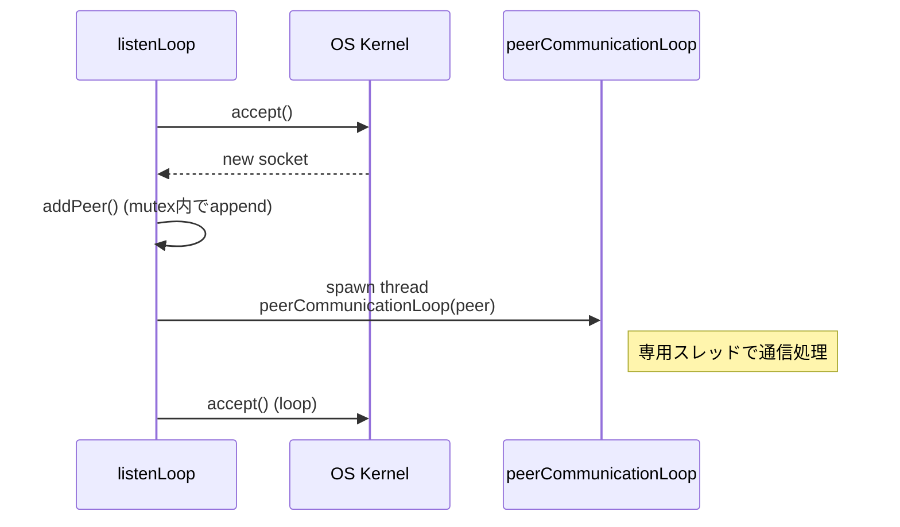
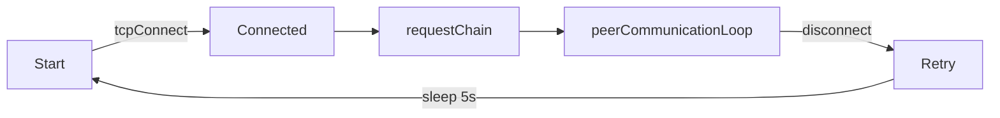

これまでは、サーバー（受信専用）とクライアント（送信専用）に役割を分け、一方向にブロックを送信する仕組みを構築しました。しかし、この方式では各ノードが対等ではなく、真の分散型ネットワークとは言えません。第8章では、この制限を取り払いピアツーピア（P2P）通信を実装します。
各ノードが送信、受信も行う対等なピアとなり、相互にブロックを交換・同期できるネットワークを構築しましょう。

## この章の目標

- 既知ピアへの自動接続: ノード起動時に、あらかじめ知っている複数のピアに対して自動的に接続を試み、ネットワークに参加します。
- ブロックのゴシップ配信: あるピアから新しいブロックを受信した際に、自分が接続している他の全てのピアへそのブロックを再送信し、ネットワーク全体にブロックを広めます（ゴシッププロトコル風の拡散）。
- チェイン全体の同期（RPCの実装）: 新規ノードがネットワークに参加した際、既存ピアに対して自分の持つブロックチェイン全体を要求・取得し、一気に同期できるようにします。
- 接続の維持と再接続: `read()`が0を返すなど、明示的な切断時のみ再接続します。無応答を検出するタイムアウト処理はスコープ外です。

```text
対象パス:   references/chapter8/src/*.zig、docker-compose.yml、fixtures/*.frame、scripts/acceptance.sh
開始地点:   ch07-sec01-block-transfer
今回の変更: 複数ピア、GET_CHAIN、ゴシップ、重複排除、tip連結検証を実装
テスト:     zig fmt --check . && zig build test && zig build
実行:       sh scripts/acceptance.sh
期待結果:   3ノードが固定済み2ブロックへ収束し、重複と改ざんブロックを拒否する
```

本章の相対パスと実行コマンドが、完成版のリポジトリ直下ではなく第8章のコードを対象にするよう、先にカレントディレクトリを固定します。以降は、特記がない限りこのディレクトリから実行します。

```bash
cd "$(git rev-parse --show-toplevel)/references/chapter8"
```

## チェインの現在の状態を表示できるようにする

blockchain.zigに現在のチェインの状態を表示する機能を加えます。

```zig
pub var chain_store = std.ArrayList(types.Block).init(std.heap.page_allocator);

/// ブロック追加の判定結果。呼び出し側は`added`のときだけ再伝播します。
pub const AddBlockResult = enum {
    added,
    duplicate,
    invalid_pow,
    invalid_link,
    out_of_memory,
};

var chain_store_mutex = std.Thread.Mutex{};
/// 検証済みブロックをブロックチェーンに追加する
///
/// チェーンに追加する前にブロックのプルーフオブワークを検証します。
/// 検証に失敗したブロックは拒否されます。
///
/// 引数:
///     new_block: チェーンに追加するBlock構造体
///
/// 注意:
///     この関数は成功または失敗のメッセージをログに記録します
pub fn addBlock(new_block: types.Block) AddBlockResult {
    chain_store_mutex.lock();
    defer chain_store_mutex.unlock();

    if (!verifyBlockPow(&new_block)) {
        std.log.warn("BLOCK_REJECTED reason=invalid_pow index={d}", .{new_block.index});
        return .invalid_pow;
    }

    for (chain_store.items) |known_block| {
        if (std.mem.eql(u8, known_block.hash[0..], new_block.hash[0..])) {
            std.log.info("BLOCK_REJECTED reason=duplicate index={d} hash={x:0>2}", .{ new_block.index, new_block.hash });
            return .duplicate;
        }
    }

    var expected_index: u32 = undefined;
    var expected_prev_hash: [32]u8 = undefined;
    if (chain_store.items.len == 0) {
        var genesis = createTestGenesisBlock(std.heap.page_allocator) catch {
            std.log.warn("BLOCK_REJECTED reason=genesis_allocation index={d}", .{new_block.index});
            return .out_of_memory;
        };
        defer genesis.transactions.deinit();
        expected_index = genesis.index + 1;
        expected_prev_hash = genesis.hash;
    } else {
        const tip = chain_store.items[chain_store.items.len - 1];
        expected_index = tip.index + 1;
        expected_prev_hash = tip.hash;
    }

    if (new_block.index != expected_index or
        !std.mem.eql(u8, new_block.prev_hash[0..], expected_prev_hash[0..]))
    {
        std.log.warn("BLOCK_REJECTED reason=invalid_link index={d} expected_index={d}", .{ new_block.index, expected_index });
        return .invalid_link;
    }

    chain_store.append(new_block) catch {
        std.log.warn("BLOCK_REJECTED reason=out_of_memory index={d}", .{new_block.index});
        return .out_of_memory;
    };
    std.log.info("Added new block index={d}, nonce={d}, hash={x:0>2}", .{ new_block.index, new_block.nonce, new_block.hash });

    // chain_store_mutexを保持しているため、再ロックしない内部版を使う。
    printChainStateLocked();
    return .added;
}
/// 現在のブロックチェーンの高さ（ブロック数）を取得する
///
/// 戻り値:
///     usize: ブロックチェーン内のブロック数
pub fn getChainHeight() usize {
    chain_store_mutex.lock();
    defer chain_store_mutex.unlock();
    return chain_store.items.len;
}

/// インデックスでブロックを取得する
///
/// 引数:
///     index: 取得するブロックのインデックス
///
/// 戻り値:
///     ?types.Block: 要求されたブロック、見つからない場合はnull
pub fn getBlock(index: usize) ?types.Block {
    chain_store_mutex.lock();
    defer chain_store_mutex.unlock();
    if (index >= chain_store.items.len) return null;
    return chain_store.items[index];
}

/// 現在のtipを値コピーで取得する。第8章では空チェーンのときnullを返し、
/// 呼び出し側が決定的genesisを直前ブロックとして使う。
pub fn getChainTip() ?types.Block {
    chain_store_mutex.lock();
    defer chain_store_mutex.unlock();
    if (chain_store.items.len == 0) return null;
    return chain_store.items[chain_store.items.len - 1];
}

/// P2P送信中のArrayList再確保を避けるため、Block構造体を値コピーする。
/// accepted blockのネストしたデータは実行中immutableかつ解放されないため、
/// shallow snapshotの参照先は有効である。呼び出し側は返却配列だけを解放する。
pub fn copyChainSnapshot(allocator: std.mem.Allocator) ![]types.Block {
    chain_store_mutex.lock();
    defer chain_store_mutex.unlock();
    return allocator.dupe(types.Block, chain_store.items);
}

/// デバッグ用に現在のブロックチェーン状態を出力する
///
/// チェーンの高さと各ブロックの詳細情報を見やすい形式で表示します
pub fn printChainState() void {
    chain_store_mutex.lock();
    defer chain_store_mutex.unlock();
    printChainStateLocked();
}

fn printChainStateLocked() void {
    std.log.info("Current chain state:", .{});
    std.log.info("- Height: {d} blocks", .{chain_store.items.len});

    if (chain_store.items.len == 0) {
        std.log.info("- No blocks in chain", .{});
        return;
    }

    // 各ブロックを詳細に表示
    for (chain_store.items) |block| {
        const hash_str = std.fmt.bytesToHex(block.hash, .lower);
        // 区切り線を表示
        std.debug.print("\n{s}\n", .{"---------------------------"});
        // ブロック情報を見やすく表示
        std.debug.print("Block index: {d}\n", .{block.index});
        std.debug.print("Timestamp  : {d}\n", .{block.timestamp});
        std.debug.print("Nonce      : {d}\n", .{block.nonce});
        std.debug.print("Data       : {s}\n", .{block.data});

        // トランザクション情報を表示
        std.debug.print("Transactions:\n", .{});
        if (block.transactions.items.len == 0) {
            std.debug.print("  (no transactions)\n", .{});
        } else {
            for (block.transactions.items) |tx| {
                std.debug.print("  {s} -> {s} : {d}\n", .{ tx.sender, tx.receiver, tx.amount });
            }
        }

        // ハッシュを表示
        std.debug.print("Hash       : {s}\n", .{hash_str[0..64]});
    }
    std.debug.print("\n{s}\n", .{"---------------------------"});
}
```

`addBlock`はPoWだけでなく、同じハッシュが未登録であること、`index`がtipの次であること、`prev_hash`がtipの`hash`と一致することを確認します。戻り値が`.added`のときだけ再伝播する設計にすると、三角形の接続で同じブロックが別経路から戻っても追加と転送を繰り返しません。署名を導入する前でも、この4条件（再計算hash、PoW、重複、tip連結）はチェインとして成立する最低限の検証です。

`addBlock`、高さ・tipの取得、送信用snapshot、表示は同じ`chain_store_mutex`で保護します。`addBlock`はmutexを保持した状態なので、表示時は再ロックしない`printChainStateLocked`を呼びます。`copyChainSnapshot`が返す配列はshallow copyですが、追加済みブロックのネストしたデータを実行中は変更・解放しないという本章の所有権規約により、送信完了まで参照先が有効です。

同じファイルの末尾へ、追加・重複・改ざん・リンク切れを1本のテストで確認するコードを加えます。

```zig
fn clearChainStoreForTest() void {
    for (chain_store.items) |*block| {
        block.transactions.deinit();
    }
    chain_store.clearRetainingCapacity();
}

test "addBlock rejects tampering duplicates and broken links" {
    clearChainStoreForTest();
    defer clearChainStoreForTest();

    var genesis = try createTestGenesisBlock(std.heap.page_allocator);
    defer genesis.transactions.deinit();

    var first = createBlock("first", genesis);
    mineBlock(&first, DIFFICULTY);
    try std.testing.expectEqual(AddBlockResult.added, addBlock(first));
    try std.testing.expectEqual(@as(usize, 1), getChainHeight());

    try std.testing.expectEqual(AddBlockResult.duplicate, addBlock(first));
    try std.testing.expectEqual(@as(usize, 1), getChainHeight());

    var tampered = first;
    tampered.data = "tampered";
    try std.testing.expectEqual(AddBlockResult.invalid_pow, addBlock(tampered));
    try std.testing.expectEqual(@as(usize, 1), getChainHeight());

    var broken_link = createBlock("broken", first);
    defer broken_link.transactions.deinit();
    broken_link.prev_hash = [_]u8{0} ** 32;
    mineBlock(&broken_link, DIFFICULTY);
    try std.testing.expectEqual(AddBlockResult.invalid_link, addBlock(broken_link));
    try std.testing.expectEqual(@as(usize, 1), getChainHeight());

    var second = createBlock("second", first);
    mineBlock(&second, DIFFICULTY);
    try std.testing.expectEqual(AddBlockResult.added, addBlock(second));
    try std.testing.expectEqual(@as(usize, 2), getChainHeight());
}
```

```bash
zig fmt --check .
zig build test
zig build
```

## P2P用の処理を作成する

ここからP2P通信に必要な機能を追加していきます。

### P2P通信設計の全体像

本章で組み立てるネットワーク層は **“シンプルさ > 完全性”** を最優先にしています。

- **伝送単位**は `TEXT(JSON) + 改行` —— *Wireshark で即読可能*
- **RPC** は2種のみ
  - `BLOCK:<json>` : 新規ブロックのゴシップ
  - `GET_CHAIN`    : レイジー同期要求
- ピア検出は **静的リスト + 再接続ループ** です。学習用の小規模構成(数ノード)を想定し、複数の接続スレッドが共有する`peer_list`はMutexで保護します。大規模化には送信キューや接続上限が必要です。
- ハードエラーより **“失敗してもリトライ”** を優先。学習用ツールとして *落ちにくい* 体験を重視しました。

これらを踏まえて、以下で各関数の内部ロジックを詳しく追っていきましょう。

## ピアとの通信処理とブロックの再伝播

それでは、実際にピア間でブロックやメッセージをやり取りする通信処理を実装しましょう。まずp2p.zigを作り、P2Pに関するコードをまとめていきます。

まず、使用するモジュールをインポートしておきます。

```zig
//! ピアツーピアネットワーキングモジュール
//!
//! このモジュールはブロックチェーンアプリケーションのピアツーピアネットワーク層を実装します。
//! 他のノードとの接続確立、着信接続の待ち受け、ノード間の通信プロトコルの
//! 処理機能を提供します。このモジュールはネットワーク全体にブロックチェーンデータを
//! ブロードキャストし、同期することを可能にします。

const std = @import("std");
const blockchain = @import("blockchain.zig");
const types = @import("types.zig");
const parser = @import("parser.zig");
```

次に、ネットワーク内の他のノードへのアクティブな接続を維持できるように、グローバルのリストを定義します。

```zig
/// 接続済みピアのグローバルリスト
/// ネットワーク内の他のノードへのアクティブな接続を維持します
pub var peer_list = std.ArrayList(types.Peer).init(std.heap.page_allocator);
var peer_list_mutex = std.Thread.Mutex{};
// TCPの1フレーム（改行まで）を分割書き込みしても、別threadのframeと混ざらない。
// chain/peerのmutexとは分離し、状態snapshotを取得してからこのmutexを取る。
var frame_write_mutex = std.Thread.Mutex{};

fn addPeer(peer: types.Peer) !void {
    peer_list_mutex.lock();
    defer peer_list_mutex.unlock();
    try peer_list.append(peer);
}

fn copyPeerSnapshot() ![]types.Peer {
    peer_list_mutex.lock();
    defer peer_list_mutex.unlock();
    return std.heap.page_allocator.dupe(types.Peer, peer_list.items);
}

fn writeBlockFrame(peer: types.Peer, payload: []const u8) !void {
    frame_write_mutex.lock();
    defer frame_write_mutex.unlock();
    var writer = peer.stream.writer();
    try writer.writeAll("BLOCK:");
    try writer.writeAll(payload);
    try writer.writeAll("\n");
}
```

## リスナースレッドの作成

inbound接続を捌くリスナースレッドを作成します。

```zig
/// リッスンソケットを開始し、着信接続を受け入れる
///
/// 指定されたポートで着信接続を待機するTCPサーバーを作成します。
/// 新しい接続ごとに、専用の通信スレッドを生成します。
///
/// 引数:
///     port: リッスンするポート番号
///
/// 注意:
///     この関数は独自のスレッドで無期限に実行されます
pub fn listenLoop(port: u16) !void {
    var addr = try std.net.Address.resolveIp("0.0.0.0", port);
    var listener = try addr.listen(.{});
    defer listener.deinit();

    std.log.info("listen 0.0.0.0:{d}", .{port});

    while (true) {
        const conn = try listener.accept();
        const peer = types.Peer{ .address = conn.address, .stream = conn.stream };
        try addPeer(peer);
        std.log.info("Accepted connection from: {any}", .{conn.address});

        // ピアとの通信を処理するスレッドを生成
        _ = try std.Thread.spawn(.{}, peerCommunicationLoop, .{peer});
    }
}
```

着信接続を受け入れるまでの流れは以下の通りです。

1. `std.net.Address.resolveIp` で **0.0.0.0:port** をバインドし全インタフェースで待ち受け。
2. `addr.listen().accept()` は *ブロッキング*。OSカーネルに制御が移ります。
3. 新規接続を `types.Peer` にラップし、`addPeer`を通して`peer_list`へ追加。
   - 目的: 全スレッド共有の接続テーブルを維持
4. 受け入れと同時に `std.Thread.spawn` で専用スレッドを生成。
5. 親スレッドは次の `accept()` へ戻り、無限ループでリッスン継続。


```mermaid
sequenceDiagram
    participant L as listenLoop
    participant K as OS Kernel
    participant P as peerCommunicationLoop
    L->>K: accept()
    K-->>L: new socket
    L->>L: addPeer() (mutex内でappend)
    L->>P: spawn thread<br/>peerCommunicationLoop(peer)
    note right of P: 専用スレッドで通信処理
    L->>K: accept() (loop)
```

ピアを管理するのに必要な関数を追加します。

```zig
/// 指定されたピアアドレスに接続する
///
/// 指定されたアドレスで別のノードとの接続を確立しようとします。
/// 接続に失敗した場合、遅延後に再試行します。接続が確立されると、
/// チェーン同期をリクエストします。
///
/// 引数:
///     addr: 接続するピアのネットワークアドレス
///
/// 注意:
///     この関数は独自のスレッドで無期限に実行され、再接続を処理します
pub fn connectToPeer(addr: std.net.Address) !void {
    while (true) {
        const sock = std.net.tcpConnectToAddress(addr) catch |err| {
            std.log.warn("Connection failed to {any}: {any}", .{ addr, err });
            std.time.sleep(5 * std.time.ns_per_s); // 5秒待機してから再試行
            continue;
        };

        std.log.info("Connected to peer: {any}", .{addr});
        const peer = types.Peer{ .address = addr, .stream = sock };
        try addPeer(peer);

        // 新しく接続されたピアからチェーン同期をリクエスト
        try requestChain(peer);

        // ピアとの通信ループを開始
        peerCommunicationLoop(peer) catch |e| {
            std.log.err("Peer communication error: {any}", .{e});
        };
    }
}

/// ピアからブロックチェーンデータをリクエストする
///
/// ピアのブロックチェーンデータをリクエストするためにGET_CHAINメッセージを送信します。
///
/// 引数:
///     peer: チェーンをリクエストするピア
///
/// エラー:
///     ストリーム書き込みエラー
fn requestChain(peer: types.Peer) !void {
    frame_write_mutex.lock();
    defer frame_write_mutex.unlock();
    try peer.stream.writer().writeAll("GET_CHAIN\n");
    std.log.info("Requested chain from {any}", .{peer.address});
}

/// ソース以外のすべてのピアにブロックをブロードキャストする
///
/// ブロックをシリアル化し、接続されているすべてのピアに送信します。
/// オプションで、送信元のピアを除外することができます。
///
/// 引数:
///     blk: ブロードキャストするブロック
///     from_peer: ブロードキャストから除外するオプションのソースピア
pub fn broadcastBlock(blk: types.Block, from_peer: ?types.Peer) void {
    const payload = parser.serializeBlock(blk) catch return;
    defer std.heap.page_allocator.free(payload);

    const peers = copyPeerSnapshot() catch |err| {
        std.log.err("Failed to snapshot peers for broadcast: {any}", .{err});
        return;
    };
    defer std.heap.page_allocator.free(peers);

    for (peers) |peer| {
        // 指定された場合、送信元のピアをスキップ
        if (from_peer) |sender| {
            if (peer.address.getPort() == sender.address.getPort()) continue;
        }

        writeBlockFrame(peer, payload) catch |err| {
            std.log.err("Error broadcasting to peer {any}: {any}", .{ peer.address, err });
            continue;
        };
    }
}

/// 完全なブロックチェーンをピアに送信する
///
/// ローカルチェーン内のすべてのブロックをシリアル化し、
/// 適切なメッセージフレーミングで1つずつ指定されたピアに送信します。
///
/// 引数:
///     peer: チェーンを送信するピア
///
/// エラー:
///     シリアル化またはネットワークエラー
pub fn sendFullChain(peer: types.Peer) !void {
    const chain = try blockchain.copyChainSnapshot(std.heap.page_allocator);
    defer std.heap.page_allocator.free(chain);
    std.log.info("Sending full chain (height={d}) to {any}", .{ chain.len, peer.address });

    frame_write_mutex.lock();
    defer frame_write_mutex.unlock();
    var writer = peer.stream.writer();

    for (chain) |block| {
        {
            const block_json = try parser.serializeBlock(block);
            defer std.heap.page_allocator.free(block_json);
            try writer.writeAll("BLOCK:");
            try writer.writeAll(block_json);
            try writer.writeAll("\n"); // メッセージフレーミングのための改行
        }
    }
}

/// ピアリストからピアを削除する
///
/// 切断された場合に、グローバルピアリストからピアを検索して削除します。
///
/// 引数:
///     target: 削除するピア
fn removePeerFromList(target: types.Peer) void {
    peer_list_mutex.lock();
    defer peer_list_mutex.unlock();

    var i: usize = 0;
    while (i < peer_list.items.len) : (i += 1) {
        if (peer_list.items[i].address.getPort() == target.address.getPort()) {
            _ = peer_list.orderedRemove(i);
            break;
        }
    }
}
```

### connectToPeer — アウトバウンド接続と再接続

1. `while (true)` で永続的に接続を試行。失敗時は `std.time.sleep(5秒)`（指数バックオフへ置換可能）。
2. 成功したら `types.Peer` を生成し `peer_list` へ登録。
3. 直後に `requestChain(peer)` を送信し **最新チェインの取得** をリクエスト。
4. 続けて **同じスレッド**で `peerCommunicationLoop` を呼び出し、通信ループへ。


```mermaid
flowchart LR
    Start -->|tcpConnect| Connected
    Connected --> send[requestChain]
    send --> comm[peerCommunicationLoop]
    comm -->|disconnect| Retry
    Retry -->|sleep 5s| Start
```

### broadcastBlock — ゴシップのコア

- シリアル化は `parser.serializeBlock` に集約し **I/O と計算を分離**。
- `from_peer`で直前の送信元を除外し、さらに`addBlock == .added`のときだけ再送します。三角トポロジーで別経路から戻る重複は`addBlock`が拒否するため、ゴシップが循環し続けません。
- `copyPeerSnapshot`はmutex内でピア一覧を複製し、ネットワーク書き込みはロック解放後に行います。`writeBlockFrame`は`BLOCK:`、JSON、改行の3回の書き込みを`frame_write_mutex`で1つのフレームとして直列化します。
- 書き込み失敗時はログのみ残してループ継続 —— *ネットワーク全断* を回避します。

### sendFullChain — 遅延同期のためのワンショット RPC

新規ノードが合流した際に **“全ブロック”** を送る簡易実装です。`copyChainSnapshot`でstate mutex内では配列コピーだけを行い、送信中のチェイン追加による`ArrayList`再確保と競合しないようにします。実際のソケット書き込みはstate mutexを解放してから`frame_write_mutex`内で行います。

受信したメッセージを処理する関数を追加します。

```zig
/// 種類に基づいて受信メッセージを処理する
///
/// BLOCKやGET_CHAINメッセージなど、ピアからの異なるメッセージタイプを
/// 解析して処理します。
///
/// 引数:
///     msg: 改行区切りのない、メッセージの内容
///     from_peer: メッセージを送信したピア
///
/// エラー:
///     解析エラーまたは処理エラー
fn handleMessage(msg: []const u8, from_peer: types.Peer) !void {
    if (std.mem.startsWith(u8, msg, "BLOCK:")) {
        // BLOCKメッセージを処理
        var blk = parser.parseBlockJson(msg[6..]) catch |err| {
            std.log.err("Error parsing block from {any}: {any}", .{ from_peer.address, err });
            return;
        };

        // 新規かつ正しく連結したブロックだけを追加・再伝播する。
        // 重複や改ざんブロックを再送しないことでゴシップの循環を止める。
        if (blockchain.addBlock(blk) == .added) {
            broadcastBlock(blk, from_peer);
        } else {
            parser.deinitParsedBlock(&blk);
        }
    } else if (std.mem.startsWith(u8, msg, "GET_CHAIN")) {
        // GET_CHAINメッセージを処理
        std.log.info("Received GET_CHAIN from {any}", .{from_peer.address});
        try sendFullChain(from_peer);
    } else {
        // 不明なメッセージを処理
        std.log.info("Unknown message from {any}: {s}", .{ from_peer.address, msg });
    }
}

/// ユーザー入力からブロックを作成してブロードキャストするインタラクティブループ
///
/// コンソールからテキスト入力を読み取り、それからブロックを作成し、
/// マイニングして、ネットワークにブロードキャストします。
///
/// 注意:
///     この関数は独自のスレッドで無期限に実行されます
fn createMinedInputBlock(line: []const u8, last_block: types.Block) !types.Block {
    // readUntilDelimiterOrEofが返すsliceは次の入力で上書きされる。
    // 採掘済みchainが入力バッファの寿命に依存しないよう、block自身が保持する。
    const owned_line = try std.heap.page_allocator.dupe(u8, line);
    errdefer std.heap.page_allocator.free(owned_line);

    var new_block = blockchain.createBlock(owned_line, last_block);
    blockchain.mineBlock(&new_block, 2);
    return new_block;
}

pub fn textInputLoop() !void {
    var reader = std.io.getStdIn().reader();
    var buf: [256]u8 = undefined;

    while (true) {
        std.debug.print("msg> ", .{});
        const maybe_line = reader.readUntilDelimiterOrEof(buf[0..], '\n') catch null;

        if (maybe_line) |line| {
            // チェーンが空の場合は最新のブロックを取得するか、ジェネシスを作成
            const last_block = blockchain.getChainTip() orelse
                try blockchain.createTestGenesisBlock(std.heap.page_allocator);

            // 新しいブロックを作成してマイニング
            var new_block = try createMinedInputBlock(line, last_block);
            if (blockchain.addBlock(new_block) == .added) {
                // 作成したブロックをブロードキャスト
                broadcastBlock(new_block, null);
            } else {
                new_block.transactions.deinit();
                std.heap.page_allocator.free(new_block.data);
            }
        } else break;
    }
}

/// ホスト:ポート文字列をネットワークアドレスに解決
///
/// "hostname:port"形式の文字列を受け取り、接続に使用できる
/// ネットワークアドレスに解決します。
///
/// 引数:
///     spec: "hostname:port"形式の文字列
///
/// 戻り値:
///     std.net.Address - 解決されたネットワークアドレス
///
/// エラー:
///     error.Invalid: 文字列フォーマットが無効な場合
///     std.net.Address.resolveIpからのその他のエラー
pub fn resolveHostPort(spec: []const u8) !std.net.Address {
    var it = std.mem.tokenizeScalar(u8, spec, ':');
    const host = it.next() orelse return error.Invalid;
    const port_s = it.next() orelse return error.Invalid;
    const port = try std.fmt.parseInt(u16, port_s, 10);

    // 特別なケース: localhostが指定された場合は直接127.0.0.1を使用
    if (std.mem.eql(u8, host, "localhost")) {
        return std.net.Address.parseIp("127.0.0.1", port) catch unreachable;
    }

    // まずIPアドレスとしてパースを試みる
    return std.net.Address.parseIp(host, port) catch |err| {
        if (err == error.InvalidIPAddressFormat) {
            // IPアドレスとして無効な場合は、ホスト名解決を試みる
            const list = try std.net.getAddressList(std.heap.page_allocator, host, port);
            defer list.deinit();

            // アドレスが見つからない場合はエラー
            if (list.addrs.len == 0) {
                return error.UnknownHostName;
            }

            // 最初のアドレスを返す
            return list.addrs[0];
        }
        return err;
    };
}
```

次にピアとの通信を処理する関数を実装します。

```zig
/// ピアとの通信を処理する
///
/// ピア接続から継続的に読み取り、メッセージを処理し、
/// 切断を処理します。
///
/// 引数:
///     peer: 通信するピア
///
/// 注意:
///     この関数は終了時に接続をクリーンアップします
fn peerCommunicationLoop(peer: types.Peer) !void {
    defer {
        removePeerFromList(peer);
        peer.stream.close();
    }

    var reader = peer.stream.reader();
    var buf: [4096]u8 = undefined; // 受信メッセージ用のバッファ
    var total_bytes: usize = 0;

    while (true) {
        const n = try reader.read(buf[total_bytes..]);
        if (n == 0) break; // 接続が閉じられた

        total_bytes += n;
        var search_start: usize = 0;

        // バッファ内の完全なメッセージを処理
        while (search_start < total_bytes) {
            // メッセージ区切り文字（改行）を探す
            var newline_pos: ?usize = null;
            var i: usize = search_start;
            while (i < total_bytes) : (i += 1) {
                if (buf[i] == '\n') {
                    newline_pos = i;
                    break;
                }
            }

            if (newline_pos) |pos| {
                // 完全なメッセージを処理
                const msg = buf[search_start..pos];
                try handleMessage(msg, peer);
                search_start = pos + 1;
            } else {
                // メッセージがまだ完全ではない
                break;
            }
        }

        // 処理済みメッセージをバッファから削除
        if (search_start > 0) {
            if (search_start < total_bytes) {
                std.mem.copyForwards(u8, &buf, buf[search_start..total_bytes]);
            }
            total_bytes -= search_start;
        }

        // バッファがいっぱいで完全なメッセージがない場合はエラー
        if (total_bytes == buf.len) {
            std.log.err("Message too long, buffer full from peer {any}", .{peer.address});
            break;
        }
    }

    std.log.info("Peer {any} disconnected.", .{peer.address});
}
```

peerCommunicationLoop関数は受信・整形・デコードの三段階で構成してあります。

| ステップ | 処理内容 | 役割 |
|---------|----------|------|
| (1) **read**  | `reader.read(buf[n..])` | ソケットから *生バイト列* を取得 |
| (2) **frame** | バッファ内を `\n` でスキャン | **メッセージ境界** を検出 |
| (3) **handle**| `handleMessage(msg, peer)` | コマンド種別で振り分け |

改行デリミタのみを規約にした **最小限の状態機械** です。実装はシンプルで、処理の流れも追いやすくなります。ただし、1メッセージが4096バイトを超える場合は接続を切断します。

出来上がったp2p.zigモジュール全体のコードは以下になります。

```p2p.zig
//! ピアツーピアネットワーキングモジュール
//!
//! このモジュールはブロックチェーンアプリケーションのピアツーピアネットワーク層を実装します。
//! 他のノードとの接続確立、着信接続の待ち受け、ノード間の通信プロトコルの
//! 処理機能を提供します。このモジュールはネットワーク全体にブロックチェーンデータを
//! ブロードキャストし、同期することを可能にします。

const std = @import("std");
const blockchain = @import("blockchain.zig");
const types = @import("types.zig");
const parser = @import("parser.zig");

/// 接続済みピアのグローバルリスト
/// ネットワーク内の他のノードへのアクティブな接続を維持します
pub var peer_list = std.ArrayList(types.Peer).init(std.heap.page_allocator);
var peer_list_mutex = std.Thread.Mutex{};
// TCPの1フレーム（改行まで）を分割書き込みしても、別threadのframeと混ざらない。
// chain/peerのmutexとは分離し、状態snapshotを取得してからこのmutexを取る。
var frame_write_mutex = std.Thread.Mutex{};

fn addPeer(peer: types.Peer) !void {
    peer_list_mutex.lock();
    defer peer_list_mutex.unlock();
    try peer_list.append(peer);
}

fn copyPeerSnapshot() ![]types.Peer {
    peer_list_mutex.lock();
    defer peer_list_mutex.unlock();
    return std.heap.page_allocator.dupe(types.Peer, peer_list.items);
}

fn writeBlockFrame(peer: types.Peer, payload: []const u8) !void {
    frame_write_mutex.lock();
    defer frame_write_mutex.unlock();
    var writer = peer.stream.writer();
    try writer.writeAll("BLOCK:");
    try writer.writeAll(payload);
    try writer.writeAll("\n");
}

/// リッスンソケットを開始し、着信接続を受け入れる
///
/// 指定されたポートで着信接続を待機するTCPサーバーを作成します。
/// 新しい接続ごとに、専用の通信スレッドを生成します。
///
/// 引数:
///     port: リッスンするポート番号
///
/// 注意:
///     この関数は独自のスレッドで無期限に実行されます
pub fn listenLoop(port: u16) !void {
    var addr = try std.net.Address.resolveIp("0.0.0.0", port);
    var listener = try addr.listen(.{});
    defer listener.deinit();

    std.log.info("listen 0.0.0.0:{d}", .{port});

    while (true) {
        const conn = try listener.accept();
        const peer = types.Peer{ .address = conn.address, .stream = conn.stream };
        try addPeer(peer);
        std.log.info("Accepted connection from: {any}", .{conn.address});

        // ピアとの通信を処理するスレッドを生成
        _ = try std.Thread.spawn(.{}, peerCommunicationLoop, .{peer});
    }
}

/// 指定されたピアアドレスに接続する
///
/// 指定されたアドレスで別のノードとの接続を確立しようとします。
/// 接続に失敗した場合、遅延後に再試行します。接続が確立されると、
/// チェーン同期をリクエストします。
///
/// 引数:
///     addr: 接続するピアのネットワークアドレス
///
/// 注意:
///     この関数は独自のスレッドで無期限に実行され、再接続を処理します
pub fn connectToPeer(addr: std.net.Address) !void {
    while (true) {
        const sock = std.net.tcpConnectToAddress(addr) catch |err| {
            std.log.warn("Connection failed to {any}: {any}", .{ addr, err });
            std.time.sleep(5 * std.time.ns_per_s); // 5秒待機してから再試行
            continue;
        };

        std.log.info("Connected to peer: {any}", .{addr});
        const peer = types.Peer{ .address = addr, .stream = sock };
        try addPeer(peer);

        // 新しく接続されたピアからチェーン同期をリクエスト
        try requestChain(peer);

        // ピアとの通信ループを開始
        peerCommunicationLoop(peer) catch |e| {
            std.log.err("Peer communication error: {any}", .{e});
        };
    }
}

/// ピアからブロックチェーンデータをリクエストする
///
/// ピアのブロックチェーンデータをリクエストするためにGET_CHAINメッセージを送信します。
///
/// 引数:
///     peer: チェーンをリクエストするピア
///
/// エラー:
///     ストリーム書き込みエラー
fn requestChain(peer: types.Peer) !void {
    frame_write_mutex.lock();
    defer frame_write_mutex.unlock();
    try peer.stream.writer().writeAll("GET_CHAIN\n");
    std.log.info("Requested chain from {any}", .{peer.address});
}

/// ソース以外のすべてのピアにブロックをブロードキャストする
///
/// ブロックをシリアル化し、接続されているすべてのピアに送信します。
/// オプションで、送信元のピアを除外することができます。
///
/// 引数:
///     blk: ブロードキャストするブロック
///     from_peer: ブロードキャストから除外するオプションのソースピア
pub fn broadcastBlock(blk: types.Block, from_peer: ?types.Peer) void {
    const payload = parser.serializeBlock(blk) catch return;
    defer std.heap.page_allocator.free(payload);

    const peers = copyPeerSnapshot() catch |err| {
        std.log.err("Failed to snapshot peers for broadcast: {any}", .{err});
        return;
    };
    defer std.heap.page_allocator.free(peers);

    for (peers) |peer| {
        // 指定された場合、送信元のピアをスキップ
        if (from_peer) |sender| {
            if (peer.address.getPort() == sender.address.getPort()) continue;
        }

        writeBlockFrame(peer, payload) catch |err| {
            std.log.err("Error broadcasting to peer {any}: {any}", .{ peer.address, err });
            continue;
        };
    }
}

/// 完全なブロックチェーンをピアに送信する
///
/// ローカルチェーン内のすべてのブロックをシリアル化し、
/// 適切なメッセージフレーミングで1つずつ指定されたピアに送信します。
///
/// 引数:
///     peer: チェーンを送信するピア
///
/// エラー:
///     シリアル化またはネットワークエラー
pub fn sendFullChain(peer: types.Peer) !void {
    const chain = try blockchain.copyChainSnapshot(std.heap.page_allocator);
    defer std.heap.page_allocator.free(chain);
    std.log.info("Sending full chain (height={d}) to {any}", .{ chain.len, peer.address });

    frame_write_mutex.lock();
    defer frame_write_mutex.unlock();
    var writer = peer.stream.writer();

    for (chain) |block| {
        {
            const block_json = try parser.serializeBlock(block);
            defer std.heap.page_allocator.free(block_json);
            try writer.writeAll("BLOCK:");
            try writer.writeAll(block_json);
            try writer.writeAll("\n"); // メッセージフレーミングのための改行
        }
    }
}

/// ピアリストからピアを削除する
///
/// 切断された場合に、グローバルピアリストからピアを検索して削除します。
///
/// 引数:
///     target: 削除するピア
fn removePeerFromList(target: types.Peer) void {
    peer_list_mutex.lock();
    defer peer_list_mutex.unlock();

    var i: usize = 0;
    while (i < peer_list.items.len) : (i += 1) {
        if (peer_list.items[i].address.getPort() == target.address.getPort()) {
            _ = peer_list.orderedRemove(i);
            break;
        }
    }
}

/// 種類に基づいて受信メッセージを処理する
///
/// BLOCKやGET_CHAINメッセージなど、ピアからの異なるメッセージタイプを
/// 解析して処理します。
///
/// 引数:
///     msg: 改行区切りのない、メッセージの内容
///     from_peer: メッセージを送信したピア
///
/// エラー:
///     解析エラーまたは処理エラー
fn handleMessage(msg: []const u8, from_peer: types.Peer) !void {
    if (std.mem.startsWith(u8, msg, "BLOCK:")) {
        // BLOCKメッセージを処理
        var blk = parser.parseBlockJson(msg[6..]) catch |err| {
            std.log.err("Error parsing block from {any}: {any}", .{ from_peer.address, err });
            return;
        };

        // 新規かつ正しく連結したブロックだけを追加・再伝播する。
        // 重複や改ざんブロックを再送しないことでゴシップの循環を止める。
        if (blockchain.addBlock(blk) == .added) {
            broadcastBlock(blk, from_peer);
        } else {
            parser.deinitParsedBlock(&blk);
        }
    } else if (std.mem.startsWith(u8, msg, "GET_CHAIN")) {
        // GET_CHAINメッセージを処理
        std.log.info("Received GET_CHAIN from {any}", .{from_peer.address});
        try sendFullChain(from_peer);
    } else {
        // 不明なメッセージを処理
        std.log.info("Unknown message from {any}: {s}", .{ from_peer.address, msg });
    }
}

/// ユーザー入力からブロックを作成してブロードキャストするインタラクティブループ
///
/// コンソールからテキスト入力を読み取り、それからブロックを作成し、
/// マイニングして、ネットワークにブロードキャストします。
///
/// 注意:
///     この関数は独自のスレッドで無期限に実行されます
fn createMinedInputBlock(line: []const u8, last_block: types.Block) !types.Block {
    // readUntilDelimiterOrEofが返すsliceは次の入力で上書きされる。
    // 採掘済みchainが入力バッファの寿命に依存しないよう、block自身が保持する。
    const owned_line = try std.heap.page_allocator.dupe(u8, line);
    errdefer std.heap.page_allocator.free(owned_line);

    var new_block = blockchain.createBlock(owned_line, last_block);
    blockchain.mineBlock(&new_block, 2);
    return new_block;
}

pub fn textInputLoop() !void {
    var reader = std.io.getStdIn().reader();
    var buf: [256]u8 = undefined;

    while (true) {
        std.debug.print("msg> ", .{});
        const maybe_line = reader.readUntilDelimiterOrEof(buf[0..], '\n') catch null;

        if (maybe_line) |line| {
            // チェーンが空の場合は最新のブロックを取得するか、ジェネシスを作成
            const last_block = blockchain.getChainTip() orelse
                try blockchain.createTestGenesisBlock(std.heap.page_allocator);

            // 新しいブロックを作成してマイニング
            var new_block = try createMinedInputBlock(line, last_block);
            if (blockchain.addBlock(new_block) == .added) {
                // 作成したブロックをブロードキャスト
                broadcastBlock(new_block, null);
            } else {
                new_block.transactions.deinit();
                std.heap.page_allocator.free(new_block.data);
            }
        } else break;
    }
}

/// ホスト:ポート文字列をネットワークアドレスに解決
///
/// "hostname:port"形式の文字列を受け取り、接続に使用できる
/// ネットワークアドレスに解決します。
///
/// 引数:
///     spec: "hostname:port"形式の文字列
///
/// 戻り値:
///     std.net.Address - 解決されたネットワークアドレス
///
/// エラー:
///     error.Invalid: 文字列フォーマットが無効な場合
///     std.net.Address.resolveIpからのその他のエラー
pub fn resolveHostPort(spec: []const u8) !std.net.Address {
    var it = std.mem.tokenizeScalar(u8, spec, ':');
    const host = it.next() orelse return error.Invalid;
    const port_s = it.next() orelse return error.Invalid;
    const port = try std.fmt.parseInt(u16, port_s, 10);

    // 特別なケース: localhostが指定された場合は直接127.0.0.1を使用
    if (std.mem.eql(u8, host, "localhost")) {
        return std.net.Address.parseIp("127.0.0.1", port) catch unreachable;
    }

    // まずIPアドレスとしてパースを試みる
    return std.net.Address.parseIp(host, port) catch |err| {
        if (err == error.InvalidIPAddressFormat) {
            // IPアドレスとして無効な場合は、ホスト名解決を試みる
            const list = try std.net.getAddressList(std.heap.page_allocator, host, port);
            defer list.deinit();

            // アドレスが見つからない場合はエラー
            if (list.addrs.len == 0) {
                return error.UnknownHostName;
            }

            // 最初のアドレスを返す
            return list.addrs[0];
        }
        return err;
    };
}

/// ピアとの通信を処理する
///
/// ピア接続から継続的に読み取り、メッセージを処理し、
/// 切断を処理します。
///
/// 引数:
///     peer: 通信するピア
///
/// 注意:
///     この関数は終了時に接続をクリーンアップします
fn peerCommunicationLoop(peer: types.Peer) !void {
    defer {
        removePeerFromList(peer);
        peer.stream.close();
    }

    var reader = peer.stream.reader();
    var buf: [4096]u8 = undefined; // 受信メッセージ用のバッファ
    var total_bytes: usize = 0;

    while (true) {
        const n = try reader.read(buf[total_bytes..]);
        if (n == 0) break; // 接続が閉じられた

        total_bytes += n;
        var search_start: usize = 0;

        // バッファ内の完全なメッセージを処理
        while (search_start < total_bytes) {
            // メッセージ区切り文字（改行）を探す
            var newline_pos: ?usize = null;
            var i: usize = search_start;
            while (i < total_bytes) : (i += 1) {
                if (buf[i] == '\n') {
                    newline_pos = i;
                    break;
                }
            }

            if (newline_pos) |pos| {
                // 完全なメッセージを処理
                const msg = buf[search_start..pos];
                try handleMessage(msg, peer);
                search_start = pos + 1;
            } else {
                // メッセージがまだ完全ではない
                break;
            }
        }

        // 処理済みメッセージをバッファから削除
        if (search_start > 0) {
            if (search_start < total_bytes) {
                std.mem.copyForwards(u8, &buf, buf[search_start..total_bytes]);
            }
            total_bytes -= search_start;
        }

        // バッファがいっぱいで完全なメッセージがない場合はエラー
        if (total_bytes == buf.len) {
            std.log.err("Message too long, buffer full from peer {any}", .{peer.address});
            break;
        }
    }

    std.log.info("Peer {any} disconnected.", .{peer.address});
}

test "locally mined block owns input after the source buffer is reused" {
    var source = [_]u8{ 'a', 'l', 'p', 'h', 'a' };
    var genesis = try blockchain.createTestGenesisBlock(std.testing.allocator);
    defer genesis.transactions.deinit();

    var block = try createMinedInputBlock(source[0..], genesis);
    defer block.transactions.deinit();
    defer std.heap.page_allocator.free(block.data);

    @memcpy(source[0..], "bravo");
    try std.testing.expectEqualStrings("alpha", block.data);
    try std.testing.expect(blockchain.verifyBlockPow(&block));
}
```

## ノード起動時に複数のピアへ自動接続する

ピア一覧を管理できるようになったところで、既知のピアに自動接続する処理を実装します。ネットワークに新しいノードを参加させる際、あらかじめネットワーク内のいくつかのノードのアドレスを知っていれば、それらに接続することでブロックチェインの同期を開始できます。これはブロックチェインネットワークのブートストラップによくある手法です。

本実装では、プログラムの引数や設定に既知ピアのアドレス一覧を渡し、起動時に順次接続を試みるようにします。main.zigを修正します。

```zig
//! ブロックチェーンアプリケーション エントリーポイント
//!
//! このファイルはブロックチェーンアプリケーションのメインエントリーポイントです。
//! コマンドライン引数の処理、ブロックチェーンの初期化、
//! ネットワーキングとユーザー操作用のスレッドの起動を行います。
//! また、適合性テストを実行するためのサポートも提供します。

const std = @import("std");
const blockchain = @import("blockchain.zig");
const types = @import("types.zig");
const parser = @import("parser.zig");
const p2p = @import("p2p.zig");

/// アプリケーションエントリーポイント
///
/// コマンドライン引数を解析し、P2Pネットワークをセットアップし、
/// リスナーとユーザー操作用のバックグラウンドスレッドを起動して
/// ブロックチェーンアプリケーションを初期化します。
/// また、適合性テストの実行もサポートします。
///
/// コマンドライン形式:
///   実行ファイル <ポート> [ピアアドレス...]
///   実行ファイル --listen <ポート> [--connect <ホスト:ポート>...]
///   実行ファイル --conformance <テスト名> [--update]
///
/// 引数:
///     <ポート>: このノードが待ち受けるポート番号
///     [ピア...]: オプションの既知ピアアドレスのリスト（"ホスト:ポート"形式）
///     --listen <ポート>: このノードが待ち受けるポート番号
///     --connect <ホスト:ポート>: オプションの既知ピアアドレス
///     --conformance <テスト名>: 指定された適合性テストを実行
///     --update: 適合性テスト実行時にゴールデンファイルを更新
///
/// 戻り値:
///     void - 関数は無期限に実行されるか、エラーが発生するまで実行
pub fn main() !void {
    // アロケータの初期化
    const gpa = std.heap.page_allocator;
    const args = try std.process.argsAlloc(gpa);
    defer std.process.argsFree(gpa, args);

    if (args.len < 2) {
        std.log.err("使用法: {s} <ポート> [ピアアドレス...]", .{args[0]});
        std.log.err("または: {s} --listen <ポート> [--connect <ホスト:ポート>...]", .{args[0]});
        std.log.err("       {s} --conformance <テスト名> [--update]", .{args[0]});
        return;
    }

    var self_port: u16 = 0;
    var known_peers = std.ArrayList([]const u8).init(gpa);
    defer known_peers.deinit();

    var i: usize = 1;
    while (i < args.len) : (i += 1) {
        const arg = args[i];
        if (std.mem.eql(u8, arg, "--listen")) {
            i += 1;
            if (i >= args.len) {
                std.log.err("--listen フラグの後にポート番号が必要です", .{});
                return;
            }
            self_port = try std.fmt.parseInt(u16, args[i], 10);
        } else if (std.mem.eql(u8, arg, "--connect")) {
            i += 1;
            if (i >= args.len) {
                std.log.err("--connect フラグの後にホスト:ポートが必要です", .{});
                return;
            }
            try known_peers.append(args[i]);
        } else if (self_port == 0) {
            // 従来の方式（最初の引数はポート番号）
            self_port = try std.fmt.parseInt(u16, arg, 10);
        } else {
            // 従来の方式（追加の引数はピアアドレス）
            try known_peers.append(arg);
        }
    }

    if (self_port == 0) {
        std.log.err("ポート番号が指定されていません。--listen フラグまたは最初の引数として指定してください。", .{});
        return;
    }

    // 初期ブロックチェーン状態の表示
    blockchain.printChainState();

    // 着信接続用のリスナースレッドを開始
    _ = try std.Thread.spawn(.{}, p2p.listenLoop, .{self_port});

    // すべての既知のピアに接続
    for (known_peers.items) |spec| {
        const peer_addr = try p2p.resolveHostPort(spec);
        _ = try std.Thread.spawn(.{}, p2p.connectToPeer, .{peer_addr});
    }

    // インタラクティブなテキスト入力スレッドを開始
    _ = try std.Thread.spawn(.{}, p2p.textInputLoop, .{});

    // メインスレッドを生かし続ける
    while (true) std.time.sleep(60 * std.time.ns_per_s);
}

//------------------------------------------------------------------------------
// テスト
//------------------------------------------------------------------------------
test "トランザクションの初期化テスト" {
    const tx = types.Transaction{
        .sender = "Alice",
        .receiver = "Bob",
        .amount = 42,
    };
    try std.testing.expectEqualStrings("Alice", tx.sender);
    try std.testing.expectEqualStrings("Bob", tx.receiver);
    try std.testing.expectEqual(@as(u64, 42), tx.amount);
}

test "ブロックにトランザクションを追加" {
    var block = types.Block{
        .index = 0,
        .timestamp = 1234567890,
        .prev_hash = [_]u8{0} ** 32,
        .transactions = std.ArrayList(types.Transaction).init(std.testing.allocator),
        .nonce = 0,
        .data = "Test block",
        .hash = [_]u8{0} ** 32,
    };
    defer block.transactions.deinit();

    try block.transactions.append(types.Transaction{
        .sender = "Taro",
        .receiver = "Hanako",
        .amount = 100,
    });
    try std.testing.expectEqual(@as(usize, 1), block.transactions.items.len);
}

test "マイニングが先頭1バイト0のハッシュを生成できる" {
    var block = types.Block{
        .index = 0,
        .timestamp = 1672531200,
        .prev_hash = [_]u8{0} ** 32,
        .transactions = std.ArrayList(types.Transaction).init(std.testing.allocator),
        .nonce = 0,
        .data = "For Mining test",
        .hash = [_]u8{0} ** 32,
    };
    defer block.transactions.deinit();

    // 適当にトランザクションを追加
    try block.transactions.append(types.Transaction{ .sender = "A", .receiver = "B", .amount = 100 });

    // 初期ハッシュ
    block.hash = blockchain.calculateHash(&block);

    // 難易度1(先頭1バイトが0)を満たすまでマイニング
    blockchain.mineBlock(&block, 1);
    try std.testing.expectEqual(@as(u8, 0), block.hash[0]);
}
```

## Docker Compose の修正

docker-compose.ymlを修正して、サーバーノードとクライアントノードの両方を起動できるようにします。以下のように修正します。

```yaml
# Docker Compose構成ファイル - ブロックチェーンノードネットワーク
#
# 使い方:
# 1. 起動: docker compose up -d
# 2. ログ確認: docker compose logs -f
# このComposeは3ノードの接続だけを作ります。acceptance.shは採掘時間に依存しない
# 固定済みPoWブロックを実TCPでnode1、node3の順に送り、同期と重複拒否を検証します。

# 共通設定
x-common-config: &common-config
  volumes:
    - ./:/app
    - ${ZIG_BOOK_CACHE_DIR:-./.book-cache}:/book-cache
  build: .

services:
  node1:
    <<: *common-config
    ports:
      - "3001:3000"
    environment:
      - NODE_ID=1
    command: >-
      sh -c "zig build
      --cache-dir /book-cache/$$NODE_ID/local
      --global-cache-dir /book-cache/global
      --prefix /book-cache/$$NODE_ID/out
      && exec /book-cache/$$NODE_ID/out/bin/chapter8 --listen 3000"

  node2:
    <<: *common-config
    depends_on:
      - node1
    ports:
      - "3002:3000"
    environment:
      - NODE_ID=2
    command: >-
      sh -c "zig build
      --cache-dir /book-cache/$$NODE_ID/local
      --global-cache-dir /book-cache/global
      --prefix /book-cache/$$NODE_ID/out
      && exec /book-cache/$$NODE_ID/out/bin/chapter8 --listen 3000 --connect node1:3000"

  node3:
    <<: *common-config
    depends_on:
      - node2
    ports:
      - "3003:3000"
    environment:
      - NODE_ID=3
    command: >-
      sh -c "zig build
      --cache-dir /book-cache/$$NODE_ID/local
      --global-cache-dir /book-cache/global
      --prefix /book-cache/$$NODE_ID/out
      && exec /book-cache/$$NODE_ID/out/bin/chapter8 --listen 3000
      --connect node1:3000 --connect node2:3000"
```

## 動作確認

### 単体ゲート

まず、コードを写した直後にコンパイルとユニットテストを通します。

```bash
zig fmt --check .
zig build test
zig build
```

ここで1つでも失敗した状態では、複数ノード試験へ進みません。

標準入力の`line`は256バイトの入力バッファを借用しているため、次の入力で上書きされます。`createMinedInputBlock`が複製を忘れると、採掘済みhashは最初の入力のまま、保存済み`data`だけが次の入力へ変わります。次の回帰テストで、入力元を書き換えてもブロックが`alpha`を保持し、PoW検証に成功することを確認します。

```zig
test "locally mined block owns input after the source buffer is reused" {
    var source = [_]u8{ 'a', 'l', 'p', 'h', 'a' };
    var genesis = try blockchain.createTestGenesisBlock(std.testing.allocator);
    defer genesis.transactions.deinit();

    var block = try createMinedInputBlock(source[0..], genesis);
    defer block.transactions.deinit();
    defer std.heap.page_allocator.free(block.data);

    @memcpy(source[0..], "bravo");
    try std.testing.expectEqualStrings("alpha", block.data);
    try std.testing.expect(blockchain.verifyBlockPow(&block));
}
```

### 3ノード受入試験

難易度2のマイニングは、実行するたびにノンスの探索時間が変わります。CIの成否がその偶然に左右されないように、受入試験では採掘済みの2ブロックを固定fixtureとして使います。ただし、ノードへは実際のTCP経由で送り、各ノードが通常どおりhashとPoWを再計算して検証します。

まず、fixture用のディレクトリを作成します。

```bash
mkdir -p fixtures
```

`references/chapter8/fixtures/block1.frame`は、決定的genesisに連結するindex=1のブロックです。

```text
BLOCK:{"index":1,"timestamp":1783932844,"nonce":18735,"data":"seed","prev_hash":"000009fd818a1c6a6577cfda48a44f72d5c3e7359fe9bf808b959e4b56a06f13","hash":"00003cac4bec61e16e133baf96b551646347bc140604913a774a270c7c03afc0","transactions":[]}
```

`references/chapter8/fixtures/block2.frame`は、block1に連結するindex=2のブロックです。

```text
BLOCK:{"index":2,"timestamp":1783932851,"nonce":106813,"data":"gossip","prev_hash":"00003cac4bec61e16e133baf96b551646347bc140604913a774a270c7c03afc0","hash":"00007975a5a016274f85fdd0cd9fbd774aafe5d5c305d74003dcaa4e958258b2","transactions":[]}
```

どちらのファイルも、表示した1行の末尾に改行を入れて保存します。

目視で「それらしいログ」を探すだけでは、3つのチェインが本当に一致したか、重複追加が止まったかを判定できません。そこで `references/chapter8/scripts/acceptance.sh` を次の内容で作成します。

```bash
#!/bin/sh
set -eu

cd "$(dirname "$0")/.."

ZIG_BOOK_CACHE_DIR=${ZIG_BOOK_CACHE_DIR:-"$HOME/.cache/zig-blockchain-book/chapter8"}
export ZIG_BOOK_CACHE_DIR
mkdir -p "$ZIG_BOOK_CACHE_DIR"
chmod 0777 "$ZIG_BOOK_CACHE_DIR"

tmp_dir=$(mktemp -d)
fixture1=/app/fixtures/block1.frame
fixture2=/app/fixtures/block2.frame

cleanup() {
  docker compose down --remove-orphans >/dev/null 2>&1 || true
  rm -rf "$tmp_dir"
}
trap cleanup EXIT INT TERM

fail() {
  echo "P2P_ACCEPTANCE FAIL: $*" >&2
  docker compose logs --no-color >&2 || true
  exit 1
}

query_chain() {
  service=$1
  output=$2
  docker compose exec -T "$service" sh -c \
    "printf 'GET_CHAIN\\n' | nc -w 2 127.0.0.1 3000" \
    >"$output" 2>/dev/null || true
}

send_fixture() {
  service=$1
  fixture=$2
  docker compose exec -T "$service" sh -ec \
    'cat "$1" | nc -w 2 127.0.0.1 3000 || true' \
    sh "$fixture" >/dev/null 2>&1
}

wait_for_topology() {
  attempt=0
  while [ "$attempt" -lt 45 ]; do
    node2_connections=$(docker compose logs --no-color node2 2>/dev/null |
      grep -c 'Connected to peer:' || true)
    node3_connections=$(docker compose logs --no-color node3 2>/dev/null |
      grep -c 'Connected to peer:' || true)
    if [ "$node2_connections" -ge 1 ] && [ "$node3_connections" -ge 2 ]; then
      return 0
    fi
    attempt=$((attempt + 1))
    sleep 1
  done
  fail "three-node peer topology did not become ready"
}

wait_for_convergence() {
  expected=$1
  attempt=0
  while [ "$attempt" -lt 45 ]; do
    query_chain node1 "$tmp_dir/node1.chain"
    query_chain node2 "$tmp_dir/node2.chain"
    query_chain node3 "$tmp_dir/node3.chain"

    node1_blocks=$(grep -c '^BLOCK:' "$tmp_dir/node1.chain" || true)
    node2_blocks=$(grep -c '^BLOCK:' "$tmp_dir/node2.chain" || true)
    node3_blocks=$(grep -c '^BLOCK:' "$tmp_dir/node3.chain" || true)

    if [ "$node1_blocks" -eq "$expected" ] &&
      [ "$node2_blocks" -eq "$expected" ] &&
      [ "$node3_blocks" -eq "$expected" ] &&
      cmp -s "$tmp_dir/node1.chain" "$tmp_dir/node2.chain" &&
      cmp -s "$tmp_dir/node1.chain" "$tmp_dir/node3.chain"; then
      return 0
    fi

    attempt=$((attempt + 1))
    sleep 1
  done
  fail "three chains did not converge at height $expected"
}

docker compose up --build -d

# Mining difficulty 2 has unbounded wall-clock time. The acceptance gate sends
# fixed, already-mined frames so CI verifies networking and consensus rules
# without depending on how quickly a particular runner finds a nonce.
wait_for_topology
send_fixture node1 "$fixture1"
wait_for_convergence 1
send_fixture node3 "$fixture2"
wait_for_convergence 2

for service in node1 node2 node3; do
  for index in 1 2; do
    added=$(docker compose logs --no-color "$service" |
      grep -c "Added new block index=$index" || true)
    if [ "$added" -ne 1 ]; then
      fail "$service added index=$index $added times"
    fi
  done
done

if ! docker compose logs --no-color | grep -q 'BLOCK_REJECTED reason=duplicate'; then
  fail "triangular gossip did not exercise duplicate rejection"
fi

cp "$tmp_dir/node1.chain" "$tmp_dir/before-invalid.chain"

docker compose exec -T node1 sh -ec '
  oversized=$(awk '\''BEGIN { for (i = 0; i < 514; i++) printf "0" }'\'')
  printf '\''BLOCK:{"prev_hash":"%s"}\n'\'' "$oversized" | nc -w 1 127.0.0.1 3000 || true
  printf '\''BLOCK:{"timestamp":-1.5}\n'\'' | nc -w 1 127.0.0.1 3000 || true
' >/dev/null 2>&1
sleep 1
if ! docker compose ps --status running --services | grep -Fxq node1; then
  echo "P2P_ACCEPTANCE FAIL: node1 exited after malformed P2P input" >&2
  docker compose logs --no-color node1 >&2
  exit 1
fi
query_chain node1 "$tmp_dir/after-malformed.chain"
if ! cmp -s "$tmp_dir/before-invalid.chain" "$tmp_dir/after-malformed.chain"; then
  echo "P2P_ACCEPTANCE FAIL: malformed P2P input changed node1 chain" >&2
  docker compose logs --no-color node1 >&2
  exit 1
fi

tampered=$(tail -n 1 "$tmp_dir/node1.chain" | sed 's/"data":"gossip"/"data":"tampered"/')
if [ "$tampered" = "$(tail -n 1 "$tmp_dir/node1.chain")" ]; then
  echo "P2P_ACCEPTANCE FAIL: could not construct the tampered block" >&2
  exit 1
fi

docker compose exec -T node1 sh -c \
  "printf '%s\\n' '$tampered' | nc -w 1 127.0.0.1 3000" \
  >/dev/null 2>&1 || true
sleep 1
query_chain node1 "$tmp_dir/after-invalid.chain"

if ! cmp -s "$tmp_dir/before-invalid.chain" "$tmp_dir/after-invalid.chain"; then
  echo "P2P_ACCEPTANCE FAIL: tampered block changed node1 chain" >&2
  docker compose logs --no-color node1 >&2
  exit 1
fi

if ! docker compose logs --no-color node1 | grep -q 'BLOCK_REJECTED reason=invalid_pow'; then
  echo "P2P_ACCEPTANCE FAIL: node1 did not report invalid PoW/hash" >&2
  docker compose logs --no-color node1 >&2
  exit 1
fi

echo "P2P_ACCEPTANCE PASS"
echo "P2P_MALFORMED_INPUT_REJECTION PASS"
echo "height=2"
grep '^BLOCK:' "$tmp_dir/node1.chain" | sed -n 's/.*"hash":"\([0-9a-f]*\)".*/hash=\1/p'
```

実行します。

```bash
chmod +x scripts/acceptance.sh
sh scripts/acceptance.sh
```

このスクリプトは次の順序を実際に実行し、条件を満たさなければ非0で終了します。

1. node1、node2、node3を起動し、node2が1接続、node3が2接続を確立するまで待つ。
2. 採掘済みの `block1.frame` をnode1の実TCPポートへ送る。
3. 3ノードへ `GET_CHAIN` を送り、高さ1かつhash列が完全一致することを `cmp` で確認する。
4. 採掘済みの `block2.frame` をnode3の実TCPポートへ送る。
5. 3ノードが高さ2かつ同じ2本のhash列へ収束することを `cmp` で確認する。
6. index=1とindex=2が各ノードで1回だけ追加され、三角トポロジーを戻ったブロックは重複として拒否されることを確認する。
7. 固定長バッファを超えるhexと小数のタイムスタンプを送り、node1が生存し、チェインも変わらないことを確認する。
8. `data`だけを書き換えたブロックを送り、node1のチェインが変わらず `invalid_pow` になることを確認する。
9. 成否にかかわらず `docker compose down --remove-orphans` を実行する。

成功時は、固定fixtureに対応する次のhashとともに終了します。

```text
P2P_ACCEPTANCE PASS
P2P_MALFORMED_INPUT_REJECTION PASS
height=2
hash=00003cac4bec61e16e133baf96b551646347bc140604913a774a270c7c03afc0
hash=00007975a5a016274f85fdd0cd9fbd774aafe5d5c305d74003dcaa4e958258b2
```

### 手動で通信を追う場合

ここは固定fixtureを使う自動試験とは別です。3つのターミナルでA、B、Cの順に起動します。Bを起動してAで `seed` を入力した後、Cを後発起動すると `GET_CHAIN`による追いつきを観察できます。Cで `gossip` を入力すると、B経由とAへの直接経路の両方が生まれます。この手順では入力ごとに難易度2のマイニングを実際に行うため、完了までの時間は実行ごとに変わります。

```bash
# Terminal A
zig build run -- --listen 8080

# Terminal B
zig build run -- --listen 8081 --connect 127.0.0.1:8080

# Terminal C（Aでseedを作った後に起動）
zig build run -- --listen 8082 \
  --connect 127.0.0.1:8080 \
  --connect 127.0.0.1:8081
```

別ターミナルから各チェインを取得します。3つの出力に同じ順序の `BLOCK:` 行が2本あれば収束しています。

```bash
printf 'GET_CHAIN\n' | nc -w 2 127.0.0.1 8080 > /tmp/node-a.chain
printf 'GET_CHAIN\n' | nc -w 2 127.0.0.1 8081 > /tmp/node-b.chain
printf 'GET_CHAIN\n' | nc -w 2 127.0.0.1 8082 > /tmp/node-c.chain
cmp /tmp/node-a.chain /tmp/node-b.chain
cmp /tmp/node-a.chain /tmp/node-c.chain
```

手動確認後も、最終判定には必ず `sh scripts/acceptance.sh` を使ってください。

## まとめ

本章では、ブロックチェインネットワークをピアツーピア通信へと発展させ、ノード同士が対等にブロックを交換・同期できるようにしました。これにより、一方向だった通信が双方向かつ分散的になり、新しいノードのチェイン同期やブロックのネットワーク全体への伝播がスムーズに行われるようになります。

この章で実装した主な機能は以下のとおりです。

- ピアリストによる複数接続管理と、自動接続処理。
- 受信したブロックの他ピアへの再伝播（ゴシッププロトコル的拡散）。
- 新規ノードが既存ネットワークからブロックチェイン全体を取得するGET_CHAIN処理。
- 簡易的な再接続による接続維持。

これで本書が扱う基本的なP2Pネットワークは完成です。実用的なブロックチェインには、認証済みメッセージ、不正データの排除、フォーク選択、トランザクションプールの同期などが必要です。これらは本書の実装範囲外であり、今回のノードを信頼できないネットワークへ公開してはいけません。

---

### 【補足】P2Pネットワークの全体像とゴシップ伝播のイメージ

ここで、P2Pネットワークの全体像と、ブロックがどのようにネットワーク全体へ伝播するかを図で整理しておきます。

#### P2P型とサーバ/クライアント型の違い

```text
+-------------------+        +-------------------+
|   サーバ/クライアント型   |        |   P2P型（本章実装）   |
+-------------------+        +-------------------+
      |      ^                       ^     ^
      v      |                       |     |
   クライアント                ノードA<--->ノードB
                                    |     |
                                    v     v
                                 ノードC<--->ノードD
```

P2P型では、各ノードが対等な立場で相互に接続し、どのノードからもブロックの送受信が可能です。

#### メッセージ処理とゴシップ伝播

`handleMessage`関数は、P2Pネットワーク上でのコマンド処理の中核です。受信したメッセージの先頭部分を見て、処理を振り分けています。

1. BLOCK: メッセージの処理
   - JSONからブロック構造体に復元し、チェインに追加
   - 同じブロックを送信元に戻さないよう `from_peer` を指定して再伝播する
   - これにより、ネットワーク全体に効率的にブロックが広がる「ゴシップ伝播」を実現

2. GET_CHAIN: メッセージの処理
   - 現在保持している全ブロックを要求元ピアへ送信
   - 主に新規参加ノードの初期同期に使用

以下の図は、あるノードで作成されたブロックがどのようにゴシップ伝播によってネットワーク全体に広がる様子を示しています。

```text
    [Node A]            [Node A]              [Node A]
       │                   │                     │
       │ BLOCK:...         │                     │
       ▼                   │                     │
    [Node B]            [Node B]              [Node B]
       │                   │ BLOCK:...          │
       │                   ▼                     │
    [Node C]            [Node C]              [Node C]
       │                   │                     │ BLOCK:...
       │                   │                     ▼
    [Node D]            [Node D]              [Node D]

   初期状態         B→Cへ伝播           C→Dへ伝播
```

この仕組みにより、中央サーバーがなくてもネットワーク全体でブロックが共有されます。また、`from_peer`パラメータによって送信元を除外することで、同じメッセージが無限にループすることを防いでいます。
