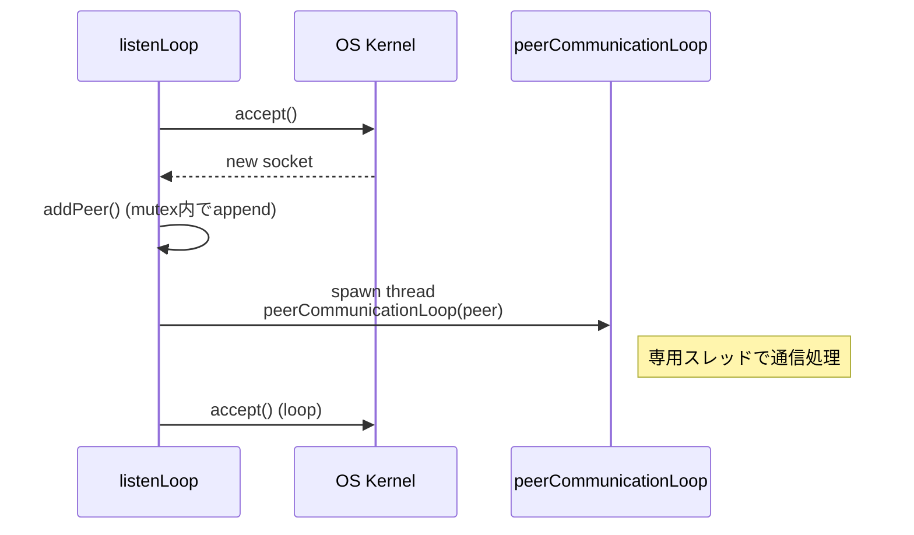
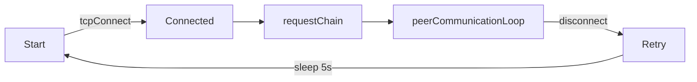

これまでは、サーバー（受信専用）とクライアント（送信専用）に役割を分け、一方向にブロックを送信する仕組みを構築しました。しかし、この方式では各ノードが対等ではなく、真の分散型ネットワークとは言えません。第8章では、この制限を取り払いピアツーピア（P2P）通信を実装します。
各ノードが送信、受信も行う対等なピアとなり、相互にブロックを交換・同期できるネットワークを構築しましょう。

## この章の目標

- 既知ピアへの自動接続: ノード起動時に、あらかじめ知っている複数のピアに対して自動的に接続を試み、ネットワークに参加します。
- ブロックのゴシップ配信: あるピアから新しいブロックを受信した際に、自分が接続している他の全てのピアへそのブロックを再送信し、ネットワーク全体にブロックを広めます（ゴシッププロトコル風の拡散）。
- チェイン全体の同期（RPCの実装）: 新規ノードがネットワークに参加した際、既存ピアに対して自分の持つブロックチェイン全体を要求・取得し、一気に同期できるようにします。
- 接続の維持と再接続: `read()`が0を返すなど、明示的な切断時のみ再接続します。無応答を検出するタイムアウト処理はスコープ外です。

```text
対象パス:   references/chapter8/src/*.zig、docker-compose.yml、fixtures/*.frame、scripts/acceptance.sh
開始地点:   ch07-sec01-block-transfer
今回の変更: 複数ピア、GET_CHAIN、ゴシップ、重複排除、tip連結検証を実装
テスト:     zig fmt --check . && zig build test && zig build
実行:       sh scripts/acceptance.sh
期待結果:   3ノードが固定済み2ブロックへ収束し、重複と改ざんブロックを拒否する
```

本章の相対パスと実行コマンドが、完成版のリポジトリ直下ではなく第8章のコードを対象にするよう、先にカレントディレクトリを固定します。以降は、特記がない限りこのディレクトリから実行します。

```bash
cd "$(git rev-parse --show-toplevel)/references/chapter8"
```

## チェインの現在の状態を表示できるようにする

blockchain.zigに現在のチェインの状態を表示する機能を加えます。

```zig
pub var chain_store = std.ArrayList(types.Block).init(std.heap.page_allocator);

/// ブロック追加の判定結果。呼び出し側は`added`のときだけ再伝播します。
pub const AddBlockResult = enum {
    added,
    duplicate,
    invalid_pow,
    invalid_link,
    out_of_memory,
};

var chain_store_mutex = std.Thread.Mutex{};
/// 検証済みブロックをブロックチェーンに追加する
///
/// チェーンに追加する前にブロックのプルーフオブワークを検証します。
/// 検証に失敗したブロックは拒否されます。
///
/// 引数:
///     new_block: チェーンに追加するBlock構造体
///
/// 注意:
///     この関数は成功または失敗のメッセージをログに記録します
pub fn addBlock(new_block: types.Block) AddBlockResult {
    chain_store_mutex.lock();
    defer chain_store_mutex.unlock();

    if (!verifyBlockPow(&new_block)) {
        std.log.warn("BLOCK_REJECTED reason=invalid_pow index={d}", .{new_block.index});
        return .invalid_pow;
    }

    for (chain_store.items) |known_block| {
        if (std.mem.eql(u8, known_block.hash[0..], new_block.hash[0..])) {
            std.log.info("BLOCK_REJECTED reason=duplicate index={d} hash={x:0>2}", .{ new_block.index, new_block.hash });
            return .duplicate;
        }
    }

    var expected_index: u32 = undefined;
    var expected_prev_hash: [32]u8 = undefined;
    if (chain_store.items.len == 0) {
        var genesis = createTestGenesisBlock(std.heap.page_allocator) catch {
            std.log.warn("BLOCK_REJECTED reason=genesis_allocation index={d}", .{new_block.index});
            return .out_of_memory;
        };
        defer genesis.transactions.deinit();
        expected_index = genesis.index + 1;
        expected_prev_hash = genesis.hash;
    } else {
        const tip = chain_store.items[chain_store.items.len - 1];
        expected_index = tip.index + 1;
        expected_prev_hash = tip.hash;
    }

    if (new_block.index != expected_index or
        !std.mem.eql(u8, new_block.prev_hash[0..], expected_prev_hash[0..]))
    {
        std.log.warn("BLOCK_REJECTED reason=invalid_link index={d} expected_index={d}", .{ new_block.index, expected_index });
        return .invalid_link;
    }

    chain_store.append(new_block) catch {
        std.log.warn("BLOCK_REJECTED reason=out_of_memory index={d}", .{new_block.index});
        return .out_of_memory;
    };
    std.log.info("Added new block index={d}, nonce={d}, hash={x:0>2}", .{ new_block.index, new_block.nonce, new_block.hash });

    // chain_store_mutexを保持しているため、再ロックしない内部版を使う。
    printChainStateLocked();
    return .added;
}
/// 現在のブロックチェーンの高さ（ブロック数）を取得する
///
/// 戻り値:
///     usize: ブロックチェーン内のブロック数
pub fn getChainHeight() usize {
    chain_store_mutex.lock();
    defer chain_store_mutex.unlock();
    return chain_store.items.len;
}

/// インデックスでブロックを取得する
///
/// 引数:
///     index: 取得するブロックのインデックス
///
/// 戻り値:
///     ?types.Block: 要求されたブロック、見つからない場合はnull
pub fn getBlock(index: usize) ?types.Block {
    chain_store_mutex.lock();
    defer chain_store_mutex.unlock();
    if (index >= chain_store.items.len) return null;
    return chain_store.items[index];
}

/// 現在のtipを値コピーで取得する。第8章では空チェーンのときnullを返し、
/// 呼び出し側が決定的genesisを直前ブロックとして使う。
pub fn getChainTip() ?types.Block {
    chain_store_mutex.lock();
    defer chain_store_mutex.unlock();
    if (chain_store.items.len == 0) return null;
    return chain_store.items[chain_store.items.len - 1];
}

/// P2P送信中のArrayList再確保を避けるため、Block構造体を値コピーする。
/// accepted blockのネストしたデータは実行中immutableかつ解放されないため、
/// shallow snapshotの参照先は有効である。呼び出し側は返却配列だけを解放する。
pub fn copyChainSnapshot(allocator: std.mem.Allocator) ![]types.Block {
    chain_store_mutex.lock();
    defer chain_store_mutex.unlock();
    return allocator.dupe(types.Block, chain_store.items);
}

/// デバッグ用に現在のブロックチェーン状態を出力する
///
/// チェーンの高さと各ブロックの詳細情報を見やすい形式で表示します
pub fn printChainState() void {
    chain_store_mutex.lock();
    defer chain_store_mutex.unlock();
    printChainStateLocked();
}

fn printChainStateLocked() void {
    std.log.info("Current chain state:", .{});
    std.log.info("- Height: {d} blocks", .{chain_store.items.len});

    if (chain_store.items.len == 0) {
        std.log.info("- No blocks in chain", .{});
        return;
    }

    // 各ブロックを詳細に表示
    for (chain_store.items) |block| {
        const hash_str = std.fmt.bytesToHex(block.hash, .lower);
        // 区切り線を表示
        std.debug.print("\n{s}\n", .{"---------------------------"});
        // ブロック情報を見やすく表示
        std.debug.print("Block index: {d}\n", .{block.index});
        std.debug.print("Timestamp  : {d}\n", .{block.timestamp});
        std.debug.print("Nonce      : {d}\n", .{block.nonce});
        std.debug.print("Data       : {s}\n", .{block.data});

        // トランザクション情報を表示
        std.debug.print("Transactions:\n", .{});
        if (block.transactions.items.len == 0) {
            std.debug.print("  (no transactions)\n", .{});
        } else {
            for (block.transactions.items) |tx| {
                std.debug.print("  {s} -> {s} : {d}\n", .{ tx.sender, tx.receiver, tx.amount });
            }
        }

        // ハッシュを表示
        std.debug.print("Hash       : {s}\n", .{hash_str[0..64]});
    }
    std.debug.print("\n{s}\n", .{"---------------------------"});
}
```

`addBlock`はPoWだけでなく、同じハッシュが未登録であること、`index`がtipの次であること、`prev_hash`がtipの`hash`と一致することを確認します。戻り値が`.added`のときだけ再伝播する設計にすると、三角形の接続で同じブロックが別経路から戻っても追加と転送を繰り返しません。署名を導入する前でも、この4条件（再計算hash、PoW、重複、tip連結）はチェインとして成立する最低限の検証です。

`addBlock`、高さ・tipの取得、送信用snapshot、表示は同じ`chain_store_mutex`で保護します。`addBlock`はmutexを保持した状態なので、表示時は再ロックしない`printChainStateLocked`を呼びます。`copyChainSnapshot`が返す配列はshallow copyですが、追加済みブロックのネストしたデータを実行中は変更・解放しないという本章の所有権規約により、送信完了まで参照先が有効です。

同じファイルの末尾へ、追加・重複・改ざん・リンク切れを1本のテストで確認するコードを加えます。

```zig
fn clearChainStoreForTest() void {
    for (chain_store.items) |*block| {
        block.transactions.deinit();
    }
    chain_store.clearRetainingCapacity();
}

test "addBlock rejects tampering duplicates and broken links" {
    clearChainStoreForTest();
    defer clearChainStoreForTest();

    var genesis = try createTestGenesisBlock(std.heap.page_allocator);
    defer genesis.transactions.deinit();

    var first = createBlock("first", genesis);
    mineBlock(&first, DIFFICULTY);
    try std.testing.expectEqual(AddBlockResult.added, addBlock(first));
    try std.testing.expectEqual(@as(usize, 1), getChainHeight());

    try std.testing.expectEqual(AddBlockResult.duplicate, addBlock(first));
    try std.testing.expectEqual(@as(usize, 1), getChainHeight());

    var tampered = first;
    tampered.data = "tampered";
    try std.testing.expectEqual(AddBlockResult.invalid_pow, addBlock(tampered));
    try std.testing.expectEqual(@as(usize, 1), getChainHeight());

    var broken_link = createBlock("broken", first);
    defer broken_link.transactions.deinit();
    broken_link.prev_hash = [_]u8{0} ** 32;
    mineBlock(&broken_link, DIFFICULTY);
    try std.testing.expectEqual(AddBlockResult.invalid_link, addBlock(broken_link));
    try std.testing.expectEqual(@as(usize, 1), getChainHeight());

    var second = createBlock("second", first);
    mineBlock(&second, DIFFICULTY);
    try std.testing.expectEqual(AddBlockResult.added, addBlock(second));
    try std.testing.expectEqual(@as(usize, 2), getChainHeight());
}
```

```bash
zig fmt --check .
zig build test
zig build
```

## P2P用の処理を作成する

ここからP2P通信に必要な機能を追加していきます。

### P2P通信設計の全体像

本章で組み立てるネットワーク層は **“シンプルさ > 完全性”** を最優先にしています。

- **伝送単位**は `TEXT(JSON) + 改行` —— *Wireshark で即読可能*
- **RPC** は2種のみ
  - `BLOCK:<json>` : 新規ブロックのゴシップ
  - `GET_CHAIN`    : レイジー同期要求
- ピア検出は **静的リスト + 再接続ループ** です。学習用の小規模構成(数ノード)を想定し、複数の接続スレッドが共有する`peer_list`はMutexで保護します。大規模化には送信キューや接続上限が必要です。
- ハードエラーより **“失敗してもリトライ”** を優先。学習用ツールとして *落ちにくい* 体験を重視しました。

これらを踏まえて、以下で各関数の内部ロジックを詳しく追っていきましょう。

## ピアとの通信処理とブロックの再伝播

それでは、実際にピア間でブロックやメッセージをやり取りする通信処理を実装しましょう。まずp2p.zigを作り、P2Pに関するコードをまとめていきます。

まず、使用するモジュールをインポートしておきます。

```zig
//! ピアツーピアネットワーキングモジュール
//!
//! このモジュールはブロックチェーンアプリケーションのピアツーピアネットワーク層を実装します。
//! 他のノードとの接続確立、着信接続の待ち受け、ノード間の通信プロトコルの
//! 処理機能を提供します。このモジュールはネットワーク全体にブロックチェーンデータを
//! ブロードキャストし、同期することを可能にします。

const std = @import("std");
const blockchain = @import("blockchain.zig");
const types = @import("types.zig");
const parser = @import("parser.zig");
```

次に、ネットワーク内の他のノードへのアクティブな接続を維持できるように、グローバルのリストを定義します。

```zig
/// 接続済みピアのグローバルリスト
/// ネットワーク内の他のノードへのアクティブな接続を維持します
pub var peer_list = std.ArrayList(types.Peer).init(std.heap.page_allocator);
var peer_list_mutex = std.Thread.Mutex{};
// TCPの1フレーム（改行まで）を分割書き込みしても、別threadのframeと混ざらない。
// chain/peerのmutexとは分離し、状態snapshotを取得してからこのmutexを取る。
var frame_write_mutex = std.Thread.Mutex{};

fn addPeer(peer: types.Peer) !void {
    peer_list_mutex.lock();
    defer peer_list_mutex.unlock();
    try peer_list.append(peer);
}

fn copyPeerSnapshot() ![]types.Peer {
    peer_list_mutex.lock();
    defer peer_list_mutex.unlock();
    return std.heap.page_allocator.dupe(types.Peer, peer_list.items);
}

fn writeBlockFrame(peer: types.Peer, payload: []const u8) !void {
    frame_write_mutex.lock();
    defer frame_write_mutex.unlock();
    var writer = peer.stream.writer();
    try writer.writeAll("BLOCK:");
    try writer.writeAll(payload);
    try writer.writeAll("\n");
}
```

## リスナースレッドの作成

inbound接続を捌くリスナースレッドを作成します。

```zig
/// リッスンソケットを開始し、着信接続を受け入れる
///
/// 指定されたポートで着信接続を待機するTCPサーバーを作成します。
/// 新しい接続ごとに、専用の通信スレッドを生成します。
///
/// 引数:
///     port: リッスンするポート番号
///
/// 注意:
///     この関数は独自のスレッドで無期限に実行されます
pub fn listenLoop(port: u16) !void {
    var addr = try std.net.Address.resolveIp("0.0.0.0", port);
    var listener = try addr.listen(.{});
    defer listener.deinit();

    std.log.info("listen 0.0.0.0:{d}", .{port});

    while (true) {
        const conn = try listener.accept();
        const peer = types.Peer{ .address = conn.address, .stream = conn.stream };
        try addPeer(peer);
        std.log.info("Accepted connection from: {any}", .{conn.address});

        // ピアとの通信を処理するスレッドを生成
        _ = try std.Thread.spawn(.{}, peerCommunicationLoop, .{peer});
    }
}
```

着信接続を受け入れるまでの流れは以下の通りです。

1. `std.net.Address.resolveIp` で **0.0.0.0:port** をバインドし全インタフェースで待ち受け。
2. `addr.listen().accept()` は *ブロッキング*。OSカーネルに制御が移ります。
3. 新規接続を `types.Peer` にラップし、`addPeer`を通して`peer_list`へ追加。
   - 目的: 全スレッド共有の接続テーブルを維持
4. 受け入れと同時に `std.Thread.spawn` で専用スレッドを生成。
5. 親スレッドは次の `accept()` へ戻り、無限ループでリッスン継続。


```mermaid
sequenceDiagram
    participant L as listenLoop
    participant K as OS Kernel
    participant P as peerCommunicationLoop
    L->>K: accept()
    K-->>L: new socket
    L->>L: addPeer() (mutex内でappend)
    L->>P: spawn thread<br/>peerCommunicationLoop(peer)
    note right of P: 専用スレッドで通信処理
    L->>K: accept() (loop)
```

ピアを管理するのに必要な関数を追加します。

```zig
/// 指定されたピアアドレスに接続する
///
/// 指定されたアドレスで別のノードとの接続を確立しようとします。
/// 接続に失敗した場合、遅延後に再試行します。接続が確立されると、
/// チェーン同期をリクエストします。
///
/// 引数:
///     addr: 接続するピアのネットワークアドレス
///
/// 注意:
///     この関数は独自のスレッドで無期限に実行され、再接続を処理します
pub fn connectToPeer(addr: std.net.Address) !void {
    while (true) {
        const sock = std.net.tcpConnectToAddress(addr) catch |err| {
            std.log.warn("Connection failed to {any}: {any}", .{ addr, err });
            std.time.sleep(5 * std.time.ns_per_s); // 5秒待機してから再試行
            continue;
        };

        std.log.info("Connected to peer: {any}", .{addr});
        const peer = types.Peer{ .address = addr, .stream = sock };
        try addPeer(peer);

        // 新しく接続されたピアからチェーン同期をリクエスト
        try requestChain(peer);

        // ピアとの通信ループを開始
        peerCommunicationLoop(peer) catch |e| {
            std.log.err("Peer communication error: {any}", .{e});
        };
    }
}

/// ピアからブロックチェーンデータをリクエストする
///
/// ピアのブロックチェーンデータをリクエストするためにGET_CHAINメッセージを送信します。
///
/// 引数:
///     peer: チェーンをリクエストするピア
///
/// エラー:
///     ストリーム書き込みエラー
fn requestChain(peer: types.Peer) !void {
    frame_write_mutex.lock();
    defer frame_write_mutex.unlock();
    try peer.stream.writer().writeAll("GET_CHAIN\n");
    std.log.info("Requested chain from {any}", .{peer.address});
}

/// ソース以外のすべてのピアにブロックをブロードキャストする
///
/// ブロックをシリアル化し、接続されているすべてのピアに送信します。
/// オプションで、送信元のピアを除外することができます。
///
/// 引数:
///     blk: ブロードキャストするブロック
///     from_peer: ブロードキャストから除外するオプションのソースピア
pub fn broadcastBlock(blk: types.Block, from_peer: ?types.Peer) void {
    const payload = parser.serializeBlock(blk) catch return;
    defer std.heap.page_allocator.free(payload);

    const peers = copyPeerSnapshot() catch |err| {
        std.log.err("Failed to snapshot peers for broadcast: {any}", .{err});
        return;
    };
    defer std.heap.page_allocator.free(peers);

    for (peers) |peer| {
        // 指定された場合、送信元のピアをスキップ
        if (from_peer) |sender| {
            if (peer.address.getPort() == sender.address.getPort()) continue;
        }

        writeBlockFrame(peer, payload) catch |err| {
            std.log.err("Error broadcasting to peer {any}: {any}", .{ peer.address, err });
            continue;
        };
    }
}

/// 完全なブロックチェーンをピアに送信する
///
/// ローカルチェーン内のすべてのブロックをシリアル化し、
/// 適切なメッセージフレーミングで1つずつ指定されたピアに送信します。
///
/// 引数:
///     peer: チェーンを送信するピア
///
/// エラー:
///     シリアル化またはネットワークエラー
pub fn sendFullChain(peer: types.Peer) !void {
    const chain = try blockchain.copyChainSnapshot(std.heap.page_allocator);
    defer std.heap.page_allocator.free(chain);
    std.log.info("Sending full chain (height={d}) to {any}", .{ chain.len, peer.address });

    frame_write_mutex.lock();
    defer frame_write_mutex.unlock();
    var writer = peer.stream.writer();

    for (chain) |block| {
        {
            const block_json = try parser.serializeBlock(block);
            defer std.heap.page_allocator.free(block_json);
            try writer.writeAll("BLOCK:");
            try writer.writeAll(block_json);
            try writer.writeAll("\n"); // メッセージフレーミングのための改行
        }
    }
}

/// ピアリストからピアを削除する
///
/// 切断された場合に、グローバルピアリストからピアを検索して削除します。
///
/// 引数:
///     target: 削除するピア
fn removePeerFromList(target: types.Peer) void {
    peer_list_mutex.lock();
    defer peer_list_mutex.unlock();

    var i: usize = 0;
    while (i < peer_list.items.len) : (i += 1) {
        if (peer_list.items[i].address.getPort() == target.address.getPort()) {
            _ = peer_list.orderedRemove(i);
            break;
        }
    }
}
```

### connectToPeer — アウトバウンド接続と再接続

1. `while (true)` で永続的に接続を試行。失敗時は `std.time.sleep(5秒)`（指数バックオフへ置換可能）。
2. 成功したら `types.Peer` を生成し `peer_list` へ登録。
3. 直後に `requestChain(peer)` を送信し **最新チェインの取得** をリクエスト。
4. 続けて **同じスレッド**で `peerCommunicationLoop` を呼び出し、通信ループへ。


```mermaid
flowchart LR
    Start -->|tcpConnect| Connected
    Connected --> send[requestChain]
    send --> comm[peerCommunicationLoop]
    comm -->|disconnect| Retry
    Retry -->|sleep 5s| Start
```

### broadcastBlock — ゴシップのコア

- シリアル化は `parser.serializeBlock` に集約し **I/O と計算を分離**。
- `from_peer`で直前の送信元を除外し、さらに`addBlock == .added`のときだけ再送します。三角トポロジーで別経路から戻る重複は`addBlock`が拒否するため、ゴシップが循環し続けません。
- `copyPeerSnapshot`はmutex内でピア一覧を複製し、ネットワーク書き込みはロック解放後に行います。`writeBlockFrame`は`BLOCK:`、JSON、改行の3回の書き込みを`frame_write_mutex`で1つのフレームとして直列化します。
- 書き込み失敗時はログのみ残してループ継続 —— *ネットワーク全断* を回避します。

### sendFullChain — 遅延同期のためのワンショット RPC

新規ノードが合流した際に **“全ブロック”** を送る簡易実装です。`copyChainSnapshot`でstate mutex内では配列コピーだけを行い、送信中のチェイン追加による`ArrayList`再確保と競合しないようにします。実際のソケット書き込みはstate mutexを解放してから`frame_write_mutex`内で行います。

受信したメッセージを処理する関数を追加します。

```zig
/// 種類に基づいて受信メッセージを処理する
///
/// BLOCKやGET_CHAINメッセージなど、ピアからの異なるメッセージタイプを
/// 解析して処理します。
///
/// 引数:
///     msg: 改行区切りのない、メッセージの内容
///     from_peer: メッセージを送信したピア
///
/// エラー:
///     解析エラーまたは処理エラー
fn handleMessage(msg: []const u8, from_peer: types.Peer) !void {
    if (std.mem.startsWith(u8, msg, "BLOCK:")) {
        // BLOCKメッセージを処理
        var blk = parser.parseBlockJson(msg[6..]) catch |err| {
            std.log.err("Error parsing block from {any}: {any}", .{ from_peer.address, err });
            return;
        };

        // 新規かつ正しく連結したブロックだけを追加・再伝播する。
        // 重複や改ざんブロックを再送しないことでゴシップの循環を止める。
        if (blockchain.addBlock(blk) == .added) {
            broadcastBlock(blk, from_peer);
        } else {
            parser.deinitParsedBlock(&blk);
        }
    } else if (std.mem.startsWith(u8, msg, "GET_CHAIN")) {
        // GET_CHAINメッセージを処理
        std.log.info("Received GET_CHAIN from {any}", .{from_peer.address});
        try sendFullChain(from_peer);
    } else {
        // 不明なメッセージを処理
        std.log.info("Unknown message from {any}: {s}", .{ from_peer.address, msg });
    }
}

/// ユーザー入力からブロックを作成してブロードキャストするインタラクティブループ
///
/// コンソールからテキスト入力を読み取り、それからブロックを作成し、
/// マイニングして、ネットワークにブロードキャストします。
///
/// 注意:
///     この関数は独自のスレッドで無期限に実行されます
fn createMinedInputBlock(line: []const u8, last_block: types.Block) !types.Block {
    // readUntilDelimiterOrEofが返すsliceは次の入力で上書きされる。
    // 採掘済みchainが入力バッファの寿命に依存しないよう、block自身が保持する。
    const owned_line = try std.heap.page_allocator.dupe(u8, line);
    errdefer std.heap.page_allocator.free(owned_line);

    var new_block = blockchain.createBlock(owned_line, last_block);
    blockchain.mineBlock(&new_block, 2);
    return new_block;
}

pub fn textInputLoop() !void {
    var reader = std.io.getStdIn().reader();
    var buf: [256]u8 = undefined;

    while (true) {
        std.debug.print("msg> ", .{});
        const maybe_line = reader.readUntilDelimiterOrEof(buf[0..], '\n') catch null;

        if (maybe_line) |line| {
            // チェーンが空の場合は最新のブロックを取得するか、ジェネシスを作成
            const last_block = blockchain.getChainTip() orelse
                try blockchain.createTestGenesisBlock(std.heap.page_allocator);

            // 新しいブロックを作成してマイニング
            var new_block = try createMinedInputBlock(line, last_block);
            if (blockchain.addBlock(new_block) == .added) {
                // 作成したブロックをブロードキャスト
                broadcastBlock(new_block, null);
            } else {
                new_block.transactions.deinit();
                std.heap.page_allocator.free(new_block.data);
            }
        } else break;
    }
}

/// ホスト:ポート文字列をネットワークアドレスに解決
///
/// "hostname:port"形式の文字列を受け取り、接続に使用できる
/// ネットワークアドレスに解決します。
///
/// 引数:
///     spec: "hostname:port"形式の文字列
///
/// 戻り値:
///     std.net.Address - 解決されたネットワークアドレス
///
/// エラー:
///     error.Invalid: 文字列フォーマットが無効な場合
///     std.net.Address.resolveIpからのその他のエラー
pub fn resolveHostPort(spec: []const u8) !std.net.Address {
    var it = std.mem.tokenizeScalar(u8, spec, ':');
    const host = it.next() orelse return error.Invalid;
    const port_s = it.next() orelse return error.Invalid;
    const port = try std.fmt.parseInt(u16, port_s, 10);

    // 特別なケース: localhostが指定された場合は直接127.0.0.1を使用
    if (std.mem.eql(u8, host, "localhost")) {
        return std.net.Address.parseIp("127.0.0.1", port) catch unreachable;
    }

    // まずIPアドレスとしてパースを試みる
    return std.net.Address.parseIp(host, port) catch |err| {
        if (err == error.InvalidIPAddressFormat) {
            // IPアドレスとして無効な場合は、ホスト名解決を試みる
            const list = try std.net.getAddressList(std.heap.page_allocator, host, port);
            defer list.deinit();

            // アドレスが見つからない場合はエラー
            if (list.addrs.len == 0) {
                return error.UnknownHostName;
            }

            // 最初のアドレスを返す
            return list.addrs[0];
        }
        return err;
    };
}
```

次にピアとの通信を処理する関数を実装します。

```zig
/// ピアとの通信を処理する
///
/// ピア接続から継続的に読み取り、メッセージを処理し、
/// 切断を処理します。
///
/// 引数:
///     peer: 通信するピア
///
/// 注意:
///     この関数は終了時に接続をクリーンアップします
fn peerCommunicationLoop(peer: types.Peer) !void {
    defer {
        removePeerFromList(peer);
        peer.stream.close();
    }

    var reader = peer.stream.reader();
    var buf: [4096]u8 = undefined; // 受信メッセージ用のバッファ
    var total_bytes: usize = 0;

    while (true) {
        const n = try reader.read(buf[total_bytes..]);
        if (n == 0) break; // 接続が閉じられた

        total_bytes += n;
        var search_start: usize = 0;

        // バッファ内の完全なメッセージを処理
        while (search_start < total_bytes) {
            // メッセージ区切り文字（改行）を探す
            var newline_pos: ?usize = null;
            var i: usize = search_start;
            while (i < total_bytes) : (i += 1) {
                if (buf[i] == '\n') {
                    newline_pos = i;
                    break;
                }
            }

            if (newline_pos) |pos| {
                // 完全なメッセージを処理
                const msg = buf[search_start..pos];
                try handleMessage(msg, peer);
                search_start = pos + 1;
            } else {
                // メッセージがまだ完全ではない
                break;
            }
        }

        // 処理済みメッセージをバッファから削除
        if (search_start > 0) {
            if (search_start < total_bytes) {
                std.mem.copyForwards(u8, &buf, buf[search_start..total_bytes]);
            }
            total_bytes -= search_start;
        }

        // バッファがいっぱいで完全なメッセージがない場合はエラー
        if (total_bytes == buf.len) {
            std.log.err("Message too long, buffer full from peer {any}", .{peer.address});
            break;
        }
    }

    std.log.info("Peer {any} disconnected.", .{peer.address});
}
```

peerCommunicationLoop関数は受信・整形・デコードの三段階で構成してあります。

| ステップ | 処理内容 | 役割 |
|---------|----------|------|
| (1) **read**  | `reader.read(buf[n..])` | ソケットから *生バイト列* を取得 |
| (2) **frame** | バッファ内を `\n` でスキャン | **メッセージ境界** を検出 |
| (3) **handle**| `handleMessage(msg, peer)` | コマンド種別で振り分け |

改行デリミタのみを規約にした **最小限の状態機械** です。実装はシンプルで、処理の流れも追いやすくなります。ただし、1メッセージが4096バイトを超える場合は接続を切断します。

出来上がったp2p.zigモジュール全体のコードは以下になります。

```p2p.zig
//! ピアツーピアネットワーキングモジュール
//!
//! このモジュールはブロックチェーンアプリケーションのピアツーピアネットワーク層を実装します。
//! 他のノードとの接続確立、着信接続の待ち受け、ノード間の通信プロトコルの
//! 処理機能を提供します。このモジュールはネットワーク全体にブロックチェーンデータを
//! ブロードキャストし、同期することを可能にします。

const std = @import("std");
const blockchain = @import("blockchain.zig");
const types = @import("types.zig");
const parser = @import("parser.zig");

/// 接続済みピアのグローバルリスト
/// ネットワーク内の他のノードへのアクティブな接続を維持します
pub var peer_list = std.ArrayList(types.Peer).init(std.heap.page_allocator);
var peer_list_mutex = std.Thread.Mutex{};
// TCPの1フレーム（改行まで）を分割書き込みしても、別threadのframeと混ざらない。
// chain/peerのmutexとは分離し、状態snapshotを取得してからこのmutexを取る。
var frame_write_mutex = std.Thread.Mutex{};

fn addPeer(peer: types.Peer) !void {
    peer_list_mutex.lock();
    defer peer_list_mutex.unlock();
    try peer_list.append(peer);
}

fn copyPeerSnapshot() ![]types.Peer {
    peer_list_mutex.lock();
    defer peer_list_mutex.unlock();
    return std.heap.page_allocator.dupe(types.Peer, peer_list.items);
}

fn writeBlockFrame(peer: types.Peer, payload: []const u8) !void {
    frame_write_mutex.lock();
    defer frame_write_mutex.unlock();
    var writer = peer.stream.writer();
    try writer.writeAll("BLOCK:");
    try writer.writeAll(payload);
    try writer.writeAll("\n");
}

/// リッスンソケットを開始し、着信接続を受け入れる
///
/// 指定されたポートで着信接続を待機するTCPサーバーを作成します。
/// 新しい接続ごとに、専用の通信スレッドを生成します。
///
/// 引数:
///     port: リッスンするポート番号
///
/// 注意:
///     この関数は独自のスレッドで無期限に実行されます
pub fn listenLoop(port: u16) !void {
    var addr = try std.net.Address.resolveIp("0.0.0.0", port);
    var listener = try addr.listen(.{});
    defer listener.deinit();

    std.log.info("listen 0.0.0.0:{d}", .{port});

    while (true) {
        const conn = try listener.accept();
        const peer = types.Peer{ .address = conn.address, .stream = conn.stream };
        try addPeer(peer);
        std.log.info("Accepted connection from: {any}", .{conn.address});

        // ピアとの通信を処理するスレッドを生成
        _ = try std.Thread.spawn(.{}, peerCommunicationLoop, .{peer});
    }
}

/// 指定されたピアアドレスに接続する
///
/// 指定されたアドレスで別のノードとの接続を確立しようとします。
/// 接続に失敗した場合、遅延後に再試行します。接続が確立されると、
/// チェーン同期をリクエストします。
///
/// 引数:
///     addr: 接続するピアのネットワークアドレス
///
/// 注意:
///     この関数は独自のスレッドで無期限に実行され、再接続を処理します
pub fn connectToPeer(addr: std.net.Address) !void {
    while (true) {
        const sock = std.net.tcpConnectToAddress(addr) catch |err| {
            std.log.warn("Connection failed to {any}: {any}", .{ addr, err });
            std.time.sleep(5 * std.time.ns_per_s); // 5秒待機してから再試行
            continue;
        };

        std.log.info("Connected to peer: {any}", .{addr});
        const peer = types.Peer{ .address = addr, .stream = sock };
        try addPeer(peer);

        // 新しく接続されたピアからチェーン同期をリクエスト
        try requestChain(peer);

        // ピアとの通信ループを開始
        peerCommunicationLoop(peer) catch |e| {
            std.log.err("Peer communication error: {any}", .{e});
        };
    }
}

/// ピアからブロックチェーンデータをリクエストする
///
/// ピアのブロックチェーンデータをリクエストするためにGET_CHAINメッセージを送信します。
///
/// 引数:
///     peer: チェーンをリクエストするピア
///
/// エラー:
///     ストリーム書き込みエラー
fn requestChain(peer: types.Peer) !void {
    frame_write_mutex.lock();
    defer frame_write_mutex.unlock();
    try peer.stream.writer().writeAll("GET_CHAIN\n");
    std.log.info("Requested chain from {any}", .{peer.address});
}

/// ソース以外のすべてのピアにブロックをブロードキャストする
///
/// ブロックをシリアル化し、接続されているすべてのピアに送信します。
/// オプションで、送信元のピアを除外することができます。
///
/// 引数:
///     blk: ブロードキャストするブロック
///     from_peer: ブロードキャストから除外するオプションのソースピア
pub fn broadcastBlock(blk: types.Block, from_peer: ?types.Peer) void {
    const payload = parser.serializeBlock(blk) catch return;
    defer std.heap.page_allocator.free(payload);

    const peers = copyPeerSnapshot() catch |err| {
        std.log.err("Failed to snapshot peers for broadcast: {any}", .{err});
        return;
    };
    defer std.heap.page_allocator.free(peers);

    for (peers) |peer| {
        // 指定された場合、送信元のピアをスキップ
        if (from_peer) |sender| {
            if (peer.address.getPort() == sender.address.getPort()) continue;
        }

        writeBlockFrame(peer, payload) catch |err| {
            std.log.err("Error broadcasting to peer {any}: {any}", .{ peer.address, err });
            continue;
        };
    }
}

/// 完全なブロックチェーンをピアに送信する
///
/// ローカルチェーン内のすべてのブロックをシリアル化し、
/// 適切なメッセージフレーミングで1つずつ指定されたピアに送信します。
///
/// 引数:
///     peer: チェーンを送信するピア
///
/// エラー:
///     シリアル化またはネットワークエラー
pub fn sendFullChain(peer: types.Peer) !void {
    const chain = try blockchain.copyChainSnapshot(std.heap.page_allocator);
    defer std.heap.page_allocator.free(chain);
    std.log.info("Sending full chain (height={d}) to {any}", .{ chain.len, peer.address });

    frame_write_mutex.lock();
    defer frame_write_mutex.unlock();
    var writer = peer.stream.writer();

    for (chain) |block| {
        {
            const block_json = try parser.serializeBlock(block);
            defer std.heap.page_allocator.free(block_json);
            try writer.writeAll("BLOCK:");
            try writer.writeAll(block_json);
            try writer.writeAll("\n"); // メッセージフレーミングのための改行
        }
    }
}

/// ピアリストからピアを削除する
///
/// 切断された場合に、グローバルピアリストからピアを検索して削除します。
///
/// 引数:
///     target: 削除するピア
fn removePeerFromList(target: types.Peer) void {
    peer_list_mutex.lock();
    defer peer_list_mutex.unlock();

    var i: usize = 0;
    while (i < peer_list.items.len) : (i += 1) {
        if (peer_list.items[i].address.getPort() == target.address.getPort()) {
            _ = peer_list.orderedRemove(i);
            break;
        }
    }
}

/// 種類に基づいて受信メッセージを処理する
///
/// BLOCKやGET_CHAINメッセージなど、ピアからの異なるメッセージタイプを
/// 解析して処理します。
///
/// 引数:
///     msg: 改行区切りのない、メッセージの内容
///     from_peer: メッセージを送信したピア
///
/// エラー:
///     解析エラーまたは処理エラー
fn handleMessage(msg: []const u8, from_peer: types.Peer) !void {
    if (std.mem.startsWith(u8, msg, "BLOCK:")) {
        // BLOCKメッセージを処理
        var blk = parser.parseBlockJson(msg[6..]) catch |err| {
            std.log.err("Error parsing block from {any}: {any}", .{ from_peer.address, err });
            return;
        };

        // 新規かつ正しく連結したブロックだけを追加・再伝播する。
        // 重複や改ざんブロックを再送しないことでゴシップの循環を止める。
        if (blockchain.addBlock(blk) == .added) {
            broadcastBlock(blk, from_peer);
        } else {
            parser.deinitParsedBlock(&blk);
        }
    } else if (std.mem.startsWith(u8, msg, "GET_CHAIN")) {
        // GET_CHAINメッセージを処理
        std.log.info("Received GET_CHAIN from {any}", .{from_peer.address});
        try sendFullChain(from_peer);
    } else {
        // 不明なメッセージを処理
        std.log.info("Unknown message from {any}: {s}", .{ from_peer.address, msg });
    }
}

/// ユーザー入力からブロックを作成してブロードキャストするインタラクティブループ
///
/// コンソールからテキスト入力を読み取り、それからブロックを作成し、
/// マイニングして、ネットワークにブロードキャストします。
///
/// 注意:
///     この関数は独自のスレッドで無期限に実行されます
fn createMinedInputBlock(line: []const u8, last_block: types.Block) !types.Block {
    // readUntilDelimiterOrEofが返すsliceは次の入力で上書きされる。
    // 採掘済みchainが入力バッファの寿命に依存しないよう、block自身が保持する。
    const owned_line = try std.heap.page_allocator.dupe(u8, line);
    errdefer std.heap.page_allocator.free(owned_line);

    var new_block = blockchain.createBlock(owned_line, last_block);
    blockchain.mineBlock(&new_block, 2);
    return new_block;
}

pub fn textInputLoop() !void {
    var reader = std.io.getStdIn().reader();
    var buf: [256]u8 = undefined;

    while (true) {
        std.debug.print("msg> ", .{});
        const maybe_line = reader.readUntilDelimiterOrEof(buf[0..], '\n') catch null;

        if (maybe_line) |line| {
            // チェーンが空の場合は最新のブロックを取得するか、ジェネシスを作成
            const last_block = blockchain.getChainTip() orelse
                try blockchain.createTestGenesisBlock(std.heap.page_allocator);

            // 新しいブロックを作成してマイニング
            var new_block = try createMinedInputBlock(line, last_block);
            if (blockchain.addBlock(new_block) == .added) {
                // 作成したブロックをブロードキャスト
                broadcastBlock(new_block, null);
            } else {
                new_block.transactions.deinit();
                std.heap.page_allocator.free(new_block.data);
            }
        } else break;
    }
}

/// ホスト:ポート文字列をネットワークアドレスに解決
///
/// "hostname:port"形式の文字列を受け取り、接続に使用できる
/// ネットワークアドレスに解決します。
///
/// 引数:
///     spec: "hostname:port"形式の文字列
///
/// 戻り値:
///     std.net.Address - 解決されたネットワークアドレス
///
/// エラー:
///     error.Invalid: 文字列フォーマットが無効な場合
///     std.net.Address.resolveIpからのその他のエラー
pub fn resolveHostPort(spec: []const u8) !std.net.Address {
    var it = std.mem.tokenizeScalar(u8, spec, ':');
    const host = it.next() orelse return error.Invalid;
    const port_s = it.next() orelse return error.Invalid;
    const port = try std.fmt.parseInt(u16, port_s, 10);

    // 特別なケース: localhostが指定された場合は直接127.0.0.1を使用
    if (std.mem.eql(u8, host, "localhost")) {
        return std.net.Address.parseIp("127.0.0.1", port) catch unreachable;
    }

    // まずIPアドレスとしてパースを試みる
    return std.net.Address.parseIp(host, port) catch |err| {
        if (err == error.InvalidIPAddressFormat) {
            // IPアドレスとして無効な場合は、ホスト名解決を試みる
            const list = try std.net.getAddressList(std.heap.page_allocator, host, port);
            defer list.deinit();

            // アドレスが見つからない場合はエラー
            if (list.addrs.len == 0) {
                return error.UnknownHostName;
            }

            // 最初のアドレスを返す
            return list.addrs[0];
        }
        return err;
    };
}

/// ピアとの通信を処理する
///
/// ピア接続から継続的に読み取り、メッセージを処理し、
/// 切断を処理します。
///
/// 引数:
///     peer: 通信するピア
///
/// 注意:
///     この関数は終了時に接続をクリーンアップします
fn peerCommunicationLoop(peer: types.Peer) !void {
    defer {
        removePeerFromList(peer);
        peer.stream.close();
    }

    var reader = peer.stream.reader();
    var buf: [4096]u8 = undefined; // 受信メッセージ用のバッファ
    var total_bytes: usize = 0;

    while (true) {
        const n = try reader.read(buf[total_bytes..]);
        if (n == 0) break; // 接続が閉じられた

        total_bytes += n;
        var search_start: usize = 0;

        // バッファ内の完全なメッセージを処理
        while (search_start < total_bytes) {
            // メッセージ区切り文字（改行）を探す
            var newline_pos: ?usize = null;
            var i: usize = search_start;
            while (i < total_bytes) : (i += 1) {
                if (buf[i] == '\n') {
                    newline_pos = i;
                    break;
                }
            }

            if (newline_pos) |pos| {
                // 完全なメッセージを処理
                const msg = buf[search_start..pos];
                try handleMessage(msg, peer);
                search_start = pos + 1;
            } else {
                // メッセージがまだ完全ではない
                break;
            }
        }

        // 処理済みメッセージをバッファから削除
        if (search_start > 0) {
            if (search_start < total_bytes) {
                std.mem.copyForwards(u8, &buf, buf[search_start..total_bytes]);
            }
            total_bytes -= search_start;
        }

        // バッファがいっぱいで完全なメッセージがない場合はエラー
        if (total_bytes == buf.len) {
            std.log.err("Message too long, buffer full from peer {any}", .{peer.address});
            break;
        }
    }

    std.log.info("Peer {any} disconnected.", .{peer.address});
}

test "locally mined block owns input after the source buffer is reused" {
    var source = [_]u8{ 'a', 'l', 'p', 'h', 'a' };
    var genesis = try blockchain.createTestGenesisBlock(std.testing.allocator);
    defer genesis.transactions.deinit();

    var block = try createMinedInputBlock(source[0..], genesis);
    defer block.transactions.deinit();
    defer std.heap.page_allocator.free(block.data);

    @memcpy(source[0..], "bravo");
    try std.testing.expectEqualStrings("alpha", block.data);
    try std.testing.expect(blockchain.verifyBlockPow(&block));
}
```

## 前半の到達点

ここまでで、ピア一覧、ゴシップ再伝播、`GET_CHAIN`によるチェイン同期、改行フレームの受信処理を実装しました。続く「P2Pブロック同期（2）複数ピアと3ノード検証」では、同じ`references/chapter8`を使い、起動時の自動接続と固定ブロックによる決定的な受け入れ確認へ進みます。
