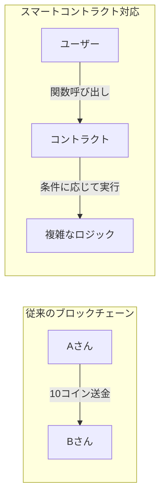
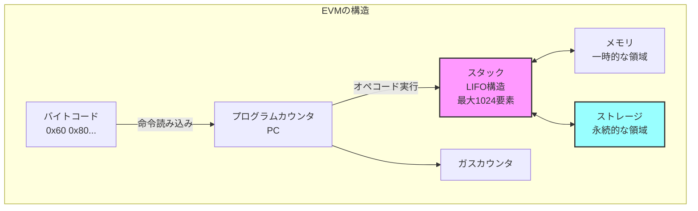

## EVM実装に向けた準備

第8章まででP2Pネットワークによるブロックチェインの基本的な実装が完成しました。第9章では、ブロックチェインの次の大きなステップとして、スマートコントラクトを実行できるEVM（Ethereum Virtual Machine）の実装に挑戦します。

EVMには、実行時に使用されるいくつかの主要なデータ領域があります。[Ethereum Yellow Paper](https://ethereum.github.io/yellowpaper/paper.pdf)。

- ストレージ (Storage): 各コントラクト（アカウント）に紐づく永続的なキー値ストアです。256ビットのキーと値のマッピングで表現され、トランザクション間で保存されます ([スマートコントラクトの紹介](https://docs.soliditylang.org/ja/latest/introduction-to-smart-contracts.html#))。コントラクトの状態変数はこのストレージに格納され、ブロックチェイン上の状態の一部として永続化されます。ストレージへの書き込み・読み出しはガスコストが高く、他のコントラクトのストレージには直接アクセスできません。

- メモリ (Memory): コントラクト実行中のみ有効な一時的なメモリ空間です。呼び出しごとにリセットされ、バイトアドレスでアクセス可能な1次元の配列として扱われます。読み書きは基本的に32バイト幅単位で行われ、アクセスしたアドレスが現在確保している範囲を超えると末尾に32バイトずつ拡張されます（拡張には追加のガスコストがかかります）。計算中の一時データや後述する戻り値の一時格納に利用されます。

- スタック (Stack): EVMの算術演算やオペコードのオペランド受け渡しに使われるLIFOスタックです。最大で1024要素の深さがあり、各要素は256ビットの値です。EVMはレジスタを持たず、全ての計算はスタック上で行われます。通常、オペコードはスタックの最上位要素（トップ）から必要な数の項目をPOPし、計算結果を再びスタックにPUSHします。スタックの深い位置に直接アクセスはできず、`DUP`（トップ16個までの要素を複製）や`SWAP`（トップと下位の一部を交換）命令で間接的に操作します。スタックオーバーフロー（積みすぎ）やスタックアンダーフローは実行失敗を招きます。

- プログラムカウンタ（PC）: 現在実行中のバイトコードの位置を指し示すものです。EVMは命令ポインタであるPCを開始時に0とセットし、各オペコードの実行後に進めていきます。条件付きジャンプ命令などによりPCを書き換えることで、ループや条件分岐も実現します。

- ガス: EVM上でコードを実行する際に必要となる手数料単位です。各オペコード毎に「この命令で必要なガス量」が定められています。また、スマートコントラクトを呼び出すトランザクションには上限となるガス量（ガスリミット）が指定されます。EVMは命令のたびに消費ガスを積算し、ガスリミットを超えるとアウトオブガスとなり実行が停止（通常は巻き戻し）されます。ガスは無限ループや過度な計算を防ぐ仕組みです。
EVMの命令（オペコード）は1バイト長で表現され、例えば`0x01`はADD（加算）、`0x60`はPUSH（スタックへ即値を積む）といったように定義されています。スマートコントラクトのバイトコード実行は常にコードの先頭（PC=0）から開始され、`STOP (0x00)`命令に到達するか実行が中断されるまで、命令を順次取り出して解釈・実行していきます。PUSH系命令だけは直後のバイト列をオペランド（値）として持つため可変長ですが、その他の命令は固定1バイトで、スタックから値を取り出し結果をスタックに戻すという挙動をとります。

以上がEVMの基本的な仕組みです。Ethereumクライアント（例：GethやNethermindなど）には各々EVM実装が内蔵されていますが、全てEthereumの公式仕様（イエローペーパー）に従う必要があります。このチュートリアルでは、このEVMの一部機能をZigで再現し、簡単なスマートコントラクトのバイトコードを実行してみます。

進め方については第9章を以下の3つのパートに分けて進めていきます。

### 第9章-1: EVMの基礎概念とデータ構造（本章）

- EVMとは何か、なぜ必要なのか
- スタックマシンの基本概念
- 256ビット整数型の実装
- 基本的なデータ構造（スタック、メモリ、ストレージ）

### 第9章-2: 基本的なオペコードの実装

- 算術演算（ADD、MUL、SUB等）
- スタック操作（PUSH、POP、DUP、SWAP）
- メモリ操作（MSTORE、MLOAD）
- 簡単なテストプログラムの実行

### 第9章-3: スマートコントラクトの実行

- 制御フロー（JUMP、JUMPI）
- 関数呼び出し（CALLDATALOAD、RETURN）
- 実際のSolidityコントラクトの実行
- ストレージの永続化

## なぜEVMが必要なのか

これまでのブロックチェインは「誰が誰にいくら送金したか」という単純な取引記録しか扱えませんでした。しかし、Ethereumが導入したスマートコントラクトにより、ブロックチェイン上でプログラムを実行できるようになりました。



EVMは、この「ブロックチェイン上でプログラムを実行する」ための仮想マシンです。

## EVMの基本構造

EVMはスタックベースの仮想マシンです。主な構成要素は次のとおりです。



### 主要コンポーネントの説明

1. スタック: 256ビット整数を最大1024個まで格納できるLIFO（Last In First Out）構造
2. メモリ: プログラム実行中のみ有効な一時的なバイト配列
3. ストレージ: コントラクトごとに永続化される256ビットのキー・値ストア
4. プログラムカウンタ（PC）: 現在実行中の命令の位置
5. ガス: 実行にかかるコストを管理するカウンタ

## この章で実装する内容

### 256ビット整数型（EVMu256）

Zigには標準で256ビット整数型がないため、独自に実装します。

```zig
/// EVM用の256ビット整数型
pub const EVMu256 = struct {
    hi: u128, // 上位128ビット
    lo: u128, // 下位128ビット

    /// ゼロ値を返す
    pub fn zero() EVMu256 {
        return EVMu256{ .hi = 0, .lo = 0 };
    }

    /// 加算
    pub fn add(self: EVMu256, other: EVMu256) EVMu256 {
        const result_lo = self.lo +% other.lo;
        const carry = if (result_lo < self.lo) 1 else 0;
        const result_hi = self.hi +% other.hi +% carry;
        return EVMu256{ .hi = result_hi, .lo = result_lo };
    }
};
```

### スタックの実装

固定サイズ配列を使い、push/popを配列インデックスの更新だけで処理することで各操作をO(1)時間で実行できるスタック実装です。

```zig
/// EVMスタック（最大1024要素）
pub const EvmStack = struct {
    data: [1024]EVMu256,
    top: usize,

    pub fn init() EvmStack {
        return EvmStack{
            .data = undefined,
            .top = 0,
        };
    }

    pub fn push(self: *EvmStack, value: EVMu256) !void {
        if (self.top >= 1024) return error.StackOverflow;
        self.data[self.top] = value;
        self.top += 1;
    }

    pub fn pop(self: *EvmStack) !EVMu256 {
        if (self.top == 0) return error.StackUnderflow;
        self.top -= 1;
        return self.data[self.top];
    }
};
```

### メモリとストレージ

動的に拡張可能なメモリと、ハッシュマップベースのストレージを次に示します。

```zig
/// EVMメモリ（動的拡張可能）
pub const EvmMemory = struct {
    data: std.ArrayList(u8),

    pub fn store(self: *EvmMemory, offset: usize, value: EVMu256) !void {
        // オフセットに32バイトのデータを書き込む
    }
};

/// EVMストレージ（永続的なキー・値ストア）
pub const EvmStorage = struct {
    data: std.AutoHashMap(EVMu256, EVMu256),

    pub fn store(self: *EvmStorage, key: EVMu256, value: EVMu256) !void {
        try self.data.put(key, value);
    }
};
```

## 次章へ向けて

本章でEVMの基本的なデータ構造を理解し、実装しました。次章（第9章-2）では、これらのデータ構造を使って実際のオペコードを実装し、簡単な計算プログラムを実行できるようにします。

最終的に第9章-3では、実際のSolidityで書かれたスマートコントラクトをコンパイルして実行できるEVMを完成させます。
