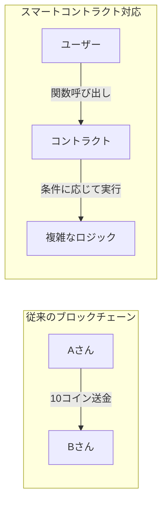
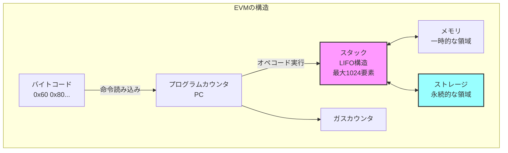
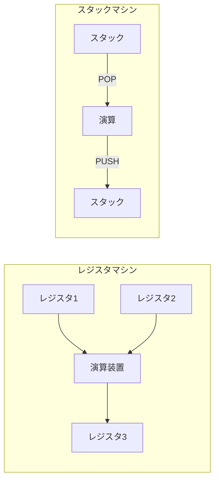
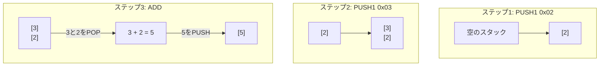

## Zigで簡易EVMバイトコードエンジンを実装し、Solidityスマートコントラクトを実行する

この章では、**Zig**プログラミング言語を用いてEthereum Virtual Machine (EVM)を実装します。

目標は以下の通りです。

- EVMの基本構造（スタック・メモリ・ストレージ）を理解する
- Zigでスタックベースの仮想マシンを構築する

## EVMとは

Ethereumブロックチェイン上でスマートコントラクトを実行するための仮想マシンです。これまでのブロックチェインは「誰が誰にいくら送金したか」という単純な取引記録しか扱えませんでした。しかし、Ethereumが導入したスマートコントラクトにより、ブロックチェイン上でプログラムを実行できるようになりました。



イーサリアムの各ノードはEVMを内部に持ち、ブロック内の取引に含まれるスマートコントラクトのコードをEVM上で実行することで、結果として世界状態（ワールドステート）を更新します。EVMは256ビット長のWord（32バイト）を基本単位とするスタックマシンであり、プログラム（バイトコード）を順次読み取り実行していきます。スマートコントラクトのコードはバイトコード（機械語に相当）でブロックチェイン上に保存され、EVMがこれを解釈・実行します。EVMは以下の主要コンポーネントで構成されています。



EVMには、実行時に使用されるいくつかの主要なデータ領域があります。[Ethereum Yellow Paper](https://ethereum.github.io/yellowpaper/paper.pdf)。

- ストレージ (Storage): 各コントラクト（アカウント）に紐づく永続的なkey-valueストアです。256ビットのキーと値のマッピングで表現され、トランザクション間で保存されます ([スマートコントラクトの紹介](https://docs.soliditylang.org/ja/latest/introduction-to-smart-contracts.html#))。コントラクトの状態変数はこのストレージに格納され、ブロックチェイン上の状態の一部として永続化されます。ストレージへの書き込み・読み出しはガスコストが高く、他のコントラクトのストレージには直接アクセスできません。

- メモリ (Memory): コントラクト実行中のみ有効な一時的なメモリ空間です。呼び出しごとにリセットされ、バイトアドレスでアクセス可能な1次元の配列として扱われます。読み書きは基本的に32バイト幅単位で行われ、末尾に向かって拡張されます（拡張にはガスコストが伴います）。計算中の一時データや後述する戻り値の一時格納に利用されます。

- スタック (Stack): EVMの算術演算やオペコードのオペランド受け渡しに使われるLIFOスタックです。最大で1024要素の深さがあり、各要素は256ビットの値です。EVMはレジスタを持たず、全ての計算はスタック上で行われます。通常、オペコードはスタックの最上位要素（トップ）から必要な数の項目をPOPし、計算結果を再びスタックにPUSHします。スタックの深い位置に直接アクセスはできず、`DUP`（トップ16個までの要素を複製）や`SWAP`（トップと下位の一部を交換）命令で間接的に操作します。スタックオーバーフロー（積みすぎ）やスタックアンダーフローは実行失敗を招きます。

- プログラムカウンタ（PC）: 現在実行中のバイトコードの位置を指し示すものです。EVMは**命令ポインタ**であるPCを開始時に0とセットし、各オペコードの実行後に進めていきます。条件付きジャンプ命令などによりPCを書き換えることで、ループや条件分岐も実現します。

- ガス: EVM上でコードを実行する際に必要となる手数料単位です。各オペコード毎に「この命令で必要なガス量」が定められています。また、スマートコントラクトを呼び出すトランザクションには上限となるガス量（ガスリミット）が指定されます。EVMは命令のたびに消費ガスを積算し、ガスリミットを超えると**アウトオブガス**となり実行が停止（通常は巻き戻し）されます。ガスは無限ループや過度な計算を防ぐ仕組みです。
EVMの命令（オペコード）は1バイト長で表現され、例えば`0x01`はADD（加算）、`0x60`はPUSH（スタックへ即値を積む）といったように定義されています。スマートコントラクトのバイトコード実行は常にコードの先頭（PC=0）から開始され、`STOP (0x00)`命令に到達するか実行が中断されるまで、命令を順次取り出して解釈・実行していきます。PUSH系命令だけは直後のバイト列をオペランド（値）として持つため可変長ですが、その他の命令は固定1バイトで、スタックから値を取り出し結果をスタックに戻すという挙動をとります。

以上がEVMの基本的な仕組みです。Ethereumクライアント（例：GethやNethermindなど）には各々EVM実装が内蔵されていますが、全てEthereumの公式仕様（イエローペーパー）に従う必要があります。このチュートリアルでは、このEVMの一部機能をZigで再現し、簡単なスマートコントラクトのバイトコードを実行してみます。

## ZigでEVMを実装する準備

開発環境の準備をします。

Solidityコンパイラの準備: Solidityのスマートコントラクトをバイトコードにコンパイルできるように、Solidity公式のコマンドラインコンパイラ`solc`を用意します。Solidityの開発環境が既にある場合はsolcコマンドが使えるはずです。インストールされていない場合、Ethereum公式サイトや各種ドキュメントに従ってインストールしてください（例：macOSならHomebrewで`brew install solidity`）。

Solidityコンパイラ`solc`を使うと、Solidityコードから各種出力を得ることができます ([Using the Compiler](https://docs.soliditylang.org/en/latest/using-the-compiler.html))。バイトコード（EVMが実行するバイナリ）を取得するには、以下のように`--bin`オプションを指定します。

まず、コンパイルするSolidityコードを用意します。以下のような簡単なコントラクトを`contract/SimpleAdder.sol`というファイル名で保存します。

```solidity
// SPDX-License-Identifier: MIT
pragma solidity ^0.8.0;

contract Adder {
    function add(uint256 a, uint256 b) public pure returns (uint256) {
        return a + b;
    }
}
```

次に、コントラクトをコンパイルしてバイトコードを取得します。以下のコマンドを実行してください。

```bash
solc --bin --abi contract/SimpleAdder.sol
```

それぞれのオプションの意味は以下の通りです。

- `--bin`: バイトコードを出力します。
- `--abi`: コントラクトのABI（Application Binary Interface）を出力します。ABIはコントラクトの関数やイベントのインタフェースを定義したものです。

上記コマンドを実行すると、コンパイル結果としてバイトコードとABI（Application Binary Interface）が表示されます。バイトコードは`0x`で始まる16進数の文字列で、EVMが実行する命令列です。
ABIは、コントラクトの関数やイベントのインタフェースを定義したものです。ABIは、コントラクトの関数を呼び出す際に必要な情報を提供します。具体的には、関数名、引数の型、戻り値の型などが含まれます。
EVMアセンブリコードは、EVMが実行する命令の一覧を示しています。これにより、EVMがどのようにバイトコードを解釈しているかを理解する手助けになります。

```bash
solc --bin  --abi contract/SimpleAdder.sol

======= contract/SimpleAdder.sol:Adder =======
Binary:
608060405234801561000f575f80fd5b506101a58061001d5f395ff3fe608060405234801561000f575f80fd5b5060043610610029575f3560e01c8063771602f71461002d575b5f80fd5b610047600480360381019061004291906100a9565b61005d565b60405161005491906100f6565b60405180910390f35b5f818361006a919061013c565b905092915050565b5f80fd5b5f819050919050565b61008881610076565b8114610092575f80fd5b50565b5f813590506100a38161007f565b92915050565b5f80604083850312156100bf576100be610072565b5b5f6100cc85828601610095565b92505060206100dd85828601610095565b9150509250929050565b6100f081610076565b82525050565b5f6020820190506101095f8301846100e7565b92915050565b7f4e487b71000000000000000000000000000000000000000000000000000000005f52601160045260245ffd5b5f61014682610076565b915061015183610076565b92508282019050808211156101695761016861010f565b5b9291505056fea2646970667358221220e478f9e62b837b6d95fa3abbc3c7eb6c02d17eb28b14607d07eb892ef9992db964736f6c63430008180033
Contract JSON ABI
[{"inputs":[{"internalType":"uint256","name":"a","type":"uint256"},{"internalType":"uint256","name":"b","type":"uint256"}],"name":"add","outputs":[{"internalType":"uint256","name":"","type":"uint256"}],"stateMutability":"pure","type":"function"}]
```

上記の出力例では、`Binary:` の下に表示されている16進数の文字列がEVMバイトコード（バイナリ）です。これはEVM上で実行されるスマートコントラクト本体となります。

`Contract JSON ABI` の部分は、コントラクトの関数や引数・戻り値の型情報をJSON形式で表現したものです。ABI（Application Binary Interface）は、外部からコントラクトの関数を呼び出す際に必要なインタフェース情報を提供します。

このバイナリとABIを使うことで、コントラクトのデプロイや関数呼び出しが可能になります。

`-o`オプションで出力先ディレクトリを指定すれば、コンパイル結果をファイルとして保存も可能です。

## 簡易EVMの実装

それでは、ZigでEVMのコアとなるバイトコード実行エンジンを実装してみましょう。EVMはスタックマシンですので、スタックやメモリ、ストレージを管理しつつ、バイトコード中のオペコードを読み取って解釈・実行するループを作ることになります。

## スタックマシンとは

スタックマシンは、演算をするためにスタック（LIFO: Last In First Out）データ構造を使用する計算モデルです。EVMがスタックマシンを採用した理由と、その動作原理について詳しく見ていきましょう。

### スタックマシンの基本概念

スタックマシンは、レジスタベースのマシンとは異なり、すべての演算をスタック上で行います。



LIFO（Last In First Out）の動作原理は以下のとおりです。

- 最後に追加された要素が最初に取り出される
- 積み木を上に積んでいくイメージ
- EVMでは最大1024個の要素を積むことができる

### EVMのスタックマシンとしての特徴

[Ethereum公式ドキュメント](https://ethereum.org/ja/developers/docs/evm/)によると、EVMは1024項目を含むスタックマシンとして実行されます。各項目は256ビットの単語で、これは256ビットの暗号（Keccak-256ハッシュやsecp256k1シグネチャなど）を使いやすいように選択されています。

EVMの実装には、以下のような特徴があります。

1. **スタックベースの実行モデル**
   - 最大1024個の256ビット項目を格納可能
   - LIFO（Last In First Out）方式で動作
   - 各オペコードはスタックから値を取り出し、結果をスタックに戻す

2. **決定的な実行**
   - EVMは決定的な仮想マシンとして設計されており、同じ入力に対して常に同じ出力を生成（[Ethereum Yellow Paper](https://ethereum.github.io/yellowpaper/paper.pdf)参照）
   - この性質はブロックチェインのコンセンサスメカニズムに不可欠

3. **スタックマシンの一般的な利点**（EVMでも当てはまる特性）
   - レジスタ管理が不要で、シンプルな実装を可能にする
   - オペランドの指定が暗黙的でコンパクトなバイトコード
   - 異なるハードウェアアーキテクチャ間での移植性

### EVMオペコードとは

[Ethereum公式ドキュメント](https://ethereum.org/ja/developers/docs/evm/)によると、コンパイルされたスマートコントラクトのバイトコードは、多数のEVMオペコードとして実行されます。オペコード（Operation Code）とは、EVMが理解できる基本的な命令のことです。

EVMのオペコードには、次のような2種類があります。

1. **標準的なスタック操作**
   - `ADD`、`SUB`（加算、減算）
   - `AND`、`OR`、`XOR`（ビット演算）
   - `PUSH`、`POP`（スタックへの値の追加・削除）

2. **ブロックチェイン固有の操作**
   - `ADDRESS`（現在のコントラクトのアドレスを取得）
   - `BALANCE`（アドレスの残高を取得）
   - `BLOCKHASH`（ブロックのハッシュを取得）

これらのオペコードがスタック上でデータを操作することで、スマートコントラクトが実行されます。

### EVMスタックマシンの動作例

簡単な計算「2 + 3」を実行する例を見てみます。先ほど説明したオペコードを使って、実際の計算過程を確認しましょう。

```text
バイトコード: 0x60 0x02 0x60 0x03 0x01

バイトコードの読み方:
- 0x60: PUSH1のオペコード（1バイトのデータをプッシュする命令）
- 0x02: プッシュする値（10進数の2）
- 0x60: 再びPUSH1のオペコード
- 0x03: プッシュする値（10進数の3）
- 0x01: ADDのオペコード（加算命令）

実行過程:
初期状態: スタックは空

1. PUSH1 0x02  (オペコード: 0x60、値: 0x02)
   → 10進数の2をスタックにプッシュ
   スタック: [2]

2. PUSH1 0x03  (オペコード: 0x60、値: 0x03)
   → 10進数の3をスタックにプッシュ
   スタック: [3, 2]  ← 3がトップ

3. ADD         (オペコード: 0x01)
   → スタックのトップ2つ（3と2）をポップし、加算結果をプッシュ
   スタック: [5]
```

図で表現すると以下のようになります。



### より複雑な例：(a + b) × c

```solidity
// Solidityコード: (10 + 20) × 3
uint result = (10 + 20) * 3;
```

EVMバイトコードでの実行例は以下のとおりです。

```text
PUSH1 0x0A    // 10をプッシュ
PUSH1 0x14    // 20をプッシュ
ADD           // 加算 → 30
PUSH1 0x03    // 3をプッシュ
MUL           // 乗算 → 90
```

スタックの変化は以下のとおりです。

```text
初期:     []
PUSH 10:  [10]
PUSH 20:  [20, 10]
ADD:      [30]         // 10 + 20 = 30
PUSH 3:   [3, 30]
MUL:      [90]         // 30 × 3 = 90
```

### スタック操作命令

EVMには、スタックを直接操作する特殊な命令もあります。

1. DUP（複製）命令

   ```text
   DUP1: スタックトップを複製
   [a, b, c] → [a, a, b, c]
   ```

2. SWAP（交換）命令

   ```text
   SWAP1: トップと2番目を交換
   [a, b, c] → [b, a, c]
   ```

3. POP（破棄）命令

   ```text
   POP: トップを破棄
   [a, b, c] → [b, c]
   ```

### スタックマシンの利点と制約

スタックマシンの利点と制約をまとめます。

スタックマシンの利点は以下の通りです。

- 実装がシンプルで検証しやすい
- メモリ効率が良い（レジスタ管理不要）
- 命令のエンコーディングがコンパクト
- 異なるハードウェア間での互換性が高い

制約は以下の通りです。

- スタックの深さ制限（最大1024要素）
- 深い位置の要素へのアクセスが困難
- 複雑な計算では多くのスタック操作が必要
- スタックオーバーフロー/アンダーフローの管理が必要

### Zigでの実装における注意点

Zigでスタックマシンを実装する際は、以下の点に注意します。

1. エラーハンドリング

   ```zig
   // スタックオーバーフローの検出
   if (self.sp >= 1024) {
       return error.StackOverflow;
   }
   ```

2. メモリ管理

   ```zig
   // 固定サイズ配列で実装
   data: [1024]EVMu256
   ```

3. 境界チェック

   ```zig
   // アンダーフローの防止
   if (self.sp == 0) {
       return error.StackUnderflow;
   }
   ```

このように、スタックマシンはシンプルながら強力な計算モデルであり、EVMの中核を成しています。次のセクションでは、このスタックマシンを使って実際のEVM命令を実装していきます。

### データ構造の定義

まず、EVMの実行に必要なデータを用意します。スタック、メモリ、ストレージ、プログラムカウンタ、ガスなどです。今回は各コンポーネントを明確に分離し、オブジェクト指向的な設計で実装します。

- 256ビット整数型 (u256): EVMの基本データ型です。Zigには組み込みの256ビット整数型がないため、2つの128ビット整数（上位128ビットと下位128ビット）を組み合わせた独自の構造体として実装します。加算・減算などの演算メソッドも提供します。
- スタック (EvmStack): 固定長配列（サイズ1024）で表現し、各要素を`u256`型とします。スタックポインタ（現在のスタック高さ）を別途管理し、プッシュ/ポップ操作を提供します。
- メモリ (EvmMemory): 動的に拡張可能な`std.ArrayList(u8)`で表現します。32バイト単位でデータを読み書きするメソッドを提供し、サイズを拡張します。
- ストレージ (EvmStorage): コントラクトの永続的なキー/値ストアです。シンプルな実装として、`std.AutoHashMap(u256, u256)`を使用し、キーと値の組を保持します。
- 実行コンテキスト (EvmContext): 上記のコンポーネントをまとめ、プログラムカウンタ、残りガス量、実行中のコード、呼び出しデータなどを含む実行環境を表現します。
- プログラムカウンタ (PC): 現在の命令位置を示すインデックスです。`usize`型（符号なしサイズ型）で0からバイトコード長-1まで動きます。
- ガス: 残り実行可能ガスを示すカウンタです。`usize`または十分大きい整数型で扱います。処理するごとに各命令のガス消費量を差し引き、0未満になったらアウトオブガスです。
- その他: 戻り値を格納する一時バッファや、実行終了フラグなどもあると便利です。例えば`RETURN`命令があった場合に、どのデータを返すかを記録しておきます。

では、これらを踏まえてZigコードを書いていきます。
まずEVMデータ構造の基本定義です。

## Zigで256ビット整数を実装する

EVMの特徴は、256ビット整数を基本データ型として使うことです。Zigには標準で256ビット整数型がないため、独自に実装します。

### なぜ256ビットなのか

EVMが256ビット整数を採用した理由は以下の通りです。

1. 暗号学的な要件
   - Ethereumのアドレスは160ビット（20バイト）
   - Keccak-256ハッシュ値は256ビット（32バイト）
   - これらを1つの整数型で扱える

2. 金融計算の精度
   - 10^77まで表現可能（2^256 ≈ 1.15 × 10^77）
   - Wei単位（10^-18 ETH）でも十分な精度を確保
   - オーバーフローのリスクを最小化

3. 実装
   - 32バイト = 256ビットはメモリアライメントに適している
   - 多くのCPUが64ビット演算をサポート → 4回の演算で処理可能

### なぜ128ビット×2で実装するのか

256ビット整数を実装する方法は主に3つありますが、Zigでは`u128`を2つ組み合わせた方法が最も適しています。

1. **u64×4**: 最も汎用的だが、キャリー処理が複雑
2. **u128×2**: Zigがu128をサポートしているため効率的
3. **単一のu256**: Zigには存在しない

```text
256ビット整数の構造：
┌─────────────────────┬─────────────────────┐
│    上位128ビット      │    下位128ビット    │
│      (hi)           │      (lo)           │
└─────────────────────┴─────────────────────┘
```

evm_types.zigを新規に作成し、以下のように記述します。

### EVMu256型の実装

```zig
const std = @import("std");

/// EVM用の256ビット整数型
/// 上位128ビットと下位128ビットに分けて管理
pub const EVMu256 = struct {
    hi: u128, // 上位128ビット
    lo: u128, // 下位128ビット

    /// ゼロ値を作成
    pub fn zero() EVMu256 {
        return EVMu256{ .hi = 0, .lo = 0 };
    }

    /// 1を作成
    pub fn one() EVMu256 {
        return EVMu256{ .hi = 0, .lo = 1 };
    }

    /// u64から変換
    pub fn fromU64(value: u64) EVMu256 {
        return EVMu256{ .hi = 0, .lo = value };
    }

    /// 加算（オーバーフローはラップアラウンド）
    pub fn add(self: EVMu256, other: EVMu256) EVMu256 {
        // 下位128ビットの加算
        const result_lo = self.lo +% other.lo;
        // キャリー（桁上がり）の計算
        const carry = if (result_lo < self.lo) 1 else 0;
        // 上位128ビットの加算（キャリーを含む）
        const result_hi = self.hi +% other.hi +% carry;

        return EVMu256{ .hi = result_hi, .lo = result_lo };
    }

    /// 減算（アンダーフローはラップアラウンド）
    pub fn sub(self: EVMu256, other: EVMu256) EVMu256 {
        // 下位128ビットの減算
        const result_lo = self.lo -% other.lo;
        // ボロー（桁借り）の計算
        const borrow = if (self.lo < other.lo) 1 else 0;
        // 上位128ビットの減算（ボローを含む）
        const result_hi = self.hi -% other.hi -% borrow;

        return EVMu256{ .hi = result_hi, .lo = result_lo };
    }

    /// 等価比較
    pub fn eq(self: EVMu256, other: EVMu256) bool {
        return self.hi == other.hi and self.lo == other.lo;
    }

    /// ゼロかどうかの判定
    pub fn isZero(self: EVMu256) bool {
        return self.hi == 0 and self.lo == 0;
    }

    /// バイト配列への変換（ビッグエンディアン）
    pub fn toBytes(self: EVMu256) [32]u8 {
        var bytes: [32]u8 = undefined;

        // 上位128ビットをバイト配列に変換
        for (0..16) |i| {
            const shift = @as(u7, @intCast((15 - i) * 8));
            bytes[i] = @truncate(self.hi >> shift);
        }

        // 下位128ビットをバイト配列に変換
        for (0..16) |i| {
            const shift = @as(u7, @intCast((15 - i) * 8));
            bytes[i + 16] = @truncate(self.lo >> shift);
        }

        return bytes;
    }

    /// バイト配列からの変換（ビッグエンディアン）
    pub fn fromBytes(bytes: []const u8) EVMu256 {
        var hi: u128 = 0;
        var lo: u128 = 0;

        const len = @min(bytes.len, 32);
        const offset = if (len < 32) 32 - len else 0;

        for (bytes, 0..) |byte, i| {
            const pos = offset + i;
            if (pos < 16) {
                const shift = @as(u7, @intCast((15 - pos) * 8));
                hi |= @as(u128, byte) << shift;
            } else if (pos < 32) {
                const shift = @as(u7, @intCast((31 - pos) * 8));
                lo |= @as(u128, byte) << shift;
            }
        }

        return EVMu256{ .hi = hi, .lo = lo };
    }
};
```

## スタックの実装

EVMのスタックは最大1024要素を格納できるLIFO（Last In First Out）構造です。

### エラーハンドリングについて

EVMのスタック操作では、以下の2つのエラーが発生します。

1. **StackOverflow**: スタックに1024個を超える要素をプッシュしようとした場合
2. **StackUnderflow**: 空のスタックからポップしようとした場合

これらのエラーは、スマートコントラクトの実行を即座に停止させ、トランザクション全体を失敗させます。
Zigのエラーハンドリング機構（`!`と`error`）を使って、これらを適切に処理します。

```zig
/// EVMスタック
pub const EvmStack = struct {
    data: [1024]EVMu256,  // 固定サイズ配列
    top: usize,           // スタックトップの位置

    /// 新しいスタックを作成
    pub fn init() EvmStack {
        return EvmStack{
            .data = undefined,  // 初期化は不要
            .top = 0,
        };
    }

    /// 値をプッシュ
    pub fn push(self: *EvmStack, value: EVMu256) !void {
        if (self.top >= 1024) {
            return error.StackOverflow;
        }
        self.data[self.top] = value;
        self.top += 1;
    }

    /// 値をポップ
    pub fn pop(self: *EvmStack) !EVMu256 {
        if (self.top == 0) {
            return error.StackUnderflow;
        }
        self.top -= 1;
        return self.data[self.top];
    }

    /// スタックの深さを取得
    pub fn depth(self: *const EvmStack) usize {
        return self.top;
    }

    /// n番目の要素を複製（DUP命令用）
    pub fn dup(self: *EvmStack, n: usize) !void {
        if (self.top < n) {
            return error.StackUnderflow;
        }
        if (self.top >= 1024) {
            return error.StackOverflow;
        }

        const value = self.data[self.top - n];
        self.data[self.top] = value;
        self.top += 1;
    }

    /// n番目の要素と交換（SWAP命令用）
    pub fn swap(self: *EvmStack, n: usize) !void {
        if (self.top < n + 1) {
            return error.StackUnderflow;
        }

        const temp = self.data[self.top - 1];
        self.data[self.top - 1] = self.data[self.top - n - 1];
        self.data[self.top - n - 1] = temp;
    }
};
```

コード全体は次のようになります。

```evm_types.zig
//! EVMデータ構造定義
//!
//! このモジュールはEthereum Virtual Machine (EVM)の実行に必要な
//! データ構造を定義します。スマートコントラクト実行環境に
//! 必要なスタック、メモリ、ストレージなどの構造体を含みます。

const std = @import("std");

/// 256ビット整数型（EVMの基本データ型）
/// u128の2つの要素で256ビットを表現
pub const EVMu256 = struct {
    // 256ビットを2つのu128値で表現（上位ビットと下位ビット）
    hi: u128, // 上位128ビット
    lo: u128, // 下位128ビット

    /// ゼロ値の作成
    pub fn zero() EVMu256 {
        return EVMu256{ .hi = 0, .lo = 0 };
    }

    /// u64値からEVMu256を作成
    pub fn fromU64(value: u64) EVMu256 {
        return EVMu256{ .hi = 0, .lo = value };
    }

    /// 加算演算
    pub fn add(self: EVMu256, other: EVMu256) EVMu256 {
        var result = EVMu256{ .hi = self.hi, .lo = self.lo };
        // 修正: Zigの最新バージョンに合わせて@addWithOverflow呼び出しを変更
        var overflow: u1 = 0;
        result.lo, overflow = @addWithOverflow(result.lo, other.lo);
        // オーバーフローした場合は上位ビットに1を加算
        result.hi = result.hi + other.hi + overflow;
        return result;
    }

    /// 減算演算
    pub fn sub(self: EVMu256, other: EVMu256) EVMu256 {
        var result = EVMu256{ .hi = self.hi, .lo = self.lo };
        // 修正: Zigの最新バージョンに合わせて@subWithOverflow呼び出しを変更
        var underflow: u1 = 0;
        result.lo, underflow = @subWithOverflow(result.lo, other.lo);
        // アンダーフローした場合は上位ビットから1を引く
        result.hi = result.hi - other.hi - underflow;
        return result;
    }

    /// 乗算演算（シンプル実装 - 実際には最適化が必要）
    pub fn mul(self: EVMu256, other: EVMu256) EVMu256 {
        // 簡易実装: 下位ビットのみの乗算
        // 注：完全な256ビット乗算は複雑なため、ここでは省略
        if (self.hi == 0 and other.hi == 0) {
            const result_lo = self.lo * other.lo;
            // シフト演算で上位ビットを取得
            // 128ビットシフトを避けるために、別の方法で計算
            // 注: u128に入らない上位ビットは無視される
            const result_hi = @as(u128, 0); // 簡略化した実装では上位ビットは0として扱う
            return EVMu256{ .hi = result_hi, .lo = result_lo };
        } else {
            // 簡易実装のため、上位ビットがある場合は詳細計算を省略
            return EVMu256{ .hi = 0, .lo = 0 };
        }
    }

    /// 等価比較
    pub fn eql(self: EVMu256, other: EVMu256) bool {
        return self.hi == other.hi and self.lo == other.lo;
    }

    /// フォーマット出力用メソッド
    /// std.fmt.Formatインターフェースに準拠
    pub fn format(
        self: EVMu256,
        comptime fmt: []const u8,
        options: std.fmt.FormatOptions,
        writer: anytype,
    ) !void {
        // options is used in some format cases below

        if (fmt.len == 0 or fmt[0] == 'd') {
            // 10進数表示
            if (self.hi == 0) {
                // 上位ビットが0の場合は単純に下位ビットを表示
                try std.fmt.formatInt(self.lo, 10, .lower, options, writer);
            } else {
                // 本来は256ビット数値を正確に10進変換する必要があるが、簡易表示
                try writer.writeAll("0x");
                try std.fmt.formatInt(self.hi, 16, .lower, .{}, writer);
                try writer.writeByte('_');
                try std.fmt.formatInt(self.lo, 16, .lower, .{}, writer);
            }
        } else if (fmt[0] == 'x' or fmt[0] == 'X') {
            // 16進数表示
            const case: std.fmt.Case = if (fmt[0] == 'X') .upper else .lower;
            try writer.writeAll("0x");

            // 上位ビットが0でなければ表示
            if (self.hi != 0) {
                try std.fmt.formatInt(self.hi, 16, case, .{ .fill = '0', .width = 32 }, writer);
            }

            try std.fmt.formatInt(self.lo, 16, case, .{ .fill = '0', .width = 32 }, writer);
        } else {
            // 不明なフォーマット指定子の場合はデフォルトで16進表示
            try writer.writeAll("0x");
            if (self.hi != 0) {
                try std.fmt.formatInt(self.hi, 16, .lower, .{}, writer);
                try writer.writeByte('_');
            }
            try std.fmt.formatInt(self.lo, 16, .lower, .{}, writer);
        }
    }
};

/// EVMアドレスクラス（20バイト/160ビットのEthereumアドレス）
pub const EVMAddress = struct {
    /// アドレスデータ（20バイト固定長）
    data: [20]u8,

    /// ゼロアドレスを作成
    pub fn zero() EVMAddress {
        return EVMAddress{ .data = [_]u8{0} ** 20 };
    }

    /// バイト配列からアドレスを作成
    pub fn fromBytes(bytes: []const u8) !EVMAddress {
        if (bytes.len != 20) {
            return error.InvalidAddressLength;
        }
        var addr = EVMAddress{ .data = undefined };
        @memcpy(&addr.data, bytes);
        return addr;
    }

    /// 16進数文字列からアドレスを作成（"0x"プレフィックスは省略可能）
    pub fn fromHexString(hex_str: []const u8) !EVMAddress {
        // 先頭の"0x"を取り除く
        var offset: usize = 0;
        if (hex_str.len >= 2 and hex_str[0] == '0' and (hex_str[1] == 'x' or hex_str[1] == 'X')) {
            offset = 2;
        }

        // 期待される長さをチェック (20バイト = 40文字 + オプションの"0x")
        if (hex_str.len - offset != 40) {
            return error.InvalidAddressLength;
        }

        var addr = EVMAddress{ .data = undefined };

        // 16進数文字列をバイト配列に変換
        var i: usize = 0;
        while (i < 20) : (i += 1) {
            const high = try std.fmt.charToDigit(hex_str[offset + i * 2], 16);
            const low = try std.fmt.charToDigit(hex_str[offset + i * 2 + 1], 16);
            addr.data[i] = @as(u8, high << 4) | @as(u8, low);
        }

        return addr;
    }

    /// アドレスを16進数文字列に変換（0xプレフィックス付き）
    pub fn toHexString(self: EVMAddress, allocator: std.mem.Allocator) ![]u8 {
        // "0x" + 20バイト*2文字 + null終端の領域を確保
        var result = try allocator.alloc(u8, 2 + 40);
        result[0] = '0';
        result[1] = 'x';

        // 各バイトを16進数に変換
        for (self.data, 0..) |byte, i| {
            const high = std.fmt.digitToChar(byte >> 4, .lower);
            const low = std.fmt.digitToChar(byte & 0xF, .lower);
            result[2 + i * 2] = high;
            result[2 + i * 2 + 1] = low;
        }

        return result;
    }

    /// EVMu256からアドレスへ変換（下位20バイトを使用）
    pub fn fromEVMu256(value: EVMu256) EVMAddress {
        var addr = EVMAddress{ .data = undefined };

        // 下位16バイトを取り出す（u128の下位部分から）
        const lo_bytes = std.mem.asBytes(&value.lo);

        // ほとんどのアーキテクチャはリトルエンディアンなので、バイト順を調整
        var i: usize = 0;
        while (i < 16) : (i += 1) {
            // u128(16バイト)の最後の4バイトは使わない
            if (i < 12) {
                addr.data[i + 8] = lo_bytes[15 - i]; // 下位バイトから順に20バイトのアドレスに入れる
            }
        }

        // 上位4バイトを取り出す（u128の上位部分の最下位バイトから）
        const hi_bytes = std.mem.asBytes(&value.hi);
        i = 0;
        while (i < 4) : (i += 1) {
            addr.data[i] = hi_bytes[15 - i]; // 最下位4バイトを使用
        }

        return addr;
    }

    /// 等価比較
    pub fn eql(self: EVMAddress, other: EVMAddress) bool {
        for (self.data, other.data) |a, b| {
            if (a != b) return false;
        }
        return true;
    }

    /// チェックサム付きアドレスを取得（EIP-55準拠）
    pub fn toChecksumAddress(self: EVMAddress, allocator: std.mem.Allocator) ![]u8 {
        // アドレスの16進表現（0xなし）を取得
        var hex_addr = try allocator.alloc(u8, 40);
        defer allocator.free(hex_addr);

        for (self.data, 0..) |byte, i| {
            const high = std.fmt.digitToChar(byte >> 4, .lower);
            const low = std.fmt.digitToChar(byte & 0xF, .lower);
            hex_addr[i * 2] = high;
            hex_addr[i * 2 + 1] = low;
        }

        // アドレスのKeccak-256ハッシュを計算
        // 注：完全な実装にするためには、適切なKeccakライブラリが必要です
        // この実装はシンプル化のため、実際のハッシュ計算は省略しています

        // 結果文字列（0xプレフィックス付き）
        var result = try allocator.alloc(u8, 42);
        result[0] = '0';
        result[1] = 'x';

        // この実装では単純にすべて小文字に
        // 実際のEIP-55実装ではハッシュ値に基づき大文字/小文字を決定する
        @memcpy(result[2..], hex_addr);

        return result;
    }
};

/// EVMスタック（1024要素まで格納可能）
pub const EvmStack = struct {
    /// スタックデータ（最大1024要素）
    data: [1024]EVMu256,
    /// スタックポインタ（次に積むインデックス）
    sp: usize,

    /// 新しい空のスタックを作成
    pub fn init() EvmStack {
        return EvmStack{
            .data = undefined,
            .sp = 0,
        };
    }

    /// スタックに値をプッシュ
    pub fn push(self: *EvmStack, value: EVMu256) !void {
        if (self.sp >= 1024) {
            return error.StackOverflow;
        }
        self.data[self.sp] = value;
        self.sp += 1;
    }

    /// スタックから値をポップ
    pub fn pop(self: *EvmStack) !EVMu256 {
        if (self.sp == 0) {
            return error.StackUnderflow;
        }
        self.sp -= 1;
        return self.data[self.sp];
    }

    /// スタックの深さを取得
    pub fn depth(self: *const EvmStack) usize {
        return self.sp;
    }
};

/// EVMメモリ（動的に拡張可能なバイト配列）
pub const EvmMemory = struct {
    /// メモリデータ（初期サイズは1024バイト）
    data: std.ArrayList(u8),

    /// 新しいEVMメモリを初期化
    pub fn init(allocator: std.mem.Allocator) EvmMemory {
        // メモリリークを避けるためにconst修飾子を使用
        const memory = std.ArrayList(u8).init(allocator);
        return EvmMemory{
            .data = memory,
        };
    }

    /// メモリを必要に応じて拡張
    pub fn ensureSize(self: *EvmMemory, size: usize) !void {
        if (size > self.data.items.len) {
            // サイズを32バイト単位に切り上げて拡張
            const new_size = ((size + 31) / 32) * 32;
            try self.data.resize(new_size);
            // 拡張部分を0で初期化
            var i = self.data.items.len;
            while (i < new_size) : (i += 1) {
                self.data.items[i] = 0;
            }
        }
    }

    /// メモリから32バイト（256ビット）読み込み
    pub fn load32(self: *EvmMemory, offset: usize) !EVMu256 {
        try self.ensureSize(offset + 32);
        var result = EVMu256.zero();

        // 上位128ビット（先頭16バイト）
        var hi: u128 = 0;
        for (0..16) |i| {
            const byte_val = self.data.items[offset + i];
            const shift_amount = (15 - i) * 8;
            hi |= @as(u128, byte_val) << @intCast(shift_amount);
        }

        // 下位128ビット（後半16バイト）
        var lo: u128 = 0;
        for (0..16) |i| {
            const byte_val = self.data.items[offset + 16 + i];
            const shift_amount = (15 - i) * 8;
            lo |= @as(u128, byte_val) << @intCast(shift_amount);
        }

        result.hi = hi;
        result.lo = lo;
        return result;
    }

    /// メモリに32バイト（256ビット）書き込み
    pub fn store32(self: *EvmMemory, offset: usize, value: EVMu256) !void {
        try self.ensureSize(offset + 32);

        // 上位128ビットをバイト単位で書き込み
        const hi = value.hi;
        var i: usize = 0;
        while (i < 16) : (i += 1) {
            const shift_amount = (15 - i) * 8;
            const byte_val = @as(u8, @truncate(hi >> @intCast(shift_amount)));
            self.data.items[offset + i] = byte_val;
        }

        // 下位128ビットをバイト単位で書き込み
        const lo = value.lo;
        i = 0;
        while (i < 16) : (i += 1) {
            const shift_amount = (15 - i) * 8;
            const byte_val = @as(u8, @truncate(lo >> @intCast(shift_amount)));
            self.data.items[offset + 16 + i] = byte_val;
        }
    }

    /// 解放処理
    pub fn deinit(self: *EvmMemory) void {
        self.data.deinit();
    }
};

/// EVMストレージ（永続的なキー/バリューストア）
pub const EvmStorage = struct {
    /// ストレージデータ（キー: EVMu256, 値: EVMu256のマップ）
    data: std.AutoHashMap(EVMu256, EVMu256),

    /// 新しいストレージを初期化
    pub fn init(allocator: std.mem.Allocator) EvmStorage {
        return EvmStorage{
            .data = std.AutoHashMap(EVMu256, EVMu256).init(allocator),
        };
    }

    /// ストレージから値を読み込み
    pub fn load(self: *EvmStorage, key: EVMu256) EVMu256 {
        return self.data.get(key) orelse EVMu256.zero();
    }

    /// ストレージに値を書き込み
    pub fn store(self: *EvmStorage, key: EVMu256, value: EVMu256) !void {
        try self.data.put(key, value);
    }

    /// 解放処理
    pub fn deinit(self: *EvmStorage) void {
        self.data.deinit();
    }
};

/// EVM実行コンテキスト（実行状態を保持）
pub const EvmContext = struct {
    /// プログラムカウンタ（現在実行中のコード位置）
    pc: usize,
    /// 残りガス量
    gas: usize,
    /// 実行中のバイトコード
    code: []const u8,
    /// 呼び出しデータ（コントラクト呼び出し時の引数）
    calldata: []const u8,
    /// 戻り値データ
    returndata: std.ArrayList(u8),
    /// スタック
    stack: EvmStack,
    /// メモリ
    memory: EvmMemory,
    /// ストレージ
    storage: EvmStorage,
    /// 呼び出し深度（再帰呼び出し用）
    depth: u8,
    /// 実行終了フラグ
    stopped: bool,
    /// エラー発生時のメッセージ
    error_msg: ?[]const u8,

    /// 新しいEVM実行コンテキストを初期化
    pub fn init(allocator: std.mem.Allocator, code: []const u8, calldata: []const u8) EvmContext {
        return EvmContext{
            .pc = 0,
            .gas = 10_000_000, // 初期ガス量（適宜調整）
            .code = code,
            .calldata = calldata,
            .returndata = std.ArrayList(u8).init(allocator),
            .stack = EvmStack.init(),
            .memory = EvmMemory.init(allocator),
            .storage = EvmStorage.init(allocator),
            .depth = 0,
            .stopped = false,
            .error_msg = null,
        };
    }

    /// リソース解放
    pub fn deinit(self: *EvmContext) void {
        self.returndata.deinit();
        self.memory.deinit();
        self.storage.deinit();
    }
};
```
