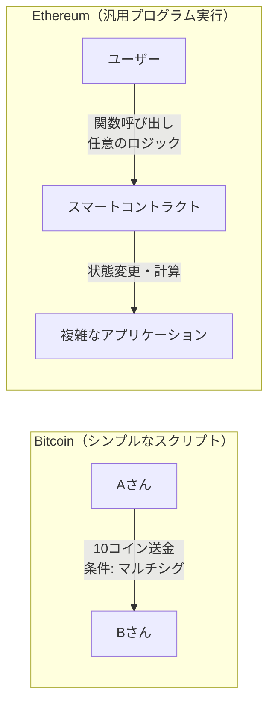
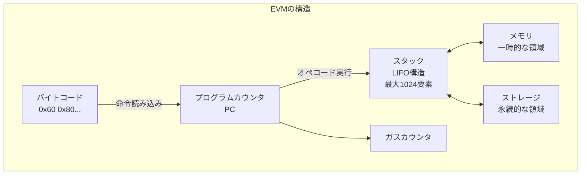
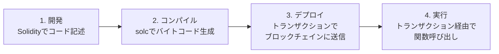
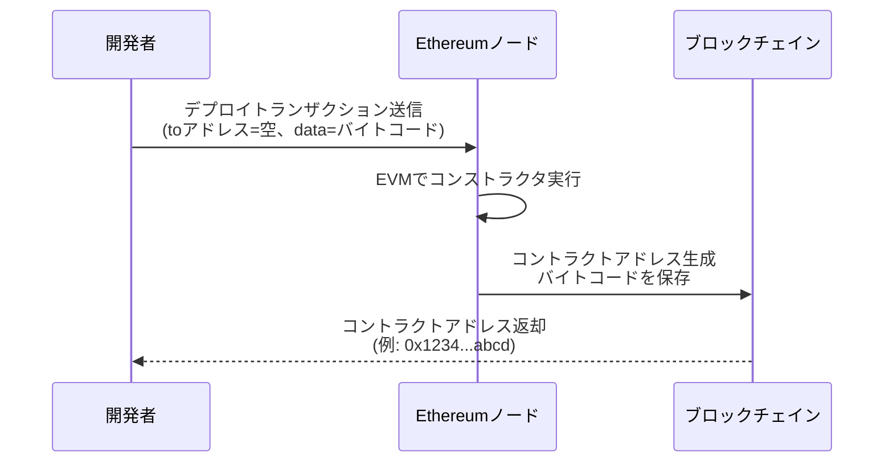
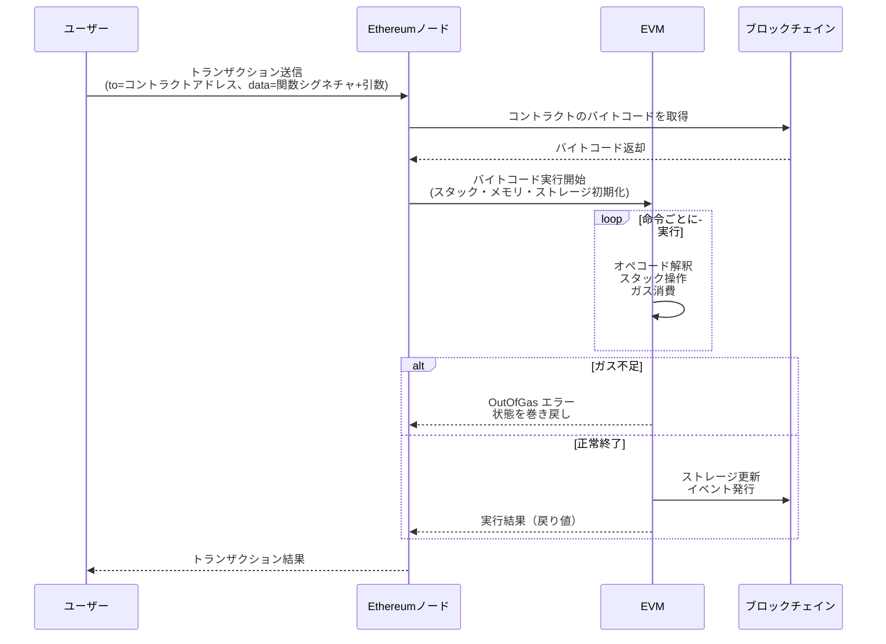
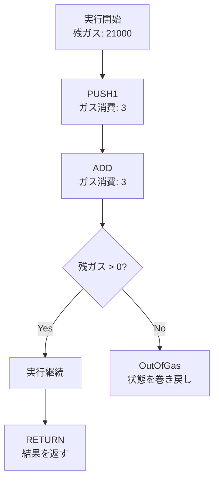
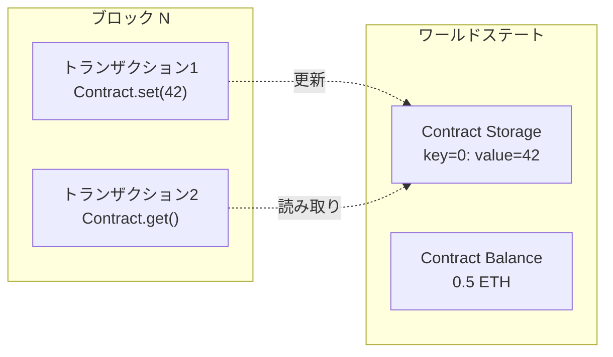

## EVM実装の土台となる256ビット整数型を作る

この章では、Ethereum Virtual Machine (EVM)の値を表す `EVMu256` をZigで実装します。スタック、メモリ、オペコード実行エンジンは第10章で組み立てます。

この章の目標は次のとおりです。

- EVMが256ビット値を使う理由を理解する
- 2つの`u128`から`EVMu256`を構成する
- 加算、減算、比較、バイト列変換をテストする

```text
対象パス:   book-work/chapter9/build.zig、build.zig.zon、src/evm_types.zig、src/root.zig、src/main.zig
対応見本:   references/chapter9/（実装を終えるまでは開かない）
開始地点:   ch08-sec03-relay-blockの受け入れ確認が成功した状態
今回の変更: P2P編を保存したまま、EVMu256だけを扱う独立した章スナップショットを新規作成
テスト:     zig fmt --check . && zig build test && zig build
実行:       zig build run
期待結果:   キャリーと32バイト往復のテストが通り、150、50、false、trueが表示される
```

## 第8章から第9章へ進む

第8章までのP2Pノードは、`references/chapter8`に対応するチェックポイントとして残します。第9章では、まだEVMをP2Pノードへ統合しません。完成済みのEVMコードを混ぜず、値表現だけを独立して検証できるように、同じリポジトリの`book-work/chapter9`へ新しいZigプロジェクトを作ります。

まず第8章の受け入れ確認を終えてください。

```bash
cd "$(git rev-parse --show-toplevel)"
sh references/chapter8/scripts/acceptance.sh
```

最後に`P2P_ACCEPTANCE PASS`と表示されたら、そのままリポジトリルートで作業ディレクトリを作ります。`references/chapter9`や`references/EVMchapter`は完成見本なので、ここではコピーしません。

```bash
mkdir -p book-work/chapter9/src
cd book-work/chapter9
```

この章で作るファイルは次の5つです。以降のコードブロックを、示したパスへそのまま配置します。

```text
book-work/chapter9/
├── build.zig
├── build.zig.zon
└── src/
    ├── evm_types.zig
    ├── main.zig
    └── root.zig
```

すでにZig 0.14.0を利用できる場合は、`book-work/chapter9`で`zig init`を実行して生成された3ファイルを、後述のコードで置き換えても構いません。本文にはビルドファイルを含む全内容を掲載するため、`zig init`や完成見本を参照しなくても同じスナップショットを作れます。

## スマートコントラクトとは

まず「スマートコントラクト」という用語について理解しましょう。「スマート」という言葉から「賢い」「高度なAI」のような印象を受けますが、実際にはブロックチェイン上で自動実行されるプログラムのことです。

「スマート」と呼ばれる理由は、人間の介入なしに条件が満たされたら自動的に実行されるという特性にあります。例えば、「Aさんが10ETHを送金したら、自動的にBさんにトークンを発行する」といったルールをコードとして記述しておけば、条件を満たした瞬間に自動実行されます。

従来の契約では、契約書に書かれた条件が満たされても、人間が手動で実行する必要がありました。スマートコントラクトは、この実行プロセスをコード化し、ブロックチェイン上で自動化したものです。AIのように「賢く判断する」わけではなく、あらかじめ決められたルール通りに動く、普通のプログラムです。

### ブロックチェイン実装の重要性

ここで重要なのは、「自動実行するプログラム」なら中央サーバーでも実現できるのに、なぜわざわざブロックチェイン上で実装するのかという点です。実装方法の違いこそが、スマートコントラクトの本質的な価値を生み出します。

#### 中央サーバー実装との比較

従来の中央サーバー上の自動実行プログラムとの違いを見てみましょう。

| 特性 | 中央サーバー実装 | 十分に分散し検証されたブロックチェインが目指す性質 |
|------|---------------|------------------|
| 改ざん耐性 | 運営者が変更できる | 合意済み履歴の変更を、多数の検証者と暗号学的検証によって難しくする |
| 透明性 | コードを非公開にできる | 公開されたコードと状態遷移を参加者が検証できる |
| 信頼 | 運営者の権限と運用を信頼する | 運営者だけでなく、プロトコル、実装、検証者集合などの前提へ信頼を分散する |
| 検閲耐性 | 運営者が実行を停止できる | 単一主体による停止を難しくできるが、停止不能が保証されるわけではない |
| 単一障害点 | 単一サーバーの障害で停止し得る | 複数ノードが稼働していれば処理を継続できる設計にできる |

#### 具体例：オンラインゲームのアイテム販売

中央サーバー実装の場合。

- 運営会社が「レアアイテムを100個限定販売」と宣言
- しかし、運営は裏で追加発行できる
- ユーザーは運営を信頼するしかない
- サービス終了でアイテムが消える可能性

ブロックチェイン実装の場合。

- スマートコントラクトで「100個のみ発行可能」とコード化
- 管理者だけが勝手に追加発行できないよう、権限と更新経路をコントラクトで制限できる
- 公開されたコード、デプロイ済みbytecode、状態を照合して100個制限を検証できる
- 台帳と検証可能な状態が複数ノードに保存されるため、単一サービスの終了へ依存しにくくできる

この違いがスマートコントラクトを使う理由の1つです。ただし、ブロックチェインへ載せるだけで改ざん不能や無停止になるわけではありません。権限設計、合意形成、ノードの分散、クライアント実装、利用者が検証する情報まで含めて性質が決まります。本書の学習ノードはhashとPoWによる内容検証までは実装しますが、署名、送信者認可、アカウントnonce、本格的なフォーク選択やファイナリティは実装しません。公開ネットワーク向けの保証ではないことを、第14章でもう一度確認します。

## EVMとは

Ethereumブロックチェイン上でスマートコントラクト（ブロックチェイン上の自動実行プログラム）を実行するための仮想マシンです。

Bitcoinには条件付きトランザクションを実現するScriptという簡易的なスクリプト言語がありましたが、[意図的にチューリング完全ではない設計](https://en.bitcoin.it/wiki/Script)となっており、ループが存在しません。これはおそらく無限ループによるDoS攻撃を防ぎ、すべてのスクリプトが確実に終了することを保証するためと考えられます([参考: Bitcoin Stack Exchange](https://bitcoin.stackexchange.com/questions/25427/the-bitcoin-scripting-system-is-purposefully-not-turing-complete-why))。

一方、Ethereumは、チューリング完全（任意の計算が可能）な言語でより複雑なロジックを記述できるスマートコントラクトを導入し、ブロックチェイン上で汎用的なプログラムを実行できるようにしました。

```text
チューリング完全（Turing Complete）とは、理論的にどんな計算でも可能な能力を持つことを意味します。具体的には以下の要素を含みます。

- ループ（繰り返し処理） - while、forなどの反復処理が可能
- 条件分岐 - if/elseなどの条件に応じた処理の切り替え
- 無制限のメモリアクセス - 必要なだけメモリを使用できる
- 関数呼び出し - 再帰を含む任意の関数呼び出しが可能

Bitcoin Scriptは意図的にチューリング不完全な設計となっており、ループが禁止されています。これはセキュリティ（無限ループによるDoS攻撃の防止）を重視した設計です。一方、EVMはチューリング完全ですが、ガスメカニズムによって実行時間を制限し、無限ループを防いでいます。
```


```mermaid
graph LR
    subgraph "Bitcoin（シンプルなスクリプト）"
        A[Aさん] -->|10コイン送金<br/>条件: マルチシグ| B[Bさん]
    end

    subgraph "Ethereum（汎用プログラム実行）"
        C[ユーザー] -->|関数呼び出し<br/>任意のロジック| D[スマートコントラクト]
        D -->|状態変更・計算| E[複雑なアプリケーション]
    end
```

### EVMの役割と動作

Ethereumの各ノードは内部にEVMを持っています。ブロック内のトランザクションがスマートコントラクトの実行を指示している場合、EVMがそのコードを実行し、その結果としてブロックチェイン全体の状態（ワールドステートと呼ばれる）を更新します。ワールドステートには、すべてのアカウントの残高やスマートコントラクトの保存データなどが含まれます。

スマートコントラクトのコードは、人間が読めるSolidityなどの高級言語で書かれた後、バイトコードと呼ばれる機械語へ変換されます。このバイトコードがブロックチェイン上へ保存され、EVMはこれを1命令ずつ読み取って実行します。

EVMはスタックマシンという方式で動作します。スタックマシンとは、データを「スタック」という後入れ先出し（LIFO）の構造で管理し、各命令の処理時にスタックからデータを取り出したり、結果を積んだりする仕組みです。また、EVMは256ビット（32バイト）を1つの基本単位（Word）として扱います。これは暗号学的な計算やEthereumのアドレス体系に適した設計です。

このような仕組みを実現するため、EVMは次のような主要コンポーネントで構成されています。


```mermaid
graph TD
    subgraph "EVMの構造"
        PC[プログラムカウンタ<br/>PC]
        Code[バイトコード<br/>0x60 0x80...]
        Stack[スタック<br/>LIFO構造<br/>最大1024要素]
        Memory[メモリ<br/>一時的な領域]
        Storage[ストレージ<br/>永続的な領域]
        Gas[ガスカウンタ]
    end

    Code -->|命令読み込み| PC
    PC -->|オペコード実行| Stack
    Stack <--> Memory
    Stack <--> Storage
    PC --> Gas
```

EVMには、実行時に使用されるいくつかの主要なデータ領域があります。[Ethereum Yellow Paper](https://ethereum.github.io/yellowpaper/paper.pdf)。

- ストレージ (Storage): 各コントラクト（アカウント）に紐づく永続的なキー値ストアです。256ビットのキーと値のマッピングで表現され、トランザクション間で保存されます ([スマートコントラクトの紹介](https://docs.soliditylang.org/ja/latest/introduction-to-smart-contracts.html#))。コントラクトの状態変数はこのストレージに格納され、ブロックチェイン上の状態の一部として永続化されます。ストレージへの書き込み・読み出しはガスコストが高く、他のコントラクトのストレージには直接アクセスできません。

- メモリ (Memory): コントラクト実行中のみ有効な一時的なメモリ空間です。呼び出しごとにリセットされ、バイトアドレスでアクセス可能な1次元の配列として扱われます。読み書きは基本的に32バイト幅単位で行われ、アクセス範囲が現在のサイズを超えた場合は末尾に向かって自動的に拡張されます（拡張にはガスコストが伴います）。計算中の一時データや後述する戻り値の一時格納に利用されます。

- スタック (Stack): EVMの算術演算やオペコードのオペランド受け渡しに使われるLIFOスタックです。最大で1024要素の深さがあり、各要素は256ビットの値です。EVMはレジスタを持たず、全ての計算はスタック上で行われます。通常、オペコードはスタックの最上位要素（トップ）から必要な数の項目をPOPし、計算結果を再びスタックにPUSHします。スタックの深い位置に直接アクセスはできず、`DUP`（トップ16個までの要素を複製）や`SWAP`（トップと下位の一部を交換）命令で間接的に操作します。スタックオーバーフロー（積みすぎ）やスタックアンダーフローは実行失敗を招きます。

- プログラムカウンタ（PC）: 現在実行中のバイトコードの位置を指し示すものです。EVMは命令ポインタであるPCを開始時に0とセットし、各オペコードの実行後に進めていきます。条件付きジャンプ命令などによりPCを書き換えることで、ループや条件分岐も実現します。

- ガス: EVM上でコードを実行する際に必要となる手数料単位です。実際のEthereumでは、オペコードごとに必要なガス量が定められています。ただし、本書の簡易EVM実装は学習用に1命令=1ガスとして扱います。スマートコントラクトを呼び出すトランザクションには、上限となるガス量（ガスリミット）が指定されます。EVMは命令のたびに消費ガスを積算します。ガスリミットを超えるとアウトオブガスとなり、実行が停止（通常は巻き戻し）されます。ガスは無限ループや過度な計算を防ぐ仕組みです。
EVMの命令（オペコード）は1バイト長で表現され、例えば`0x01`はADD（加算）、`0x60`はPUSH（スタックへ即値を積む）といったように定義されています。スマートコントラクトのバイトコード実行は常にコードの先頭（PC=0）から開始され、`STOP (0x00)`命令に到達するか実行が中断されるまで、命令を順次取り出して解釈・実行していきます。PUSH系命令だけは直後のバイト列をオペランド（値）として持つため可変長ですが、その他の命令は固定1バイトで、スタックから値を取り出し結果をスタックに戻すという挙動をとります。

以上がEVMの基本的な仕組みです。Ethereumクライアント（例：GethやNethermindなど）には各々EVM実装が内蔵されていますが、全てEthereumの公式仕様（イエローペーパー）に従う必要があります。このチュートリアルでは、このEVMの一部機能をZigで再現し、簡単なスマートコントラクトのバイトコードを実行してみます。

## スマートコントラクトのライフサイクル

EVMの技術的な構造を理解したところで、スマートコントラクトが実際どのように動作するのかを見ていきましょう。開発からデプロイ、そして実行まで全体の流れを把握することで、EVMの役割をより明確に理解できます。

### ライフサイクルの全体像

スマートコントラクトは、以下の4つのフェーズを経て動作します。


```mermaid
graph LR
    A[1. 開発<br/>Solidityでコード記述] --> B[2. コンパイル<br/>solcでバイトコード生成]
    B --> C[3. デプロイ<br/>トランザクションで<br/>ブロックチェインに送信]
    C --> D[4. 実行<br/>トランザクション経由で<br/>関数呼び出し]
```

それぞれのフェーズを詳しく見ていきましょう。

### フェーズ1: 開発（Solidityコード記述）

開発者は[Solidity](https://solidity-jp.readthedocs.io/ja/latest/)という高級言語でスマートコントラクトを記述します。
SimpleAdder.solというファイル名で2つの変数を受け取り加算するコントラクトを記述して見ます。

```solidity
// 例: シンプルな加算コントラクト
// SPDX-License-Identifier: MIT
pragma solidity ^0.8.24;

contract Adder {
    function add(uint256 a, uint256 b) public pure returns (uint256) {
        return a + b;
    }
}
```

### フェーズ2: コンパイル（バイトコード生成）

[Solidityコンパイラ（solc）](https://docs.soliditylang.org/ja/latest/installing-solidity.html)を使用して、人間が読めるコードをEVMが実行できるバイトコードに変換します。

```bash
❯ solc  --bin SimpleAdder.sol

======= SimpleAdder.sol:Adder =======
Binary:
608060405234801561000f575f80fd5b506101a58061001d5f395ff3fe608060405234801561000f575f80fd5b5060043610610029575f3560e01c8063771602f71461002d575b5f80fd5b610047600480360381019061004291906100a9565b61005d565b60405161005491906100f6565b60405180910390f35b5f818361006a919061013c565b905092915050565b5f80fd5b5f819050919050565b61008881610076565b8114610092575f80fd5b50565b5f813590506100a38161007f565b92915050565b5f80604083850312156100bf576100be610072565b5b5f6100cc85828601610095565b92505060206100dd85828601610095565b9150509250929050565b6100f081610076565b82525050565b5f6020820190506101095f8301846100e7565b92915050565b7f4e487b71000000000000000000000000000000000000000000000000000000005f52601160045260245ffd5b5f61014682610076565b915061015183610076565b92508282019050808211156101695761016861010f565b5b9291505056fea2646970667358221220547c479b7467e131e58f1f008092608cd04c7f3fefa8feaba018660ce99f045c64736f6c63430008180033
```

このバイトコードは、EVMのオペコード（命令）の列です。例えば次のようなものがあります。

- `0x60`: PUSH1（1バイトの値をスタックにプッシュ）
- `0x01`: ADD（スタックの上位2つの値を加算）
- `0xf3`: RETURN（実行結果を返す）

### フェーズ3: デプロイ（ブロックチェインへの保存）

コンパイルされたバイトコードを、特殊なトランザクションを使ってブロックチェインに送信します。


```mermaid
sequenceDiagram
    participant User as 開発者
    participant Node as Ethereumノード
    participant BC as ブロックチェイン

    User->>Node: デプロイトランザクション送信<br/>(toアドレス=空、data=バイトコード)
    Node->>Node: EVMでコンストラクタ実行
    Node->>BC: コントラクトアドレス生成<br/>バイトコードを保存
    BC-->>User: コントラクトアドレス返却<br/>(例: 0x1234...abcd)
```

#### デプロイトランザクションの特徴

通常のトランザクションとの違いは次のとおりです。

| 項目 | 通常のトランザクション | デプロイトランザクション |
|------|---------------------|----------------------|
| to（送信先） | 既存のアドレス | 空（null） |
| data（データ） | 関数呼び出しのエンコード | バイトコード全体 |
| 結果 | 関数の戻り値 | 新しいコントラクトアドレス |

#### 参考: 本物のEthereumでのアドレス導出

本物のEthereumでは、コントラクトアドレスはデプロイ者のアドレスとnonce（トランザクション回数）から決定論的に生成されます。

```text
contract_address = keccak256(RLP(sender_address, nonce))[12:]
                                                          ^^^^
                                                          下位20バイト（160ビット）
```

このアドレスがコントラクトの「住所」となります。
以降はこのアドレスに対してトランザクションを送ることで関数を呼び出せます。

#### 補足: Ethereum仕様での導出ルール

ここからはEthereum本体の仕様です。
本書の完成形実装では、この導出処理は実装しません。
第12章の`--deploy <bin> <address>`のように、コントラクトアドレスをCLI引数で直接指定します。

コントラクトアドレスが以下の式で決定されるのは、Ethereumの公式仕様として定義されている挙動です。

```text
keccak256(RLP(sender_address, nonce))[12:]
```
これは「実装上の慣習」ではなく、**Ethereum Yellow Paper（公式仕様書）**に基づく決定論的なルールです。

Ethereumでは、アカウントは次の2種類に分類されます。

- 外部所有アカウント（EOA）: 秘密鍵を持つ通常のユーザーアドレス
- コントラクトアカウント: デプロイトランザクションによって生成されるアドレス

このうち、コントラクトアカウントのアドレスはランダムに割り当てられるのではなく、
デプロイ者のアドレスと、その時点でのnonceから一意に決定されます。

[Ethereum Yellow Paper](https://ethereum.github.io/yellowpaper/paper.pdf)（Appendix F）では、コントラクト生成時のアドレスを次のように定義しています。

新しいアカウントのアドレスは以下のようになります。

```text
keccak256(rlp([sender, sender_nonce])) の下位160ビット
```

これをコード表現にすると次の式になります。

contract_address = keccak256(RLP(sender_address, nonce))[12:]

- sender_address
→ コントラクトをデプロイした外部所有アカウント（EOA）のアドレス。
- nonce
→ そのアカウントが送信したトランザクションの通し番号。
- RLP
→ Ethereumで使われる標準的なシリアライズ形式（Recursive Length Prefix）。
- keccak256
→ Ethereumで採用されているハッシュ関数。NIST標準のSHA3-256とはパディングが異なる別物です。
- [12:]
→ 256ビット（32バイト）のハッシュ値の下位20バイト（160ビット）を使用。

Ethereumのアドレスは常に160ビット長であるため、
ハッシュ値全体ではなく下位160ビットのみがアドレスとして採用されます。

なぜこの方式が採用されているのか
この設計には、いくつかの重要な理由があります。
1. 決定論的であること
デプロイ前に、将来生成されるコントラクトアドレスを事前に計算できます。
これにより、互いのアドレスを前提にコントラクト同士を設計するような高度な構成が可能になります。
2. 衝突が極めて起こりにくいこと
keccak256の性質上、異なる (sender, nonce) の組が同じアドレスになる確率は事実上無視できます。
3. 追加の状態を持たないこと
「次に空いているアドレス」を管理するようなグローバル状態を持たずに済み、
分散システムとしての整合性を保ちやすくなります。
4. 実装がシンプルで全ノードで同一結果を得られること
各ノードが同じトランザクションを検証すれば、必ず同じアドレスが生成されます。

なお、後年追加されたCREATE2オペコード（EIP-1014）では、saltとバイトコードのハッシュを用いた別方式のアドレス生成も導入されています。
しかし、Ethereumの基本的なデプロイ（CREATE）では、上記のルールが適用されます。

本書のブロックチェイン実装では、`keccak256`やRLPを使った導出は行いません。
学習用のCLIでは、読者が`0x000000000000000000000000000000000000abcd`のような20バイトアドレスを指定します。

### フェーズ4: 実行（関数呼び出し）

デプロイ後、ユーザーはトランザクションを送信してコントラクトの関数を呼び出します。


```mermaid
sequenceDiagram
    participant User as ユーザー
    participant Node as Ethereumノード
    participant EVM as EVM
    participant BC as ブロックチェイン

    User->>Node: トランザクション送信<br/>(to=コントラクトアドレス、data=関数シグネチャ+引数)
    Node->>BC: コントラクトのバイトコードを取得
    BC-->>Node: バイトコード返却
    Node->>EVM: バイトコード実行開始<br/>(スタック・メモリ・ストレージ初期化)

    loop 命令ごとに実行
        EVM->>EVM: オペコード解釈<br/>スタック操作<br/>ガス消費
    end

    alt ガス不足
        EVM-->>Node: OutOfGas エラー<br/>状態を巻き戻し
    else 正常終了
        EVM->>BC: ストレージ更新<br/>イベント発行
        EVM-->>Node: 実行結果（戻り値）
    end

    Node-->>User: トランザクション結果
```

#### 関数呼び出しの仕組み

トランザクションの`data`フィールドには、関数セレクタ（最初の4バイト）と引数がエンコードされています。

```text
例: add(5, 3) の呼び出し

data = 0x771602f7  // 関数セレクタ（keccak256("add(uint256,uint256)")の最初の4バイト）
       0000000000000000000000000000000000000000000000000000000000000005  // 引数a = 5
       0000000000000000000000000000000000000000000000000000000000000003  // 引数b = 3
```

EVMはこの`data`を解析して、該当する関数のバイトコードにジャンプし、引数をスタックに積んで実行を開始します。

### ガスと実行の停止

EVM実行中は、命令ごとにガスが消費されます。ガスが不足すると、実行は即座に停止し、すべての状態変更が巻き戻されます（ただし、消費されたガスは返却されません）。


```mermaid
graph TD
    Start[実行開始<br/>残ガス: 21000] --> Exec1[PUSH1<br/>ガス消費: 3]
    Exec1 --> Exec2[ADD<br/>ガス消費: 3]
    Exec2 --> Check{残ガス > 0?}
    Check -->|Yes| Continue[実行継続]
    Check -->|No| Revert[OutOfGas<br/>状態を巻き戻し]
    Continue --> Return[RETURN<br/>結果を返す]

```

この図の`PUSH1=3`や`ADD=3`は、実際のEthereumのガス例です。
本書の簡易EVMでは、命令種別に関係なく1命令=1ガスとして実装します。

### Ethereumの永続化と本書の実装範囲

一般のEthereumでは、実行が成功すると、以下の情報がブロック、レシート、ワールドステートの対応する領域へ反映されます。

1. ストレージの変更 - コントラクトの状態変数の更新
2. イベントログ - `emit`で発行されたイベント
3. トランザクション履歴 - 誰がいつ何を実行したかの記録

これらはEthereumノードが共通の状態遷移規則で検証し、コンセンサスの対象となるブロックと状態に反映します。

一方、本書の実装が到達する範囲は異なります。第12章で、デプロイトランザクションとruntime codeを採掘済みブロックに含め、実行中プロセスの`contract_storage`へ保存するところまでです。`SSTORE`の値は1回のEVM呼び出しの中だけで有効で、イベントログと汎用的な取引履歴は実装しません。ブロックとコントラクト状態はメモリ上にあり、プロセスを再起動すると失われます。また、P2Pノードが行うのはhash、PoW、index、親hashの検証であり、Ethereumと同等の状態遷移やコンセンサスではありません。以下の図は一般的なEthereumの概念図であり、本書の実行結果ではありません。


```mermaid
graph LR
    subgraph "ブロック N"
        TX1["トランザクション1<br/>Contract.set(42)"]
        TX2["トランザクション2<br/>Contract.get()"]
    end

    subgraph "ワールドステート"
        S1[Contract Storage<br/>key=0: value=42]
        S2[Contract Balance<br/>0.5 ETH]
    end

    TX1 -.更新.-> S1
    TX2 -.読み取り.-> S1

```

---

以上がスマートコントラクトのライフサイクルです。これから実装するEVMは、このフローの「フェーズ4: 実行」部分を担当します。デプロイ済みのバイトコードを読み込み、命令を解釈してスタック・メモリ・ストレージを操作しながら、計算結果を返すエンジンを構築していきます。

## Solidityコンパイルの流れを先に知る

ここでは後続章で使うSolidityコンパイルの流れだけを確認します。**第9章の実装・テストに`solc`は不要**です。実際に`SimpleAdder.sol`を配置して簡易EVMへ接続する作業は第11章で行うため、先にEVMu256の章スナップショットを完成させたい場合は「簡易EVMの構成」まで読み進めてください。

Solidityコンパイラの準備: Solidityのスマートコントラクトをバイトコードにコンパイルできるように、Solidity公式のコマンドラインコンパイラ`solc`を用意します。Solidityの開発環境が既にある場合はsolcコマンドが使えるはずです。インストールされていない場合、Ethereum公式サイトや各種ドキュメントに従ってインストールしてください（例：macOSならHomebrewで`brew install solidity`）。

Solidityコンパイラ`solc`を使うと、Solidityコードから各種出力を得ることができます ([Using the Compiler](https://docs.soliditylang.org/en/latest/using-the-compiler.html))。バイトコード（EVMが実行するバイナリ）を取得するには、以下のように`--bin`オプションを指定します。

まず、コンパイルするSolidityコードを用意します。以下のような簡単なコントラクトを`contract/SimpleAdder.sol`というファイル名で保存します。

```solidity
// SPDX-License-Identifier: MIT
pragma solidity ^0.8.0;

contract Adder {
    function add(uint256 a, uint256 b) public pure returns (uint256) {
        return a + b;
    }
}
```

次に、コントラクトをコンパイルしてバイトコードを取得します。以下のコマンドを実行してください。

```bash
solc --bin --abi contract/SimpleAdder.sol
```

それぞれのオプションの意味は以下の通りです。

- `--bin`: バイトコードを出力します。
- `--abi`: コントラクトのABI（Application Binary Interface）を出力します。ABIはコントラクトの関数やイベントのインタフェースを定義したものです。

上記コマンドを実行すると、コンパイル結果としてバイトコードとABI（Application Binary Interface）が表示されます。バイトコードは`0x`で始まる16進数の文字列で、EVMが実行する命令列です。
ABIは、コントラクトの関数やイベントのインタフェースを定義したものです。ABIは、コントラクトの関数を呼び出す際に必要な情報を提供します。具体的には、関数名、引数の型、戻り値の型などが含まれます。
EVMアセンブリコードは、EVMが実行する命令の一覧を示しています。これにより、EVMがどのようにバイトコードを解釈しているかを理解する手助けになります。

```bash
solc --bin  --abi contract/SimpleAdder.sol

======= contract/SimpleAdder.sol:Adder =======
Binary:
608060405234801561000f575f80fd5b506101a58061001d5f395ff3fe608060405234801561000f575f80fd5b5060043610610029575f3560e01c8063771602f71461002d575b5f80fd5b610047600480360381019061004291906100a9565b61005d565b60405161005491906100f6565b60405180910390f35b5f818361006a919061013c565b905092915050565b5f80fd5b5f819050919050565b61008881610076565b8114610092575f80fd5b50565b5f813590506100a38161007f565b92915050565b5f80604083850312156100bf576100be610072565b5b5f6100cc85828601610095565b92505060206100dd85828601610095565b9150509250929050565b6100f081610076565b82525050565b5f6020820190506101095f8301846100e7565b92915050565b7f4e487b71000000000000000000000000000000000000000000000000000000005f52601160045260245ffd5b5f61014682610076565b915061015183610076565b92508282019050808211156101695761016861010f565b5b9291505056fea2646970667358221220e478f9e62b837b6d95fa3abbc3c7eb6c02d17eb28b14607d07eb892ef9992db964736f6c63430008180033
Contract JSON ABI
[{"inputs":[{"internalType":"uint256","name":"a","type":"uint256"},{"internalType":"uint256","name":"b","type":"uint256"}],"name":"add","outputs":[{"internalType":"uint256","name":"","type":"uint256"}],"stateMutability":"pure","type":"function"}]
```

`-o`オプションで出力先ディレクトリを指定すれば、コンパイル結果をファイルとして保存も可能です。

## 簡易EVMの構成

これから複数章を使い、ZigでEVMのコアとなるバイトコード実行エンジンを実装します。EVMはスタックマシンですので、スタックやメモリ、ストレージを管理しつつ、バイトコード中のオペコードを読み取って解釈・実行するループを作ることになります。本章で実装するのは、その最小単位である`EVMu256`だけです。

### データ構造の定義

まず、EVMの実行に必要なデータを用意します。スタック、メモリ、ストレージ、プログラムカウンタ、ガスなどです。今回は各コンポーネントを明確に分離し、オブジェクト指向的な設計で実装します。

- 256ビット整数型 (`EVMu256`): EVMの基本データ型です。Zig 0.14.0は`u256`のような任意ビット幅整数を扱えます。本書ではキャリー、ボロー、ビッグエンディアン変換をコードで追います。そのため、2つの128ビット整数（上位と下位）を組み合わせた構造体として実装します。
- スタック (EvmStack): 固定長配列（サイズ1024）で表現し、各要素を`u256`型とします。スタックポインタ（現在のスタック高さ）を別途管理し、プッシュ/ポップ操作を提供します。
- メモリ (EvmMemory): 動的に拡張可能な`std.ArrayList(u8)`で表現します。32バイト単位でデータを読み書きするメソッドを提供し、アクセス範囲が現在のサイズを超えた場合は自動的にサイズを拡張します。
- ストレージ (EvmStorage): コントラクトの永続的なキー/値ストアです。シンプルな実装として、`std.AutoHashMap(u256, u256)`を使用し、キーと値の組を保持します。
- 実行コンテキスト (EvmContext): 上記のコンポーネントをまとめ、プログラムカウンタ、残りガス量、実行中のコード、呼び出しデータなどを含む実行環境を表現します。
- プログラムカウンタ (PC): 現在の命令位置を示すインデックスです。`usize`型（符号なしサイズ型）で0からバイトコード長-1まで動きます。
- ガス: 残り実行可能ガスを示すカウンタです。`usize`または十分大きい整数型で扱います。処理するごとに各命令のガス消費量を差し引き、0未満になったらアウトオブガスです。
- その他: 戻り値を格納する一時バッファや、実行終了フラグなどもあると便利です。例えば`RETURN`命令があった場合に、どのデータを返すかを記録しておきます。

では、これらを踏まえてZigコードを書いていきます。
まずEVMデータ構造の基本定義です。

## 第9章のビルド構成を作る

```text
対象パス:   book-work/chapter9/build.zig、book-work/chapter9/build.zig.zon
開始地点:   ch08-sec03-relay-blockを確認し、book-work/chapter9/srcを作成した状態
今回の変更: EVMu256ライブラリ、デモ実行、両方のテストをまとめて実行するZigパッケージを定義
テスト:     後続の3つのsrcファイル配置後にzig build test
実行:       後続の3つのsrcファイル配置後にzig build run
期待結果:   testとrunのビルドステップが認識される
```

`book-work/chapter9/build.zig`へ、次の内容を配置します。`src/root.zig`をライブラリ入口、`src/main.zig`を実行入口とし、実行側から`chapter9_lib`という名前でライブラリを読み込めるようにします。

```zig
const std = @import("std");

pub fn build(b: *std.Build) void {
    const target = b.standardTargetOptions(.{});
    const optimize = b.standardOptimizeOption(.{});

    const lib_mod = b.createModule(.{
        .root_source_file = b.path("src/root.zig"),
        .target = target,
        .optimize = optimize,
    });
    const exe_mod = b.createModule(.{
        .root_source_file = b.path("src/main.zig"),
        .target = target,
        .optimize = optimize,
    });
    exe_mod.addImport("chapter9_lib", lib_mod);

    const lib = b.addLibrary(.{
        .linkage = .static,
        .name = "chapter9",
        .root_module = lib_mod,
    });
    b.installArtifact(lib);

    const exe = b.addExecutable(.{
        .name = "chapter9",
        .root_module = exe_mod,
    });
    b.installArtifact(exe);

    const run_cmd = b.addRunArtifact(exe);
    run_cmd.step.dependOn(b.getInstallStep());
    if (b.args) |args| run_cmd.addArgs(args);
    const run_step = b.step("run", "Run the app");
    run_step.dependOn(&run_cmd.step);

    const lib_tests = b.addTest(.{ .root_module = lib_mod });
    const exe_tests = b.addTest(.{ .root_module = exe_mod });
    const run_lib_tests = b.addRunArtifact(lib_tests);
    const run_exe_tests = b.addRunArtifact(exe_tests);

    const test_step = b.step("test", "Run unit tests");
    test_step.dependOn(&run_lib_tests.step);
    test_step.dependOn(&run_exe_tests.step);
}
```

続いて、`book-work/chapter9/build.zig.zon`を作ります。`fingerprint`はこの学習用パッケージの識別子です。別名のパッケージとして公開する場合は、`zig init`で新しい値を生成してください。

```zig
.{
    .name = .chapter9,
    .version = "0.0.0",
    .fingerprint = 0x5128ebffb0c1ecc5,
    .minimum_zig_version = "0.14.0",
    .dependencies = .{},
    .paths = .{
        "build.zig",
        "build.zig.zon",
        "src",
    },
}
```

## Zigで256ビット整数を実装する

EVMの特徴の1つは、256ビット整数を基本データ型として使うことです。Zigでは`u256`も宣言できますが、本書ではEVMの32バイト表現と桁上がりを目で追うため、`hi`と`lo`に分けた独自型を実装します。これはZigの制約ではなく、この章の学習上の選択です。

### なぜ256ビットなのか

EVMが256ビット整数を採用した理由は次のとおりです。

1. 暗号学的な要件
   - Ethereumのアドレスは160ビット（20バイト）
   - Keccak-256ハッシュ値は256ビット（32バイト）
   - これらを1つの整数型で扱える

2. 金融計算の精度
   - 10^77まで表現可能（2^256 ≈ 1.15 × 10^77）
   - Wei単位（10^-18 ETH）でも十分な精度を確保
   - オーバーフローのリスクを最小化

3. ハードウェア特性に適した実装
   - 32バイト = 256ビットはメモリアライメントに適している
   - 多くのCPUが64ビット演算をサポート → 4回の演算で処理可能

### なぜ128ビット×2で実装するのか

256ビット整数を実装する主な方法は次のとおりです。

1. u64×4: 最も汎用的だが、キャリー処理が複雑
2. u128×2: Zigがu128をサポートしているため効率的
3. 単一の`u256`: Zigでも利用でき、実装は短くなる。ただし本章では内部のキャリー処理が隠れる

```text
256ビット整数の構造：
┌─────────────────────┬─────────────────────┐
│    上位128ビット    │    下位128ビット    │
│      (hi)           │      (lo)           │
└─────────────────────┴─────────────────────┘
```

### EVMu256型の実装

```text
対象パス:   book-work/chapter9/src/evm_types.zig
開始地点:   ch09-sec01-build-files
今回の変更: hiとlo、基本値、ラップ加減算、比較、32バイトのビッグエンディアン相互変換を実装
テスト:     src/root.zig配置後にzig build test
実行:       src/main.zig配置後にzig build run
期待結果:   下位128ビットの桁上がりがhiへ伝わり、toBytes/fromBytesが元の値へ戻る
```

`book-work/chapter9/src/evm_types.zig`を新規に作成し、以下の内容を配置します。このコードブロックはファイル全体です。

```zig
const std = @import("std");

/// EVM用の256ビット整数型
/// 上位128ビットと下位128ビットに分けて管理
pub const EVMu256 = struct {
    hi: u128, // 上位128ビット
    lo: u128, // 下位128ビット

    /// ゼロ値を作成
    pub fn zero() EVMu256 {
        return EVMu256{ .hi = 0, .lo = 0 };
    }

    /// 1を作成
    pub fn one() EVMu256 {
        return EVMu256{ .hi = 0, .lo = 1 };
    }

    /// u64から変換
    pub fn fromU64(value: u64) EVMu256 {
        return EVMu256{ .hi = 0, .lo = value };
    }

    /// 加算（オーバーフローはラップアラウンド）
    pub fn add(self: EVMu256, other: EVMu256) EVMu256 {
        // 下位128ビットの加算
        const result_lo = self.lo +% other.lo;
        // キャリー（桁上がり）の計算
        const carry: u128 = if (result_lo < self.lo) 1 else 0;
        // 上位128ビットの加算（キャリーを含む）
        const result_hi = self.hi +% other.hi +% carry;

        return EVMu256{ .hi = result_hi, .lo = result_lo };
    }

    /// 減算（アンダーフローはラップアラウンド）
    pub fn sub(self: EVMu256, other: EVMu256) EVMu256 {
        // 下位128ビットの減算
        const result_lo = self.lo -% other.lo;
        // ボロー（桁借り）の計算
        const borrow: u128 = if (self.lo < other.lo) 1 else 0;
        // 上位128ビットの減算（ボローを含む）
        const result_hi = self.hi -% other.hi -% borrow;

        return EVMu256{ .hi = result_hi, .lo = result_lo };
    }

    /// 等価比較
    pub fn eq(self: EVMu256, other: EVMu256) bool {
        return self.hi == other.hi and self.lo == other.lo;
    }

    /// ゼロかどうかの判定
    pub fn isZero(self: EVMu256) bool {
        return self.hi == 0 and self.lo == 0;
    }

    /// バイト配列への変換（ビッグエンディアン）
    pub fn toBytes(self: EVMu256) [32]u8 {
        var bytes: [32]u8 = undefined;

        // 上位128ビットをバイト配列に変換
        for (0..16) |i| {
            const shift = @as(u7, @intCast((15 - i) * 8));
            bytes[i] = @truncate(self.hi >> shift);
        }

        // 下位128ビットをバイト配列に変換
        for (0..16) |i| {
            const shift = @as(u7, @intCast((15 - i) * 8));
            bytes[i + 16] = @truncate(self.lo >> shift);
        }

        return bytes;
    }

    /// バイト配列からの変換（ビッグエンディアン）
    pub fn fromBytes(bytes: []const u8) EVMu256 {
        var hi: u128 = 0;
        var lo: u128 = 0;

        const len = @min(bytes.len, 32);
        const offset = if (len < 32) 32 - len else 0;

        for (bytes, 0..) |byte, i| {
            const pos = offset + i;
            if (pos < 16) {
                const shift = @as(u7, @intCast((15 - pos) * 8));
                hi |= @as(u128, byte) << shift;
            } else if (pos < 32) {
                const shift = @as(u7, @intCast((31 - pos) * 8));
                lo |= @as(u128, byte) << shift;
            }
        }

        return EVMu256{ .hi = hi, .lo = lo };
    }
};
```

### ライブラリ入口と境界値テスト

```text
対象パス:   book-work/chapter9/src/root.zig
開始地点:   ch09-sec02-evmu256
今回の変更: EVMu256を公開し、下位桁のキャリーと32バイト変換の往復をテスト
テスト:     zig build test
実行:       なし（ライブラリのテストとして実行）
期待結果:   maxInt(u128)+1でhi=1・lo=0となり、32バイト変換後も値が一致する
```

`book-work/chapter9/src/root.zig`はライブラリの入口です。`EVMu256`を公開し、実装を壊しやすい2つの境界をテストします。次のコードブロックがファイル全体です。

```zig
//! 第9章のライブラリ入口。
//!
//! このチェックポイントでは、EVM全体へ進む前に256ビット整数の表現と
//! 基本演算、ビッグエンディアンのバイト変換だけを扱う。

const std = @import("std");

pub const EVMu256 = @import("evm_types.zig").EVMu256;

test "EVMu256 addition carries into the high half" {
    const max_low = EVMu256{ .hi = 0, .lo = std.math.maxInt(u128) };
    const result = max_low.add(EVMu256.one());

    try std.testing.expectEqual(@as(u128, 1), result.hi);
    try std.testing.expectEqual(@as(u128, 0), result.lo);
}

test "EVMu256 byte conversion round-trips" {
    const value = EVMu256{
        .hi = 0x0123456789abcdef_fedcba9876543210,
        .lo = 0x0011223344556677_8899aabbccddeeff,
    };

    const bytes = value.toBytes();
    const decoded = EVMu256.fromBytes(&bytes);

    try std.testing.expect(decoded.eq(value));
}
```

### EVMu256型を実行する

```text
対象パス:   book-work/chapter9/src/main.zig
開始地点:   ch09-sec03-evmu256-tests
今回の変更: 100と50の加減算、バイト列の往復、比較、ゼロ判定を表示するデモを実装
テスト:     zig fmt --check . && zig build test && zig build
実行:       zig build run
期待結果:   100+50=150、100-50=50、往復後hi=0・lo=150、比較false、ゼロ判定true
```

`book-work/chapter9/src/main.zig`へ実行例を配置します。`chapter9_lib`は、先ほど`build.zig`の`addImport`で登録したライブラリ名です。相対パスで完成版のEVMコードを読み込んでいるわけではありません。

```zig
//! 第9章: EVMの基本データ型である256ビット整数を動かす。

const std = @import("std");
const EVMu256 = @import("chapter9_lib").EVMu256;

pub fn main() !void {
    const stdout = std.io.getStdOut().writer();

    const a = EVMu256.fromU64(100);
    const b = EVMu256.fromU64(50);
    const sum = a.add(b);
    const difference = a.sub(b);
    const round_trip = EVMu256.fromBytes(&sum.toBytes());

    try stdout.print("100 + 50 = {d}\n", .{sum.lo});
    try stdout.print("100 - 50 = {d}\n", .{difference.lo});
    try stdout.print("sum round-trip: hi={d}, lo={d}\n", .{ round_trip.hi, round_trip.lo });
    try stdout.print("a == b: {}\n", .{a.eq(b)});
    try stdout.print("zero.isZero(): {}\n", .{EVMu256.zero().isZero()});
}

test "chapter 9 EVMu256 demo calculations" {
    const a = EVMu256.fromU64(100);
    const b = EVMu256.fromU64(50);

    try std.testing.expectEqual(@as(u128, 150), a.add(b).lo);
    try std.testing.expectEqual(@as(u128, 50), a.sub(b).lo);
}
```

### テスト、ビルド、実行

Zig 0.14.0を直接使える環境では、`book-work/chapter9`で次を実行します。4コマンドのどれかが非0で終了した場合は、次章へ進まず、対象パスとコードブロックを見直してください。

```bash
zig fmt --check .
zig build test
zig build
zig build run
```

macOS 26などDockerを標準にする環境では、BlockChainリポジトリのルートでイメージを作り、作業スナップショットを読み取り専用でマウントします。キャッシュと成果物はコンテナの`/tmp`へ出すため、ホスト側へroot所有ファイルを残しません。

```bash
cd "$(git rev-parse --show-toplevel)"
docker build --build-arg ZIG_VERSION=0.14.0 -t zig-blockchain-book .

docker run --rm \
  -v "$PWD/book-work/chapter9:/work:ro" \
  -w /work \
  zig-blockchain-book \
  sh -c '
    zig fmt --check . &&
    zig build test --cache-dir /tmp/zig-cache --global-cache-dir /tmp/zig-global-cache &&
    zig build --cache-dir /tmp/zig-cache --global-cache-dir /tmp/zig-global-cache --prefix /tmp/zig-out &&
    zig build run --cache-dir /tmp/zig-cache --global-cache-dir /tmp/zig-global-cache --prefix /tmp/zig-out
  '
```

`zig build test`は、`root.zig`の2件と`main.zig`の1件を実行します。成功時はエラーを出さず終了し、`zig build run`は次の5行を表示します。

```text
100 + 50 = 150
100 - 50 = 50
sum round-trip: hi=0, lo=150
a == b: false
zero.isZero(): true
```

最後に、本文だけで作ったスナップショットと完成見本の構成を照合できます。ここで初めて`references/chapter9`を参照します。差分がある場合も完成見本を丸ごとコピーせず、どのファイルのどの行が異なるかを確認してください。

```bash
cd "$(git rev-parse --show-toplevel)"
diff -ru \
  --exclude=.zig-cache \
  --exclude=zig-out \
  --exclude=Dockerfile \
  --exclude=docker-compose.yml \
  book-work/chapter9 references/chapter9
```

短いコメントの有無を除き、`build.zig`、`build.zig.zon`、`src/evm_types.zig`、`src/root.zig`、`src/main.zig`の動作は同じになります。`diff`は差がある場合に終了コード1を返しますが、比較コマンド自体の失敗ではありません。

### この章のまとめ

本章では、Ethereumのスマートコントラクトの実行環境であるEVMについて学び、256ビット整数型（EVMu256）を実装しました。

**学んだこと：**

1. **スマートコントラクトの本質**
   - ブロックチェイン上で自動実行されるプログラム
   - 検証可能性と改ざん耐性を目指す仕組み、その成立に必要な合意・分散・権限設計の前提

2. **EVMの役割**
   - Ethereumブロックチェイン上でスマートコントラクトを実行する仮想マシン
   - チューリング完全な計算環境を提供

3. **スマートコントラクトのライフサイクル**
   - 開発（Solidityでコード記述）
   - コンパイル（バイトコードへの変換）
   - デプロイ（ブロックチェインへの送信）
   - 実行（トランザクション経由での関数呼び出し）

4. **EVMu256型の実装**
   - 256ビット整数を128ビット×2で実装
   - 加算・減算・比較などの基本演算
   - バイト配列との相互変換

### 次章の内容

次章では、この256ビット整数型を使って、EVMの実行に不可欠な以下の3つのコンポーネントを実装していきます。

1. **スタック**
   - 計算用の一時データを保持
   - LIFO（後入れ先出し）方式で最大1024要素

2. **メモリ**
   - 関数呼び出し時の一時データを保持
   - バイトアドレス指定で動的に拡張

3. **オペコード実行エンジン**
   - ADD、MUL、PUSHなどの命令を解釈・実行
   - スタックとメモリを操作

これらのコンポーネントを組み合わせることで、実際にSolidityバイトコードを実行できる簡易EVMエンジンが完成します。
