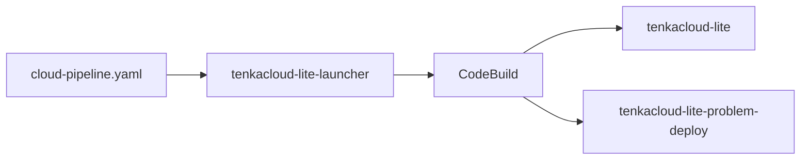

You have finished building the AWS problems. Now you will switch to the organizer's role and deliver them to participants. To deploy and score `hello-world` and `hello-world-battle` for multiple teams, you will deploy TenkaCloud to AWS.

## Cloud Hosting

Cloud hosting provides the organizer console, Participant Portal, event and team management, problem deployment, scoring, and red-team fault injection. It runs on Lambda and Cognito with a choice of Turso or DynamoDB. Local hosting provides event and team operation in a single Bun process with persistent SQLite.

The AWS problems in this book require Cloud hosting. Docker/Compose exercises run locally. The previous SaaS control plane and tenant-provisioning pipeline are not part of the current hosting configuration. Existing stack names may still contain `lite`; use the physical names shown by the deployed environment.

Cloud hosting remains an integration candidate. Rehearse participant access, scoring, and teardown in the intended AWS accounts before an event.

## Review Cost and Cleanup Before Deployment

TenkaCloud is open source, but it runs on real AWS infrastructure. AWS usage charges apply even though the software itself has no license fee.

Separate the cost into three areas:

| Cost area | What runs | What increases the cost |
| --- | --- | --- |
| TenkaCloud | Admin UI, participant UI, authentication, scoring, and data storage | Runtime, traffic, stored data, and logs |
| Problem environments | CloudFormation stacks deployed to each team | Number of teams, number of problems, and runtime of services such as EC2 |
| Deployment process | CodeBuild started by the launcher | Time spent deploying and deleting |

The exact amount depends on the region, AWS services used by the problems, number of teams, and event duration. Monitor AWS Billing during the event, and do not leave the environment running when it is not needed.

At the end of the event, delete resources in this order:

1. Delete the problem stacks deployed to each team.
2. Run `ACTION=destroy-all` in CodeBuild to remove TenkaCloud and its retained data.
3. After that succeeds, delete the launcher stack.
4. Check CloudFormation, EC2, DynamoDB, S3, logs, and the selected Turso database. Chapter 16 explains which retained and shared resources need a separate decision.

The launcher is also the entry point for removing TenkaCloud. Deleting it before `destroy-all` succeeds makes recovery more complicated.

For a guided cleanup, open [Clean Up TenkaCloud](https://www.tenkacloud.com/portal-demo/?demo=1&goto=%2Fproblems%2F01HZX0M0CLEANUPTENKA0001) on the TenkaCloud landing page. This book also walks through deletion and the final resource check after the event.

## Start with the Deployment Tutorial

The TenkaCloud landing page provides an interactive tutorial for deploying TenkaCloud to AWS:

[Open Deploy TenkaCloud](https://www.tenkacloud.com/portal-demo/?demo=1&goto=%2Fproblems%2F01HZX0KZZ3DR0PW9M4Q7XV2C5D)

This tutorial guides you through creating TenkaCloud in your AWS account. It is separate from local mode, which runs the earlier Docker problem on one computer.

It consists of four stages:

1. Create the CloudFormation launcher.
2. Deploy TenkaCloud from CodeBuild.
3. Connect a team AWS account.
4. Create the first event.

This chapter explains what each step creates and why. Follow the landing-page tutorial for the current screen-by-screen instructions and input values.

## Distinguish the Launcher from TenkaCloud

The first stack, `tenkacloud-lite-launcher`, is not TenkaCloud itself. It creates a CodeBuild project that fetches the TenkaCloud source and problem catalog, then performs the deployment.

Open CodeBuild from the launcher's `StartBuildConsoleUrl` output and choose `Start build`. CodeBuild then creates the TenkaCloud stacks.

This manual action makes the start of the billable deployment explicit. Creating the launcher alone does not start TenkaCloud.

## Use a Custom Problem Catalog

Keep the default values when using the official TenkaCloudChallenge catalog.

To use problems from your own fork or branch, set `ProblemsRepoUrl` and `ProblemsRepoRef` on the launcher:

| Parameter | Meaning |
| --- | --- |
| `ProblemsRepoUrl` | Git URL of a publicly readable problem catalog |
| `ProblemsRepoRef` | Branch, tag, or commit SHA |

A branch is convenient during rehearsal. For the real event, pin a reviewed tag or commit SHA. If the reference changes during deployment, teams may receive different versions of a problem.

The two AWS problems built in this book already exist in the official catalog, so they work without a custom URL. The launcher’s Git fetch does not authenticate to private repositories. For private problems, use the Problem Pack workflow in the final chapter. Catalog updates do not rewrite a saved event catalog; redeploy between events and select the updated problem in a new event.

## Confirm the Deployment

At the end of the CodeBuild run, the logs display the URLs for the Application Admin Console and Participant Portal. The same URLs are available in the outputs of these CloudFormation stacks:

- `tenkacloud-lite`
- `tenkacloud-lite-problem-deploy`

Select Turso or DynamoDB in the deployment configuration. If using Turso, configure its database URL and an existing SSM token parameter before deployment; follow the [current infrastructure guide](https://github.com/susumutomita/TenkaCloud/blob/main/infrastructure/README.md). The launcher may bootstrap CDKToolkit when missing; review its CodeBuild role and permissions before deployment.

Use the invitation sent to `TenantAdminEmail` to sign in to the Application Admin Console.

In the next chapter, you will connect team AWS accounts and add the two problems to an event.
