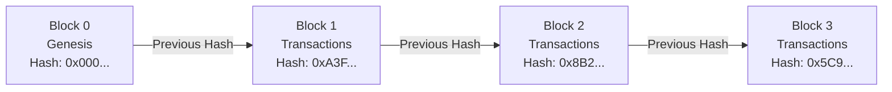
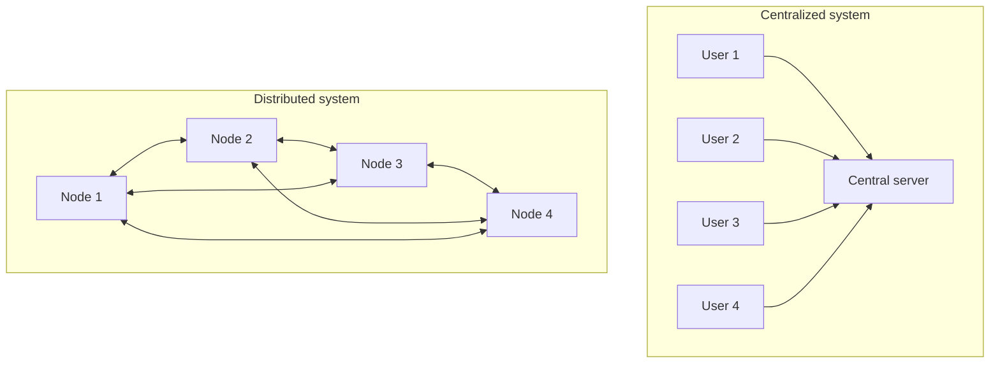

This book is a workshop rather than a survey. You will build a small blockchain in Zig, connect multiple nodes over TCP, add block propagation and chain synchronization, and then implement enough of the Ethereum Virtual Machine to execute selected Solidity bytecode.

The result is intentionally a learning node. It is not a production blockchain, an Ethereum-compatible client, or a safe place to hold assets. Its purpose is to expose the mechanisms that are normally hidden behind SDKs, hosted nodes, and frameworks.

The first English edition is tested with Zig `0.14.0`. Use the Docker environment provided by the code repository when you want reproducible results. Newer Zig releases can change standard-library and build APIs, so using another version may require migration work.

## The basic idea behind a blockchain

### What is a blockchain?

A blockchain is a distributed ledger that groups records into blocks and links those blocks into an ordered chain. Each block contains the hash of the preceding block. Changing an older block therefore changes its hash and breaks every link that depends on it.

Nodes keep copies of the chain and validate proposed blocks according to a shared set of rules. The process used to decide which history the network accepts is generally called consensus.

Hash links alone do not make data immutable. A practical blockchain also needs rules for validating blocks, deciding between competing histories, and determining when a block should be considered final. Different blockchain protocols make different tradeoffs. In this book, we implement a deliberately small Proof-of-Work chain so that each rule remains visible and testable.

### Common properties

- Distributed operation: Multiple nodes store and validate the ledger instead of relying on one central server. A node failure does not necessarily stop the whole network.
- Tamper evidence: Because blocks are linked cryptographically, modifying old data changes the hashes that follow it. The network's validation and consensus rules determine whether that modified history is rejected.
- Consensus: Nodes apply a shared protocol to decide which blocks may be appended and which chain they follow. Bitcoin, for example, uses Proof of Work.
- Transparency and traceability: Public blockchains expose their transaction history for inspection. Participants are usually represented by cryptographic addresses rather than real names.

These properties made blockchains useful as the foundation of cryptocurrencies, beginning with Bitcoin. The same ideas have since been explored for other systems that need independently verifiable records, shared state, or programmable asset transfer.

## A brief history

The modern blockchain story begins in 2008.

- 2008: Satoshi Nakamoto published [Bitcoin: A Peer-to-Peer Electronic Cash System](https://bitcoin.org/bitcoin.pdf), describing a decentralized digital-cash system based on Proof of Work and a hash-linked history.
- 2009: The Bitcoin network launched and produced its genesis block. Participants began validating transactions and mining new blocks.
- 2015: [Ethereum](https://ethereum.org/en/whitepaper/) launched a general-purpose smart-contract platform. Instead of limiting the chain to currency transfer, Ethereum allowed programs to execute against shared blockchain state.
- From 2017 onward: Public interest expanded into decentralized finance, non-fungible tokens, supply-chain experiments, tokenized assets, and many other applications.

The history also exposes the cost of decentralization. When many independent nodes must validate and replicate the same work, throughput and latency become difficult engineering problems. Some consensus mechanisms consume significant energy, while others introduce new assumptions about validators, stake, voting, and finality. No design receives decentralization, security, performance, and simplicity for free.

This book does not attempt to solve all of those tradeoffs. Instead, it gives you a compact system in which you can observe them directly.

## What we will implement

### Why Zig?

The implementation language is [Zig](https://ziglang.org/learn/), a systems programming language designed around explicit control, predictable allocation, straightforward interoperability, and compile-time computation.

Zig is a useful fit for this project because a blockchain node combines several systems-level concerns:

- byte-oriented hashing and serialization
- explicit memory ownership
- network sockets and framing
- concurrency and shared state
- deterministic validation rules
- a bytecode interpreter with stack, memory, and storage

There is also a simpler reason: building a nontrivial project is one of the best ways to learn a language. Instead of studying isolated syntax examples, you will see how Zig behaves when a program grows across modules, tests, network processes, and executable checkpoints.

### A minimal EVM

The Ethereum Virtual Machine is the execution environment used by Ethereum smart contracts. Contract logic is compiled into EVM bytecode, which manipulates 256-bit values, stack entries, memory, storage, calldata, and execution state.

We will not implement the complete EVM specification. We will implement a small interpreter that supports the subset needed by the book's examples. You will build the core data structures, add selected opcodes, compile a small Solidity contract, construct ABI calldata, and execute the result inside the learning chain.

This boundary matters. Passing the examples in this book does not make the implementation compatible with arbitrary Ethereum contracts.

## Running multiple nodes with Docker

A distributed system becomes much easier to understand once you can run several independent processes and watch them exchange state.

The book uses Docker and Docker Compose to run multiple blockchain nodes on one machine. Each container behaves like a separate node, so you can observe connection establishment, block transfer, re-propagation, and chain convergence without provisioning multiple physical servers or cloud instances.

The container image also pins the Zig toolchain used by the book. This is important because the project deliberately exposes low-level standard-library and build APIs that may change between Zig releases.

Although the project is designed to be approachable, it does not hide the important mechanisms. The exercises go beyond making a demo appear to work. You will inspect why a block is valid, why a malformed message is rejected, how a chain link is checked, where shared state must be synchronized, and what the minimal EVM does at each stage of execution.

## Intended audience and prerequisites

This book is primarily for engineers who know the basic vocabulary of blockchains or smart contracts and want to understand the machinery in greater depth.

It will be especially useful if you:

- have used Bitcoin, Ethereum, or another blockchain and want to understand what a node actually does
- are interested in Solidity, smart contracts, or decentralized applications
- want to learn Zig through a substantial project rather than isolated exercises
- enjoy understanding protocols by implementing their smallest useful form

You should already have programming experience in at least one language. Experience with C, C++, Rust, Go, or another systems-oriented language is helpful, but not required. The early chapters introduce the cryptographic and networking concepts used later, although familiarity with transactions, hashes, mining, and sockets will make the journey smoother.

## Roadmap

The book grows one system in stages.

1. Development environment
   Install or prepare Docker, Docker Compose, Zig, and the required tools. Verify the pinned environment before changing code.

2. Core blockchain
   Define blocks and transactions, calculate SHA-256 hashes, link blocks, implement a learning-oriented Proof of Work, mine blocks, and validate the resulting chain on a single node.

3. Networking and distributed nodes
   Add TCP communication, define message framing, exchange blocks and transactions, propagate valid data, connect multiple peers, and synchronize the chain across nodes.

4. Consensus boundaries
   Implement the book's small Proof-of-Work rule and make its limitations explicit. Proof of Stake is not presented as a completed feature. A later design chapter explains the additional machinery required for validator selection, voting, fork choice, finality, penalties, and persistent consensus state.

5. Smart contracts and the minimal EVM
   Implement EVM-oriented 256-bit values, stack, memory, storage, execution context, and selected opcodes. Compile a Solidity contract, encode a function call, and execute it through the blockchain node.

6. Testing, acceptance, and advanced directions
   Test malformed input, tampering, block links, Proof of Work, P2P behavior, and EVM execution. Run one-node and multi-node acceptance scenarios. Finally, compare the learning implementation with production requirements such as signatures, replay protection, account state, fork choice, finality, complete EVM semantics, Layer 2 systems, and zero-knowledge execution.

By the end, you will have a runnable learning blockchain with a minimal EVM and, more importantly, a concrete model of how its pieces fit together.

## How the book is written

Each implementation section follows a hands-on cycle:

1. identify the exact file or checkpoint
2. make one bounded change
3. run the nearest relevant tests
4. execute the program or multi-node scenario
5. compare behavior with an explicit expected result

The executable code is maintained in [susumutomita/BlockChain](https://github.com/susumutomita/BlockChain). The manuscript is maintained separately in [susumutomita/zenn-article](https://github.com/susumutomita/zenn-article).

The next chapter explains the mapping between the manuscript, the chapter checkpoints, the complete source tree, the companion patches, and the verification commands. Read it before beginning the implementation chapters. It is the contract that keeps the prose and executable code aligned.
